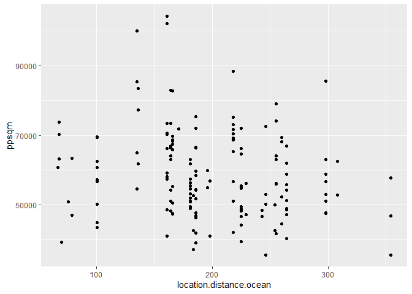

# Sales apartment in Ekhagen

## Average ppsqm and 5 most expensive w.r.t ppsqm.

    #Task 1
    booli_sold <- booli_sold %>%
      mutate(ppsqm = soldPrice / livingArea) 

    #Task 2
    booli_sold %>% 
      arrange(desc(ppsqm)) %>%
      select(booliId, ppsqm) %>%
      head(n = 5) %>%
      kable() 

<table>
<thead>
<tr class="header">
<th style="text-align: right;">booliId</th>
<th style="text-align: right;">ppsqm</th>
</tr>
</thead>
<tbody>
<tr class="odd">
<td style="text-align: right;">2018259</td>
<td style="text-align: right;">104166.67</td>
</tr>
<tr class="even">
<td style="text-align: right;">2125576</td>
<td style="text-align: right;">102083.33</td>
</tr>
<tr class="odd">
<td style="text-align: right;">2078171</td>
<td style="text-align: right;">100000.00</td>
</tr>
<tr class="even">
<td style="text-align: right;">2330886</td>
<td style="text-align: right;">88400.00</td>
</tr>
<tr class="odd">
<td style="text-align: right;">2067384</td>
<td style="text-align: right;">85501.86</td>
</tr>
</tbody>
</table>

    #Task 3
    avergage_price <- booli_sold %>% 
      summarise(avg_price = mean(na.omit(ppsqm)))

    kable(avergage_price)

<table>
<thead>
<tr class="header">
<th style="text-align: right;">avg_price</th>
</tr>
</thead>
<tbody>
<tr class="odd">
<td style="text-align: right;">58759.38</td>
</tr>
</tbody>
</table>

## Distance to ocean and ppsqm.

I choose to plot distance to Ocean against ppsqm expecting to observe
steep price increase per square meter for apartments very close to the
Ocean. The data does not seem to support this theory at a first glance
from the the scatterplot.

    booli_sold %>%
      filter(!is.na(location.distance.ocean) & !is.na(ppsqm)) %>%
      ggplot() + 
        geom_point(mapping = aes(x = location.distance.ocean, y = ppsqm))

# Röster per kommun

    # Task 1: Number of valid votes in stockholm municipalities
    r_per_kommun %>% 
      filter(LÄNSNAMN  == "Stockholms län") %>%
      summarize(total_votes_in_Stockholm = sum(RÖSTER.GILTIGA, na.rm = TRUE)) %>% 
      kable()

<table>
<thead>
<tr class="header">
<th style="text-align: right;">total_votes_in_Stockholm</th>
</tr>
</thead>
<tbody>
<tr class="odd">
<td style="text-align: right;">1426237</td>
</tr>
</tbody>
</table>

    # Task 2: In which municipality did the social democratic party garner the hightest voting percentage.
    r_per_kommun %>%
      arrange(desc(S)) %>%
      head(n=1)

    ##   LÄNSKOD KOMMUNKOD      LÄNSNAMN KOMMUNNAMN    M    C    L   KD     S    V
    ## 1      17        62 Värmlands län   Munkfors 8.33 8.12 2.91 3.93 52.18 6.11
    ##     MP    SD   FI  AfS BASIP CSIS DD DjuP EAP  ENH FHS Gup INI  KLP KrVP  LPo
    ## 1 1.37 15.43 0.64 0.51  0.04   NA NA   NA  NA 0.04  NA  NA  NA 0.04   NA 0.09
    ##    MED  NMR NORRP NYREF   PP RNP S.FRP SKP  SKÅ TRP VL.S ÖVR OGEJ BLANK OG
    ## 1 0.04 0.09    NA    NA 0.09  NA    NA  NA 0.04  NA   NA  NA   NA  1.02 NA
    ##   RÖSTER.GILTIGA RÖSTANDE RÖSTBERÄTTIGADE VALDELTAGANDE
    ## 1           2340     2364            2777         85.13

    # Task 3: Ranking the (3) municipialities with highest participation (valdeltagande).
    r_per_kommun %>%
      select(KOMMUNNAMN, VALDELTAGANDE) %>%
      arrange(desc(VALDELTAGANDE)) %>%
      head(n=3) %>%
      kable()

<table>
<thead>
<tr class="header">
<th style="text-align: left;">KOMMUNNAMN</th>
<th style="text-align: right;">VALDELTAGANDE</th>
</tr>
</thead>
<tbody>
<tr class="odd">
<td style="text-align: left;">Lomma</td>
<td style="text-align: right;">93.86</td>
</tr>
<tr class="even">
<td style="text-align: left;">Habo</td>
<td style="text-align: right;">93.35</td>
</tr>
<tr class="odd">
<td style="text-align: left;">Vellinge</td>
<td style="text-align: right;">93.13</td>
</tr>
</tbody>
</table>

# Stroke data

The following plot looks to answer weather or not men and women are
unequaly affected by ever having been married in regards to if they have
suffered a stroke or not. The graph suggests that having been married
increases the chance of suffering a stroke and this would seem slightly
more prominent for women then men.

    stroke_data %>%
      select(stroke, gender, ever_married) %>%
      filter(gender != "Other") %>%
      mutate(stroke = ifelse(stroke != 0, 1, 0)) %>%  
      group_by(ever_married, gender, stroke) %>%  
      summarise(count = n()) %>%  
      ggplot(aes(x = interaction(ever_married, gender), y = count, fill = gender)) +  
      geom_bar(stat = "identity", position = "dodge") +  
      labs(title = "Frequency of Stroke by if ever married and Gender",
           x = "Ever married and Gender",
           y = "Frequency of Stroke",
           fill = "Gender") 

    ## `summarise()` has grouped output by 'ever_married', 'gender'. You can override
    ## using the `.groups` argument.

