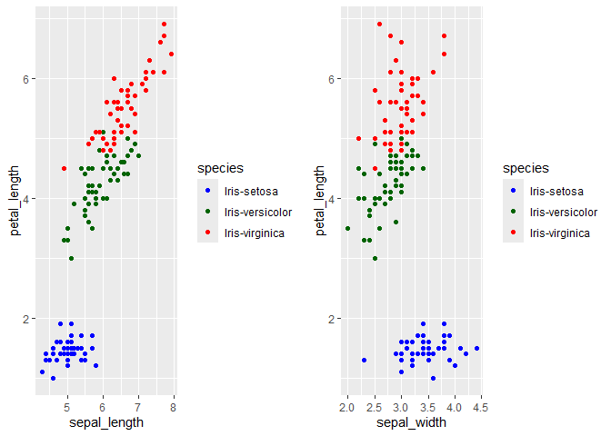
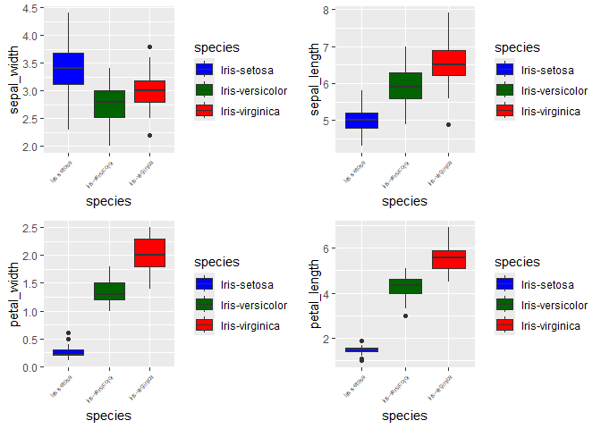
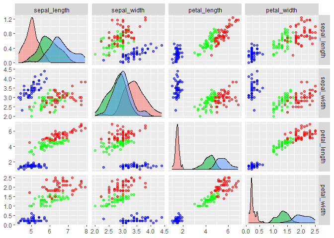
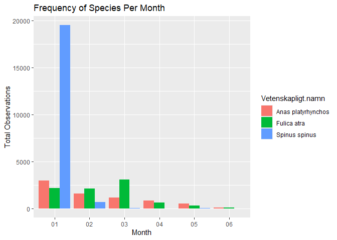
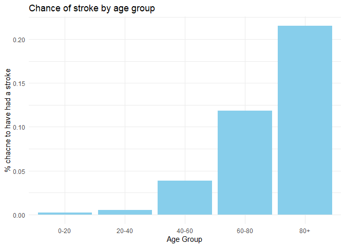
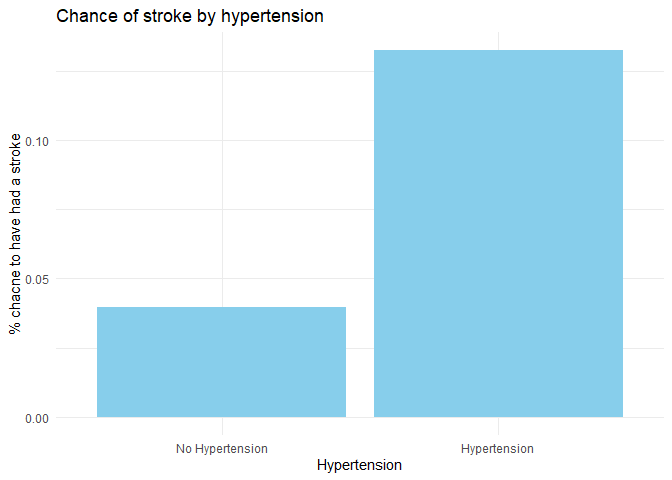
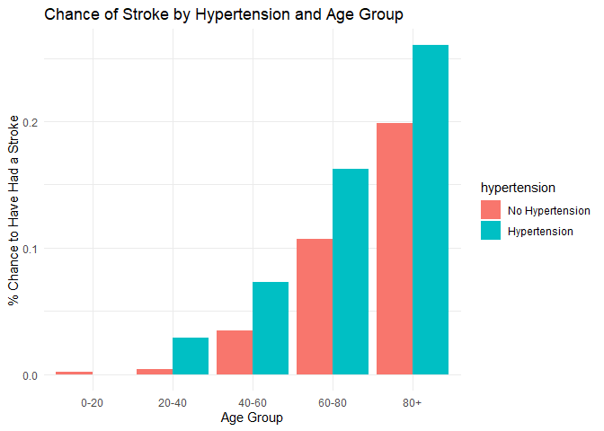

# Exploratory Data Analysis

## The IRIS dataset

### Scatterplots

We can observe from the scatterplot Fig 1 that sepal-length and petal
length is closely positvly ocrrelated for Iris-versicolor and
Iris-virginica and a slight positive correlation when looking at
sepal-width and sepal-length. This is not the case however for
Iris-setosa.

    p1 <- ggplot(iris) + 
      geom_point(aes(x = sepal_length, y = petal_length, color = species)) +
      scale_color_manual(values = c("Iris-setosa" =  "blue", "Iris-versicolor" = "darkgreen", "Iris-virginica" = "red"))

    p2 <- ggplot(iris) + 
      geom_point(aes(x = sepal_width, y = petal_length, color = species)) +
      scale_color_manual(values = c("Iris-setosa" =  "blue", "Iris-versicolor" = "darkgreen", "Iris-virginica" = "red"))

    grid.arrange(p1, p2, ncol = 2)

<figure>

<figcaption aria-hidden="true">Scatter plots sepal vs petal</figcaption>
</figure>

### Boxplots

The boxplots in Fig 2 shows us the spread of the data for each species
and attribute (sepal-width, -length, petal-width, -length). We se that
for sepal-width Iris-setosa stands out by being wider but also having
more variability. For sepal-length, petal-width, petal-length we observe
a hierarchical order from smallest to largest Iris-setosa, -versicolor,
-virginica.

    p1 <- ggplot(iris) + 
      geom_boxplot(aes(x = species, y = sepal_width, fill = species)) +
      scale_fill_manual(values = c("Iris-setosa" =  "blue", "Iris-versicolor" = "darkgreen", "Iris-virginica" = "red")) +
      theme(axis.text.x = element_text(size = 5, angle = 45, hjust = 1))

    p2 <- ggplot(iris) + 
      geom_boxplot(aes(x = species, y = sepal_length, fill = species)) +
      scale_fill_manual(values = c("Iris-setosa" =  "blue", "Iris-versicolor" = "darkgreen", "Iris-virginica" = "red")) +
      theme(axis.text.x = element_text(size = 5, angle = 45, hjust = 1))

    p3 <- ggplot(iris) + 
      geom_boxplot(aes(x = species, y = petal_width, fill = species)) +
      scale_fill_manual(values = c("Iris-setosa" =  "blue", "Iris-versicolor" = "darkgreen", "Iris-virginica" = "red")) +
      theme(axis.text.x = element_text(size = 5, angle = 45, hjust = 1))

    p4 <- ggplot(iris) + 
      geom_boxplot(aes(x = species, y = petal_length, fill = species)) +
      scale_fill_manual(values = c("Iris-setosa" =  "blue", "Iris-versicolor" = "darkgreen", "Iris-virginica" = "red")) +
      theme(axis.text.x = element_text(size = 5, angle = 45, hjust = 1))

    grid.arrange(p1, p2, p3, p4, nrow = 2, ncol = 2)

<figure>

<figcaption aria-hidden="true">boxplots for Iris species and
variable</figcaption>
</figure>

### Pairs plot

The pairs plot gives us an overview how the different variables of the
data are related. We observe the same plots as the ones produced on
Figure 1 outside of the diagonals and distribution plots across the
diagonals.

    ggpairs(iris[, -5],
            aes(color = iris$species, alpha = 0.5),
            upper = list(continuous = "points")) +
              scale_color_manual(values = c("Iris-setosa" = "blue",    
                                   "Iris-versicolor" = "green", 
                                   "Iris-virginica" = "red")) 

    ## Warning: No shared levels found between `names(values)` of the manual scale and the
    ## data's colour values.
    ## No shared levels found between `names(values)` of the manual scale and the
    ## data's colour values.
    ## No shared levels found between `names(values)` of the manual scale and the
    ## data's colour values.
    ## No shared levels found between `names(values)` of the manual scale and the
    ## data's colour values.

## Highest count species

    artportalen <- artportalen %>% 
      mutate(Antal = as.numeric(Antal))

    ## Warning: There was 1 warning in `mutate()`.
    ## ℹ In argument: `Antal = as.numeric(Antal)`.
    ## Caused by warning:
    ## ! NAs introduced by coercion

    # 5 most prevalent species
    artportalen %>%
      group_by(Vetenskapligt.namn) %>%                 
      summarize(total = sum(Antal, na.rm = TRUE)) %>%   
      arrange(desc(total)) %>%                          
      slice(1:5) %>%                                    
      kable() 

<table>
<thead>
<tr class="header">
<th style="text-align: left;">Vetenskapligt.namn</th>
<th style="text-align: right;">total</th>
</tr>
</thead>
<tbody>
<tr class="odd">
<td style="text-align: left;">Spinus spinus</td>
<td style="text-align: right;">20211</td>
</tr>
<tr class="even">
<td style="text-align: left;">Fulica atra</td>
<td style="text-align: right;">8308</td>
</tr>
<tr class="odd">
<td style="text-align: left;">Anas platyrhynchos</td>
<td style="text-align: right;">7167</td>
</tr>
<tr class="even">
<td style="text-align: left;">Mergus merganser</td>
<td style="text-align: right;">6750</td>
</tr>
<tr class="odd">
<td style="text-align: left;">Branta leucopsis</td>
<td style="text-align: right;">6345</td>
</tr>
</tbody>
</table>

    # Monthly distribution of the 3 most prevalent species
    dist_art <- artportalen %>% 
      filter(Vetenskapligt.namn %in% c("Spinus spinus", "Fulica atra", "Anas platyrhynchos")) %>%
      mutate(month = format(as.Date(Startdatum), "%m")) %>% # creates new variable month
      group_by(Vetenskapligt.namn, month) %>% 
      summarize(total = sum(Antal, na.rm = TRUE)) 

    ## `summarise()` has grouped output by 'Vetenskapligt.namn'. You can override
    ## using the `.groups` argument.

    ggplot(dist_art, aes(x = month, y = total, fill = Vetenskapligt.namn)) +
      geom_bar(stat = "identity", position = "dodge") +  # Use "dodge" to make bars side-by-side
      labs(
        title = "Frequency of Species Per Month",
        x = "Month",
        y = "Total Observations"
      )

    # 5 rarest species 
    artportalen %>%
      group_by(Vetenskapligt.namn) %>%                 
      summarize(total = sum(Antal, na.rm = TRUE)) %>%   
      filter(total == 1) %>%
      kable()

<table>
<thead>
<tr class="header">
<th style="text-align: left;">Vetenskapligt.namn</th>
<th style="text-align: right;">total</th>
</tr>
</thead>
<tbody>
<tr class="odd">
<td style="text-align: left;">Ardea alba</td>
<td style="text-align: right;">1</td>
</tr>
<tr class="even">
<td style="text-align: left;">Buteo buteo buteo</td>
<td style="text-align: right;">1</td>
</tr>
<tr class="odd">
<td style="text-align: left;">Buteo lagopus</td>
<td style="text-align: right;">1</td>
</tr>
<tr class="even">
<td style="text-align: left;">Calcarius lapponicus</td>
<td style="text-align: right;">1</td>
</tr>
<tr class="odd">
<td style="text-align: left;">Carpodacus erythrinus</td>
<td style="text-align: right;">1</td>
</tr>
<tr class="even">
<td style="text-align: left;">Cinclus cinclus</td>
<td style="text-align: right;">1</td>
</tr>
<tr class="odd">
<td style="text-align: left;">Dryocopus martius</td>
<td style="text-align: right;">1</td>
</tr>
<tr class="even">
<td style="text-align: left;">Falco tinnunculus</td>
<td style="text-align: right;">1</td>
</tr>
<tr class="odd">
<td style="text-align: left;">Gavia arctica</td>
<td style="text-align: right;">1</td>
</tr>
<tr class="even">
<td style="text-align: left;">Lanius excubitor</td>
<td style="text-align: right;">1</td>
</tr>
<tr class="odd">
<td style="text-align: left;">Linaria flavirostris</td>
<td style="text-align: right;">1</td>
</tr>
<tr class="even">
<td style="text-align: left;">Loxia bifasciata</td>
<td style="text-align: right;">1</td>
</tr>
<tr class="odd">
<td style="text-align: left;">Lullula arborea</td>
<td style="text-align: right;">1</td>
</tr>
<tr class="even">
<td style="text-align: left;">Milvus milvus</td>
<td style="text-align: right;">1</td>
</tr>
<tr class="odd">
<td style="text-align: left;">Motacilla cinerea</td>
<td style="text-align: right;">1</td>
</tr>
<tr class="even">
<td style="text-align: left;">Pernis apivorus</td>
<td style="text-align: right;">1</td>
</tr>
<tr class="odd">
<td style="text-align: left;">Somateria mollissima</td>
<td style="text-align: right;">1</td>
</tr>
<tr class="even">
<td style="text-align: left;">Tadorna tadorna</td>
<td style="text-align: right;">1</td>
</tr>
<tr class="odd">
<td style="text-align: left;">Tringa totanus</td>
<td style="text-align: right;">1</td>
</tr>
</tbody>
</table>

## Stroke data

The dataset contains information pertaining peoples: Gender, age,
hypertension, hearth disease, has ever been married, residence type,
avg\_glucose\_level, bmi as well as the number of strokes the individual
has had. A first insight can be gained by creating a pairs plot.

### Does age affect the chance to get a stroke stroke?

As predicted the age influences the chance to have had a stroke, see
Figure 3.

    stroke <- as_tibble(read.csv("stroke-data.csv"))

    # Creates age intervals variable for the data
    stroke <- stroke %>%
      mutate(age_group = cut(age, breaks = seq(0, max(age), by = 20), 
                            labels = paste(seq(0, max(age) - 20, by = 20), 
                                           seq(20, max(age), by = 20), sep = "-"), 
                            right = FALSE))

    # Count strokes in each age group per individuals in the group
    stroke_summary <- stroke %>%
      group_by(age_group) %>%
      summarize(stroke_count = sum(stroke == 1, na.rm = TRUE),
                total_count = n()) %>%
      mutate(stroke_rate = stroke_count / total_count) 

    # Plot
    ggplot(stroke_summary, aes(x = age_group, y = stroke_rate)) + 
      geom_bar(stat = "identity", fill = "skyblue") +
      labs(title = "Chance of stroke by age group", x = "Age Group", y = "% chacne to have had a stroke") +
      theme_minimal() +
      scale_x_discrete(labels = c("0-20","20-40","40-60","60-80","80+"))

<figure>

<figcaption aria-hidden="true">Barplot by age intervals of 20 showing
the relative frequency of strokes</figcaption>
</figure>

### Does hypertension affect the chance of have had a stroke?

From Figure 4 we can se that individuals with hypertension are about
four times as likely to have suffered a stroke.

    # Count strokes in each age group per individuals in the group
    stroke_summary <- stroke %>%
      group_by(hypertension) %>%
      summarize(stroke_count = sum(stroke == 1, na.rm = TRUE),
                total_count = n()) %>%
      mutate(stroke_rate = stroke_count / total_count) 

    # Convert hypertension in to categorical
    stroke_summary$hypertension <- factor(stroke_summary$hypertension, labels = c("No Hypertension", "Hypertension"))

    # Plot
    ggplot(stroke_summary, aes(x = hypertension, y = stroke_rate)) + 
      geom_bar(stat = "identity", fill = "skyblue") +
      labs(title = "Chance of stroke by hypertension", x = "Hypertension", y = "% chacne to have had a stroke") +
      theme_minimal()

<figure>

<figcaption aria-hidden="true">Barplot showing individuals with and
without hypertension and relative stroke frquency</figcaption>
</figure>

### Does the effect of hypertension on the stroke rate depend on the age of the individual?

Combining the observed information from the above questions we now ask
if the 4 to 1 ratio for hypertension holds true for all age groups as
shown above. Figure 5 indicates that the relative effect of hypertension
is stronger the younger you are. Hypertension increases the stroke
chance with about 0.05 chance across all ages. As an individual ages the
effect of hypertension increases very slightly but other effect seem to
come in to play.

    # Relative stroke frequency by age_group and hypertension
    stroke_summary <- stroke %>%
      group_by(age_group, hypertension) %>%
      summarize(stroke_count = sum(stroke == 1, na.rm = TRUE),
                total_count = n(),
                .groups = "drop") %>%
      mutate(stroke_rate = stroke_count / total_count) 

    # Transform to factor variable
    stroke_summary$hypertension <- factor(stroke_summary$hypertension, labels = c("No Hypertension", "Hypertension"))

    # Barplot
    ggplot(stroke_summary, aes(x = age_group, y = stroke_rate, fill = hypertension)) + 
      geom_bar(stat = "identity", position = "dodge") +  # Position bars side by side
      labs(title = "Chance of Stroke by Hypertension and Age Group", 
           x = "Age Group", 
           y = "% Chance to Have Had a Stroke") +
      theme_minimal() +
      scale_x_discrete(labels = c("0-20","20-40","40-60","60-80","80+"))

<figure>

<figcaption aria-hidden="true">Barplot of the relative frequency of
hypertension by age group and hypertension</figcaption>
</figure>

## Cleaning datat

    cell_phone <- read.csv("cell_phones_total.csv")

    cell_t <- cell_phone %>%
      # This section transforms k,M,B in to numerical values acordingly
      mutate(across(-1,
                     ~ ifelse(grepl("k", .), as.numeric(gsub("k", "", .)) * 1e3, .))) %>%
      mutate(across(-1,
                     ~ ifelse(grepl("M", .), as.numeric(gsub("M", "", .)) * 1e6, .))) %>%
      mutate(across(-1,
                     ~ ifelse(grepl("B", .), as.numeric(gsub("B", "", .)) * 1e9, .))) %>%
      # Transforms the empty chr in to NA
      mutate(across(where(is.character), ~ na_if(., ""))) %>%
      # Transforms chr 0 in to dbl 0
      mutate(across(where(is.character), ~ ifelse(. == "0", 0, .))) %>%  
      # Transforms logical values in to dbl. 
      mutate(across(where(is.logical), ~ as.numeric(.))) 

    ## Warning: There were 33 warnings in `mutate()`.
    ## The first warning was:
    ## ℹ In argument: `across(...)`.
    ## Caused by warning in `ifelse()`:
    ## ! NAs introduced by coercion
    ## ℹ Run `dplyr::last_dplyr_warnings()` to see the 32 remaining warnings.

    ## Warning: There were 8 warnings in `mutate()`.
    ## The first warning was:
    ## ℹ In argument: `across(...)`.
    ## Caused by warning in `ifelse()`:
    ## ! NAs introduced by coercion
    ## ℹ Run `dplyr::last_dplyr_warnings()` to see the 7 remaining warnings.

    # Was not supported by md file only html
    # # View(cell_t)
    # # View(cell_phone)
    # cell_tibble <- as_tibble(cell_t)
    # datatable(cell_t, 
    #           options = list(
    #             scrollY = '200px',        # Vertical scrolling
    #             scrollX = TRUE,           # Horizontal scrolling
    #             scroller = TRUE,          # Enable scrolling (especially for large tables)
    #             fixedHeader = TRUE        # Fix the column headers while scrolling
    #           )
    # )

    kable(cell_t)

<table style="width:100%;">
<colgroup>
<col style="width: 1%" />
<col style="width: 1%" />
<col style="width: 1%" />
<col style="width: 1%" />
<col style="width: 1%" />
<col style="width: 1%" />
<col style="width: 1%" />
<col style="width: 1%" />
<col style="width: 1%" />
<col style="width: 1%" />
<col style="width: 1%" />
<col style="width: 1%" />
<col style="width: 1%" />
<col style="width: 1%" />
<col style="width: 1%" />
<col style="width: 1%" />
<col style="width: 1%" />
<col style="width: 1%" />
<col style="width: 1%" />
<col style="width: 1%" />
<col style="width: 1%" />
<col style="width: 1%" />
<col style="width: 1%" />
<col style="width: 1%" />
<col style="width: 1%" />
<col style="width: 1%" />
<col style="width: 1%" />
<col style="width: 1%" />
<col style="width: 1%" />
<col style="width: 1%" />
<col style="width: 1%" />
<col style="width: 2%" />
<col style="width: 2%" />
<col style="width: 2%" />
<col style="width: 2%" />
<col style="width: 2%" />
<col style="width: 2%" />
<col style="width: 2%" />
<col style="width: 2%" />
<col style="width: 2%" />
<col style="width: 2%" />
<col style="width: 2%" />
<col style="width: 2%" />
<col style="width: 2%" />
<col style="width: 2%" />
<col style="width: 2%" />
<col style="width: 2%" />
<col style="width: 2%" />
<col style="width: 2%" />
<col style="width: 2%" />
<col style="width: 2%" />
<col style="width: 2%" />
<col style="width: 2%" />
<col style="width: 2%" />
<col style="width: 2%" />
<col style="width: 2%" />
<col style="width: 2%" />
</colgroup>
<thead>
<tr class="header">
<th style="text-align: left;">iso.3</th>
<th style="text-align: right;">X1960</th>
<th style="text-align: right;">X1965</th>
<th style="text-align: right;">X1966</th>
<th style="text-align: right;">X1967</th>
<th style="text-align: right;">X1968</th>
<th style="text-align: right;">X1969</th>
<th style="text-align: right;">X1970</th>
<th style="text-align: right;">X1971</th>
<th style="text-align: right;">X1972</th>
<th style="text-align: right;">X1973</th>
<th style="text-align: right;">X1974</th>
<th style="text-align: right;">X1975</th>
<th style="text-align: right;">X1976</th>
<th style="text-align: right;">X1977</th>
<th style="text-align: right;">X1978</th>
<th style="text-align: right;">X1979</th>
<th style="text-align: left;">X1980</th>
<th style="text-align: left;">X1981</th>
<th style="text-align: left;">X1982</th>
<th style="text-align: left;">X1983</th>
<th style="text-align: left;">X1984</th>
<th style="text-align: left;">X1985</th>
<th style="text-align: left;">X1986</th>
<th style="text-align: left;">X1987</th>
<th style="text-align: left;">X1988</th>
<th style="text-align: left;">X1989</th>
<th style="text-align: left;">X1990</th>
<th style="text-align: left;">X1991</th>
<th style="text-align: left;">X1992</th>
<th style="text-align: left;">X1993</th>
<th style="text-align: left;">X1994</th>
<th style="text-align: left;">X1995</th>
<th style="text-align: left;">X1996</th>
<th style="text-align: left;">X1997</th>
<th style="text-align: left;">X1998</th>
<th style="text-align: left;">X1999</th>
<th style="text-align: left;">X2000</th>
<th style="text-align: left;">X2001</th>
<th style="text-align: left;">X2002</th>
<th style="text-align: left;">X2003</th>
<th style="text-align: left;">X2004</th>
<th style="text-align: left;">X2005</th>
<th style="text-align: left;">X2006</th>
<th style="text-align: left;">X2007</th>
<th style="text-align: left;">X2008</th>
<th style="text-align: left;">X2009</th>
<th style="text-align: left;">X2010</th>
<th style="text-align: left;">X2011</th>
<th style="text-align: left;">X2012</th>
<th style="text-align: left;">X2013</th>
<th style="text-align: left;">X2014</th>
<th style="text-align: left;">X2015</th>
<th style="text-align: left;">X2016</th>
<th style="text-align: left;">X2017</th>
<th style="text-align: left;">X2018</th>
<th style="text-align: left;">X2019</th>
</tr>
</thead>
<tbody>
<tr class="odd">
<td style="text-align: left;">ABW</td>
<td style="text-align: right;">0</td>
<td style="text-align: right;">0</td>
<td style="text-align: right;">NA</td>
<td style="text-align: right;">NA</td>
<td style="text-align: right;">NA</td>
<td style="text-align: right;">NA</td>
<td style="text-align: right;">0</td>
<td style="text-align: right;">NA</td>
<td style="text-align: right;">NA</td>
<td style="text-align: right;">NA</td>
<td style="text-align: right;">NA</td>
<td style="text-align: right;">0</td>
<td style="text-align: right;">0</td>
<td style="text-align: right;">0</td>
<td style="text-align: right;">0</td>
<td style="text-align: right;">0</td>
<td style="text-align: left;">0</td>
<td style="text-align: left;">0</td>
<td style="text-align: left;">0</td>
<td style="text-align: left;">0</td>
<td style="text-align: left;">0</td>
<td style="text-align: left;">0</td>
<td style="text-align: left;">0</td>
<td style="text-align: left;">0</td>
<td style="text-align: left;">0</td>
<td style="text-align: left;">0</td>
<td style="text-align: left;">0</td>
<td style="text-align: left;">0</td>
<td style="text-align: left;">20</td>
<td style="text-align: left;">NA</td>
<td style="text-align: left;">NA</td>
<td style="text-align: left;">1720</td>
<td style="text-align: left;">3000</td>
<td style="text-align: left;">3400</td>
<td style="text-align: left;">5380</td>
<td style="text-align: left;">12000</td>
<td style="text-align: left;">15000</td>
<td style="text-align: left;">53000</td>
<td style="text-align: left;">61800</td>
<td style="text-align: left;">70000</td>
<td style="text-align: left;">98400</td>
<td style="text-align: left;">103000</td>
<td style="text-align: left;">109000</td>
<td style="text-align: left;">114000</td>
<td style="text-align: left;">121000</td>
<td style="text-align: left;">128000</td>
<td style="text-align: left;">132000</td>
<td style="text-align: left;">NA</td>
<td style="text-align: left;">135000</td>
<td style="text-align: left;">139000</td>
<td style="text-align: left;">140000</td>
<td style="text-align: left;">141000</td>
<td style="text-align: left;">NA</td>
<td style="text-align: left;">NA</td>
<td style="text-align: left;">NA</td>
<td style="text-align: left;">NA</td>
</tr>
<tr class="even">
<td style="text-align: left;">AFG</td>
<td style="text-align: right;">0</td>
<td style="text-align: right;">0</td>
<td style="text-align: right;">NA</td>
<td style="text-align: right;">NA</td>
<td style="text-align: right;">NA</td>
<td style="text-align: right;">NA</td>
<td style="text-align: right;">0</td>
<td style="text-align: right;">NA</td>
<td style="text-align: right;">NA</td>
<td style="text-align: right;">NA</td>
<td style="text-align: right;">NA</td>
<td style="text-align: right;">0</td>
<td style="text-align: right;">0</td>
<td style="text-align: right;">0</td>
<td style="text-align: right;">0</td>
<td style="text-align: right;">0</td>
<td style="text-align: left;">0</td>
<td style="text-align: left;">0</td>
<td style="text-align: left;">0</td>
<td style="text-align: left;">0</td>
<td style="text-align: left;">0</td>
<td style="text-align: left;">0</td>
<td style="text-align: left;">0</td>
<td style="text-align: left;">0</td>
<td style="text-align: left;">0</td>
<td style="text-align: left;">0</td>
<td style="text-align: left;">0</td>
<td style="text-align: left;">0</td>
<td style="text-align: left;">0</td>
<td style="text-align: left;">0</td>
<td style="text-align: left;">0</td>
<td style="text-align: left;">0</td>
<td style="text-align: left;">0</td>
<td style="text-align: left;">0</td>
<td style="text-align: left;">0</td>
<td style="text-align: left;">0</td>
<td style="text-align: left;">0</td>
<td style="text-align: left;">0</td>
<td style="text-align: left;">25000</td>
<td style="text-align: left;">2e+05</td>
<td style="text-align: left;">6e+05</td>
<td style="text-align: left;">1200000</td>
<td style="text-align: left;">2520000</td>
<td style="text-align: left;">4670000</td>
<td style="text-align: left;">7900000</td>
<td style="text-align: left;">10500000</td>
<td style="text-align: left;">10200000</td>
<td style="text-align: left;">13800000</td>
<td style="text-align: left;">15300000</td>
<td style="text-align: left;">16800000</td>
<td style="text-align: left;">18400000</td>
<td style="text-align: left;">19700000</td>
<td style="text-align: left;">21600000</td>
<td style="text-align: left;">23900000</td>
<td style="text-align: left;">2.2e+07</td>
<td style="text-align: left;">22600000</td>
</tr>
<tr class="odd">
<td style="text-align: left;">AGO</td>
<td style="text-align: right;">0</td>
<td style="text-align: right;">0</td>
<td style="text-align: right;">NA</td>
<td style="text-align: right;">NA</td>
<td style="text-align: right;">NA</td>
<td style="text-align: right;">NA</td>
<td style="text-align: right;">0</td>
<td style="text-align: right;">NA</td>
<td style="text-align: right;">NA</td>
<td style="text-align: right;">NA</td>
<td style="text-align: right;">NA</td>
<td style="text-align: right;">0</td>
<td style="text-align: right;">0</td>
<td style="text-align: right;">0</td>
<td style="text-align: right;">0</td>
<td style="text-align: right;">0</td>
<td style="text-align: left;">0</td>
<td style="text-align: left;">0</td>
<td style="text-align: left;">0</td>
<td style="text-align: left;">0</td>
<td style="text-align: left;">0</td>
<td style="text-align: left;">0</td>
<td style="text-align: left;">0</td>
<td style="text-align: left;">0</td>
<td style="text-align: left;">0</td>
<td style="text-align: left;">0</td>
<td style="text-align: left;">0</td>
<td style="text-align: left;">0</td>
<td style="text-align: left;">0</td>
<td style="text-align: left;">1100</td>
<td style="text-align: left;">1820</td>
<td style="text-align: left;">1990</td>
<td style="text-align: left;">3300</td>
<td style="text-align: left;">7050</td>
<td style="text-align: left;">9820</td>
<td style="text-align: left;">24000</td>
<td style="text-align: left;">25800</td>
<td style="text-align: left;">75000</td>
<td style="text-align: left;">140000</td>
<td style="text-align: left;">350000</td>
<td style="text-align: left;">740000</td>
<td style="text-align: left;">1610000</td>
<td style="text-align: left;">3050000</td>
<td style="text-align: left;">4960000</td>
<td style="text-align: left;">6770000</td>
<td style="text-align: left;">8110000</td>
<td style="text-align: left;">9400000</td>
<td style="text-align: left;">12100000</td>
<td style="text-align: left;">12800000</td>
<td style="text-align: left;">13300000</td>
<td style="text-align: left;">14100000</td>
<td style="text-align: left;">13900000</td>
<td style="text-align: left;">1.3e+07</td>
<td style="text-align: left;">13300000</td>
<td style="text-align: left;">13300000</td>
<td style="text-align: left;">14800000</td>
</tr>
<tr class="even">
<td style="text-align: left;">ALB</td>
<td style="text-align: right;">0</td>
<td style="text-align: right;">0</td>
<td style="text-align: right;">NA</td>
<td style="text-align: right;">NA</td>
<td style="text-align: right;">NA</td>
<td style="text-align: right;">NA</td>
<td style="text-align: right;">0</td>
<td style="text-align: right;">NA</td>
<td style="text-align: right;">NA</td>
<td style="text-align: right;">NA</td>
<td style="text-align: right;">NA</td>
<td style="text-align: right;">0</td>
<td style="text-align: right;">0</td>
<td style="text-align: right;">0</td>
<td style="text-align: right;">0</td>
<td style="text-align: right;">0</td>
<td style="text-align: left;">0</td>
<td style="text-align: left;">0</td>
<td style="text-align: left;">0</td>
<td style="text-align: left;">0</td>
<td style="text-align: left;">0</td>
<td style="text-align: left;">0</td>
<td style="text-align: left;">0</td>
<td style="text-align: left;">0</td>
<td style="text-align: left;">0</td>
<td style="text-align: left;">0</td>
<td style="text-align: left;">0</td>
<td style="text-align: left;">0</td>
<td style="text-align: left;">0</td>
<td style="text-align: left;">0</td>
<td style="text-align: left;">0</td>
<td style="text-align: left;">0</td>
<td style="text-align: left;">2300</td>
<td style="text-align: left;">3300</td>
<td style="text-align: left;">5600</td>
<td style="text-align: left;">11000</td>
<td style="text-align: left;">29800</td>
<td style="text-align: left;">393000</td>
<td style="text-align: left;">851000</td>
<td style="text-align: left;">1100000</td>
<td style="text-align: left;">1260000</td>
<td style="text-align: left;">1530000</td>
<td style="text-align: left;">1910000</td>
<td style="text-align: left;">2320000</td>
<td style="text-align: left;">1860000</td>
<td style="text-align: left;">2460000</td>
<td style="text-align: left;">2690000</td>
<td style="text-align: left;">3100000</td>
<td style="text-align: left;">3500000</td>
<td style="text-align: left;">3690000</td>
<td style="text-align: left;">3360000</td>
<td style="text-align: left;">3400000</td>
<td style="text-align: left;">3370000</td>
<td style="text-align: left;">3630000</td>
<td style="text-align: left;">2710000</td>
<td style="text-align: left;">2630000</td>
</tr>
<tr class="odd">
<td style="text-align: left;">AND</td>
<td style="text-align: right;">0</td>
<td style="text-align: right;">0</td>
<td style="text-align: right;">NA</td>
<td style="text-align: right;">NA</td>
<td style="text-align: right;">NA</td>
<td style="text-align: right;">NA</td>
<td style="text-align: right;">0</td>
<td style="text-align: right;">NA</td>
<td style="text-align: right;">NA</td>
<td style="text-align: right;">NA</td>
<td style="text-align: right;">NA</td>
<td style="text-align: right;">0</td>
<td style="text-align: right;">0</td>
<td style="text-align: right;">0</td>
<td style="text-align: right;">0</td>
<td style="text-align: right;">0</td>
<td style="text-align: left;">0</td>
<td style="text-align: left;">0</td>
<td style="text-align: left;">0</td>
<td style="text-align: left;">0</td>
<td style="text-align: left;">0</td>
<td style="text-align: left;">0</td>
<td style="text-align: left;">0</td>
<td style="text-align: left;">0</td>
<td style="text-align: left;">0</td>
<td style="text-align: left;">0</td>
<td style="text-align: left;">0</td>
<td style="text-align: left;">0</td>
<td style="text-align: left;">770</td>
<td style="text-align: left;">780</td>
<td style="text-align: left;">784</td>
<td style="text-align: left;">2830</td>
<td style="text-align: left;">5490</td>
<td style="text-align: left;">8620</td>
<td style="text-align: left;">14100</td>
<td style="text-align: left;">20600</td>
<td style="text-align: left;">23500</td>
<td style="text-align: left;">29400</td>
<td style="text-align: left;">32800</td>
<td style="text-align: left;">51900</td>
<td style="text-align: left;">58400</td>
<td style="text-align: left;">64600</td>
<td style="text-align: left;">69000</td>
<td style="text-align: left;">63500</td>
<td style="text-align: left;">64200</td>
<td style="text-align: left;">64500</td>
<td style="text-align: left;">65500</td>
<td style="text-align: left;">65000</td>
<td style="text-align: left;">63900</td>
<td style="text-align: left;">63900</td>
<td style="text-align: left;">66200</td>
<td style="text-align: left;">71300</td>
<td style="text-align: left;">76100</td>
<td style="text-align: left;">80300</td>
<td style="text-align: left;">82600</td>
<td style="text-align: left;">87900</td>
</tr>
<tr class="even">
<td style="text-align: left;">ARE</td>
<td style="text-align: right;">NA</td>
<td style="text-align: right;">NA</td>
<td style="text-align: right;">NA</td>
<td style="text-align: right;">NA</td>
<td style="text-align: right;">NA</td>
<td style="text-align: right;">NA</td>
<td style="text-align: right;">NA</td>
<td style="text-align: right;">NA</td>
<td style="text-align: right;">NA</td>
<td style="text-align: right;">NA</td>
<td style="text-align: right;">NA</td>
<td style="text-align: right;">NA</td>
<td style="text-align: right;">NA</td>
<td style="text-align: right;">NA</td>
<td style="text-align: right;">NA</td>
<td style="text-align: right;">NA</td>
<td style="text-align: left;">NA</td>
<td style="text-align: left;">NA</td>
<td style="text-align: left;">2330</td>
<td style="text-align: left;">3560</td>
<td style="text-align: left;">4940</td>
<td style="text-align: left;">7920</td>
<td style="text-align: left;">11200</td>
<td style="text-align: left;">13700</td>
<td style="text-align: left;">13800</td>
<td style="text-align: left;">24900</td>
<td style="text-align: left;">33600</td>
<td style="text-align: left;">43000</td>
<td style="text-align: left;">48900</td>
<td style="text-align: left;">70600</td>
<td style="text-align: left;">91500</td>
<td style="text-align: left;">129000</td>
<td style="text-align: left;">194000</td>
<td style="text-align: left;">309000</td>
<td style="text-align: left;">493000</td>
<td style="text-align: left;">832000</td>
<td style="text-align: left;">1430000</td>
<td style="text-align: left;">1910000</td>
<td style="text-align: left;">2430000</td>
<td style="text-align: left;">2970000</td>
<td style="text-align: left;">3680000</td>
<td style="text-align: left;">4530000</td>
<td style="text-align: left;">5520000</td>
<td style="text-align: left;">7730000</td>
<td style="text-align: left;">9360000</td>
<td style="text-align: left;">10700000</td>
<td style="text-align: left;">10900000</td>
<td style="text-align: left;">11700000</td>
<td style="text-align: left;">13800000</td>
<td style="text-align: left;">16100000</td>
<td style="text-align: left;">16800000</td>
<td style="text-align: left;">17900000</td>
<td style="text-align: left;">19900000</td>
<td style="text-align: left;">19800000</td>
<td style="text-align: left;">20100000</td>
<td style="text-align: left;">19600000</td>
</tr>
<tr class="odd">
<td style="text-align: left;">ARG</td>
<td style="text-align: right;">0</td>
<td style="text-align: right;">0</td>
<td style="text-align: right;">NA</td>
<td style="text-align: right;">NA</td>
<td style="text-align: right;">NA</td>
<td style="text-align: right;">NA</td>
<td style="text-align: right;">0</td>
<td style="text-align: right;">NA</td>
<td style="text-align: right;">NA</td>
<td style="text-align: right;">NA</td>
<td style="text-align: right;">NA</td>
<td style="text-align: right;">0</td>
<td style="text-align: right;">0</td>
<td style="text-align: right;">0</td>
<td style="text-align: right;">0</td>
<td style="text-align: right;">0</td>
<td style="text-align: left;">0</td>
<td style="text-align: left;">0</td>
<td style="text-align: left;">0</td>
<td style="text-align: left;">0</td>
<td style="text-align: left;">0</td>
<td style="text-align: left;">0</td>
<td style="text-align: left;">0</td>
<td style="text-align: left;">0</td>
<td style="text-align: left;">0</td>
<td style="text-align: left;">2300</td>
<td style="text-align: left;">12000</td>
<td style="text-align: left;">25000</td>
<td style="text-align: left;">46600</td>
<td style="text-align: left;">112000</td>
<td style="text-align: left;">241000</td>
<td style="text-align: left;">405000</td>
<td style="text-align: left;">667000</td>
<td style="text-align: left;">2010000</td>
<td style="text-align: left;">2670000</td>
<td style="text-align: left;">3850000</td>
<td style="text-align: left;">6490000</td>
<td style="text-align: left;">6740000</td>
<td style="text-align: left;">6570000</td>
<td style="text-align: left;">7840000</td>
<td style="text-align: left;">13500000</td>
<td style="text-align: left;">22200000</td>
<td style="text-align: left;">31500000</td>
<td style="text-align: left;">40400000</td>
<td style="text-align: left;">46500000</td>
<td style="text-align: left;">52500000</td>
<td style="text-align: left;">57100000</td>
<td style="text-align: left;">60700000</td>
<td style="text-align: left;">64300000</td>
<td style="text-align: left;">67400000</td>
<td style="text-align: left;">61200000</td>
<td style="text-align: left;">61800000</td>
<td style="text-align: left;">63700000</td>
<td style="text-align: left;">61900000</td>
<td style="text-align: left;">58600000</td>
<td style="text-align: left;">58600000</td>
</tr>
<tr class="even">
<td style="text-align: left;">ARM</td>
<td style="text-align: right;">0</td>
<td style="text-align: right;">0</td>
<td style="text-align: right;">NA</td>
<td style="text-align: right;">NA</td>
<td style="text-align: right;">NA</td>
<td style="text-align: right;">NA</td>
<td style="text-align: right;">0</td>
<td style="text-align: right;">NA</td>
<td style="text-align: right;">NA</td>
<td style="text-align: right;">NA</td>
<td style="text-align: right;">NA</td>
<td style="text-align: right;">0</td>
<td style="text-align: right;">0</td>
<td style="text-align: right;">0</td>
<td style="text-align: right;">0</td>
<td style="text-align: right;">0</td>
<td style="text-align: left;">0</td>
<td style="text-align: left;">0</td>
<td style="text-align: left;">0</td>
<td style="text-align: left;">0</td>
<td style="text-align: left;">0</td>
<td style="text-align: left;">0</td>
<td style="text-align: left;">0</td>
<td style="text-align: left;">0</td>
<td style="text-align: left;">0</td>
<td style="text-align: left;">0</td>
<td style="text-align: left;">0</td>
<td style="text-align: left;">0</td>
<td style="text-align: left;">0</td>
<td style="text-align: left;">0</td>
<td style="text-align: left;">0</td>
<td style="text-align: left;">0</td>
<td style="text-align: left;">300</td>
<td style="text-align: left;">5000</td>
<td style="text-align: left;">7830</td>
<td style="text-align: left;">8160</td>
<td style="text-align: left;">17500</td>
<td style="text-align: left;">25500</td>
<td style="text-align: left;">71300</td>
<td style="text-align: left;">114000</td>
<td style="text-align: left;">203000</td>
<td style="text-align: left;">318000</td>
<td style="text-align: left;">1260000</td>
<td style="text-align: left;">1880000</td>
<td style="text-align: left;">1440000</td>
<td style="text-align: left;">2190000</td>
<td style="text-align: left;">3870000</td>
<td style="text-align: left;">3210000</td>
<td style="text-align: left;">3320000</td>
<td style="text-align: left;">3350000</td>
<td style="text-align: left;">3460000</td>
<td style="text-align: left;">3460000</td>
<td style="text-align: left;">3430000</td>
<td style="text-align: left;">3490000</td>
<td style="text-align: left;">3580000</td>
<td style="text-align: left;">3620000</td>
</tr>
<tr class="odd">
<td style="text-align: left;">ASM</td>
<td style="text-align: right;">0</td>
<td style="text-align: right;">0</td>
<td style="text-align: right;">NA</td>
<td style="text-align: right;">NA</td>
<td style="text-align: right;">NA</td>
<td style="text-align: right;">NA</td>
<td style="text-align: right;">0</td>
<td style="text-align: right;">NA</td>
<td style="text-align: right;">NA</td>
<td style="text-align: right;">NA</td>
<td style="text-align: right;">NA</td>
<td style="text-align: right;">0</td>
<td style="text-align: right;">0</td>
<td style="text-align: right;">0</td>
<td style="text-align: right;">0</td>
<td style="text-align: right;">0</td>
<td style="text-align: left;">0</td>
<td style="text-align: left;">0</td>
<td style="text-align: left;">0</td>
<td style="text-align: left;">0</td>
<td style="text-align: left;">0</td>
<td style="text-align: left;">0</td>
<td style="text-align: left;">0</td>
<td style="text-align: left;">NA</td>
<td style="text-align: left;">NA</td>
<td style="text-align: left;">NA</td>
<td style="text-align: left;">0</td>
<td style="text-align: left;">0</td>
<td style="text-align: left;">700</td>
<td style="text-align: left;">900</td>
<td style="text-align: left;">1200</td>
<td style="text-align: left;">1250</td>
<td style="text-align: left;">1300</td>
<td style="text-align: left;">1400</td>
<td style="text-align: left;">1500</td>
<td style="text-align: left;">1800</td>
<td style="text-align: left;">1990</td>
<td style="text-align: left;">2160</td>
<td style="text-align: left;">2040</td>
<td style="text-align: left;">2100</td>
<td style="text-align: left;">2250</td>
<td style="text-align: left;">NA</td>
<td style="text-align: left;">NA</td>
<td style="text-align: left;">NA</td>
<td style="text-align: left;">NA</td>
<td style="text-align: left;">NA</td>
<td style="text-align: left;">NA</td>
<td style="text-align: left;">NA</td>
<td style="text-align: left;">NA</td>
<td style="text-align: left;">NA</td>
<td style="text-align: left;">NA</td>
<td style="text-align: left;">NA</td>
<td style="text-align: left;">NA</td>
<td style="text-align: left;">NA</td>
<td style="text-align: left;">NA</td>
<td style="text-align: left;">NA</td>
</tr>
<tr class="even">
<td style="text-align: left;">ATG</td>
<td style="text-align: right;">0</td>
<td style="text-align: right;">0</td>
<td style="text-align: right;">NA</td>
<td style="text-align: right;">NA</td>
<td style="text-align: right;">NA</td>
<td style="text-align: right;">NA</td>
<td style="text-align: right;">0</td>
<td style="text-align: right;">NA</td>
<td style="text-align: right;">NA</td>
<td style="text-align: right;">NA</td>
<td style="text-align: right;">NA</td>
<td style="text-align: right;">0</td>
<td style="text-align: right;">0</td>
<td style="text-align: right;">0</td>
<td style="text-align: right;">0</td>
<td style="text-align: right;">0</td>
<td style="text-align: left;">0</td>
<td style="text-align: left;">0</td>
<td style="text-align: left;">0</td>
<td style="text-align: left;">0</td>
<td style="text-align: left;">0</td>
<td style="text-align: left;">0</td>
<td style="text-align: left;">0</td>
<td style="text-align: left;">0</td>
<td style="text-align: left;">0</td>
<td style="text-align: left;">NA</td>
<td style="text-align: left;">0</td>
<td style="text-align: left;">NA</td>
<td style="text-align: left;">NA</td>
<td style="text-align: left;">NA</td>
<td style="text-align: left;">NA</td>
<td style="text-align: left;">NA</td>
<td style="text-align: left;">1300</td>
<td style="text-align: left;">1400</td>
<td style="text-align: left;">1500</td>
<td style="text-align: left;">8500</td>
<td style="text-align: left;">22000</td>
<td style="text-align: left;">25000</td>
<td style="text-align: left;">38200</td>
<td style="text-align: left;">46100</td>
<td style="text-align: left;">54000</td>
<td style="text-align: left;">86000</td>
<td style="text-align: left;">110000</td>
<td style="text-align: left;">112000</td>
<td style="text-align: left;">137000</td>
<td style="text-align: left;">135000</td>
<td style="text-align: left;">168000</td>
<td style="text-align: left;">176000</td>
<td style="text-align: left;">127000</td>
<td style="text-align: left;">114000</td>
<td style="text-align: left;">120000</td>
<td style="text-align: left;">176000</td>
<td style="text-align: left;">180000</td>
<td style="text-align: left;">184000</td>
<td style="text-align: left;">NA</td>
<td style="text-align: left;">NA</td>
</tr>
<tr class="odd">
<td style="text-align: left;">AUS</td>
<td style="text-align: right;">0</td>
<td style="text-align: right;">0</td>
<td style="text-align: right;">NA</td>
<td style="text-align: right;">NA</td>
<td style="text-align: right;">NA</td>
<td style="text-align: right;">NA</td>
<td style="text-align: right;">0</td>
<td style="text-align: right;">NA</td>
<td style="text-align: right;">NA</td>
<td style="text-align: right;">NA</td>
<td style="text-align: right;">NA</td>
<td style="text-align: right;">0</td>
<td style="text-align: right;">0</td>
<td style="text-align: right;">0</td>
<td style="text-align: right;">0</td>
<td style="text-align: right;">0</td>
<td style="text-align: left;">0</td>
<td style="text-align: left;">0</td>
<td style="text-align: left;">0</td>
<td style="text-align: left;">0</td>
<td style="text-align: left;">0</td>
<td style="text-align: left;">0</td>
<td style="text-align: left;">0</td>
<td style="text-align: left;">4420</td>
<td style="text-align: left;">31600</td>
<td style="text-align: left;">94500</td>
<td style="text-align: left;">185000</td>
<td style="text-align: left;">291000</td>
<td style="text-align: left;">497000</td>
<td style="text-align: left;">690000</td>
<td style="text-align: left;">1220000</td>
<td style="text-align: left;">2240000</td>
<td style="text-align: left;">3990000</td>
<td style="text-align: left;">4580000</td>
<td style="text-align: left;">4920000</td>
<td style="text-align: left;">6320000</td>
<td style="text-align: left;">8560000</td>
<td style="text-align: left;">11100000</td>
<td style="text-align: left;">12700000</td>
<td style="text-align: left;">14300000</td>
<td style="text-align: left;">16500000</td>
<td style="text-align: left;">18400000</td>
<td style="text-align: left;">19800000</td>
<td style="text-align: left;">21300000</td>
<td style="text-align: left;">22100000</td>
<td style="text-align: left;">22200000</td>
<td style="text-align: left;">22500000</td>
<td style="text-align: left;">23800000</td>
<td style="text-align: left;">24300000</td>
<td style="text-align: left;">24900000</td>
<td style="text-align: left;">25100000</td>
<td style="text-align: left;">25800000</td>
<td style="text-align: left;">26600000</td>
<td style="text-align: left;">26700000</td>
<td style="text-align: left;">27600000</td>
<td style="text-align: left;">27900000</td>
</tr>
<tr class="even">
<td style="text-align: left;">AUT</td>
<td style="text-align: right;">0</td>
<td style="text-align: right;">0</td>
<td style="text-align: right;">NA</td>
<td style="text-align: right;">NA</td>
<td style="text-align: right;">NA</td>
<td style="text-align: right;">NA</td>
<td style="text-align: right;">0</td>
<td style="text-align: right;">NA</td>
<td style="text-align: right;">NA</td>
<td style="text-align: right;">NA</td>
<td style="text-align: right;">NA</td>
<td style="text-align: right;">0</td>
<td style="text-align: right;">0</td>
<td style="text-align: right;">0</td>
<td style="text-align: right;">0</td>
<td style="text-align: right;">0</td>
<td style="text-align: left;">0</td>
<td style="text-align: left;">0</td>
<td style="text-align: left;">0</td>
<td style="text-align: left;">0</td>
<td style="text-align: left;">0</td>
<td style="text-align: left;">9760</td>
<td style="text-align: left;">19100</td>
<td style="text-align: left;">26200</td>
<td style="text-align: left;">36900</td>
<td style="text-align: left;">50700</td>
<td style="text-align: left;">73700</td>
<td style="text-align: left;">115000</td>
<td style="text-align: left;">172000</td>
<td style="text-align: left;">221000</td>
<td style="text-align: left;">278000</td>
<td style="text-align: left;">384000</td>
<td style="text-align: left;">599000</td>
<td style="text-align: left;">1160000</td>
<td style="text-align: left;">2290000</td>
<td style="text-align: left;">4250000</td>
<td style="text-align: left;">6120000</td>
<td style="text-align: left;">6540000</td>
<td style="text-align: left;">6740000</td>
<td style="text-align: left;">7270000</td>
<td style="text-align: left;">7990000</td>
<td style="text-align: left;">8660000</td>
<td style="text-align: left;">9280000</td>
<td style="text-align: left;">9910000</td>
<td style="text-align: left;">10800000</td>
<td style="text-align: left;">11400000</td>
<td style="text-align: left;">12200000</td>
<td style="text-align: left;">1.3e+07</td>
<td style="text-align: left;">13600000</td>
<td style="text-align: left;">13300000</td>
<td style="text-align: left;">1.3e+07</td>
<td style="text-align: left;">13500000</td>
<td style="text-align: left;">11100000</td>
<td style="text-align: left;">10900000</td>
<td style="text-align: left;">1.1e+07</td>
<td style="text-align: left;">10700000</td>
</tr>
<tr class="odd">
<td style="text-align: left;">AZE</td>
<td style="text-align: right;">0</td>
<td style="text-align: right;">0</td>
<td style="text-align: right;">NA</td>
<td style="text-align: right;">NA</td>
<td style="text-align: right;">NA</td>
<td style="text-align: right;">NA</td>
<td style="text-align: right;">0</td>
<td style="text-align: right;">NA</td>
<td style="text-align: right;">NA</td>
<td style="text-align: right;">NA</td>
<td style="text-align: right;">NA</td>
<td style="text-align: right;">0</td>
<td style="text-align: right;">0</td>
<td style="text-align: right;">0</td>
<td style="text-align: right;">0</td>
<td style="text-align: right;">0</td>
<td style="text-align: left;">0</td>
<td style="text-align: left;">0</td>
<td style="text-align: left;">0</td>
<td style="text-align: left;">0</td>
<td style="text-align: left;">0</td>
<td style="text-align: left;">0</td>
<td style="text-align: left;">0</td>
<td style="text-align: left;">0</td>
<td style="text-align: left;">0</td>
<td style="text-align: left;">0</td>
<td style="text-align: left;">0</td>
<td style="text-align: left;">0</td>
<td style="text-align: left;">0</td>
<td style="text-align: left;">0</td>
<td style="text-align: left;">500</td>
<td style="text-align: left;">6000</td>
<td style="text-align: left;">17000</td>
<td style="text-align: left;">40000</td>
<td style="text-align: left;">65000</td>
<td style="text-align: left;">370000</td>
<td style="text-align: left;">420000</td>
<td style="text-align: left;">730000</td>
<td style="text-align: left;">794000</td>
<td style="text-align: left;">1060000</td>
<td style="text-align: left;">1460000</td>
<td style="text-align: left;">2240000</td>
<td style="text-align: left;">3320000</td>
<td style="text-align: left;">4520000</td>
<td style="text-align: left;">6550000</td>
<td style="text-align: left;">7760000</td>
<td style="text-align: left;">9100000</td>
<td style="text-align: left;">10100000</td>
<td style="text-align: left;">10100000</td>
<td style="text-align: left;">10100000</td>
<td style="text-align: left;">10600000</td>
<td style="text-align: left;">10700000</td>
<td style="text-align: left;">10200000</td>
<td style="text-align: left;">10100000</td>
<td style="text-align: left;">10300000</td>
<td style="text-align: left;">10800000</td>
</tr>
<tr class="even">
<td style="text-align: left;">BDI</td>
<td style="text-align: right;">0</td>
<td style="text-align: right;">0</td>
<td style="text-align: right;">NA</td>
<td style="text-align: right;">NA</td>
<td style="text-align: right;">NA</td>
<td style="text-align: right;">NA</td>
<td style="text-align: right;">0</td>
<td style="text-align: right;">NA</td>
<td style="text-align: right;">NA</td>
<td style="text-align: right;">NA</td>
<td style="text-align: right;">NA</td>
<td style="text-align: right;">0</td>
<td style="text-align: right;">0</td>
<td style="text-align: right;">0</td>
<td style="text-align: right;">0</td>
<td style="text-align: right;">0</td>
<td style="text-align: left;">0</td>
<td style="text-align: left;">0</td>
<td style="text-align: left;">0</td>
<td style="text-align: left;">0</td>
<td style="text-align: left;">0</td>
<td style="text-align: left;">0</td>
<td style="text-align: left;">0</td>
<td style="text-align: left;">0</td>
<td style="text-align: left;">0</td>
<td style="text-align: left;">0</td>
<td style="text-align: left;">0</td>
<td style="text-align: left;">0</td>
<td style="text-align: left;">0</td>
<td style="text-align: left;">353</td>
<td style="text-align: left;">378</td>
<td style="text-align: left;">564</td>
<td style="text-align: left;">561</td>
<td style="text-align: left;">619</td>
<td style="text-align: left;">620</td>
<td style="text-align: left;">800</td>
<td style="text-align: left;">16300</td>
<td style="text-align: left;">33400</td>
<td style="text-align: left;">52000</td>
<td style="text-align: left;">64000</td>
<td style="text-align: left;">101000</td>
<td style="text-align: left;">153000</td>
<td style="text-align: left;">2e+05</td>
<td style="text-align: left;">270000</td>
<td style="text-align: left;">481000</td>
<td style="text-align: left;">921000</td>
<td style="text-align: left;">1680000</td>
<td style="text-align: left;">1910000</td>
<td style="text-align: left;">2250000</td>
<td style="text-align: left;">2540000</td>
<td style="text-align: left;">3190000</td>
<td style="text-align: left;">5e+06</td>
<td style="text-align: left;">5360000</td>
<td style="text-align: left;">5920000</td>
<td style="text-align: left;">6320000</td>
<td style="text-align: left;">6640000</td>
</tr>
<tr class="odd">
<td style="text-align: left;">BEL</td>
<td style="text-align: right;">0</td>
<td style="text-align: right;">0</td>
<td style="text-align: right;">NA</td>
<td style="text-align: right;">NA</td>
<td style="text-align: right;">NA</td>
<td style="text-align: right;">NA</td>
<td style="text-align: right;">0</td>
<td style="text-align: right;">NA</td>
<td style="text-align: right;">NA</td>
<td style="text-align: right;">NA</td>
<td style="text-align: right;">NA</td>
<td style="text-align: right;">0</td>
<td style="text-align: right;">0</td>
<td style="text-align: right;">0</td>
<td style="text-align: right;">0</td>
<td style="text-align: right;">0</td>
<td style="text-align: left;">0</td>
<td style="text-align: left;">0</td>
<td style="text-align: left;">0</td>
<td style="text-align: left;">0</td>
<td style="text-align: left;">0</td>
<td style="text-align: left;">0</td>
<td style="text-align: left;">3800</td>
<td style="text-align: left;">7220</td>
<td style="text-align: left;">19200</td>
<td style="text-align: left;">30800</td>
<td style="text-align: left;">42900</td>
<td style="text-align: left;">51400</td>
<td style="text-align: left;">61500</td>
<td style="text-align: left;">67800</td>
<td style="text-align: left;">128000</td>
<td style="text-align: left;">235000</td>
<td style="text-align: left;">478000</td>
<td style="text-align: left;">974000</td>
<td style="text-align: left;">1760000</td>
<td style="text-align: left;">3190000</td>
<td style="text-align: left;">5630000</td>
<td style="text-align: left;">7700000</td>
<td style="text-align: left;">8100000</td>
<td style="text-align: left;">8610000</td>
<td style="text-align: left;">9130000</td>
<td style="text-align: left;">9600000</td>
<td style="text-align: left;">9850000</td>
<td style="text-align: left;">10700000</td>
<td style="text-align: left;">11300000</td>
<td style="text-align: left;">11800000</td>
<td style="text-align: left;">12200000</td>
<td style="text-align: left;">12500000</td>
<td style="text-align: left;">12300000</td>
<td style="text-align: left;">12300000</td>
<td style="text-align: left;">12700000</td>
<td style="text-align: left;">12800000</td>
<td style="text-align: left;">12600000</td>
<td style="text-align: left;">11400000</td>
<td style="text-align: left;">11400000</td>
<td style="text-align: left;">11500000</td>
</tr>
<tr class="even">
<td style="text-align: left;">BEN</td>
<td style="text-align: right;">0</td>
<td style="text-align: right;">0</td>
<td style="text-align: right;">NA</td>
<td style="text-align: right;">NA</td>
<td style="text-align: right;">NA</td>
<td style="text-align: right;">NA</td>
<td style="text-align: right;">0</td>
<td style="text-align: right;">NA</td>
<td style="text-align: right;">NA</td>
<td style="text-align: right;">NA</td>
<td style="text-align: right;">NA</td>
<td style="text-align: right;">0</td>
<td style="text-align: right;">0</td>
<td style="text-align: right;">0</td>
<td style="text-align: right;">0</td>
<td style="text-align: right;">0</td>
<td style="text-align: left;">0</td>
<td style="text-align: left;">0</td>
<td style="text-align: left;">0</td>
<td style="text-align: left;">0</td>
<td style="text-align: left;">0</td>
<td style="text-align: left;">0</td>
<td style="text-align: left;">0</td>
<td style="text-align: left;">0</td>
<td style="text-align: left;">0</td>
<td style="text-align: left;">0</td>
<td style="text-align: left;">0</td>
<td style="text-align: left;">0</td>
<td style="text-align: left;">0</td>
<td style="text-align: left;">0</td>
<td style="text-align: left;">0</td>
<td style="text-align: left;">1050</td>
<td style="text-align: left;">2710</td>
<td style="text-align: left;">4300</td>
<td style="text-align: left;">6290</td>
<td style="text-align: left;">7270</td>
<td style="text-align: left;">55500</td>
<td style="text-align: left;">125000</td>
<td style="text-align: left;">219000</td>
<td style="text-align: left;">236000</td>
<td style="text-align: left;">459000</td>
<td style="text-align: left;">596000</td>
<td style="text-align: left;">1060000</td>
<td style="text-align: left;">2050000</td>
<td style="text-align: left;">3630000</td>
<td style="text-align: left;">5030000</td>
<td style="text-align: left;">7070000</td>
<td style="text-align: left;">7770000</td>
<td style="text-align: left;">8410000</td>
<td style="text-align: left;">9630000</td>
<td style="text-align: left;">8660000</td>
<td style="text-align: left;">9320000</td>
<td style="text-align: left;">8890000</td>
<td style="text-align: left;">8770000</td>
<td style="text-align: left;">9460000</td>
<td style="text-align: left;">10300000</td>
</tr>
<tr class="odd">
<td style="text-align: left;">BFA</td>
<td style="text-align: right;">0</td>
<td style="text-align: right;">0</td>
<td style="text-align: right;">NA</td>
<td style="text-align: right;">NA</td>
<td style="text-align: right;">NA</td>
<td style="text-align: right;">NA</td>
<td style="text-align: right;">0</td>
<td style="text-align: right;">NA</td>
<td style="text-align: right;">NA</td>
<td style="text-align: right;">NA</td>
<td style="text-align: right;">NA</td>
<td style="text-align: right;">0</td>
<td style="text-align: right;">0</td>
<td style="text-align: right;">0</td>
<td style="text-align: right;">0</td>
<td style="text-align: right;">0</td>
<td style="text-align: left;">0</td>
<td style="text-align: left;">0</td>
<td style="text-align: left;">0</td>
<td style="text-align: left;">0</td>
<td style="text-align: left;">0</td>
<td style="text-align: left;">0</td>
<td style="text-align: left;">0</td>
<td style="text-align: left;">0</td>
<td style="text-align: left;">0</td>
<td style="text-align: left;">0</td>
<td style="text-align: left;">0</td>
<td style="text-align: left;">0</td>
<td style="text-align: left;">0</td>
<td style="text-align: left;">0</td>
<td style="text-align: left;">0</td>
<td style="text-align: left;">0</td>
<td style="text-align: left;">525</td>
<td style="text-align: left;">1500</td>
<td style="text-align: left;">2730</td>
<td style="text-align: left;">5040</td>
<td style="text-align: left;">25200</td>
<td style="text-align: left;">76200</td>
<td style="text-align: left;">111000</td>
<td style="text-align: left;">238000</td>
<td style="text-align: left;">396000</td>
<td style="text-align: left;">634000</td>
<td style="text-align: left;">1020000</td>
<td style="text-align: left;">1860000</td>
<td style="text-align: left;">3020000</td>
<td style="text-align: left;">3820000</td>
<td style="text-align: left;">5710000</td>
<td style="text-align: left;">7680000</td>
<td style="text-align: left;">9980000</td>
<td style="text-align: left;">11200000</td>
<td style="text-align: left;">12500000</td>
<td style="text-align: left;">14400000</td>
<td style="text-align: left;">15400000</td>
<td style="text-align: left;">17900000</td>
<td style="text-align: left;">19300000</td>
<td style="text-align: left;">20400000</td>
</tr>
<tr class="even">
<td style="text-align: left;">BGD</td>
<td style="text-align: right;">0</td>
<td style="text-align: right;">0</td>
<td style="text-align: right;">NA</td>
<td style="text-align: right;">NA</td>
<td style="text-align: right;">NA</td>
<td style="text-align: right;">NA</td>
<td style="text-align: right;">0</td>
<td style="text-align: right;">NA</td>
<td style="text-align: right;">NA</td>
<td style="text-align: right;">NA</td>
<td style="text-align: right;">NA</td>
<td style="text-align: right;">0</td>
<td style="text-align: right;">0</td>
<td style="text-align: right;">0</td>
<td style="text-align: right;">0</td>
<td style="text-align: right;">0</td>
<td style="text-align: left;">0</td>
<td style="text-align: left;">0</td>
<td style="text-align: left;">0</td>
<td style="text-align: left;">0</td>
<td style="text-align: left;">0</td>
<td style="text-align: left;">0</td>
<td style="text-align: left;">0</td>
<td style="text-align: left;">0</td>
<td style="text-align: left;">0</td>
<td style="text-align: left;">0</td>
<td style="text-align: left;">0</td>
<td style="text-align: left;">0</td>
<td style="text-align: left;">250</td>
<td style="text-align: left;">500</td>
<td style="text-align: left;">1100</td>
<td style="text-align: left;">2500</td>
<td style="text-align: left;">4000</td>
<td style="text-align: left;">26000</td>
<td style="text-align: left;">75000</td>
<td style="text-align: left;">149000</td>
<td style="text-align: left;">279000</td>
<td style="text-align: left;">520000</td>
<td style="text-align: left;">1070000</td>
<td style="text-align: left;">1360000</td>
<td style="text-align: left;">2780000</td>
<td style="text-align: left;">9e+06</td>
<td style="text-align: left;">19100000</td>
<td style="text-align: left;">34400000</td>
<td style="text-align: left;">44600000</td>
<td style="text-align: left;">51400000</td>
<td style="text-align: left;">67900000</td>
<td style="text-align: left;">84400000</td>
<td style="text-align: left;">97200000</td>
<td style="text-align: left;">1.17e+08</td>
<td style="text-align: left;">1.27e+08</td>
<td style="text-align: left;">1.31e+08</td>
<td style="text-align: left;">1.36e+08</td>
<td style="text-align: left;">1.51e+08</td>
<td style="text-align: left;">1.62e+08</td>
<td style="text-align: left;">1.66e+08</td>
</tr>
<tr class="odd">
<td style="text-align: left;">BGR</td>
<td style="text-align: right;">0</td>
<td style="text-align: right;">0</td>
<td style="text-align: right;">NA</td>
<td style="text-align: right;">NA</td>
<td style="text-align: right;">NA</td>
<td style="text-align: right;">NA</td>
<td style="text-align: right;">0</td>
<td style="text-align: right;">NA</td>
<td style="text-align: right;">NA</td>
<td style="text-align: right;">NA</td>
<td style="text-align: right;">NA</td>
<td style="text-align: right;">0</td>
<td style="text-align: right;">0</td>
<td style="text-align: right;">0</td>
<td style="text-align: right;">0</td>
<td style="text-align: right;">0</td>
<td style="text-align: left;">0</td>
<td style="text-align: left;">0</td>
<td style="text-align: left;">0</td>
<td style="text-align: left;">0</td>
<td style="text-align: left;">0</td>
<td style="text-align: left;">0</td>
<td style="text-align: left;">0</td>
<td style="text-align: left;">0</td>
<td style="text-align: left;">0</td>
<td style="text-align: left;">0</td>
<td style="text-align: left;">0</td>
<td style="text-align: left;">0</td>
<td style="text-align: left;">0</td>
<td style="text-align: left;">1000</td>
<td style="text-align: left;">6500</td>
<td style="text-align: left;">20900</td>
<td style="text-align: left;">26600</td>
<td style="text-align: left;">70000</td>
<td style="text-align: left;">127000</td>
<td style="text-align: left;">350000</td>
<td style="text-align: left;">738000</td>
<td style="text-align: left;">1550000</td>
<td style="text-align: left;">2600000</td>
<td style="text-align: left;">3500000</td>
<td style="text-align: left;">4730000</td>
<td style="text-align: left;">6240000</td>
<td style="text-align: left;">8250000</td>
<td style="text-align: left;">9900000</td>
<td style="text-align: left;">10400000</td>
<td style="text-align: left;">10500000</td>
<td style="text-align: left;">10200000</td>
<td style="text-align: left;">10500000</td>
<td style="text-align: left;">10800000</td>
<td style="text-align: left;">10500000</td>
<td style="text-align: left;">9490000</td>
<td style="text-align: left;">9190000</td>
<td style="text-align: left;">8970000</td>
<td style="text-align: left;">8530000</td>
<td style="text-align: left;">8390000</td>
<td style="text-align: left;">8130000</td>
</tr>
<tr class="even">
<td style="text-align: left;">BHR</td>
<td style="text-align: right;">0</td>
<td style="text-align: right;">0</td>
<td style="text-align: right;">NA</td>
<td style="text-align: right;">NA</td>
<td style="text-align: right;">NA</td>
<td style="text-align: right;">NA</td>
<td style="text-align: right;">0</td>
<td style="text-align: right;">NA</td>
<td style="text-align: right;">NA</td>
<td style="text-align: right;">NA</td>
<td style="text-align: right;">NA</td>
<td style="text-align: right;">0</td>
<td style="text-align: right;">0</td>
<td style="text-align: right;">0</td>
<td style="text-align: right;">0</td>
<td style="text-align: right;">0</td>
<td style="text-align: left;">0</td>
<td style="text-align: left;">0</td>
<td style="text-align: left;">0</td>
<td style="text-align: left;">0</td>
<td style="text-align: left;">0</td>
<td style="text-align: left;">0</td>
<td style="text-align: left;">618</td>
<td style="text-align: left;">1710</td>
<td style="text-align: left;">2890</td>
<td style="text-align: left;">4250</td>
<td style="text-align: left;">5150</td>
<td style="text-align: left;">7350</td>
<td style="text-align: left;">9680</td>
<td style="text-align: left;">11400</td>
<td style="text-align: left;">17600</td>
<td style="text-align: left;">27600</td>
<td style="text-align: left;">40100</td>
<td style="text-align: left;">58500</td>
<td style="text-align: left;">92100</td>
<td style="text-align: left;">133000</td>
<td style="text-align: left;">206000</td>
<td style="text-align: left;">3e+05</td>
<td style="text-align: left;">389000</td>
<td style="text-align: left;">443000</td>
<td style="text-align: left;">650000</td>
<td style="text-align: left;">767000</td>
<td style="text-align: left;">907000</td>
<td style="text-align: left;">1120000</td>
<td style="text-align: left;">1440000</td>
<td style="text-align: left;">1400000</td>
<td style="text-align: left;">1570000</td>
<td style="text-align: left;">1690000</td>
<td style="text-align: left;">2120000</td>
<td style="text-align: left;">2210000</td>
<td style="text-align: left;">2330000</td>
<td style="text-align: left;">2520000</td>
<td style="text-align: left;">2990000</td>
<td style="text-align: left;">2360000</td>
<td style="text-align: left;">2090000</td>
<td style="text-align: left;">1900000</td>
</tr>
<tr class="odd">
<td style="text-align: left;">BHS</td>
<td style="text-align: right;">0</td>
<td style="text-align: right;">0</td>
<td style="text-align: right;">NA</td>
<td style="text-align: right;">NA</td>
<td style="text-align: right;">NA</td>
<td style="text-align: right;">NA</td>
<td style="text-align: right;">0</td>
<td style="text-align: right;">NA</td>
<td style="text-align: right;">NA</td>
<td style="text-align: right;">NA</td>
<td style="text-align: right;">NA</td>
<td style="text-align: right;">0</td>
<td style="text-align: right;">0</td>
<td style="text-align: right;">0</td>
<td style="text-align: right;">0</td>
<td style="text-align: right;">0</td>
<td style="text-align: left;">0</td>
<td style="text-align: left;">0</td>
<td style="text-align: left;">0</td>
<td style="text-align: left;">0</td>
<td style="text-align: left;">0</td>
<td style="text-align: left;">0</td>
<td style="text-align: left;">0</td>
<td style="text-align: left;">0</td>
<td style="text-align: left;">0</td>
<td style="text-align: left;">0</td>
<td style="text-align: left;">1920</td>
<td style="text-align: left;">2020</td>
<td style="text-align: left;">2600</td>
<td style="text-align: left;">2400</td>
<td style="text-align: left;">NA</td>
<td style="text-align: left;">4100</td>
<td style="text-align: left;">4950</td>
<td style="text-align: left;">6200</td>
<td style="text-align: left;">8070</td>
<td style="text-align: left;">15900</td>
<td style="text-align: left;">31500</td>
<td style="text-align: left;">60600</td>
<td style="text-align: left;">122000</td>
<td style="text-align: left;">122000</td>
<td style="text-align: left;">186000</td>
<td style="text-align: left;">228000</td>
<td style="text-align: left;">253000</td>
<td style="text-align: left;">374000</td>
<td style="text-align: left;">358000</td>
<td style="text-align: left;">359000</td>
<td style="text-align: left;">428000</td>
<td style="text-align: left;">299000</td>
<td style="text-align: left;">3e+05</td>
<td style="text-align: left;">287000</td>
<td style="text-align: left;">315000</td>
<td style="text-align: left;">311000</td>
<td style="text-align: left;">360000</td>
<td style="text-align: left;">354000</td>
<td style="text-align: left;">389000</td>
<td style="text-align: left;">426000</td>
</tr>
<tr class="even">
<td style="text-align: left;">BIH</td>
<td style="text-align: right;">0</td>
<td style="text-align: right;">0</td>
<td style="text-align: right;">NA</td>
<td style="text-align: right;">NA</td>
<td style="text-align: right;">NA</td>
<td style="text-align: right;">NA</td>
<td style="text-align: right;">0</td>
<td style="text-align: right;">NA</td>
<td style="text-align: right;">NA</td>
<td style="text-align: right;">NA</td>
<td style="text-align: right;">NA</td>
<td style="text-align: right;">0</td>
<td style="text-align: right;">0</td>
<td style="text-align: right;">0</td>
<td style="text-align: right;">0</td>
<td style="text-align: right;">0</td>
<td style="text-align: left;">0</td>
<td style="text-align: left;">0</td>
<td style="text-align: left;">0</td>
<td style="text-align: left;">0</td>
<td style="text-align: left;">0</td>
<td style="text-align: left;">0</td>
<td style="text-align: left;">0</td>
<td style="text-align: left;">0</td>
<td style="text-align: left;">0</td>
<td style="text-align: left;">0</td>
<td style="text-align: left;">0</td>
<td style="text-align: left;">0</td>
<td style="text-align: left;">0</td>
<td style="text-align: left;">0</td>
<td style="text-align: left;">0</td>
<td style="text-align: left;">0</td>
<td style="text-align: left;">1500</td>
<td style="text-align: left;">9000</td>
<td style="text-align: left;">25200</td>
<td style="text-align: left;">52600</td>
<td style="text-align: left;">93400</td>
<td style="text-align: left;">445000</td>
<td style="text-align: left;">749000</td>
<td style="text-align: left;">1070000</td>
<td style="text-align: left;">1410000</td>
<td style="text-align: left;">1590000</td>
<td style="text-align: left;">1890000</td>
<td style="text-align: left;">2450000</td>
<td style="text-align: left;">3180000</td>
<td style="text-align: left;">3260000</td>
<td style="text-align: left;">3110000</td>
<td style="text-align: left;">3170000</td>
<td style="text-align: left;">3360000</td>
<td style="text-align: left;">3490000</td>
<td style="text-align: left;">3490000</td>
<td style="text-align: left;">3440000</td>
<td style="text-align: left;">3400000</td>
<td style="text-align: left;">3440000</td>
<td style="text-align: left;">3460000</td>
<td style="text-align: left;">3690000</td>
</tr>
<tr class="odd">
<td style="text-align: left;">BLR</td>
<td style="text-align: right;">0</td>
<td style="text-align: right;">0</td>
<td style="text-align: right;">NA</td>
<td style="text-align: right;">NA</td>
<td style="text-align: right;">NA</td>
<td style="text-align: right;">NA</td>
<td style="text-align: right;">0</td>
<td style="text-align: right;">NA</td>
<td style="text-align: right;">NA</td>
<td style="text-align: right;">NA</td>
<td style="text-align: right;">NA</td>
<td style="text-align: right;">0</td>
<td style="text-align: right;">0</td>
<td style="text-align: right;">0</td>
<td style="text-align: right;">0</td>
<td style="text-align: right;">0</td>
<td style="text-align: left;">0</td>
<td style="text-align: left;">0</td>
<td style="text-align: left;">0</td>
<td style="text-align: left;">0</td>
<td style="text-align: left;">0</td>
<td style="text-align: left;">0</td>
<td style="text-align: left;">0</td>
<td style="text-align: left;">0</td>
<td style="text-align: left;">0</td>
<td style="text-align: left;">0</td>
<td style="text-align: left;">0</td>
<td style="text-align: left;">0</td>
<td style="text-align: left;">0</td>
<td style="text-align: left;">324</td>
<td style="text-align: left;">1720</td>
<td style="text-align: left;">5900</td>
<td style="text-align: left;">6550</td>
<td style="text-align: left;">8170</td>
<td style="text-align: left;">12200</td>
<td style="text-align: left;">23500</td>
<td style="text-align: left;">49400</td>
<td style="text-align: left;">138000</td>
<td style="text-align: left;">463000</td>
<td style="text-align: left;">1120000</td>
<td style="text-align: left;">2240000</td>
<td style="text-align: left;">4100000</td>
<td style="text-align: left;">5960000</td>
<td style="text-align: left;">6960000</td>
<td style="text-align: left;">8130000</td>
<td style="text-align: left;">9690000</td>
<td style="text-align: left;">10300000</td>
<td style="text-align: left;">10700000</td>
<td style="text-align: left;">10700000</td>
<td style="text-align: left;">11100000</td>
<td style="text-align: left;">11400000</td>
<td style="text-align: left;">11400000</td>
<td style="text-align: left;">11400000</td>
<td style="text-align: left;">11400000</td>
<td style="text-align: left;">11600000</td>
<td style="text-align: left;">NA</td>
</tr>
<tr class="even">
<td style="text-align: left;">BLZ</td>
<td style="text-align: right;">0</td>
<td style="text-align: right;">0</td>
<td style="text-align: right;">NA</td>
<td style="text-align: right;">NA</td>
<td style="text-align: right;">NA</td>
<td style="text-align: right;">NA</td>
<td style="text-align: right;">0</td>
<td style="text-align: right;">NA</td>
<td style="text-align: right;">NA</td>
<td style="text-align: right;">NA</td>
<td style="text-align: right;">NA</td>
<td style="text-align: right;">0</td>
<td style="text-align: right;">0</td>
<td style="text-align: right;">0</td>
<td style="text-align: right;">0</td>
<td style="text-align: right;">0</td>
<td style="text-align: left;">0</td>
<td style="text-align: left;">0</td>
<td style="text-align: left;">0</td>
<td style="text-align: left;">0</td>
<td style="text-align: left;">0</td>
<td style="text-align: left;">0</td>
<td style="text-align: left;">0</td>
<td style="text-align: left;">0</td>
<td style="text-align: left;">0</td>
<td style="text-align: left;">0</td>
<td style="text-align: left;">0</td>
<td style="text-align: left;">0</td>
<td style="text-align: left;">0</td>
<td style="text-align: left;">400</td>
<td style="text-align: left;">832</td>
<td style="text-align: left;">1550</td>
<td style="text-align: left;">2180</td>
<td style="text-align: left;">2540</td>
<td style="text-align: left;">3540</td>
<td style="text-align: left;">6590</td>
<td style="text-align: left;">16800</td>
<td style="text-align: left;">39200</td>
<td style="text-align: left;">51700</td>
<td style="text-align: left;">60400</td>
<td style="text-align: left;">75000</td>
<td style="text-align: left;">96000</td>
<td style="text-align: left;">118000</td>
<td style="text-align: left;">118000</td>
<td style="text-align: left;">160000</td>
<td style="text-align: left;">162000</td>
<td style="text-align: left;">194000</td>
<td style="text-align: left;">222000</td>
<td style="text-align: left;">172000</td>
<td style="text-align: left;">175000</td>
<td style="text-align: left;">172000</td>
<td style="text-align: left;">212000</td>
<td style="text-align: left;">223000</td>
<td style="text-align: left;">239000</td>
<td style="text-align: left;">246000</td>
<td style="text-align: left;">255000</td>
</tr>
<tr class="odd">
<td style="text-align: left;">BMU</td>
<td style="text-align: right;">0</td>
<td style="text-align: right;">0</td>
<td style="text-align: right;">NA</td>
<td style="text-align: right;">NA</td>
<td style="text-align: right;">NA</td>
<td style="text-align: right;">NA</td>
<td style="text-align: right;">0</td>
<td style="text-align: right;">NA</td>
<td style="text-align: right;">NA</td>
<td style="text-align: right;">NA</td>
<td style="text-align: right;">NA</td>
<td style="text-align: right;">0</td>
<td style="text-align: right;">0</td>
<td style="text-align: right;">0</td>
<td style="text-align: right;">0</td>
<td style="text-align: right;">0</td>
<td style="text-align: left;">0</td>
<td style="text-align: left;">0</td>
<td style="text-align: left;">0</td>
<td style="text-align: left;">0</td>
<td style="text-align: left;">0</td>
<td style="text-align: left;">0</td>
<td style="text-align: left;">0</td>
<td style="text-align: left;">NA</td>
<td style="text-align: left;">NA</td>
<td style="text-align: left;">745</td>
<td style="text-align: left;">1110</td>
<td style="text-align: left;">1440</td>
<td style="text-align: left;">1940</td>
<td style="text-align: left;">3400</td>
<td style="text-align: left;">5130</td>
<td style="text-align: left;">6320</td>
<td style="text-align: left;">7980</td>
<td style="text-align: left;">10300</td>
<td style="text-align: left;">12600</td>
<td style="text-align: left;">12800</td>
<td style="text-align: left;">13000</td>
<td style="text-align: left;">13300</td>
<td style="text-align: left;">30000</td>
<td style="text-align: left;">40000</td>
<td style="text-align: left;">49000</td>
<td style="text-align: left;">52700</td>
<td style="text-align: left;">60100</td>
<td style="text-align: left;">69000</td>
<td style="text-align: left;">79000</td>
<td style="text-align: left;">85000</td>
<td style="text-align: left;">88200</td>
<td style="text-align: left;">NA</td>
<td style="text-align: left;">91000</td>
<td style="text-align: left;">94300</td>
<td style="text-align: left;">59500</td>
<td style="text-align: left;">38000</td>
<td style="text-align: left;">63900</td>
<td style="text-align: left;">65000</td>
<td style="text-align: left;">NA</td>
<td style="text-align: left;">NA</td>
</tr>
<tr class="even">
<td style="text-align: left;">BOL</td>
<td style="text-align: right;">0</td>
<td style="text-align: right;">0</td>
<td style="text-align: right;">NA</td>
<td style="text-align: right;">NA</td>
<td style="text-align: right;">NA</td>
<td style="text-align: right;">NA</td>
<td style="text-align: right;">0</td>
<td style="text-align: right;">NA</td>
<td style="text-align: right;">NA</td>
<td style="text-align: right;">NA</td>
<td style="text-align: right;">NA</td>
<td style="text-align: right;">0</td>
<td style="text-align: right;">0</td>
<td style="text-align: right;">0</td>
<td style="text-align: right;">0</td>
<td style="text-align: right;">0</td>
<td style="text-align: left;">0</td>
<td style="text-align: left;">0</td>
<td style="text-align: left;">0</td>
<td style="text-align: left;">0</td>
<td style="text-align: left;">0</td>
<td style="text-align: left;">0</td>
<td style="text-align: left;">0</td>
<td style="text-align: left;">0</td>
<td style="text-align: left;">0</td>
<td style="text-align: left;">0</td>
<td style="text-align: left;">0</td>
<td style="text-align: left;">295</td>
<td style="text-align: left;">1550</td>
<td style="text-align: left;">2660</td>
<td style="text-align: left;">4060</td>
<td style="text-align: left;">7230</td>
<td style="text-align: left;">33400</td>
<td style="text-align: left;">118000</td>
<td style="text-align: left;">239000</td>
<td style="text-align: left;">420000</td>
<td style="text-align: left;">583000</td>
<td style="text-align: left;">780000</td>
<td style="text-align: left;">1020000</td>
<td style="text-align: left;">1280000</td>
<td style="text-align: left;">1800000</td>
<td style="text-align: left;">2420000</td>
<td style="text-align: left;">2880000</td>
<td style="text-align: left;">3250000</td>
<td style="text-align: left;">5040000</td>
<td style="text-align: left;">6460000</td>
<td style="text-align: left;">7180000</td>
<td style="text-align: left;">8350000</td>
<td style="text-align: left;">9490000</td>
<td style="text-align: left;">10400000</td>
<td style="text-align: left;">10500000</td>
<td style="text-align: left;">10200000</td>
<td style="text-align: left;">10100000</td>
<td style="text-align: left;">1.1e+07</td>
<td style="text-align: left;">11400000</td>
<td style="text-align: left;">NA</td>
</tr>
<tr class="odd">
<td style="text-align: left;">BRA</td>
<td style="text-align: right;">0</td>
<td style="text-align: right;">0</td>
<td style="text-align: right;">NA</td>
<td style="text-align: right;">NA</td>
<td style="text-align: right;">NA</td>
<td style="text-align: right;">NA</td>
<td style="text-align: right;">0</td>
<td style="text-align: right;">NA</td>
<td style="text-align: right;">NA</td>
<td style="text-align: right;">NA</td>
<td style="text-align: right;">NA</td>
<td style="text-align: right;">0</td>
<td style="text-align: right;">0</td>
<td style="text-align: right;">0</td>
<td style="text-align: right;">0</td>
<td style="text-align: right;">0</td>
<td style="text-align: left;">0</td>
<td style="text-align: left;">0</td>
<td style="text-align: left;">0</td>
<td style="text-align: left;">0</td>
<td style="text-align: left;">0</td>
<td style="text-align: left;">0</td>
<td style="text-align: left;">0</td>
<td style="text-align: left;">0</td>
<td style="text-align: left;">0</td>
<td style="text-align: left;">0</td>
<td style="text-align: left;">667</td>
<td style="text-align: left;">6700</td>
<td style="text-align: left;">32000</td>
<td style="text-align: left;">182000</td>
<td style="text-align: left;">574000</td>
<td style="text-align: left;">1290000</td>
<td style="text-align: left;">2500000</td>
<td style="text-align: left;">4550000</td>
<td style="text-align: left;">7370000</td>
<td style="text-align: left;">1.5e+07</td>
<td style="text-align: left;">23200000</td>
<td style="text-align: left;">28700000</td>
<td style="text-align: left;">34900000</td>
<td style="text-align: left;">46400000</td>
<td style="text-align: left;">65600000</td>
<td style="text-align: left;">86200000</td>
<td style="text-align: left;">99900000</td>
<td style="text-align: left;">1.21e+08</td>
<td style="text-align: left;">1.51e+08</td>
<td style="text-align: left;">1.69e+08</td>
<td style="text-align: left;">1.97e+08</td>
<td style="text-align: left;">2.34e+08</td>
<td style="text-align: left;">2.48e+08</td>
<td style="text-align: left;">2.71e+08</td>
<td style="text-align: left;">2.81e+08</td>
<td style="text-align: left;">2.58e+08</td>
<td style="text-align: left;">2.44e+08</td>
<td style="text-align: left;">2.18e+08</td>
<td style="text-align: left;">2.07e+08</td>
<td style="text-align: left;">NA</td>
</tr>
<tr class="even">
<td style="text-align: left;">BRB</td>
<td style="text-align: right;">0</td>
<td style="text-align: right;">0</td>
<td style="text-align: right;">NA</td>
<td style="text-align: right;">NA</td>
<td style="text-align: right;">NA</td>
<td style="text-align: right;">NA</td>
<td style="text-align: right;">0</td>
<td style="text-align: right;">NA</td>
<td style="text-align: right;">NA</td>
<td style="text-align: right;">NA</td>
<td style="text-align: right;">NA</td>
<td style="text-align: right;">0</td>
<td style="text-align: right;">0</td>
<td style="text-align: right;">0</td>
<td style="text-align: right;">0</td>
<td style="text-align: right;">0</td>
<td style="text-align: left;">0</td>
<td style="text-align: left;">0</td>
<td style="text-align: left;">0</td>
<td style="text-align: left;">0</td>
<td style="text-align: left;">0</td>
<td style="text-align: left;">0</td>
<td style="text-align: left;">0</td>
<td style="text-align: left;">0</td>
<td style="text-align: left;">0</td>
<td style="text-align: left;">0</td>
<td style="text-align: left;">0</td>
<td style="text-align: left;">486</td>
<td style="text-align: left;">796</td>
<td style="text-align: left;">1560</td>
<td style="text-align: left;">2970</td>
<td style="text-align: left;">4610</td>
<td style="text-align: left;">6280</td>
<td style="text-align: left;">8010</td>
<td style="text-align: left;">12000</td>
<td style="text-align: left;">20300</td>
<td style="text-align: left;">28500</td>
<td style="text-align: left;">53100</td>
<td style="text-align: left;">97200</td>
<td style="text-align: left;">140000</td>
<td style="text-align: left;">2e+05</td>
<td style="text-align: left;">206000</td>
<td style="text-align: left;">237000</td>
<td style="text-align: left;">258000</td>
<td style="text-align: left;">289000</td>
<td style="text-align: left;">337000</td>
<td style="text-align: left;">350000</td>
<td style="text-align: left;">348000</td>
<td style="text-align: left;">349000</td>
<td style="text-align: left;">308000</td>
<td style="text-align: left;">305000</td>
<td style="text-align: left;">335000</td>
<td style="text-align: left;">332000</td>
<td style="text-align: left;">330000</td>
<td style="text-align: left;">329000</td>
<td style="text-align: left;">312000</td>
</tr>
<tr class="odd">
<td style="text-align: left;">BRN</td>
<td style="text-align: right;">0</td>
<td style="text-align: right;">0</td>
<td style="text-align: right;">NA</td>
<td style="text-align: right;">NA</td>
<td style="text-align: right;">NA</td>
<td style="text-align: right;">NA</td>
<td style="text-align: right;">0</td>
<td style="text-align: right;">NA</td>
<td style="text-align: right;">NA</td>
<td style="text-align: right;">NA</td>
<td style="text-align: right;">NA</td>
<td style="text-align: right;">0</td>
<td style="text-align: right;">0</td>
<td style="text-align: right;">0</td>
<td style="text-align: right;">0</td>
<td style="text-align: right;">0</td>
<td style="text-align: left;">0</td>
<td style="text-align: left;">0</td>
<td style="text-align: left;">0</td>
<td style="text-align: left;">0</td>
<td style="text-align: left;">0</td>
<td style="text-align: left;">0</td>
<td style="text-align: left;">0</td>
<td style="text-align: left;">0</td>
<td style="text-align: left;">0</td>
<td style="text-align: left;">NA</td>
<td style="text-align: left;">1770</td>
<td style="text-align: left;">3030</td>
<td style="text-align: left;">4100</td>
<td style="text-align: left;">8300</td>
<td style="text-align: left;">15600</td>
<td style="text-align: left;">35900</td>
<td style="text-align: left;">43500</td>
<td style="text-align: left;">45000</td>
<td style="text-align: left;">49100</td>
<td style="text-align: left;">66000</td>
<td style="text-align: left;">95000</td>
<td style="text-align: left;">143000</td>
<td style="text-align: left;">154000</td>
<td style="text-align: left;">177000</td>
<td style="text-align: left;">202000</td>
<td style="text-align: left;">233000</td>
<td style="text-align: left;">301000</td>
<td style="text-align: left;">366000</td>
<td style="text-align: left;">399000</td>
<td style="text-align: left;">413000</td>
<td style="text-align: left;">435000</td>
<td style="text-align: left;">443000</td>
<td style="text-align: left;">470000</td>
<td style="text-align: left;">469000</td>
<td style="text-align: left;">452000</td>
<td style="text-align: left;">463000</td>
<td style="text-align: left;">523000</td>
<td style="text-align: left;">545000</td>
<td style="text-align: left;">566000</td>
<td style="text-align: left;">557000</td>
</tr>
<tr class="even">
<td style="text-align: left;">BTN</td>
<td style="text-align: right;">0</td>
<td style="text-align: right;">0</td>
<td style="text-align: right;">NA</td>
<td style="text-align: right;">NA</td>
<td style="text-align: right;">NA</td>
<td style="text-align: right;">NA</td>
<td style="text-align: right;">0</td>
<td style="text-align: right;">NA</td>
<td style="text-align: right;">NA</td>
<td style="text-align: right;">NA</td>
<td style="text-align: right;">NA</td>
<td style="text-align: right;">0</td>
<td style="text-align: right;">0</td>
<td style="text-align: right;">0</td>
<td style="text-align: right;">0</td>
<td style="text-align: right;">0</td>
<td style="text-align: left;">0</td>
<td style="text-align: left;">0</td>
<td style="text-align: left;">0</td>
<td style="text-align: left;">0</td>
<td style="text-align: left;">0</td>
<td style="text-align: left;">0</td>
<td style="text-align: left;">0</td>
<td style="text-align: left;">0</td>
<td style="text-align: left;">0</td>
<td style="text-align: left;">0</td>
<td style="text-align: left;">0</td>
<td style="text-align: left;">0</td>
<td style="text-align: left;">0</td>
<td style="text-align: left;">0</td>
<td style="text-align: left;">0</td>
<td style="text-align: left;">0</td>
<td style="text-align: left;">0</td>
<td style="text-align: left;">0</td>
<td style="text-align: left;">0</td>
<td style="text-align: left;">0</td>
<td style="text-align: left;">0</td>
<td style="text-align: left;">0</td>
<td style="text-align: left;">0</td>
<td style="text-align: left;">2260</td>
<td style="text-align: left;">19100</td>
<td style="text-align: left;">36000</td>
<td style="text-align: left;">82100</td>
<td style="text-align: left;">149000</td>
<td style="text-align: left;">253000</td>
<td style="text-align: left;">339000</td>
<td style="text-align: left;">394000</td>
<td style="text-align: left;">484000</td>
<td style="text-align: left;">561000</td>
<td style="text-align: left;">544000</td>
<td style="text-align: left;">625000</td>
<td style="text-align: left;">676000</td>
<td style="text-align: left;">698000</td>
<td style="text-align: left;">731000</td>
<td style="text-align: left;">704000</td>
<td style="text-align: left;">729000</td>
</tr>
<tr class="odd">
<td style="text-align: left;">BWA</td>
<td style="text-align: right;">0</td>
<td style="text-align: right;">0</td>
<td style="text-align: right;">NA</td>
<td style="text-align: right;">NA</td>
<td style="text-align: right;">NA</td>
<td style="text-align: right;">NA</td>
<td style="text-align: right;">0</td>
<td style="text-align: right;">NA</td>
<td style="text-align: right;">NA</td>
<td style="text-align: right;">NA</td>
<td style="text-align: right;">NA</td>
<td style="text-align: right;">0</td>
<td style="text-align: right;">0</td>
<td style="text-align: right;">0</td>
<td style="text-align: right;">0</td>
<td style="text-align: right;">0</td>
<td style="text-align: left;">0</td>
<td style="text-align: left;">0</td>
<td style="text-align: left;">0</td>
<td style="text-align: left;">0</td>
<td style="text-align: left;">0</td>
<td style="text-align: left;">0</td>
<td style="text-align: left;">0</td>
<td style="text-align: left;">0</td>
<td style="text-align: left;">0</td>
<td style="text-align: left;">0</td>
<td style="text-align: left;">0</td>
<td style="text-align: left;">0</td>
<td style="text-align: left;">0</td>
<td style="text-align: left;">0</td>
<td style="text-align: left;">0</td>
<td style="text-align: left;">0</td>
<td style="text-align: left;">0</td>
<td style="text-align: left;">0</td>
<td style="text-align: left;">15200</td>
<td style="text-align: left;">92000</td>
<td style="text-align: left;">222000</td>
<td style="text-align: left;">332000</td>
<td style="text-align: left;">332000</td>
<td style="text-align: left;">445000</td>
<td style="text-align: left;">523000</td>
<td style="text-align: left;">564000</td>
<td style="text-align: left;">823000</td>
<td style="text-align: left;">1150000</td>
<td style="text-align: left;">1490000</td>
<td style="text-align: left;">1870000</td>
<td style="text-align: left;">2360000</td>
<td style="text-align: left;">2900000</td>
<td style="text-align: left;">3080000</td>
<td style="text-align: left;">3250000</td>
<td style="text-align: left;">3410000</td>
<td style="text-align: left;">3480000</td>
<td style="text-align: left;">3290000</td>
<td style="text-align: left;">3240000</td>
<td style="text-align: left;">3380000</td>
<td style="text-align: left;">4e+06</td>
</tr>
<tr class="even">
<td style="text-align: left;">CAF</td>
<td style="text-align: right;">0</td>
<td style="text-align: right;">0</td>
<td style="text-align: right;">NA</td>
<td style="text-align: right;">NA</td>
<td style="text-align: right;">NA</td>
<td style="text-align: right;">NA</td>
<td style="text-align: right;">0</td>
<td style="text-align: right;">NA</td>
<td style="text-align: right;">NA</td>
<td style="text-align: right;">NA</td>
<td style="text-align: right;">NA</td>
<td style="text-align: right;">0</td>
<td style="text-align: right;">0</td>
<td style="text-align: right;">0</td>
<td style="text-align: right;">0</td>
<td style="text-align: right;">0</td>
<td style="text-align: left;">0</td>
<td style="text-align: left;">0</td>
<td style="text-align: left;">0</td>
<td style="text-align: left;">0</td>
<td style="text-align: left;">0</td>
<td style="text-align: left;">0</td>
<td style="text-align: left;">0</td>
<td style="text-align: left;">0</td>
<td style="text-align: left;">0</td>
<td style="text-align: left;">0</td>
<td style="text-align: left;">0</td>
<td style="text-align: left;">0</td>
<td style="text-align: left;">0</td>
<td style="text-align: left;">0</td>
<td style="text-align: left;">0</td>
<td style="text-align: left;">44</td>
<td style="text-align: left;">1070</td>
<td style="text-align: left;">1370</td>
<td style="text-align: left;">1630</td>
<td style="text-align: left;">4160</td>
<td style="text-align: left;">4970</td>
<td style="text-align: left;">11000</td>
<td style="text-align: left;">12600</td>
<td style="text-align: left;">40000</td>
<td style="text-align: left;">60000</td>
<td style="text-align: left;">1e+05</td>
<td style="text-align: left;">110000</td>
<td style="text-align: left;">340000</td>
<td style="text-align: left;">570000</td>
<td style="text-align: left;">864000</td>
<td style="text-align: left;">979000</td>
<td style="text-align: left;">992000</td>
<td style="text-align: left;">1140000</td>
<td style="text-align: left;">1360000</td>
<td style="text-align: left;">1160000</td>
<td style="text-align: left;">1240000</td>
<td style="text-align: left;">1250000</td>
<td style="text-align: left;">1180000</td>
<td style="text-align: left;">1280000</td>
<td style="text-align: left;">1530000</td>
</tr>
<tr class="odd">
<td style="text-align: left;">CAN</td>
<td style="text-align: right;">0</td>
<td style="text-align: right;">0</td>
<td style="text-align: right;">NA</td>
<td style="text-align: right;">NA</td>
<td style="text-align: right;">NA</td>
<td style="text-align: right;">NA</td>
<td style="text-align: right;">0</td>
<td style="text-align: right;">NA</td>
<td style="text-align: right;">NA</td>
<td style="text-align: right;">NA</td>
<td style="text-align: right;">NA</td>
<td style="text-align: right;">0</td>
<td style="text-align: right;">0</td>
<td style="text-align: right;">0</td>
<td style="text-align: right;">0</td>
<td style="text-align: right;">0</td>
<td style="text-align: left;">0</td>
<td style="text-align: left;">0</td>
<td style="text-align: left;">0</td>
<td style="text-align: left;">0</td>
<td style="text-align: left;">0</td>
<td style="text-align: left;">12000</td>
<td style="text-align: left;">60000</td>
<td style="text-align: left;">98400</td>
<td style="text-align: left;">203000</td>
<td style="text-align: left;">345000</td>
<td style="text-align: left;">584000</td>
<td style="text-align: left;">776000</td>
<td style="text-align: left;">1030000</td>
<td style="text-align: left;">1330000</td>
<td style="text-align: left;">1870000</td>
<td style="text-align: left;">2590000</td>
<td style="text-align: left;">3500000</td>
<td style="text-align: left;">4200000</td>
<td style="text-align: left;">5350000</td>
<td style="text-align: left;">6910000</td>
<td style="text-align: left;">8730000</td>
<td style="text-align: left;">10600000</td>
<td style="text-align: left;">11900000</td>
<td style="text-align: left;">13300000</td>
<td style="text-align: left;">1.5e+07</td>
<td style="text-align: left;">1.7e+07</td>
<td style="text-align: left;">18700000</td>
<td style="text-align: left;">20300000</td>
<td style="text-align: left;">22100000</td>
<td style="text-align: left;">23800000</td>
<td style="text-align: left;">25800000</td>
<td style="text-align: left;">26800000</td>
<td style="text-align: left;">27700000</td>
<td style="text-align: left;">28400000</td>
<td style="text-align: left;">28800000</td>
<td style="text-align: left;">29800000</td>
<td style="text-align: left;">30800000</td>
<td style="text-align: left;">31700000</td>
<td style="text-align: left;">33200000</td>
<td style="text-align: left;">34600000</td>
</tr>
<tr class="even">
<td style="text-align: left;">CHE</td>
<td style="text-align: right;">0</td>
<td style="text-align: right;">0</td>
<td style="text-align: right;">NA</td>
<td style="text-align: right;">NA</td>
<td style="text-align: right;">NA</td>
<td style="text-align: right;">NA</td>
<td style="text-align: right;">0</td>
<td style="text-align: right;">NA</td>
<td style="text-align: right;">NA</td>
<td style="text-align: right;">NA</td>
<td style="text-align: right;">NA</td>
<td style="text-align: right;">0</td>
<td style="text-align: right;">0</td>
<td style="text-align: right;">0</td>
<td style="text-align: right;">0</td>
<td style="text-align: right;">0</td>
<td style="text-align: left;">0</td>
<td style="text-align: left;">0</td>
<td style="text-align: left;">0</td>
<td style="text-align: left;">0</td>
<td style="text-align: left;">0</td>
<td style="text-align: left;">0</td>
<td style="text-align: left;">0</td>
<td style="text-align: left;">5480</td>
<td style="text-align: left;">30800</td>
<td style="text-align: left;">72700</td>
<td style="text-align: left;">125000</td>
<td style="text-align: left;">175000</td>
<td style="text-align: left;">215000</td>
<td style="text-align: left;">258000</td>
<td style="text-align: left;">332000</td>
<td style="text-align: left;">447000</td>
<td style="text-align: left;">663000</td>
<td style="text-align: left;">1040000</td>
<td style="text-align: left;">1700000</td>
<td style="text-align: left;">3060000</td>
<td style="text-align: left;">4640000</td>
<td style="text-align: left;">5280000</td>
<td style="text-align: left;">5740000</td>
<td style="text-align: left;">6190000</td>
<td style="text-align: left;">6270000</td>
<td style="text-align: left;">6830000</td>
<td style="text-align: left;">7440000</td>
<td style="text-align: left;">8210000</td>
<td style="text-align: left;">8900000</td>
<td style="text-align: left;">9320000</td>
<td style="text-align: left;">9640000</td>
<td style="text-align: left;">10100000</td>
<td style="text-align: left;">10600000</td>
<td style="text-align: left;">1.1e+07</td>
<td style="text-align: left;">11200000</td>
<td style="text-align: left;">11200000</td>
<td style="text-align: left;">11200000</td>
<td style="text-align: left;">11100000</td>
<td style="text-align: left;">10800000</td>
<td style="text-align: left;">10900000</td>
</tr>
<tr class="odd">
<td style="text-align: left;">CHL</td>
<td style="text-align: right;">0</td>
<td style="text-align: right;">0</td>
<td style="text-align: right;">NA</td>
<td style="text-align: right;">NA</td>
<td style="text-align: right;">NA</td>
<td style="text-align: right;">NA</td>
<td style="text-align: right;">0</td>
<td style="text-align: right;">NA</td>
<td style="text-align: right;">NA</td>
<td style="text-align: right;">NA</td>
<td style="text-align: right;">NA</td>
<td style="text-align: right;">0</td>
<td style="text-align: right;">0</td>
<td style="text-align: right;">0</td>
<td style="text-align: right;">0</td>
<td style="text-align: right;">0</td>
<td style="text-align: left;">0</td>
<td style="text-align: left;">0</td>
<td style="text-align: left;">0</td>
<td style="text-align: left;">0</td>
<td style="text-align: left;">0</td>
<td style="text-align: left;">0</td>
<td style="text-align: left;">0</td>
<td style="text-align: left;">0</td>
<td style="text-align: left;">0</td>
<td style="text-align: left;">4890</td>
<td style="text-align: left;">13900</td>
<td style="text-align: left;">36100</td>
<td style="text-align: left;">64400</td>
<td style="text-align: left;">85200</td>
<td style="text-align: left;">116000</td>
<td style="text-align: left;">197000</td>
<td style="text-align: left;">319000</td>
<td style="text-align: left;">410000</td>
<td style="text-align: left;">964000</td>
<td style="text-align: left;">2260000</td>
<td style="text-align: left;">3400000</td>
<td style="text-align: left;">5100000</td>
<td style="text-align: left;">6240000</td>
<td style="text-align: left;">7270000</td>
<td style="text-align: left;">9260000</td>
<td style="text-align: left;">10600000</td>
<td style="text-align: left;">12500000</td>
<td style="text-align: left;">1.4e+07</td>
<td style="text-align: left;">14800000</td>
<td style="text-align: left;">16500000</td>
<td style="text-align: left;">19900000</td>
<td style="text-align: left;">22300000</td>
<td style="text-align: left;">23900000</td>
<td style="text-align: left;">23700000</td>
<td style="text-align: left;">23700000</td>
<td style="text-align: left;">23200000</td>
<td style="text-align: left;">23300000</td>
<td style="text-align: left;">2.3e+07</td>
<td style="text-align: left;">25200000</td>
<td style="text-align: left;">25100000</td>
</tr>
<tr class="even">
<td style="text-align: left;">CHN</td>
<td style="text-align: right;">0</td>
<td style="text-align: right;">0</td>
<td style="text-align: right;">NA</td>
<td style="text-align: right;">NA</td>
<td style="text-align: right;">NA</td>
<td style="text-align: right;">NA</td>
<td style="text-align: right;">0</td>
<td style="text-align: right;">NA</td>
<td style="text-align: right;">NA</td>
<td style="text-align: right;">NA</td>
<td style="text-align: right;">NA</td>
<td style="text-align: right;">0</td>
<td style="text-align: right;">0</td>
<td style="text-align: right;">0</td>
<td style="text-align: right;">0</td>
<td style="text-align: right;">0</td>
<td style="text-align: left;">0</td>
<td style="text-align: left;">0</td>
<td style="text-align: left;">0</td>
<td style="text-align: left;">0</td>
<td style="text-align: left;">0</td>
<td style="text-align: left;">0</td>
<td style="text-align: left;">0</td>
<td style="text-align: left;">700</td>
<td style="text-align: left;">3230</td>
<td style="text-align: left;">9810</td>
<td style="text-align: left;">18300</td>
<td style="text-align: left;">47500</td>
<td style="text-align: left;">177000</td>
<td style="text-align: left;">638000</td>
<td style="text-align: left;">1570000</td>
<td style="text-align: left;">3630000</td>
<td style="text-align: left;">6850000</td>
<td style="text-align: left;">13200000</td>
<td style="text-align: left;">23900000</td>
<td style="text-align: left;">43300000</td>
<td style="text-align: left;">85300000</td>
<td style="text-align: left;">1.45e+08</td>
<td style="text-align: left;">2.06e+08</td>
<td style="text-align: left;">2.7e+08</td>
<td style="text-align: left;">3.35e+08</td>
<td style="text-align: left;">3.93e+08</td>
<td style="text-align: left;">4.61e+08</td>
<td style="text-align: left;">5.47e+08</td>
<td style="text-align: left;">6.41e+08</td>
<td style="text-align: left;">7.47e+08</td>
<td style="text-align: left;">8.59e+08</td>
<td style="text-align: left;">9.86e+08</td>
<td style="text-align: left;">1.11e+09</td>
<td style="text-align: left;">1.23e+09</td>
<td style="text-align: left;">1.29e+09</td>
<td style="text-align: left;">1.29e+09</td>
<td style="text-align: left;">1.36e+09</td>
<td style="text-align: left;">1.47e+09</td>
<td style="text-align: left;">1.65e+09</td>
<td style="text-align: left;">1.73e+09</td>
</tr>
<tr class="odd">
<td style="text-align: left;">CIV</td>
<td style="text-align: right;">0</td>
<td style="text-align: right;">0</td>
<td style="text-align: right;">NA</td>
<td style="text-align: right;">NA</td>
<td style="text-align: right;">NA</td>
<td style="text-align: right;">NA</td>
<td style="text-align: right;">0</td>
<td style="text-align: right;">NA</td>
<td style="text-align: right;">NA</td>
<td style="text-align: right;">NA</td>
<td style="text-align: right;">NA</td>
<td style="text-align: right;">0</td>
<td style="text-align: right;">0</td>
<td style="text-align: right;">0</td>
<td style="text-align: right;">0</td>
<td style="text-align: right;">0</td>
<td style="text-align: left;">0</td>
<td style="text-align: left;">0</td>
<td style="text-align: left;">0</td>
<td style="text-align: left;">0</td>
<td style="text-align: left;">0</td>
<td style="text-align: left;">0</td>
<td style="text-align: left;">0</td>
<td style="text-align: left;">0</td>
<td style="text-align: left;">0</td>
<td style="text-align: left;">0</td>
<td style="text-align: left;">0</td>
<td style="text-align: left;">0</td>
<td style="text-align: left;">0</td>
<td style="text-align: left;">0</td>
<td style="text-align: left;">0</td>
<td style="text-align: left;">0</td>
<td style="text-align: left;">13500</td>
<td style="text-align: left;">36000</td>
<td style="text-align: left;">91200</td>
<td style="text-align: left;">257000</td>
<td style="text-align: left;">473000</td>
<td style="text-align: left;">729000</td>
<td style="text-align: left;">1030000</td>
<td style="text-align: left;">1280000</td>
<td style="text-align: left;">1670000</td>
<td style="text-align: left;">2350000</td>
<td style="text-align: left;">4070000</td>
<td style="text-align: left;">7470000</td>
<td style="text-align: left;">10400000</td>
<td style="text-align: left;">13200000</td>
<td style="text-align: left;">15600000</td>
<td style="text-align: left;">17300000</td>
<td style="text-align: left;">18100000</td>
<td style="text-align: left;">19400000</td>
<td style="text-align: left;">22100000</td>
<td style="text-align: left;">25400000</td>
<td style="text-align: left;">27500000</td>
<td style="text-align: left;">31700000</td>
<td style="text-align: left;">33800000</td>
<td style="text-align: left;">37400000</td>
</tr>
<tr class="even">
<td style="text-align: left;">CMR</td>
<td style="text-align: right;">0</td>
<td style="text-align: right;">0</td>
<td style="text-align: right;">NA</td>
<td style="text-align: right;">NA</td>
<td style="text-align: right;">NA</td>
<td style="text-align: right;">NA</td>
<td style="text-align: right;">0</td>
<td style="text-align: right;">NA</td>
<td style="text-align: right;">NA</td>
<td style="text-align: right;">NA</td>
<td style="text-align: right;">NA</td>
<td style="text-align: right;">0</td>
<td style="text-align: right;">0</td>
<td style="text-align: right;">0</td>
<td style="text-align: right;">0</td>
<td style="text-align: right;">0</td>
<td style="text-align: left;">0</td>
<td style="text-align: left;">0</td>
<td style="text-align: left;">0</td>
<td style="text-align: left;">0</td>
<td style="text-align: left;">0</td>
<td style="text-align: left;">0</td>
<td style="text-align: left;">0</td>
<td style="text-align: left;">0</td>
<td style="text-align: left;">0</td>
<td style="text-align: left;">0</td>
<td style="text-align: left;">0</td>
<td style="text-align: left;">0</td>
<td style="text-align: left;">0</td>
<td style="text-align: left;">0</td>
<td style="text-align: left;">1600</td>
<td style="text-align: left;">2800</td>
<td style="text-align: left;">3500</td>
<td style="text-align: left;">4200</td>
<td style="text-align: left;">5000</td>
<td style="text-align: left;">6000</td>
<td style="text-align: left;">103000</td>
<td style="text-align: left;">417000</td>
<td style="text-align: left;">702000</td>
<td style="text-align: left;">1080000</td>
<td style="text-align: left;">1530000</td>
<td style="text-align: left;">2250000</td>
<td style="text-align: left;">3140000</td>
<td style="text-align: left;">4540000</td>
<td style="text-align: left;">6160000</td>
<td style="text-align: left;">8e+06</td>
<td style="text-align: left;">8640000</td>
<td style="text-align: left;">10500000</td>
<td style="text-align: left;">13100000</td>
<td style="text-align: left;">15700000</td>
<td style="text-align: left;">1.7e+07</td>
<td style="text-align: left;">18200000</td>
<td style="text-align: left;">18700000</td>
<td style="text-align: left;">20100000</td>
<td style="text-align: left;">18500000</td>
<td style="text-align: left;">21200000</td>
</tr>
<tr class="odd">
<td style="text-align: left;">COD</td>
<td style="text-align: right;">0</td>
<td style="text-align: right;">0</td>
<td style="text-align: right;">NA</td>
<td style="text-align: right;">NA</td>
<td style="text-align: right;">NA</td>
<td style="text-align: right;">NA</td>
<td style="text-align: right;">0</td>
<td style="text-align: right;">NA</td>
<td style="text-align: right;">NA</td>
<td style="text-align: right;">NA</td>
<td style="text-align: right;">NA</td>
<td style="text-align: right;">0</td>
<td style="text-align: right;">0</td>
<td style="text-align: right;">0</td>
<td style="text-align: right;">0</td>
<td style="text-align: right;">0</td>
<td style="text-align: left;">0</td>
<td style="text-align: left;">0</td>
<td style="text-align: left;">0</td>
<td style="text-align: left;">0</td>
<td style="text-align: left;">0</td>
<td style="text-align: left;">0</td>
<td style="text-align: left;">0</td>
<td style="text-align: left;">0</td>
<td style="text-align: left;">0</td>
<td style="text-align: left;">0</td>
<td style="text-align: left;">0</td>
<td style="text-align: left;">0</td>
<td style="text-align: left;">NA</td>
<td style="text-align: left;">NA</td>
<td style="text-align: left;">NA</td>
<td style="text-align: left;">8500</td>
<td style="text-align: left;">7200</td>
<td style="text-align: left;">8900</td>
<td style="text-align: left;">10000</td>
<td style="text-align: left;">12000</td>
<td style="text-align: left;">15000</td>
<td style="text-align: left;">150000</td>
<td style="text-align: left;">560000</td>
<td style="text-align: left;">1250000</td>
<td style="text-align: left;">1990000</td>
<td style="text-align: left;">2750000</td>
<td style="text-align: left;">4420000</td>
<td style="text-align: left;">6590000</td>
<td style="text-align: left;">9940000</td>
<td style="text-align: left;">9460000</td>
<td style="text-align: left;">11800000</td>
<td style="text-align: left;">15600000</td>
<td style="text-align: left;">20100000</td>
<td style="text-align: left;">28200000</td>
<td style="text-align: left;">37100000</td>
<td style="text-align: left;">37800000</td>
<td style="text-align: left;">28900000</td>
<td style="text-align: left;">35400000</td>
<td style="text-align: left;">36500000</td>
<td style="text-align: left;">37100000</td>
</tr>
<tr class="even">
<td style="text-align: left;">COG</td>
<td style="text-align: right;">0</td>
<td style="text-align: right;">0</td>
<td style="text-align: right;">NA</td>
<td style="text-align: right;">NA</td>
<td style="text-align: right;">NA</td>
<td style="text-align: right;">NA</td>
<td style="text-align: right;">0</td>
<td style="text-align: right;">NA</td>
<td style="text-align: right;">NA</td>
<td style="text-align: right;">NA</td>
<td style="text-align: right;">NA</td>
<td style="text-align: right;">0</td>
<td style="text-align: right;">0</td>
<td style="text-align: right;">0</td>
<td style="text-align: right;">0</td>
<td style="text-align: right;">0</td>
<td style="text-align: left;">0</td>
<td style="text-align: left;">0</td>
<td style="text-align: left;">0</td>
<td style="text-align: left;">0</td>
<td style="text-align: left;">0</td>
<td style="text-align: left;">0</td>
<td style="text-align: left;">0</td>
<td style="text-align: left;">0</td>
<td style="text-align: left;">0</td>
<td style="text-align: left;">0</td>
<td style="text-align: left;">0</td>
<td style="text-align: left;">0</td>
<td style="text-align: left;">0</td>
<td style="text-align: left;">0</td>
<td style="text-align: left;">0</td>
<td style="text-align: left;">0</td>
<td style="text-align: left;">1000</td>
<td style="text-align: left;">NA</td>
<td style="text-align: left;">3390</td>
<td style="text-align: left;">5000</td>
<td style="text-align: left;">70000</td>
<td style="text-align: left;">150000</td>
<td style="text-align: left;">222000</td>
<td style="text-align: left;">330000</td>
<td style="text-align: left;">384000</td>
<td style="text-align: left;">558000</td>
<td style="text-align: left;">917000</td>
<td style="text-align: left;">1290000</td>
<td style="text-align: left;">1810000</td>
<td style="text-align: left;">2950000</td>
<td style="text-align: left;">3720000</td>
<td style="text-align: left;">3880000</td>
<td style="text-align: left;">4280000</td>
<td style="text-align: left;">4660000</td>
<td style="text-align: left;">4930000</td>
<td style="text-align: left;">5220000</td>
<td style="text-align: left;">5420000</td>
<td style="text-align: left;">5060000</td>
<td style="text-align: left;">5e+06</td>
<td style="text-align: left;">NA</td>
</tr>
<tr class="odd">
<td style="text-align: left;">COL</td>
<td style="text-align: right;">0</td>
<td style="text-align: right;">0</td>
<td style="text-align: right;">NA</td>
<td style="text-align: right;">NA</td>
<td style="text-align: right;">NA</td>
<td style="text-align: right;">NA</td>
<td style="text-align: right;">0</td>
<td style="text-align: right;">NA</td>
<td style="text-align: right;">NA</td>
<td style="text-align: right;">NA</td>
<td style="text-align: right;">NA</td>
<td style="text-align: right;">0</td>
<td style="text-align: right;">0</td>
<td style="text-align: right;">0</td>
<td style="text-align: right;">0</td>
<td style="text-align: right;">0</td>
<td style="text-align: left;">0</td>
<td style="text-align: left;">0</td>
<td style="text-align: left;">0</td>
<td style="text-align: left;">0</td>
<td style="text-align: left;">0</td>
<td style="text-align: left;">0</td>
<td style="text-align: left;">0</td>
<td style="text-align: left;">0</td>
<td style="text-align: left;">0</td>
<td style="text-align: left;">0</td>
<td style="text-align: left;">0</td>
<td style="text-align: left;">0</td>
<td style="text-align: left;">0</td>
<td style="text-align: left;">0</td>
<td style="text-align: left;">86800</td>
<td style="text-align: left;">275000</td>
<td style="text-align: left;">523000</td>
<td style="text-align: left;">1260000</td>
<td style="text-align: left;">1800000</td>
<td style="text-align: left;">1970000</td>
<td style="text-align: left;">2260000</td>
<td style="text-align: left;">3270000</td>
<td style="text-align: left;">4600000</td>
<td style="text-align: left;">6190000</td>
<td style="text-align: left;">10400000</td>
<td style="text-align: left;">21800000</td>
<td style="text-align: left;">29800000</td>
<td style="text-align: left;">33900000</td>
<td style="text-align: left;">41400000</td>
<td style="text-align: left;">42200000</td>
<td style="text-align: left;">44500000</td>
<td style="text-align: left;">46200000</td>
<td style="text-align: left;">49100000</td>
<td style="text-align: left;">50300000</td>
<td style="text-align: left;">55300000</td>
<td style="text-align: left;">57300000</td>
<td style="text-align: left;">58700000</td>
<td style="text-align: left;">62200000</td>
<td style="text-align: left;">64500000</td>
<td style="text-align: left;">66300000</td>
</tr>
<tr class="even">
<td style="text-align: left;">COM</td>
<td style="text-align: right;">0</td>
<td style="text-align: right;">0</td>
<td style="text-align: right;">NA</td>
<td style="text-align: right;">NA</td>
<td style="text-align: right;">NA</td>
<td style="text-align: right;">NA</td>
<td style="text-align: right;">0</td>
<td style="text-align: right;">NA</td>
<td style="text-align: right;">NA</td>
<td style="text-align: right;">NA</td>
<td style="text-align: right;">NA</td>
<td style="text-align: right;">0</td>
<td style="text-align: right;">0</td>
<td style="text-align: right;">0</td>
<td style="text-align: right;">0</td>
<td style="text-align: right;">0</td>
<td style="text-align: left;">0</td>
<td style="text-align: left;">0</td>
<td style="text-align: left;">0</td>
<td style="text-align: left;">0</td>
<td style="text-align: left;">0</td>
<td style="text-align: left;">0</td>
<td style="text-align: left;">0</td>
<td style="text-align: left;">0</td>
<td style="text-align: left;">0</td>
<td style="text-align: left;">0</td>
<td style="text-align: left;">0</td>
<td style="text-align: left;">0</td>
<td style="text-align: left;">0</td>
<td style="text-align: left;">0</td>
<td style="text-align: left;">0</td>
<td style="text-align: left;">0</td>
<td style="text-align: left;">0</td>
<td style="text-align: left;">0</td>
<td style="text-align: left;">0</td>
<td style="text-align: left;">0</td>
<td style="text-align: left;">0</td>
<td style="text-align: left;">0</td>
<td style="text-align: left;">0</td>
<td style="text-align: left;">2000</td>
<td style="text-align: left;">8380</td>
<td style="text-align: left;">15500</td>
<td style="text-align: left;">36900</td>
<td style="text-align: left;">62100</td>
<td style="text-align: left;">91700</td>
<td style="text-align: left;">123000</td>
<td style="text-align: left;">165000</td>
<td style="text-align: left;">216000</td>
<td style="text-align: left;">284000</td>
<td style="text-align: left;">348000</td>
<td style="text-align: left;">383000</td>
<td style="text-align: left;">425000</td>
<td style="text-align: left;">454000</td>
<td style="text-align: left;">469000</td>
<td style="text-align: left;">499000</td>
<td style="text-align: left;">575000</td>
</tr>
<tr class="odd">
<td style="text-align: left;">CPV</td>
<td style="text-align: right;">0</td>
<td style="text-align: right;">0</td>
<td style="text-align: right;">NA</td>
<td style="text-align: right;">NA</td>
<td style="text-align: right;">NA</td>
<td style="text-align: right;">NA</td>
<td style="text-align: right;">0</td>
<td style="text-align: right;">NA</td>
<td style="text-align: right;">NA</td>
<td style="text-align: right;">NA</td>
<td style="text-align: right;">NA</td>
<td style="text-align: right;">0</td>
<td style="text-align: right;">0</td>
<td style="text-align: right;">0</td>
<td style="text-align: right;">0</td>
<td style="text-align: right;">0</td>
<td style="text-align: left;">0</td>
<td style="text-align: left;">0</td>
<td style="text-align: left;">0</td>
<td style="text-align: left;">0</td>
<td style="text-align: left;">0</td>
<td style="text-align: left;">0</td>
<td style="text-align: left;">0</td>
<td style="text-align: left;">0</td>
<td style="text-align: left;">0</td>
<td style="text-align: left;">0</td>
<td style="text-align: left;">0</td>
<td style="text-align: left;">0</td>
<td style="text-align: left;">0</td>
<td style="text-align: left;">0</td>
<td style="text-align: left;">0</td>
<td style="text-align: left;">0</td>
<td style="text-align: left;">0</td>
<td style="text-align: left;">20</td>
<td style="text-align: left;">1020</td>
<td style="text-align: left;">8070</td>
<td style="text-align: left;">19700</td>
<td style="text-align: left;">31500</td>
<td style="text-align: left;">42900</td>
<td style="text-align: left;">53300</td>
<td style="text-align: left;">65800</td>
<td style="text-align: left;">81700</td>
<td style="text-align: left;">109000</td>
<td style="text-align: left;">152000</td>
<td style="text-align: left;">278000</td>
<td style="text-align: left;">291000</td>
<td style="text-align: left;">372000</td>
<td style="text-align: left;">396000</td>
<td style="text-align: left;">425000</td>
<td style="text-align: left;">499000</td>
<td style="text-align: left;">613000</td>
<td style="text-align: left;">611000</td>
<td style="text-align: left;">602000</td>
<td style="text-align: left;">612000</td>
<td style="text-align: left;">610000</td>
<td style="text-align: left;">596000</td>
</tr>
<tr class="even">
<td style="text-align: left;">CRI</td>
<td style="text-align: right;">0</td>
<td style="text-align: right;">0</td>
<td style="text-align: right;">NA</td>
<td style="text-align: right;">NA</td>
<td style="text-align: right;">NA</td>
<td style="text-align: right;">NA</td>
<td style="text-align: right;">0</td>
<td style="text-align: right;">NA</td>
<td style="text-align: right;">NA</td>
<td style="text-align: right;">NA</td>
<td style="text-align: right;">NA</td>
<td style="text-align: right;">0</td>
<td style="text-align: right;">0</td>
<td style="text-align: right;">0</td>
<td style="text-align: right;">0</td>
<td style="text-align: right;">0</td>
<td style="text-align: left;">0</td>
<td style="text-align: left;">0</td>
<td style="text-align: left;">0</td>
<td style="text-align: left;">0</td>
<td style="text-align: left;">0</td>
<td style="text-align: left;">0</td>
<td style="text-align: left;">0</td>
<td style="text-align: left;">0</td>
<td style="text-align: left;">0</td>
<td style="text-align: left;">0</td>
<td style="text-align: left;">0</td>
<td style="text-align: left;">0</td>
<td style="text-align: left;">3010</td>
<td style="text-align: left;">4530</td>
<td style="text-align: left;">6990</td>
<td style="text-align: left;">18800</td>
<td style="text-align: left;">46500</td>
<td style="text-align: left;">64400</td>
<td style="text-align: left;">109000</td>
<td style="text-align: left;">138000</td>
<td style="text-align: left;">212000</td>
<td style="text-align: left;">327000</td>
<td style="text-align: left;">502000</td>
<td style="text-align: left;">778000</td>
<td style="text-align: left;">923000</td>
<td style="text-align: left;">1100000</td>
<td style="text-align: left;">1440000</td>
<td style="text-align: left;">1510000</td>
<td style="text-align: left;">1890000</td>
<td style="text-align: left;">1950000</td>
<td style="text-align: left;">3130000</td>
<td style="text-align: left;">4150000</td>
<td style="text-align: left;">5380000</td>
<td style="text-align: left;">7110000</td>
<td style="text-align: left;">7020000</td>
<td style="text-align: left;">7540000</td>
<td style="text-align: left;">8330000</td>
<td style="text-align: left;">8840000</td>
<td style="text-align: left;">8500000</td>
<td style="text-align: left;">8170000</td>
</tr>
<tr class="odd">
<td style="text-align: left;">CUB</td>
<td style="text-align: right;">0</td>
<td style="text-align: right;">0</td>
<td style="text-align: right;">NA</td>
<td style="text-align: right;">NA</td>
<td style="text-align: right;">NA</td>
<td style="text-align: right;">NA</td>
<td style="text-align: right;">0</td>
<td style="text-align: right;">NA</td>
<td style="text-align: right;">NA</td>
<td style="text-align: right;">NA</td>
<td style="text-align: right;">NA</td>
<td style="text-align: right;">0</td>
<td style="text-align: right;">0</td>
<td style="text-align: right;">0</td>
<td style="text-align: right;">0</td>
<td style="text-align: right;">0</td>
<td style="text-align: left;">0</td>
<td style="text-align: left;">0</td>
<td style="text-align: left;">0</td>
<td style="text-align: left;">0</td>
<td style="text-align: left;">0</td>
<td style="text-align: left;">0</td>
<td style="text-align: left;">0</td>
<td style="text-align: left;">0</td>
<td style="text-align: left;">0</td>
<td style="text-align: left;">0</td>
<td style="text-align: left;">0</td>
<td style="text-align: left;">0</td>
<td style="text-align: left;">234</td>
<td style="text-align: left;">500</td>
<td style="text-align: left;">1150</td>
<td style="text-align: left;">1940</td>
<td style="text-align: left;">2430</td>
<td style="text-align: left;">2990</td>
<td style="text-align: left;">4060</td>
<td style="text-align: left;">5140</td>
<td style="text-align: left;">6540</td>
<td style="text-align: left;">8580</td>
<td style="text-align: left;">17900</td>
<td style="text-align: left;">35400</td>
<td style="text-align: left;">75800</td>
<td style="text-align: left;">136000</td>
<td style="text-align: left;">153000</td>
<td style="text-align: left;">198000</td>
<td style="text-align: left;">332000</td>
<td style="text-align: left;">621000</td>
<td style="text-align: left;">1e+06</td>
<td style="text-align: left;">1320000</td>
<td style="text-align: left;">1680000</td>
<td style="text-align: left;">2e+06</td>
<td style="text-align: left;">2530000</td>
<td style="text-align: left;">3340000</td>
<td style="text-align: left;">3990000</td>
<td style="text-align: left;">4610000</td>
<td style="text-align: left;">5370000</td>
<td style="text-align: left;">6040000</td>
</tr>
<tr class="even">
<td style="text-align: left;">CUW</td>
<td style="text-align: right;">NA</td>
<td style="text-align: right;">NA</td>
<td style="text-align: right;">NA</td>
<td style="text-align: right;">NA</td>
<td style="text-align: right;">NA</td>
<td style="text-align: right;">NA</td>
<td style="text-align: right;">NA</td>
<td style="text-align: right;">NA</td>
<td style="text-align: right;">NA</td>
<td style="text-align: right;">NA</td>
<td style="text-align: right;">NA</td>
<td style="text-align: right;">NA</td>
<td style="text-align: right;">NA</td>
<td style="text-align: right;">NA</td>
<td style="text-align: right;">NA</td>
<td style="text-align: right;">NA</td>
<td style="text-align: left;">NA</td>
<td style="text-align: left;">NA</td>
<td style="text-align: left;">NA</td>
<td style="text-align: left;">NA</td>
<td style="text-align: left;">NA</td>
<td style="text-align: left;">NA</td>
<td style="text-align: left;">NA</td>
<td style="text-align: left;">NA</td>
<td style="text-align: left;">NA</td>
<td style="text-align: left;">NA</td>
<td style="text-align: left;">NA</td>
<td style="text-align: left;">NA</td>
<td style="text-align: left;">NA</td>
<td style="text-align: left;">NA</td>
<td style="text-align: left;">NA</td>
<td style="text-align: left;">NA</td>
<td style="text-align: left;">NA</td>
<td style="text-align: left;">NA</td>
<td style="text-align: left;">NA</td>
<td style="text-align: left;">NA</td>
<td style="text-align: left;">NA</td>
<td style="text-align: left;">NA</td>
<td style="text-align: left;">NA</td>
<td style="text-align: left;">NA</td>
<td style="text-align: left;">NA</td>
<td style="text-align: left;">NA</td>
<td style="text-align: left;">NA</td>
<td style="text-align: left;">NA</td>
<td style="text-align: left;">NA</td>
<td style="text-align: left;">201000</td>
<td style="text-align: left;">204000</td>
<td style="text-align: left;">206000</td>
<td style="text-align: left;">205000</td>
<td style="text-align: left;">204000</td>
<td style="text-align: left;">193000</td>
<td style="text-align: left;">190000</td>
<td style="text-align: left;">187000</td>
<td style="text-align: left;">187000</td>
<td style="text-align: left;">186000</td>
<td style="text-align: left;">NA</td>
</tr>
<tr class="odd">
<td style="text-align: left;">CYM</td>
<td style="text-align: right;">0</td>
<td style="text-align: right;">0</td>
<td style="text-align: right;">NA</td>
<td style="text-align: right;">NA</td>
<td style="text-align: right;">NA</td>
<td style="text-align: right;">NA</td>
<td style="text-align: right;">0</td>
<td style="text-align: right;">NA</td>
<td style="text-align: right;">NA</td>
<td style="text-align: right;">NA</td>
<td style="text-align: right;">NA</td>
<td style="text-align: right;">0</td>
<td style="text-align: right;">0</td>
<td style="text-align: right;">0</td>
<td style="text-align: right;">0</td>
<td style="text-align: right;">0</td>
<td style="text-align: left;">0</td>
<td style="text-align: left;">0</td>
<td style="text-align: left;">0</td>
<td style="text-align: left;">0</td>
<td style="text-align: left;">0</td>
<td style="text-align: left;">0</td>
<td style="text-align: left;">0</td>
<td style="text-align: left;">NA</td>
<td style="text-align: left;">NA</td>
<td style="text-align: left;">NA</td>
<td style="text-align: left;">0</td>
<td style="text-align: left;">559</td>
<td style="text-align: left;">988</td>
<td style="text-align: left;">1260</td>
<td style="text-align: left;">1810</td>
<td style="text-align: left;">2530</td>
<td style="text-align: left;">NA</td>
<td style="text-align: left;">4110</td>
<td style="text-align: left;">5170</td>
<td style="text-align: left;">8410</td>
<td style="text-align: left;">10700</td>
<td style="text-align: left;">17000</td>
<td style="text-align: left;">19000</td>
<td style="text-align: left;">21000</td>
<td style="text-align: left;">33800</td>
<td style="text-align: left;">80900</td>
<td style="text-align: left;">92600</td>
<td style="text-align: left;">101000</td>
<td style="text-align: left;">98300</td>
<td style="text-align: left;">109000</td>
<td style="text-align: left;">101000</td>
<td style="text-align: left;">96800</td>
<td style="text-align: left;">98800</td>
<td style="text-align: left;">98000</td>
<td style="text-align: left;">91100</td>
<td style="text-align: left;">93200</td>
<td style="text-align: left;">95700</td>
<td style="text-align: left;">96700</td>
<td style="text-align: left;">NA</td>
<td style="text-align: left;">NA</td>
</tr>
<tr class="even">
<td style="text-align: left;">CYP</td>
<td style="text-align: right;">0</td>
<td style="text-align: right;">0</td>
<td style="text-align: right;">NA</td>
<td style="text-align: right;">NA</td>
<td style="text-align: right;">NA</td>
<td style="text-align: right;">NA</td>
<td style="text-align: right;">0</td>
<td style="text-align: right;">NA</td>
<td style="text-align: right;">NA</td>
<td style="text-align: right;">NA</td>
<td style="text-align: right;">NA</td>
<td style="text-align: right;">0</td>
<td style="text-align: right;">0</td>
<td style="text-align: right;">0</td>
<td style="text-align: right;">0</td>
<td style="text-align: right;">0</td>
<td style="text-align: left;">0</td>
<td style="text-align: left;">0</td>
<td style="text-align: left;">0</td>
<td style="text-align: left;">0</td>
<td style="text-align: left;">0</td>
<td style="text-align: left;">0</td>
<td style="text-align: left;">0</td>
<td style="text-align: left;">0</td>
<td style="text-align: left;">168</td>
<td style="text-align: left;">1350</td>
<td style="text-align: left;">3160</td>
<td style="text-align: left;">5130</td>
<td style="text-align: left;">9740</td>
<td style="text-align: left;">15300</td>
<td style="text-align: left;">22900</td>
<td style="text-align: left;">44500</td>
<td style="text-align: left;">70800</td>
<td style="text-align: left;">92000</td>
<td style="text-align: left;">116000</td>
<td style="text-align: left;">152000</td>
<td style="text-align: left;">218000</td>
<td style="text-align: left;">314000</td>
<td style="text-align: left;">418000</td>
<td style="text-align: left;">552000</td>
<td style="text-align: left;">658000</td>
<td style="text-align: left;">783000</td>
<td style="text-align: left;">868000</td>
<td style="text-align: left;">988000</td>
<td style="text-align: left;">1020000</td>
<td style="text-align: left;">978000</td>
<td style="text-align: left;">1030000</td>
<td style="text-align: left;">1090000</td>
<td style="text-align: left;">1110000</td>
<td style="text-align: left;">1100000</td>
<td style="text-align: left;">1110000</td>
<td style="text-align: left;">1110000</td>
<td style="text-align: left;">1130000</td>
<td style="text-align: left;">1180000</td>
<td style="text-align: left;">1200000</td>
<td style="text-align: left;">1240000</td>
</tr>
<tr class="odd">
<td style="text-align: left;">CZE</td>
<td style="text-align: right;">0</td>
<td style="text-align: right;">0</td>
<td style="text-align: right;">NA</td>
<td style="text-align: right;">NA</td>
<td style="text-align: right;">NA</td>
<td style="text-align: right;">NA</td>
<td style="text-align: right;">0</td>
<td style="text-align: right;">NA</td>
<td style="text-align: right;">NA</td>
<td style="text-align: right;">NA</td>
<td style="text-align: right;">NA</td>
<td style="text-align: right;">0</td>
<td style="text-align: right;">0</td>
<td style="text-align: right;">0</td>
<td style="text-align: right;">0</td>
<td style="text-align: right;">0</td>
<td style="text-align: left;">0</td>
<td style="text-align: left;">0</td>
<td style="text-align: left;">0</td>
<td style="text-align: left;">0</td>
<td style="text-align: left;">0</td>
<td style="text-align: left;">0</td>
<td style="text-align: left;">0</td>
<td style="text-align: left;">0</td>
<td style="text-align: left;">0</td>
<td style="text-align: left;">0</td>
<td style="text-align: left;">0</td>
<td style="text-align: left;">1240</td>
<td style="text-align: left;">4650</td>
<td style="text-align: left;">14000</td>
<td style="text-align: left;">30400</td>
<td style="text-align: left;">48900</td>
<td style="text-align: left;">2e+05</td>
<td style="text-align: left;">526000</td>
<td style="text-align: left;">965000</td>
<td style="text-align: left;">1940000</td>
<td style="text-align: left;">4350000</td>
<td style="text-align: left;">6950000</td>
<td style="text-align: left;">8610000</td>
<td style="text-align: left;">9710000</td>
<td style="text-align: left;">10800000</td>
<td style="text-align: left;">11800000</td>
<td style="text-align: left;">12400000</td>
<td style="text-align: left;">13200000</td>
<td style="text-align: left;">13800000</td>
<td style="text-align: left;">13100000</td>
<td style="text-align: left;">12900000</td>
<td style="text-align: left;">13200000</td>
<td style="text-align: left;">13500000</td>
<td style="text-align: left;">13700000</td>
<td style="text-align: left;">13900000</td>
<td style="text-align: left;">12500000</td>
<td style="text-align: left;">12500000</td>
<td style="text-align: left;">12600000</td>
<td style="text-align: left;">12700000</td>
<td style="text-align: left;">13200000</td>
</tr>
<tr class="even">
<td style="text-align: left;">DEU</td>
<td style="text-align: right;">0</td>
<td style="text-align: right;">0</td>
<td style="text-align: right;">NA</td>
<td style="text-align: right;">NA</td>
<td style="text-align: right;">NA</td>
<td style="text-align: right;">NA</td>
<td style="text-align: right;">0</td>
<td style="text-align: right;">NA</td>
<td style="text-align: right;">NA</td>
<td style="text-align: right;">NA</td>
<td style="text-align: right;">NA</td>
<td style="text-align: right;">0</td>
<td style="text-align: right;">0</td>
<td style="text-align: right;">0</td>
<td style="text-align: right;">0</td>
<td style="text-align: right;">0</td>
<td style="text-align: left;">0</td>
<td style="text-align: left;">0</td>
<td style="text-align: left;">0</td>
<td style="text-align: left;">0</td>
<td style="text-align: left;">0</td>
<td style="text-align: left;">1080</td>
<td style="text-align: left;">23800</td>
<td style="text-align: left;">48700</td>
<td style="text-align: left;">98800</td>
<td style="text-align: left;">164000</td>
<td style="text-align: left;">273000</td>
<td style="text-align: left;">532000</td>
<td style="text-align: left;">972000</td>
<td style="text-align: left;">1770000</td>
<td style="text-align: left;">2490000</td>
<td style="text-align: left;">3730000</td>
<td style="text-align: left;">5510000</td>
<td style="text-align: left;">8280000</td>
<td style="text-align: left;">13900000</td>
<td style="text-align: left;">23400000</td>
<td style="text-align: left;">48200000</td>
<td style="text-align: left;">56100000</td>
<td style="text-align: left;">59100000</td>
<td style="text-align: left;">64800000</td>
<td style="text-align: left;">71300000</td>
<td style="text-align: left;">79300000</td>
<td style="text-align: left;">85700000</td>
<td style="text-align: left;">96200000</td>
<td style="text-align: left;">1.06e+08</td>
<td style="text-align: left;">1.05e+08</td>
<td style="text-align: left;">88400000</td>
<td style="text-align: left;">90900000</td>
<td style="text-align: left;">92400000</td>
<td style="text-align: left;">1e+08</td>
<td style="text-align: left;">99500000</td>
<td style="text-align: left;">96400000</td>
<td style="text-align: left;">1.03e+08</td>
<td style="text-align: left;">1.1e+08</td>
<td style="text-align: left;">1.08e+08</td>
<td style="text-align: left;">1.07e+08</td>
</tr>
<tr class="odd">
<td style="text-align: left;">DJI</td>
<td style="text-align: right;">0</td>
<td style="text-align: right;">0</td>
<td style="text-align: right;">NA</td>
<td style="text-align: right;">NA</td>
<td style="text-align: right;">NA</td>
<td style="text-align: right;">NA</td>
<td style="text-align: right;">0</td>
<td style="text-align: right;">NA</td>
<td style="text-align: right;">NA</td>
<td style="text-align: right;">NA</td>
<td style="text-align: right;">NA</td>
<td style="text-align: right;">0</td>
<td style="text-align: right;">0</td>
<td style="text-align: right;">0</td>
<td style="text-align: right;">0</td>
<td style="text-align: right;">0</td>
<td style="text-align: left;">0</td>
<td style="text-align: left;">0</td>
<td style="text-align: left;">0</td>
<td style="text-align: left;">0</td>
<td style="text-align: left;">0</td>
<td style="text-align: left;">0</td>
<td style="text-align: left;">0</td>
<td style="text-align: left;">0</td>
<td style="text-align: left;">0</td>
<td style="text-align: left;">0</td>
<td style="text-align: left;">0</td>
<td style="text-align: left;">0</td>
<td style="text-align: left;">0</td>
<td style="text-align: left;">0</td>
<td style="text-align: left;">0</td>
<td style="text-align: left;">0</td>
<td style="text-align: left;">110</td>
<td style="text-align: left;">203</td>
<td style="text-align: left;">220</td>
<td style="text-align: left;">280</td>
<td style="text-align: left;">230</td>
<td style="text-align: left;">3000</td>
<td style="text-align: left;">15000</td>
<td style="text-align: left;">23000</td>
<td style="text-align: left;">34500</td>
<td style="text-align: left;">44100</td>
<td style="text-align: left;">44800</td>
<td style="text-align: left;">69500</td>
<td style="text-align: left;">113000</td>
<td style="text-align: left;">129000</td>
<td style="text-align: left;">166000</td>
<td style="text-align: left;">193000</td>
<td style="text-align: left;">212000</td>
<td style="text-align: left;">244000</td>
<td style="text-align: left;">287000</td>
<td style="text-align: left;">314000</td>
<td style="text-align: left;">345000</td>
<td style="text-align: left;">373000</td>
<td style="text-align: left;">395000</td>
<td style="text-align: left;">NA</td>
</tr>
<tr class="even">
<td style="text-align: left;">DMA</td>
<td style="text-align: right;">0</td>
<td style="text-align: right;">0</td>
<td style="text-align: right;">NA</td>
<td style="text-align: right;">NA</td>
<td style="text-align: right;">NA</td>
<td style="text-align: right;">NA</td>
<td style="text-align: right;">0</td>
<td style="text-align: right;">NA</td>
<td style="text-align: right;">NA</td>
<td style="text-align: right;">NA</td>
<td style="text-align: right;">NA</td>
<td style="text-align: right;">0</td>
<td style="text-align: right;">0</td>
<td style="text-align: right;">0</td>
<td style="text-align: right;">0</td>
<td style="text-align: right;">0</td>
<td style="text-align: left;">0</td>
<td style="text-align: left;">0</td>
<td style="text-align: left;">0</td>
<td style="text-align: left;">0</td>
<td style="text-align: left;">0</td>
<td style="text-align: left;">0</td>
<td style="text-align: left;">0</td>
<td style="text-align: left;">0</td>
<td style="text-align: left;">0</td>
<td style="text-align: left;">0</td>
<td style="text-align: left;">0</td>
<td style="text-align: left;">0</td>
<td style="text-align: left;">0</td>
<td style="text-align: left;">0</td>
<td style="text-align: left;">0</td>
<td style="text-align: left;">0</td>
<td style="text-align: left;">461</td>
<td style="text-align: left;">556</td>
<td style="text-align: left;">650</td>
<td style="text-align: left;">800</td>
<td style="text-align: left;">1200</td>
<td style="text-align: left;">7710</td>
<td style="text-align: left;">12200</td>
<td style="text-align: left;">23800</td>
<td style="text-align: left;">41800</td>
<td style="text-align: left;">52000</td>
<td style="text-align: left;">71500</td>
<td style="text-align: left;">89000</td>
<td style="text-align: left;">91000</td>
<td style="text-align: left;">98500</td>
<td style="text-align: left;">106000</td>
<td style="text-align: left;">109000</td>
<td style="text-align: left;">109000</td>
<td style="text-align: left;">93600</td>
<td style="text-align: left;">73900</td>
<td style="text-align: left;">77300</td>
<td style="text-align: left;">78400</td>
<td style="text-align: left;">75200</td>
<td style="text-align: left;">75800</td>
<td style="text-align: left;">NA</td>
</tr>
<tr class="odd">
<td style="text-align: left;">DNK</td>
<td style="text-align: right;">0</td>
<td style="text-align: right;">0</td>
<td style="text-align: right;">NA</td>
<td style="text-align: right;">NA</td>
<td style="text-align: right;">NA</td>
<td style="text-align: right;">NA</td>
<td style="text-align: right;">0</td>
<td style="text-align: right;">NA</td>
<td style="text-align: right;">NA</td>
<td style="text-align: right;">NA</td>
<td style="text-align: right;">NA</td>
<td style="text-align: right;">0</td>
<td style="text-align: right;">0</td>
<td style="text-align: right;">0</td>
<td style="text-align: right;">0</td>
<td style="text-align: right;">0</td>
<td style="text-align: left;">0</td>
<td style="text-align: left;">0</td>
<td style="text-align: left;">7200</td>
<td style="text-align: left;">16100</td>
<td style="text-align: left;">30600</td>
<td style="text-align: left;">46100</td>
<td style="text-align: left;">57600</td>
<td style="text-align: left;">77400</td>
<td style="text-align: left;">101000</td>
<td style="text-align: left;">124000</td>
<td style="text-align: left;">148000</td>
<td style="text-align: left;">176000</td>
<td style="text-align: left;">211000</td>
<td style="text-align: left;">358000</td>
<td style="text-align: left;">504000</td>
<td style="text-align: left;">822000</td>
<td style="text-align: left;">1320000</td>
<td style="text-align: left;">1440000</td>
<td style="text-align: left;">1930000</td>
<td style="text-align: left;">2630000</td>
<td style="text-align: left;">3360000</td>
<td style="text-align: left;">3960000</td>
<td style="text-align: left;">4480000</td>
<td style="text-align: left;">4770000</td>
<td style="text-align: left;">5170000</td>
<td style="text-align: left;">5450000</td>
<td style="text-align: left;">5830000</td>
<td style="text-align: left;">6310000</td>
<td style="text-align: left;">6560000</td>
<td style="text-align: left;">6830000</td>
<td style="text-align: left;">6420000</td>
<td style="text-align: left;">7170000</td>
<td style="text-align: left;">7290000</td>
<td style="text-align: left;">7030000</td>
<td style="text-align: left;">7160000</td>
<td style="text-align: left;">7080000</td>
<td style="text-align: left;">6990000</td>
<td style="text-align: left;">7140000</td>
<td style="text-align: left;">7220000</td>
<td style="text-align: left;">7240000</td>
</tr>
<tr class="even">
<td style="text-align: left;">DOM</td>
<td style="text-align: right;">0</td>
<td style="text-align: right;">0</td>
<td style="text-align: right;">NA</td>
<td style="text-align: right;">NA</td>
<td style="text-align: right;">NA</td>
<td style="text-align: right;">NA</td>
<td style="text-align: right;">0</td>
<td style="text-align: right;">NA</td>
<td style="text-align: right;">NA</td>
<td style="text-align: right;">NA</td>
<td style="text-align: right;">NA</td>
<td style="text-align: right;">0</td>
<td style="text-align: right;">0</td>
<td style="text-align: right;">0</td>
<td style="text-align: right;">0</td>
<td style="text-align: right;">0</td>
<td style="text-align: left;">0</td>
<td style="text-align: left;">0</td>
<td style="text-align: left;">0</td>
<td style="text-align: left;">0</td>
<td style="text-align: left;">0</td>
<td style="text-align: left;">0</td>
<td style="text-align: left;">0</td>
<td style="text-align: left;">NA</td>
<td style="text-align: left;">NA</td>
<td style="text-align: left;">NA</td>
<td style="text-align: left;">3170</td>
<td style="text-align: left;">5610</td>
<td style="text-align: left;">7190</td>
<td style="text-align: left;">10400</td>
<td style="text-align: left;">21000</td>
<td style="text-align: left;">56000</td>
<td style="text-align: left;">82500</td>
<td style="text-align: left;">142000</td>
<td style="text-align: left;">209000</td>
<td style="text-align: left;">424000</td>
<td style="text-align: left;">705000</td>
<td style="text-align: left;">1270000</td>
<td style="text-align: left;">1700000</td>
<td style="text-align: left;">2090000</td>
<td style="text-align: left;">2530000</td>
<td style="text-align: left;">3620000</td>
<td style="text-align: left;">4610000</td>
<td style="text-align: left;">5510000</td>
<td style="text-align: left;">7210000</td>
<td style="text-align: left;">8630000</td>
<td style="text-align: left;">8890000</td>
<td style="text-align: left;">8770000</td>
<td style="text-align: left;">8930000</td>
<td style="text-align: left;">9200000</td>
<td style="text-align: left;">8300000</td>
<td style="text-align: left;">8800000</td>
<td style="text-align: left;">8710000</td>
<td style="text-align: left;">8770000</td>
<td style="text-align: left;">8940000</td>
<td style="text-align: left;">8950000</td>
</tr>
<tr class="odd">
<td style="text-align: left;">DZA</td>
<td style="text-align: right;">0</td>
<td style="text-align: right;">0</td>
<td style="text-align: right;">NA</td>
<td style="text-align: right;">NA</td>
<td style="text-align: right;">NA</td>
<td style="text-align: right;">NA</td>
<td style="text-align: right;">0</td>
<td style="text-align: right;">NA</td>
<td style="text-align: right;">NA</td>
<td style="text-align: right;">NA</td>
<td style="text-align: right;">NA</td>
<td style="text-align: right;">0</td>
<td style="text-align: right;">0</td>
<td style="text-align: right;">0</td>
<td style="text-align: right;">0</td>
<td style="text-align: right;">0</td>
<td style="text-align: left;">0</td>
<td style="text-align: left;">0</td>
<td style="text-align: left;">0</td>
<td style="text-align: left;">0</td>
<td style="text-align: left;">0</td>
<td style="text-align: left;">0</td>
<td style="text-align: left;">0</td>
<td style="text-align: left;">0</td>
<td style="text-align: left;">0</td>
<td style="text-align: left;">0</td>
<td style="text-align: left;">470</td>
<td style="text-align: left;">4780</td>
<td style="text-align: left;">4780</td>
<td style="text-align: left;">4780</td>
<td style="text-align: left;">1350</td>
<td style="text-align: left;">4690</td>
<td style="text-align: left;">11700</td>
<td style="text-align: left;">17400</td>
<td style="text-align: left;">18000</td>
<td style="text-align: left;">72000</td>
<td style="text-align: left;">86000</td>
<td style="text-align: left;">1e+05</td>
<td style="text-align: left;">450000</td>
<td style="text-align: left;">1450000</td>
<td style="text-align: left;">4880000</td>
<td style="text-align: left;">13700000</td>
<td style="text-align: left;">2.1e+07</td>
<td style="text-align: left;">27600000</td>
<td style="text-align: left;">2.7e+07</td>
<td style="text-align: left;">32700000</td>
<td style="text-align: left;">32800000</td>
<td style="text-align: left;">35600000</td>
<td style="text-align: left;">37500000</td>
<td style="text-align: left;">39500000</td>
<td style="text-align: left;">43300000</td>
<td style="text-align: left;">43200000</td>
<td style="text-align: left;">4.7e+07</td>
<td style="text-align: left;">45800000</td>
<td style="text-align: left;">47200000</td>
<td style="text-align: left;">47100000</td>
</tr>
<tr class="even">
<td style="text-align: left;">ECU</td>
<td style="text-align: right;">0</td>
<td style="text-align: right;">0</td>
<td style="text-align: right;">NA</td>
<td style="text-align: right;">NA</td>
<td style="text-align: right;">NA</td>
<td style="text-align: right;">NA</td>
<td style="text-align: right;">0</td>
<td style="text-align: right;">NA</td>
<td style="text-align: right;">NA</td>
<td style="text-align: right;">NA</td>
<td style="text-align: right;">NA</td>
<td style="text-align: right;">0</td>
<td style="text-align: right;">0</td>
<td style="text-align: right;">0</td>
<td style="text-align: right;">0</td>
<td style="text-align: right;">0</td>
<td style="text-align: left;">0</td>
<td style="text-align: left;">0</td>
<td style="text-align: left;">0</td>
<td style="text-align: left;">0</td>
<td style="text-align: left;">0</td>
<td style="text-align: left;">0</td>
<td style="text-align: left;">0</td>
<td style="text-align: left;">0</td>
<td style="text-align: left;">0</td>
<td style="text-align: left;">0</td>
<td style="text-align: left;">0</td>
<td style="text-align: left;">0</td>
<td style="text-align: left;">0</td>
<td style="text-align: left;">0</td>
<td style="text-align: left;">18900</td>
<td style="text-align: left;">54400</td>
<td style="text-align: left;">59800</td>
<td style="text-align: left;">127000</td>
<td style="text-align: left;">243000</td>
<td style="text-align: left;">383000</td>
<td style="text-align: left;">482000</td>
<td style="text-align: left;">859000</td>
<td style="text-align: left;">1560000</td>
<td style="text-align: left;">2400000</td>
<td style="text-align: left;">3540000</td>
<td style="text-align: left;">6250000</td>
<td style="text-align: left;">8490000</td>
<td style="text-align: left;">9940000</td>
<td style="text-align: left;">11700000</td>
<td style="text-align: left;">13200000</td>
<td style="text-align: left;">14800000</td>
<td style="text-align: left;">15300000</td>
<td style="text-align: left;">16500000</td>
<td style="text-align: left;">16600000</td>
<td style="text-align: left;">16600000</td>
<td style="text-align: left;">12900000</td>
<td style="text-align: left;">13900000</td>
<td style="text-align: left;">14700000</td>
<td style="text-align: left;">15800000</td>
<td style="text-align: left;">15900000</td>
</tr>
<tr class="odd">
<td style="text-align: left;">EGY</td>
<td style="text-align: right;">0</td>
<td style="text-align: right;">0</td>
<td style="text-align: right;">NA</td>
<td style="text-align: right;">NA</td>
<td style="text-align: right;">NA</td>
<td style="text-align: right;">NA</td>
<td style="text-align: right;">0</td>
<td style="text-align: right;">NA</td>
<td style="text-align: right;">NA</td>
<td style="text-align: right;">NA</td>
<td style="text-align: right;">NA</td>
<td style="text-align: right;">0</td>
<td style="text-align: right;">0</td>
<td style="text-align: right;">0</td>
<td style="text-align: right;">0</td>
<td style="text-align: right;">0</td>
<td style="text-align: left;">0</td>
<td style="text-align: left;">0</td>
<td style="text-align: left;">0</td>
<td style="text-align: left;">0</td>
<td style="text-align: left;">0</td>
<td style="text-align: left;">0</td>
<td style="text-align: left;">0</td>
<td style="text-align: left;">2630</td>
<td style="text-align: left;">3020</td>
<td style="text-align: left;">3620</td>
<td style="text-align: left;">4000</td>
<td style="text-align: left;">4500</td>
<td style="text-align: left;">4910</td>
<td style="text-align: left;">6880</td>
<td style="text-align: left;">7370</td>
<td style="text-align: left;">7370</td>
<td style="text-align: left;">7370</td>
<td style="text-align: left;">65400</td>
<td style="text-align: left;">90800</td>
<td style="text-align: left;">481000</td>
<td style="text-align: left;">1360000</td>
<td style="text-align: left;">2790000</td>
<td style="text-align: left;">4490000</td>
<td style="text-align: left;">5800000</td>
<td style="text-align: left;">7640000</td>
<td style="text-align: left;">13600000</td>
<td style="text-align: left;">1.8e+07</td>
<td style="text-align: left;">30100000</td>
<td style="text-align: left;">41300000</td>
<td style="text-align: left;">55400000</td>
<td style="text-align: left;">70700000</td>
<td style="text-align: left;">83400000</td>
<td style="text-align: left;">96800000</td>
<td style="text-align: left;">99700000</td>
<td style="text-align: left;">95300000</td>
<td style="text-align: left;">9.4e+07</td>
<td style="text-align: left;">97800000</td>
<td style="text-align: left;">1.03e+08</td>
<td style="text-align: left;">93800000</td>
<td style="text-align: left;">95300000</td>
</tr>
<tr class="even">
<td style="text-align: left;">ERI</td>
<td style="text-align: right;">0</td>
<td style="text-align: right;">0</td>
<td style="text-align: right;">NA</td>
<td style="text-align: right;">NA</td>
<td style="text-align: right;">NA</td>
<td style="text-align: right;">NA</td>
<td style="text-align: right;">0</td>
<td style="text-align: right;">NA</td>
<td style="text-align: right;">NA</td>
<td style="text-align: right;">NA</td>
<td style="text-align: right;">NA</td>
<td style="text-align: right;">0</td>
<td style="text-align: right;">0</td>
<td style="text-align: right;">0</td>
<td style="text-align: right;">0</td>
<td style="text-align: right;">0</td>
<td style="text-align: left;">0</td>
<td style="text-align: left;">0</td>
<td style="text-align: left;">0</td>
<td style="text-align: left;">0</td>
<td style="text-align: left;">0</td>
<td style="text-align: left;">0</td>
<td style="text-align: left;">0</td>
<td style="text-align: left;">0</td>
<td style="text-align: left;">0</td>
<td style="text-align: left;">0</td>
<td style="text-align: left;">0</td>
<td style="text-align: left;">0</td>
<td style="text-align: left;">0</td>
<td style="text-align: left;">0</td>
<td style="text-align: left;">0</td>
<td style="text-align: left;">0</td>
<td style="text-align: left;">0</td>
<td style="text-align: left;">0</td>
<td style="text-align: left;">0</td>
<td style="text-align: left;">0</td>
<td style="text-align: left;">0</td>
<td style="text-align: left;">0</td>
<td style="text-align: left;">0</td>
<td style="text-align: left;">0</td>
<td style="text-align: left;">20000</td>
<td style="text-align: left;">40400</td>
<td style="text-align: left;">62000</td>
<td style="text-align: left;">84300</td>
<td style="text-align: left;">109000</td>
<td style="text-align: left;">141000</td>
<td style="text-align: left;">185000</td>
<td style="text-align: left;">242000</td>
<td style="text-align: left;">305000</td>
<td style="text-align: left;">355000</td>
<td style="text-align: left;">417000</td>
<td style="text-align: left;">475000</td>
<td style="text-align: left;">506000</td>
<td style="text-align: left;">695000</td>
<td style="text-align: left;">NA</td>
<td style="text-align: left;">NA</td>
</tr>
<tr class="odd">
<td style="text-align: left;">ESP</td>
<td style="text-align: right;">0</td>
<td style="text-align: right;">0</td>
<td style="text-align: right;">NA</td>
<td style="text-align: right;">NA</td>
<td style="text-align: right;">NA</td>
<td style="text-align: right;">NA</td>
<td style="text-align: right;">0</td>
<td style="text-align: right;">NA</td>
<td style="text-align: right;">NA</td>
<td style="text-align: right;">NA</td>
<td style="text-align: right;">NA</td>
<td style="text-align: right;">0</td>
<td style="text-align: right;">0</td>
<td style="text-align: right;">0</td>
<td style="text-align: right;">0</td>
<td style="text-align: right;">0</td>
<td style="text-align: left;">0</td>
<td style="text-align: left;">0</td>
<td style="text-align: left;">0</td>
<td style="text-align: left;">NA</td>
<td style="text-align: left;">NA</td>
<td style="text-align: left;">NA</td>
<td style="text-align: left;">1700</td>
<td style="text-align: left;">4200</td>
<td style="text-align: left;">11600</td>
<td style="text-align: left;">29800</td>
<td style="text-align: left;">54700</td>
<td style="text-align: left;">108000</td>
<td style="text-align: left;">180000</td>
<td style="text-align: left;">257000</td>
<td style="text-align: left;">412000</td>
<td style="text-align: left;">945000</td>
<td style="text-align: left;">3e+06</td>
<td style="text-align: left;">4340000</td>
<td style="text-align: left;">6440000</td>
<td style="text-align: left;">1.5e+07</td>
<td style="text-align: left;">24300000</td>
<td style="text-align: left;">29700000</td>
<td style="text-align: left;">33500000</td>
<td style="text-align: left;">37200000</td>
<td style="text-align: left;">38600000</td>
<td style="text-align: left;">42700000</td>
<td style="text-align: left;">45700000</td>
<td style="text-align: left;">48400000</td>
<td style="text-align: left;">49600000</td>
<td style="text-align: left;">51100000</td>
<td style="text-align: left;">51400000</td>
<td style="text-align: left;">52600000</td>
<td style="text-align: left;">50700000</td>
<td style="text-align: left;">50200000</td>
<td style="text-align: left;">50800000</td>
<td style="text-align: left;">51100000</td>
<td style="text-align: left;">51500000</td>
<td style="text-align: left;">52500000</td>
<td style="text-align: left;">54200000</td>
<td style="text-align: left;">55300000</td>
</tr>
<tr class="even">
<td style="text-align: left;">EST</td>
<td style="text-align: right;">0</td>
<td style="text-align: right;">0</td>
<td style="text-align: right;">NA</td>
<td style="text-align: right;">NA</td>
<td style="text-align: right;">NA</td>
<td style="text-align: right;">NA</td>
<td style="text-align: right;">0</td>
<td style="text-align: right;">NA</td>
<td style="text-align: right;">NA</td>
<td style="text-align: right;">NA</td>
<td style="text-align: right;">NA</td>
<td style="text-align: right;">0</td>
<td style="text-align: right;">0</td>
<td style="text-align: right;">0</td>
<td style="text-align: right;">0</td>
<td style="text-align: right;">0</td>
<td style="text-align: left;">0</td>
<td style="text-align: left;">0</td>
<td style="text-align: left;">0</td>
<td style="text-align: left;">0</td>
<td style="text-align: left;">0</td>
<td style="text-align: left;">0</td>
<td style="text-align: left;">0</td>
<td style="text-align: left;">0</td>
<td style="text-align: left;">0</td>
<td style="text-align: left;">0</td>
<td style="text-align: left;">0</td>
<td style="text-align: left;">570</td>
<td style="text-align: left;">2500</td>
<td style="text-align: left;">7220</td>
<td style="text-align: left;">13800</td>
<td style="text-align: left;">30500</td>
<td style="text-align: left;">69500</td>
<td style="text-align: left;">144000</td>
<td style="text-align: left;">247000</td>
<td style="text-align: left;">387000</td>
<td style="text-align: left;">557000</td>
<td style="text-align: left;">651000</td>
<td style="text-align: left;">881000</td>
<td style="text-align: left;">1050000</td>
<td style="text-align: left;">1260000</td>
<td style="text-align: left;">1450000</td>
<td style="text-align: left;">1660000</td>
<td style="text-align: left;">1680000</td>
<td style="text-align: left;">1620000</td>
<td style="text-align: left;">1570000</td>
<td style="text-align: left;">1650000</td>
<td style="text-align: left;">1810000</td>
<td style="text-align: left;">2e+06</td>
<td style="text-align: left;">1930000</td>
<td style="text-align: left;">1900000</td>
<td style="text-align: left;">1900000</td>
<td style="text-align: left;">1900000</td>
<td style="text-align: left;">1900000</td>
<td style="text-align: left;">1920000</td>
<td style="text-align: left;">1950000</td>
</tr>
<tr class="odd">
<td style="text-align: left;">ETH</td>
<td style="text-align: right;">0</td>
<td style="text-align: right;">0</td>
<td style="text-align: right;">NA</td>
<td style="text-align: right;">NA</td>
<td style="text-align: right;">NA</td>
<td style="text-align: right;">NA</td>
<td style="text-align: right;">0</td>
<td style="text-align: right;">NA</td>
<td style="text-align: right;">NA</td>
<td style="text-align: right;">NA</td>
<td style="text-align: right;">NA</td>
<td style="text-align: right;">0</td>
<td style="text-align: right;">0</td>
<td style="text-align: right;">0</td>
<td style="text-align: right;">0</td>
<td style="text-align: right;">0</td>
<td style="text-align: left;">0</td>
<td style="text-align: left;">0</td>
<td style="text-align: left;">0</td>
<td style="text-align: left;">0</td>
<td style="text-align: left;">0</td>
<td style="text-align: left;">0</td>
<td style="text-align: left;">0</td>
<td style="text-align: left;">0</td>
<td style="text-align: left;">0</td>
<td style="text-align: left;">0</td>
<td style="text-align: left;">0</td>
<td style="text-align: left;">0</td>
<td style="text-align: left;">0</td>
<td style="text-align: left;">0</td>
<td style="text-align: left;">0</td>
<td style="text-align: left;">0</td>
<td style="text-align: left;">0</td>
<td style="text-align: left;">0</td>
<td style="text-align: left;">0</td>
<td style="text-align: left;">6740</td>
<td style="text-align: left;">17800</td>
<td style="text-align: left;">27500</td>
<td style="text-align: left;">50400</td>
<td style="text-align: left;">51300</td>
<td style="text-align: left;">156000</td>
<td style="text-align: left;">411000</td>
<td style="text-align: left;">867000</td>
<td style="text-align: left;">1210000</td>
<td style="text-align: left;">1950000</td>
<td style="text-align: left;">4050000</td>
<td style="text-align: left;">6850000</td>
<td style="text-align: left;">14100000</td>
<td style="text-align: left;">20500000</td>
<td style="text-align: left;">25600000</td>
<td style="text-align: left;">30500000</td>
<td style="text-align: left;">42300000</td>
<td style="text-align: left;">51200000</td>
<td style="text-align: left;">39600000</td>
<td style="text-align: left;">NA</td>
<td style="text-align: left;">NA</td>
</tr>
<tr class="even">
<td style="text-align: left;">FIN</td>
<td style="text-align: right;">0</td>
<td style="text-align: right;">0</td>
<td style="text-align: right;">NA</td>
<td style="text-align: right;">NA</td>
<td style="text-align: right;">NA</td>
<td style="text-align: right;">NA</td>
<td style="text-align: right;">0</td>
<td style="text-align: right;">NA</td>
<td style="text-align: right;">NA</td>
<td style="text-align: right;">NA</td>
<td style="text-align: right;">NA</td>
<td style="text-align: right;">0</td>
<td style="text-align: right;">0</td>
<td style="text-align: right;">0</td>
<td style="text-align: right;">0</td>
<td style="text-align: right;">0</td>
<td style="text-align: left;">23500</td>
<td style="text-align: left;">28300</td>
<td style="text-align: left;">33900</td>
<td style="text-align: left;">42200</td>
<td style="text-align: left;">52000</td>
<td style="text-align: left;">67600</td>
<td style="text-align: left;">85300</td>
<td style="text-align: left;">106000</td>
<td style="text-align: left;">138000</td>
<td style="text-align: left;">190000</td>
<td style="text-align: left;">258000</td>
<td style="text-align: left;">319000</td>
<td style="text-align: left;">386000</td>
<td style="text-align: left;">489000</td>
<td style="text-align: left;">676000</td>
<td style="text-align: left;">1040000</td>
<td style="text-align: left;">1500000</td>
<td style="text-align: left;">2160000</td>
<td style="text-align: left;">2850000</td>
<td style="text-align: left;">3270000</td>
<td style="text-align: left;">3730000</td>
<td style="text-align: left;">4180000</td>
<td style="text-align: left;">4520000</td>
<td style="text-align: left;">4750000</td>
<td style="text-align: left;">4990000</td>
<td style="text-align: left;">5270000</td>
<td style="text-align: left;">5670000</td>
<td style="text-align: left;">6080000</td>
<td style="text-align: left;">6830000</td>
<td style="text-align: left;">7700000</td>
<td style="text-align: left;">8390000</td>
<td style="text-align: left;">8940000</td>
<td style="text-align: left;">9320000</td>
<td style="text-align: left;">7410000</td>
<td style="text-align: left;">7600000</td>
<td style="text-align: left;">7400000</td>
<td style="text-align: left;">7220000</td>
<td style="text-align: left;">7160000</td>
<td style="text-align: left;">7150000</td>
<td style="text-align: left;">7150000</td>
</tr>
<tr class="odd">
<td style="text-align: left;">FJI</td>
<td style="text-align: right;">0</td>
<td style="text-align: right;">0</td>
<td style="text-align: right;">NA</td>
<td style="text-align: right;">NA</td>
<td style="text-align: right;">NA</td>
<td style="text-align: right;">NA</td>
<td style="text-align: right;">0</td>
<td style="text-align: right;">NA</td>
<td style="text-align: right;">NA</td>
<td style="text-align: right;">NA</td>
<td style="text-align: right;">NA</td>
<td style="text-align: right;">0</td>
<td style="text-align: right;">0</td>
<td style="text-align: right;">0</td>
<td style="text-align: right;">0</td>
<td style="text-align: right;">0</td>
<td style="text-align: left;">0</td>
<td style="text-align: left;">0</td>
<td style="text-align: left;">0</td>
<td style="text-align: left;">0</td>
<td style="text-align: left;">0</td>
<td style="text-align: left;">0</td>
<td style="text-align: left;">0</td>
<td style="text-align: left;">0</td>
<td style="text-align: left;">0</td>
<td style="text-align: left;">0</td>
<td style="text-align: left;">0</td>
<td style="text-align: left;">0</td>
<td style="text-align: left;">0</td>
<td style="text-align: left;">0</td>
<td style="text-align: left;">1100</td>
<td style="text-align: left;">2200</td>
<td style="text-align: left;">3700</td>
<td style="text-align: left;">5200</td>
<td style="text-align: left;">8000</td>
<td style="text-align: left;">23400</td>
<td style="text-align: left;">55100</td>
<td style="text-align: left;">80900</td>
<td style="text-align: left;">89900</td>
<td style="text-align: left;">110000</td>
<td style="text-align: left;">142000</td>
<td style="text-align: left;">205000</td>
<td style="text-align: left;">285000</td>
<td style="text-align: left;">530000</td>
<td style="text-align: left;">6e+05</td>
<td style="text-align: left;">640000</td>
<td style="text-align: left;">698000</td>
<td style="text-align: left;">727000</td>
<td style="text-align: left;">859000</td>
<td style="text-align: left;">930000</td>
<td style="text-align: left;">876000</td>
<td style="text-align: left;">966000</td>
<td style="text-align: left;">1040000</td>
<td style="text-align: left;">1030000</td>
<td style="text-align: left;">NA</td>
<td style="text-align: left;">NA</td>
</tr>
<tr class="even">
<td style="text-align: left;">FRA</td>
<td style="text-align: right;">0</td>
<td style="text-align: right;">0</td>
<td style="text-align: right;">NA</td>
<td style="text-align: right;">NA</td>
<td style="text-align: right;">NA</td>
<td style="text-align: right;">NA</td>
<td style="text-align: right;">0</td>
<td style="text-align: right;">NA</td>
<td style="text-align: right;">NA</td>
<td style="text-align: right;">NA</td>
<td style="text-align: right;">NA</td>
<td style="text-align: right;">0</td>
<td style="text-align: right;">0</td>
<td style="text-align: right;">0</td>
<td style="text-align: right;">0</td>
<td style="text-align: right;">0</td>
<td style="text-align: left;">0</td>
<td style="text-align: left;">0</td>
<td style="text-align: left;">0</td>
<td style="text-align: left;">0</td>
<td style="text-align: left;">0</td>
<td style="text-align: left;">0</td>
<td style="text-align: left;">9060</td>
<td style="text-align: left;">39200</td>
<td style="text-align: left;">98300</td>
<td style="text-align: left;">178000</td>
<td style="text-align: left;">283000</td>
<td style="text-align: left;">375000</td>
<td style="text-align: left;">437000</td>
<td style="text-align: left;">572000</td>
<td style="text-align: left;">883000</td>
<td style="text-align: left;">1300000</td>
<td style="text-align: left;">2460000</td>
<td style="text-align: left;">5820000</td>
<td style="text-align: left;">11200000</td>
<td style="text-align: left;">21400000</td>
<td style="text-align: left;">29100000</td>
<td style="text-align: left;">3.7e+07</td>
<td style="text-align: left;">38600000</td>
<td style="text-align: left;">41700000</td>
<td style="text-align: left;">44500000</td>
<td style="text-align: left;">48100000</td>
<td style="text-align: left;">51700000</td>
<td style="text-align: left;">55400000</td>
<td style="text-align: left;">5.8e+07</td>
<td style="text-align: left;">57900000</td>
<td style="text-align: left;">57800000</td>
<td style="text-align: left;">59800000</td>
<td style="text-align: left;">62300000</td>
<td style="text-align: left;">63300000</td>
<td style="text-align: left;">65400000</td>
<td style="text-align: left;">66700000</td>
<td style="text-align: left;">67600000</td>
<td style="text-align: left;">6.9e+07</td>
<td style="text-align: left;">70400000</td>
<td style="text-align: left;">7.2e+07</td>
</tr>
<tr class="odd">
<td style="text-align: left;">FRO</td>
<td style="text-align: right;">0</td>
<td style="text-align: right;">0</td>
<td style="text-align: right;">NA</td>
<td style="text-align: right;">NA</td>
<td style="text-align: right;">NA</td>
<td style="text-align: right;">NA</td>
<td style="text-align: right;">0</td>
<td style="text-align: right;">NA</td>
<td style="text-align: right;">NA</td>
<td style="text-align: right;">NA</td>
<td style="text-align: right;">NA</td>
<td style="text-align: right;">0</td>
<td style="text-align: right;">0</td>
<td style="text-align: right;">0</td>
<td style="text-align: right;">0</td>
<td style="text-align: right;">0</td>
<td style="text-align: left;">0</td>
<td style="text-align: left;">0</td>
<td style="text-align: left;">0</td>
<td style="text-align: left;">0</td>
<td style="text-align: left;">0</td>
<td style="text-align: left;">0</td>
<td style="text-align: left;">0</td>
<td style="text-align: left;">0</td>
<td style="text-align: left;">0</td>
<td style="text-align: left;">NA</td>
<td style="text-align: left;">0</td>
<td style="text-align: left;">1430</td>
<td style="text-align: left;">1720</td>
<td style="text-align: left;">1610</td>
<td style="text-align: left;">1960</td>
<td style="text-align: left;">2560</td>
<td style="text-align: left;">3270</td>
<td style="text-align: left;">4700</td>
<td style="text-align: left;">6520</td>
<td style="text-align: left;">10800</td>
<td style="text-align: left;">17000</td>
<td style="text-align: left;">24500</td>
<td style="text-align: left;">34700</td>
<td style="text-align: left;">38000</td>
<td style="text-align: left;">41300</td>
<td style="text-align: left;">42000</td>
<td style="text-align: left;">50000</td>
<td style="text-align: left;">52200</td>
<td style="text-align: left;">54900</td>
<td style="text-align: left;">57000</td>
<td style="text-align: left;">59400</td>
<td style="text-align: left;">58500</td>
<td style="text-align: left;">58700</td>
<td style="text-align: left;">57800</td>
<td style="text-align: left;">58300</td>
<td style="text-align: left;">53200</td>
<td style="text-align: left;">54500</td>
<td style="text-align: left;">56600</td>
<td style="text-align: left;">56800</td>
<td style="text-align: left;">NA</td>
</tr>
<tr class="even">
<td style="text-align: left;">FSM</td>
<td style="text-align: right;">0</td>
<td style="text-align: right;">0</td>
<td style="text-align: right;">NA</td>
<td style="text-align: right;">NA</td>
<td style="text-align: right;">NA</td>
<td style="text-align: right;">NA</td>
<td style="text-align: right;">0</td>
<td style="text-align: right;">NA</td>
<td style="text-align: right;">NA</td>
<td style="text-align: right;">NA</td>
<td style="text-align: right;">NA</td>
<td style="text-align: right;">0</td>
<td style="text-align: right;">0</td>
<td style="text-align: right;">0</td>
<td style="text-align: right;">0</td>
<td style="text-align: right;">0</td>
<td style="text-align: left;">0</td>
<td style="text-align: left;">0</td>
<td style="text-align: left;">0</td>
<td style="text-align: left;">0</td>
<td style="text-align: left;">0</td>
<td style="text-align: left;">0</td>
<td style="text-align: left;">0</td>
<td style="text-align: left;">0</td>
<td style="text-align: left;">0</td>
<td style="text-align: left;">0</td>
<td style="text-align: left;">0</td>
<td style="text-align: left;">0</td>
<td style="text-align: left;">0</td>
<td style="text-align: left;">0</td>
<td style="text-align: left;">0</td>
<td style="text-align: left;">0</td>
<td style="text-align: left;">0</td>
<td style="text-align: left;">0</td>
<td style="text-align: left;">0</td>
<td style="text-align: left;">0</td>
<td style="text-align: left;">0</td>
<td style="text-align: left;">0</td>
<td style="text-align: left;">100</td>
<td style="text-align: left;">5870</td>
<td style="text-align: left;">12800</td>
<td style="text-align: left;">14100</td>
<td style="text-align: left;">18600</td>
<td style="text-align: left;">27400</td>
<td style="text-align: left;">27500</td>
<td style="text-align: left;">27500</td>
<td style="text-align: left;">27500</td>
<td style="text-align: left;">27600</td>
<td style="text-align: left;">31200</td>
<td style="text-align: left;">31400</td>
<td style="text-align: left;">NA</td>
<td style="text-align: left;">22500</td>
<td style="text-align: left;">23400</td>
<td style="text-align: left;">23100</td>
<td style="text-align: left;">NA</td>
<td style="text-align: left;">NA</td>
</tr>
<tr class="odd">
<td style="text-align: left;">GAB</td>
<td style="text-align: right;">0</td>
<td style="text-align: right;">0</td>
<td style="text-align: right;">NA</td>
<td style="text-align: right;">NA</td>
<td style="text-align: right;">NA</td>
<td style="text-align: right;">NA</td>
<td style="text-align: right;">0</td>
<td style="text-align: right;">NA</td>
<td style="text-align: right;">NA</td>
<td style="text-align: right;">NA</td>
<td style="text-align: right;">NA</td>
<td style="text-align: right;">0</td>
<td style="text-align: right;">0</td>
<td style="text-align: right;">0</td>
<td style="text-align: right;">0</td>
<td style="text-align: right;">0</td>
<td style="text-align: left;">0</td>
<td style="text-align: left;">0</td>
<td style="text-align: left;">0</td>
<td style="text-align: left;">0</td>
<td style="text-align: left;">0</td>
<td style="text-align: left;">0</td>
<td style="text-align: left;">0</td>
<td style="text-align: left;">0</td>
<td style="text-align: left;">0</td>
<td style="text-align: left;">0</td>
<td style="text-align: left;">0</td>
<td style="text-align: left;">0</td>
<td style="text-align: left;">280</td>
<td style="text-align: left;">1200</td>
<td style="text-align: left;">2580</td>
<td style="text-align: left;">4000</td>
<td style="text-align: left;">6800</td>
<td style="text-align: left;">9500</td>
<td style="text-align: left;">9690</td>
<td style="text-align: left;">8890</td>
<td style="text-align: left;">120000</td>
<td style="text-align: left;">150000</td>
<td style="text-align: left;">279000</td>
<td style="text-align: left;">3e+05</td>
<td style="text-align: left;">489000</td>
<td style="text-align: left;">737000</td>
<td style="text-align: left;">898000</td>
<td style="text-align: left;">1170000</td>
<td style="text-align: left;">1300000</td>
<td style="text-align: left;">1450000</td>
<td style="text-align: left;">1610000</td>
<td style="text-align: left;">2370000</td>
<td style="text-align: left;">2560000</td>
<td style="text-align: left;">2750000</td>
<td style="text-align: left;">2930000</td>
<td style="text-align: left;">2820000</td>
<td style="text-align: left;">2960000</td>
<td style="text-align: left;">2660000</td>
<td style="text-align: left;">2930000</td>
<td style="text-align: left;">NA</td>
</tr>
<tr class="even">
<td style="text-align: left;">GBR</td>
<td style="text-align: right;">0</td>
<td style="text-align: right;">0</td>
<td style="text-align: right;">NA</td>
<td style="text-align: right;">NA</td>
<td style="text-align: right;">NA</td>
<td style="text-align: right;">NA</td>
<td style="text-align: right;">0</td>
<td style="text-align: right;">NA</td>
<td style="text-align: right;">NA</td>
<td style="text-align: right;">NA</td>
<td style="text-align: right;">NA</td>
<td style="text-align: right;">0</td>
<td style="text-align: right;">0</td>
<td style="text-align: right;">0</td>
<td style="text-align: right;">0</td>
<td style="text-align: right;">0</td>
<td style="text-align: left;">0</td>
<td style="text-align: left;">0</td>
<td style="text-align: left;">0</td>
<td style="text-align: left;">0</td>
<td style="text-align: left;">0</td>
<td style="text-align: left;">50000</td>
<td style="text-align: left;">130000</td>
<td style="text-align: left;">290000</td>
<td style="text-align: left;">560000</td>
<td style="text-align: left;">975000</td>
<td style="text-align: left;">1110000</td>
<td style="text-align: left;">1260000</td>
<td style="text-align: left;">1510000</td>
<td style="text-align: left;">2270000</td>
<td style="text-align: left;">3940000</td>
<td style="text-align: left;">5740000</td>
<td style="text-align: left;">7250000</td>
<td style="text-align: left;">8840000</td>
<td style="text-align: left;">14900000</td>
<td style="text-align: left;">27200000</td>
<td style="text-align: left;">43500000</td>
<td style="text-align: left;">46300000</td>
<td style="text-align: left;">49200000</td>
<td style="text-align: left;">54300000</td>
<td style="text-align: left;">59700000</td>
<td style="text-align: left;">65500000</td>
<td style="text-align: left;">70100000</td>
<td style="text-align: left;">73800000</td>
<td style="text-align: left;">74900000</td>
<td style="text-align: left;">76500000</td>
<td style="text-align: left;">76700000</td>
<td style="text-align: left;">77200000</td>
<td style="text-align: left;">78300000</td>
<td style="text-align: left;">78700000</td>
<td style="text-align: left;">78500000</td>
<td style="text-align: left;">79300000</td>
<td style="text-align: left;">78900000</td>
<td style="text-align: left;">79100000</td>
<td style="text-align: left;">79500000</td>
<td style="text-align: left;">NA</td>
</tr>
<tr class="odd">
<td style="text-align: left;">GEO</td>
<td style="text-align: right;">0</td>
<td style="text-align: right;">0</td>
<td style="text-align: right;">NA</td>
<td style="text-align: right;">NA</td>
<td style="text-align: right;">NA</td>
<td style="text-align: right;">NA</td>
<td style="text-align: right;">0</td>
<td style="text-align: right;">NA</td>
<td style="text-align: right;">NA</td>
<td style="text-align: right;">NA</td>
<td style="text-align: right;">NA</td>
<td style="text-align: right;">0</td>
<td style="text-align: right;">0</td>
<td style="text-align: right;">0</td>
<td style="text-align: right;">0</td>
<td style="text-align: right;">0</td>
<td style="text-align: left;">0</td>
<td style="text-align: left;">0</td>
<td style="text-align: left;">0</td>
<td style="text-align: left;">0</td>
<td style="text-align: left;">0</td>
<td style="text-align: left;">0</td>
<td style="text-align: left;">0</td>
<td style="text-align: left;">0</td>
<td style="text-align: left;">0</td>
<td style="text-align: left;">0</td>
<td style="text-align: left;">0</td>
<td style="text-align: left;">0</td>
<td style="text-align: left;">0</td>
<td style="text-align: left;">0</td>
<td style="text-align: left;">0</td>
<td style="text-align: left;">150</td>
<td style="text-align: left;">2300</td>
<td style="text-align: left;">30000</td>
<td style="text-align: left;">60000</td>
<td style="text-align: left;">133000</td>
<td style="text-align: left;">195000</td>
<td style="text-align: left;">301000</td>
<td style="text-align: left;">504000</td>
<td style="text-align: left;">711000</td>
<td style="text-align: left;">841000</td>
<td style="text-align: left;">1170000</td>
<td style="text-align: left;">1700000</td>
<td style="text-align: left;">2600000</td>
<td style="text-align: left;">2760000</td>
<td style="text-align: left;">2840000</td>
<td style="text-align: left;">3980000</td>
<td style="text-align: left;">4430000</td>
<td style="text-align: left;">4700000</td>
<td style="text-align: left;">4990000</td>
<td style="text-align: left;">5400000</td>
<td style="text-align: left;">5550000</td>
<td style="text-align: left;">5530000</td>
<td style="text-align: left;">5500000</td>
<td style="text-align: left;">5460000</td>
<td style="text-align: left;">5380000</td>
</tr>
<tr class="even">
<td style="text-align: left;">GHA</td>
<td style="text-align: right;">0</td>
<td style="text-align: right;">0</td>
<td style="text-align: right;">NA</td>
<td style="text-align: right;">NA</td>
<td style="text-align: right;">NA</td>
<td style="text-align: right;">NA</td>
<td style="text-align: right;">0</td>
<td style="text-align: right;">NA</td>
<td style="text-align: right;">NA</td>
<td style="text-align: right;">NA</td>
<td style="text-align: right;">NA</td>
<td style="text-align: right;">0</td>
<td style="text-align: right;">0</td>
<td style="text-align: right;">0</td>
<td style="text-align: right;">0</td>
<td style="text-align: right;">0</td>
<td style="text-align: left;">0</td>
<td style="text-align: left;">0</td>
<td style="text-align: left;">0</td>
<td style="text-align: left;">0</td>
<td style="text-align: left;">0</td>
<td style="text-align: left;">0</td>
<td style="text-align: left;">0</td>
<td style="text-align: left;">0</td>
<td style="text-align: left;">0</td>
<td style="text-align: left;">0</td>
<td style="text-align: left;">0</td>
<td style="text-align: left;">0</td>
<td style="text-align: left;">400</td>
<td style="text-align: left;">1740</td>
<td style="text-align: left;">3340</td>
<td style="text-align: left;">6200</td>
<td style="text-align: left;">12800</td>
<td style="text-align: left;">21900</td>
<td style="text-align: left;">41800</td>
<td style="text-align: left;">70000</td>
<td style="text-align: left;">130000</td>
<td style="text-align: left;">244000</td>
<td style="text-align: left;">387000</td>
<td style="text-align: left;">796000</td>
<td style="text-align: left;">1700000</td>
<td style="text-align: left;">2870000</td>
<td style="text-align: left;">5210000</td>
<td style="text-align: left;">7600000</td>
<td style="text-align: left;">11600000</td>
<td style="text-align: left;">15100000</td>
<td style="text-align: left;">17400000</td>
<td style="text-align: left;">21200000</td>
<td style="text-align: left;">25600000</td>
<td style="text-align: left;">2.8e+07</td>
<td style="text-align: left;">30400000</td>
<td style="text-align: left;">3.5e+07</td>
<td style="text-align: left;">38300000</td>
<td style="text-align: left;">36800000</td>
<td style="text-align: left;">40900000</td>
<td style="text-align: left;">40900000</td>
</tr>
<tr class="odd">
<td style="text-align: left;">GIB</td>
<td style="text-align: right;">0</td>
<td style="text-align: right;">0</td>
<td style="text-align: right;">NA</td>
<td style="text-align: right;">NA</td>
<td style="text-align: right;">NA</td>
<td style="text-align: right;">NA</td>
<td style="text-align: right;">0</td>
<td style="text-align: right;">NA</td>
<td style="text-align: right;">NA</td>
<td style="text-align: right;">NA</td>
<td style="text-align: right;">NA</td>
<td style="text-align: right;">0</td>
<td style="text-align: right;">0</td>
<td style="text-align: right;">0</td>
<td style="text-align: right;">0</td>
<td style="text-align: right;">0</td>
<td style="text-align: left;">0</td>
<td style="text-align: left;">0</td>
<td style="text-align: left;">0</td>
<td style="text-align: left;">0</td>
<td style="text-align: left;">0</td>
<td style="text-align: left;">0</td>
<td style="text-align: left;">0</td>
<td style="text-align: left;">0</td>
<td style="text-align: left;">0</td>
<td style="text-align: left;">0</td>
<td style="text-align: left;">0</td>
<td style="text-align: left;">0</td>
<td style="text-align: left;">0</td>
<td style="text-align: left;">0</td>
<td style="text-align: left;">0</td>
<td style="text-align: left;">660</td>
<td style="text-align: left;">1000</td>
<td style="text-align: left;">1620</td>
<td style="text-align: left;">2450</td>
<td style="text-align: left;">3650</td>
<td style="text-align: left;">5560</td>
<td style="text-align: left;">9800</td>
<td style="text-align: left;">12200</td>
<td style="text-align: left;">15900</td>
<td style="text-align: left;">18400</td>
<td style="text-align: left;">20000</td>
<td style="text-align: left;">22000</td>
<td style="text-align: left;">24000</td>
<td style="text-align: left;">26000</td>
<td style="text-align: left;">28600</td>
<td style="text-align: left;">30000</td>
<td style="text-align: left;">32500</td>
<td style="text-align: left;">34800</td>
<td style="text-align: left;">NA</td>
<td style="text-align: left;">38000</td>
<td style="text-align: left;">41400</td>
<td style="text-align: left;">41100</td>
<td style="text-align: left;">41000</td>
<td style="text-align: left;">41000</td>
<td style="text-align: left;">40500</td>
</tr>
<tr class="even">
<td style="text-align: left;">GIN</td>
<td style="text-align: right;">0</td>
<td style="text-align: right;">0</td>
<td style="text-align: right;">NA</td>
<td style="text-align: right;">NA</td>
<td style="text-align: right;">NA</td>
<td style="text-align: right;">NA</td>
<td style="text-align: right;">0</td>
<td style="text-align: right;">NA</td>
<td style="text-align: right;">NA</td>
<td style="text-align: right;">NA</td>
<td style="text-align: right;">NA</td>
<td style="text-align: right;">0</td>
<td style="text-align: right;">0</td>
<td style="text-align: right;">0</td>
<td style="text-align: right;">0</td>
<td style="text-align: right;">0</td>
<td style="text-align: left;">0</td>
<td style="text-align: left;">0</td>
<td style="text-align: left;">0</td>
<td style="text-align: left;">0</td>
<td style="text-align: left;">0</td>
<td style="text-align: left;">0</td>
<td style="text-align: left;">0</td>
<td style="text-align: left;">0</td>
<td style="text-align: left;">0</td>
<td style="text-align: left;">0</td>
<td style="text-align: left;">0</td>
<td style="text-align: left;">0</td>
<td style="text-align: left;">0</td>
<td style="text-align: left;">42</td>
<td style="text-align: left;">812</td>
<td style="text-align: left;">950</td>
<td style="text-align: left;">950</td>
<td style="text-align: left;">2870</td>
<td style="text-align: left;">21600</td>
<td style="text-align: left;">25200</td>
<td style="text-align: left;">42100</td>
<td style="text-align: left;">55700</td>
<td style="text-align: left;">90800</td>
<td style="text-align: left;">112000</td>
<td style="text-align: left;">155000</td>
<td style="text-align: left;">189000</td>
<td style="text-align: left;">NA</td>
<td style="text-align: left;">2e+06</td>
<td style="text-align: left;">2750000</td>
<td style="text-align: left;">3490000</td>
<td style="text-align: left;">4e+06</td>
<td style="text-align: left;">4860000</td>
<td style="text-align: left;">5580000</td>
<td style="text-align: left;">7440000</td>
<td style="text-align: left;">8680000</td>
<td style="text-align: left;">10800000</td>
<td style="text-align: left;">11100000</td>
<td style="text-align: left;">11700000</td>
<td style="text-align: left;">1.2e+07</td>
<td style="text-align: left;">12900000</td>
</tr>
<tr class="odd">
<td style="text-align: left;">GMB</td>
<td style="text-align: right;">0</td>
<td style="text-align: right;">0</td>
<td style="text-align: right;">NA</td>
<td style="text-align: right;">NA</td>
<td style="text-align: right;">NA</td>
<td style="text-align: right;">NA</td>
<td style="text-align: right;">0</td>
<td style="text-align: right;">NA</td>
<td style="text-align: right;">NA</td>
<td style="text-align: right;">NA</td>
<td style="text-align: right;">NA</td>
<td style="text-align: right;">0</td>
<td style="text-align: right;">0</td>
<td style="text-align: right;">0</td>
<td style="text-align: right;">0</td>
<td style="text-align: right;">0</td>
<td style="text-align: left;">0</td>
<td style="text-align: left;">0</td>
<td style="text-align: left;">0</td>
<td style="text-align: left;">0</td>
<td style="text-align: left;">0</td>
<td style="text-align: left;">0</td>
<td style="text-align: left;">0</td>
<td style="text-align: left;">0</td>
<td style="text-align: left;">0</td>
<td style="text-align: left;">0</td>
<td style="text-align: left;">0</td>
<td style="text-align: left;">0</td>
<td style="text-align: left;">204</td>
<td style="text-align: left;">457</td>
<td style="text-align: left;">812</td>
<td style="text-align: left;">1440</td>
<td style="text-align: left;">3100</td>
<td style="text-align: left;">4730</td>
<td style="text-align: left;">5050</td>
<td style="text-align: left;">5310</td>
<td style="text-align: left;">5600</td>
<td style="text-align: left;">55100</td>
<td style="text-align: left;">1e+05</td>
<td style="text-align: left;">149000</td>
<td style="text-align: left;">175000</td>
<td style="text-align: left;">247000</td>
<td style="text-align: left;">404000</td>
<td style="text-align: left;">8e+05</td>
<td style="text-align: left;">1170000</td>
<td style="text-align: left;">1310000</td>
<td style="text-align: left;">1480000</td>
<td style="text-align: left;">1400000</td>
<td style="text-align: left;">1530000</td>
<td style="text-align: left;">1850000</td>
<td style="text-align: left;">2280000</td>
<td style="text-align: left;">2720000</td>
<td style="text-align: left;">2840000</td>
<td style="text-align: left;">2970000</td>
<td style="text-align: left;">3180000</td>
<td style="text-align: left;">NA</td>
</tr>
<tr class="even">
<td style="text-align: left;">GNB</td>
<td style="text-align: right;">0</td>
<td style="text-align: right;">0</td>
<td style="text-align: right;">NA</td>
<td style="text-align: right;">NA</td>
<td style="text-align: right;">NA</td>
<td style="text-align: right;">NA</td>
<td style="text-align: right;">0</td>
<td style="text-align: right;">NA</td>
<td style="text-align: right;">NA</td>
<td style="text-align: right;">NA</td>
<td style="text-align: right;">NA</td>
<td style="text-align: right;">0</td>
<td style="text-align: right;">0</td>
<td style="text-align: right;">0</td>
<td style="text-align: right;">0</td>
<td style="text-align: right;">0</td>
<td style="text-align: left;">0</td>
<td style="text-align: left;">0</td>
<td style="text-align: left;">0</td>
<td style="text-align: left;">0</td>
<td style="text-align: left;">0</td>
<td style="text-align: left;">0</td>
<td style="text-align: left;">0</td>
<td style="text-align: left;">0</td>
<td style="text-align: left;">0</td>
<td style="text-align: left;">0</td>
<td style="text-align: left;">0</td>
<td style="text-align: left;">0</td>
<td style="text-align: left;">0</td>
<td style="text-align: left;">0</td>
<td style="text-align: left;">0</td>
<td style="text-align: left;">0</td>
<td style="text-align: left;">0</td>
<td style="text-align: left;">0</td>
<td style="text-align: left;">0</td>
<td style="text-align: left;">0</td>
<td style="text-align: left;">0</td>
<td style="text-align: left;">0</td>
<td style="text-align: left;">0</td>
<td style="text-align: left;">1280</td>
<td style="text-align: left;">39500</td>
<td style="text-align: left;">98800</td>
<td style="text-align: left;">157000</td>
<td style="text-align: left;">296000</td>
<td style="text-align: left;">5e+05</td>
<td style="text-align: left;">560000</td>
<td style="text-align: left;">677000</td>
<td style="text-align: left;">733000</td>
<td style="text-align: left;">1050000</td>
<td style="text-align: left;">940000</td>
<td style="text-align: left;">1110000</td>
<td style="text-align: left;">1240000</td>
<td style="text-align: left;">1290000</td>
<td style="text-align: left;">1430000</td>
<td style="text-align: left;">1480000</td>
<td style="text-align: left;">1590000</td>
</tr>
<tr class="odd">
<td style="text-align: left;">GNQ</td>
<td style="text-align: right;">0</td>
<td style="text-align: right;">0</td>
<td style="text-align: right;">NA</td>
<td style="text-align: right;">NA</td>
<td style="text-align: right;">NA</td>
<td style="text-align: right;">NA</td>
<td style="text-align: right;">0</td>
<td style="text-align: right;">NA</td>
<td style="text-align: right;">NA</td>
<td style="text-align: right;">NA</td>
<td style="text-align: right;">NA</td>
<td style="text-align: right;">0</td>
<td style="text-align: right;">0</td>
<td style="text-align: right;">0</td>
<td style="text-align: right;">0</td>
<td style="text-align: right;">0</td>
<td style="text-align: left;">0</td>
<td style="text-align: left;">0</td>
<td style="text-align: left;">0</td>
<td style="text-align: left;">0</td>
<td style="text-align: left;">0</td>
<td style="text-align: left;">0</td>
<td style="text-align: left;">0</td>
<td style="text-align: left;">0</td>
<td style="text-align: left;">0</td>
<td style="text-align: left;">0</td>
<td style="text-align: left;">0</td>
<td style="text-align: left;">0</td>
<td style="text-align: left;">0</td>
<td style="text-align: left;">0</td>
<td style="text-align: left;">0</td>
<td style="text-align: left;">0</td>
<td style="text-align: left;">61</td>
<td style="text-align: left;">300</td>
<td style="text-align: left;">297</td>
<td style="text-align: left;">600</td>
<td style="text-align: left;">5000</td>
<td style="text-align: left;">15000</td>
<td style="text-align: left;">32000</td>
<td style="text-align: left;">41500</td>
<td style="text-align: left;">61900</td>
<td style="text-align: left;">96900</td>
<td style="text-align: left;">120000</td>
<td style="text-align: left;">150000</td>
<td style="text-align: left;">180000</td>
<td style="text-align: left;">2e+05</td>
<td style="text-align: left;">399000</td>
<td style="text-align: left;">479000</td>
<td style="text-align: left;">501000</td>
<td style="text-align: left;">511000</td>
<td style="text-align: left;">517000</td>
<td style="text-align: left;">533000</td>
<td style="text-align: left;">576000</td>
<td style="text-align: left;">566000</td>
<td style="text-align: left;">591000</td>
<td style="text-align: left;">NA</td>
</tr>
<tr class="even">
<td style="text-align: left;">GRC</td>
<td style="text-align: right;">0</td>
<td style="text-align: right;">0</td>
<td style="text-align: right;">NA</td>
<td style="text-align: right;">NA</td>
<td style="text-align: right;">NA</td>
<td style="text-align: right;">NA</td>
<td style="text-align: right;">0</td>
<td style="text-align: right;">NA</td>
<td style="text-align: right;">NA</td>
<td style="text-align: right;">NA</td>
<td style="text-align: right;">NA</td>
<td style="text-align: right;">0</td>
<td style="text-align: right;">0</td>
<td style="text-align: right;">0</td>
<td style="text-align: right;">0</td>
<td style="text-align: right;">0</td>
<td style="text-align: left;">0</td>
<td style="text-align: left;">0</td>
<td style="text-align: left;">0</td>
<td style="text-align: left;">0</td>
<td style="text-align: left;">0</td>
<td style="text-align: left;">0</td>
<td style="text-align: left;">0</td>
<td style="text-align: left;">0</td>
<td style="text-align: left;">0</td>
<td style="text-align: left;">0</td>
<td style="text-align: left;">0</td>
<td style="text-align: left;">0</td>
<td style="text-align: left;">0</td>
<td style="text-align: left;">48000</td>
<td style="text-align: left;">153000</td>
<td style="text-align: left;">273000</td>
<td style="text-align: left;">532000</td>
<td style="text-align: left;">938000</td>
<td style="text-align: left;">2050000</td>
<td style="text-align: left;">3900000</td>
<td style="text-align: left;">5930000</td>
<td style="text-align: left;">7960000</td>
<td style="text-align: left;">9310000</td>
<td style="text-align: left;">8940000</td>
<td style="text-align: left;">9320000</td>
<td style="text-align: left;">10300000</td>
<td style="text-align: left;">1.1e+07</td>
<td style="text-align: left;">12300000</td>
<td style="text-align: left;">13800000</td>
<td style="text-align: left;">13300000</td>
<td style="text-align: left;">12300000</td>
<td style="text-align: left;">12100000</td>
<td style="text-align: left;">13400000</td>
<td style="text-align: left;">12500000</td>
<td style="text-align: left;">12100000</td>
<td style="text-align: left;">12600000</td>
<td style="text-align: left;">12500000</td>
<td style="text-align: left;">12900000</td>
<td style="text-align: left;">12200000</td>
<td style="text-align: left;">11900000</td>
</tr>
<tr class="odd">
<td style="text-align: left;">GRD</td>
<td style="text-align: right;">0</td>
<td style="text-align: right;">0</td>
<td style="text-align: right;">NA</td>
<td style="text-align: right;">NA</td>
<td style="text-align: right;">NA</td>
<td style="text-align: right;">NA</td>
<td style="text-align: right;">0</td>
<td style="text-align: right;">NA</td>
<td style="text-align: right;">NA</td>
<td style="text-align: right;">NA</td>
<td style="text-align: right;">NA</td>
<td style="text-align: right;">0</td>
<td style="text-align: right;">0</td>
<td style="text-align: right;">0</td>
<td style="text-align: right;">0</td>
<td style="text-align: right;">0</td>
<td style="text-align: left;">0</td>
<td style="text-align: left;">0</td>
<td style="text-align: left;">0</td>
<td style="text-align: left;">0</td>
<td style="text-align: left;">0</td>
<td style="text-align: left;">0</td>
<td style="text-align: left;">0</td>
<td style="text-align: left;">0</td>
<td style="text-align: left;">0</td>
<td style="text-align: left;">0</td>
<td style="text-align: left;">150</td>
<td style="text-align: left;">147</td>
<td style="text-align: left;">181</td>
<td style="text-align: left;">282</td>
<td style="text-align: left;">350</td>
<td style="text-align: left;">400</td>
<td style="text-align: left;">570</td>
<td style="text-align: left;">976</td>
<td style="text-align: left;">1410</td>
<td style="text-align: left;">2010</td>
<td style="text-align: left;">4300</td>
<td style="text-align: left;">6410</td>
<td style="text-align: left;">7550</td>
<td style="text-align: left;">42300</td>
<td style="text-align: left;">43300</td>
<td style="text-align: left;">46900</td>
<td style="text-align: left;">46200</td>
<td style="text-align: left;">51400</td>
<td style="text-align: left;">60000</td>
<td style="text-align: left;">114000</td>
<td style="text-align: left;">122000</td>
<td style="text-align: left;">121000</td>
<td style="text-align: left;">130000</td>
<td style="text-align: left;">133000</td>
<td style="text-align: left;">117000</td>
<td style="text-align: left;">120000</td>
<td style="text-align: left;">119000</td>
<td style="text-align: left;">113000</td>
<td style="text-align: left;">116000</td>
<td style="text-align: left;">NA</td>
</tr>
<tr class="even">
<td style="text-align: left;">GRL</td>
<td style="text-align: right;">0</td>
<td style="text-align: right;">0</td>
<td style="text-align: right;">NA</td>
<td style="text-align: right;">NA</td>
<td style="text-align: right;">NA</td>
<td style="text-align: right;">NA</td>
<td style="text-align: right;">0</td>
<td style="text-align: right;">NA</td>
<td style="text-align: right;">NA</td>
<td style="text-align: right;">NA</td>
<td style="text-align: right;">NA</td>
<td style="text-align: right;">0</td>
<td style="text-align: right;">0</td>
<td style="text-align: right;">0</td>
<td style="text-align: right;">0</td>
<td style="text-align: right;">0</td>
<td style="text-align: left;">0</td>
<td style="text-align: left;">0</td>
<td style="text-align: left;">0</td>
<td style="text-align: left;">0</td>
<td style="text-align: left;">0</td>
<td style="text-align: left;">0</td>
<td style="text-align: left;">0</td>
<td style="text-align: left;">0</td>
<td style="text-align: left;">0</td>
<td style="text-align: left;">0</td>
<td style="text-align: left;">0</td>
<td style="text-align: left;">0</td>
<td style="text-align: left;">171</td>
<td style="text-align: left;">438</td>
<td style="text-align: left;">964</td>
<td style="text-align: left;">2050</td>
<td style="text-align: left;">4120</td>
<td style="text-align: left;">6480</td>
<td style="text-align: left;">8900</td>
<td style="text-align: left;">13500</td>
<td style="text-align: left;">15100</td>
<td style="text-align: left;">15900</td>
<td style="text-align: left;">19900</td>
<td style="text-align: left;">29700</td>
<td style="text-align: left;">39000</td>
<td style="text-align: left;">46500</td>
<td style="text-align: left;">53900</td>
<td style="text-align: left;">66400</td>
<td style="text-align: left;">55800</td>
<td style="text-align: left;">53500</td>
<td style="text-align: left;">57300</td>
<td style="text-align: left;">58700</td>
<td style="text-align: left;">59500</td>
<td style="text-align: left;">60400</td>
<td style="text-align: left;">60800</td>
<td style="text-align: left;">61000</td>
<td style="text-align: left;">NA</td>
<td style="text-align: left;">62200</td>
<td style="text-align: left;">62500</td>
<td style="text-align: left;">64900</td>
</tr>
<tr class="odd">
<td style="text-align: left;">GTM</td>
<td style="text-align: right;">0</td>
<td style="text-align: right;">0</td>
<td style="text-align: right;">NA</td>
<td style="text-align: right;">NA</td>
<td style="text-align: right;">NA</td>
<td style="text-align: right;">NA</td>
<td style="text-align: right;">0</td>
<td style="text-align: right;">NA</td>
<td style="text-align: right;">NA</td>
<td style="text-align: right;">NA</td>
<td style="text-align: right;">NA</td>
<td style="text-align: right;">0</td>
<td style="text-align: right;">0</td>
<td style="text-align: right;">0</td>
<td style="text-align: right;">0</td>
<td style="text-align: right;">0</td>
<td style="text-align: left;">0</td>
<td style="text-align: left;">0</td>
<td style="text-align: left;">0</td>
<td style="text-align: left;">0</td>
<td style="text-align: left;">0</td>
<td style="text-align: left;">0</td>
<td style="text-align: left;">0</td>
<td style="text-align: left;">0</td>
<td style="text-align: left;">0</td>
<td style="text-align: left;">0</td>
<td style="text-align: left;">293</td>
<td style="text-align: left;">1220</td>
<td style="text-align: left;">2140</td>
<td style="text-align: left;">2990</td>
<td style="text-align: left;">10500</td>
<td style="text-align: left;">30000</td>
<td style="text-align: left;">43400</td>
<td style="text-align: left;">64200</td>
<td style="text-align: left;">111000</td>
<td style="text-align: left;">338000</td>
<td style="text-align: left;">857000</td>
<td style="text-align: left;">1150000</td>
<td style="text-align: left;">1580000</td>
<td style="text-align: left;">2030000</td>
<td style="text-align: left;">3170000</td>
<td style="text-align: left;">4510000</td>
<td style="text-align: left;">7180000</td>
<td style="text-align: left;">11900000</td>
<td style="text-align: left;">14900000</td>
<td style="text-align: left;">17300000</td>
<td style="text-align: left;">18100000</td>
<td style="text-align: left;">19500000</td>
<td style="text-align: left;">20800000</td>
<td style="text-align: left;">21700000</td>
<td style="text-align: left;">16900000</td>
<td style="text-align: left;">18100000</td>
<td style="text-align: left;">18300000</td>
<td style="text-align: left;">2e+07</td>
<td style="text-align: left;">20500000</td>
<td style="text-align: left;">20900000</td>
</tr>
<tr class="even">
<td style="text-align: left;">GUM</td>
<td style="text-align: right;">0</td>
<td style="text-align: right;">0</td>
<td style="text-align: right;">NA</td>
<td style="text-align: right;">NA</td>
<td style="text-align: right;">NA</td>
<td style="text-align: right;">NA</td>
<td style="text-align: right;">0</td>
<td style="text-align: right;">NA</td>
<td style="text-align: right;">NA</td>
<td style="text-align: right;">NA</td>
<td style="text-align: right;">NA</td>
<td style="text-align: right;">0</td>
<td style="text-align: right;">0</td>
<td style="text-align: right;">0</td>
<td style="text-align: right;">0</td>
<td style="text-align: right;">0</td>
<td style="text-align: left;">0</td>
<td style="text-align: left;">0</td>
<td style="text-align: left;">0</td>
<td style="text-align: left;">0</td>
<td style="text-align: left;">0</td>
<td style="text-align: left;">0</td>
<td style="text-align: left;">0</td>
<td style="text-align: left;">0</td>
<td style="text-align: left;">0</td>
<td style="text-align: left;">0</td>
<td style="text-align: left;">0</td>
<td style="text-align: left;">867</td>
<td style="text-align: left;">1300</td>
<td style="text-align: left;">1910</td>
<td style="text-align: left;">4100</td>
<td style="text-align: left;">4970</td>
<td style="text-align: left;">5800</td>
<td style="text-align: left;">5670</td>
<td style="text-align: left;">12800</td>
<td style="text-align: left;">20000</td>
<td style="text-align: left;">27200</td>
<td style="text-align: left;">32600</td>
<td style="text-align: left;">70500</td>
<td style="text-align: left;">79800</td>
<td style="text-align: left;">98000</td>
<td style="text-align: left;">NA</td>
<td style="text-align: left;">NA</td>
<td style="text-align: left;">NA</td>
<td style="text-align: left;">NA</td>
<td style="text-align: left;">NA</td>
<td style="text-align: left;">NA</td>
<td style="text-align: left;">NA</td>
<td style="text-align: left;">NA</td>
<td style="text-align: left;">NA</td>
<td style="text-align: left;">NA</td>
<td style="text-align: left;">NA</td>
<td style="text-align: left;">NA</td>
<td style="text-align: left;">NA</td>
<td style="text-align: left;">NA</td>
<td style="text-align: left;">NA</td>
</tr>
<tr class="odd">
<td style="text-align: left;">GUY</td>
<td style="text-align: right;">0</td>
<td style="text-align: right;">0</td>
<td style="text-align: right;">NA</td>
<td style="text-align: right;">NA</td>
<td style="text-align: right;">NA</td>
<td style="text-align: right;">NA</td>
<td style="text-align: right;">0</td>
<td style="text-align: right;">NA</td>
<td style="text-align: right;">NA</td>
<td style="text-align: right;">NA</td>
<td style="text-align: right;">NA</td>
<td style="text-align: right;">0</td>
<td style="text-align: right;">0</td>
<td style="text-align: right;">0</td>
<td style="text-align: right;">0</td>
<td style="text-align: right;">0</td>
<td style="text-align: left;">0</td>
<td style="text-align: left;">0</td>
<td style="text-align: left;">0</td>
<td style="text-align: left;">0</td>
<td style="text-align: left;">0</td>
<td style="text-align: left;">0</td>
<td style="text-align: left;">0</td>
<td style="text-align: left;">0</td>
<td style="text-align: left;">0</td>
<td style="text-align: left;">0</td>
<td style="text-align: left;">0</td>
<td style="text-align: left;">0</td>
<td style="text-align: left;">841</td>
<td style="text-align: left;">1030</td>
<td style="text-align: left;">1250</td>
<td style="text-align: left;">1240</td>
<td style="text-align: left;">1200</td>
<td style="text-align: left;">1400</td>
<td style="text-align: left;">1450</td>
<td style="text-align: left;">2820</td>
<td style="text-align: left;">39800</td>
<td style="text-align: left;">75300</td>
<td style="text-align: left;">79400</td>
<td style="text-align: left;">138000</td>
<td style="text-align: left;">172000</td>
<td style="text-align: left;">281000</td>
<td style="text-align: left;">4e+05</td>
<td style="text-align: left;">539000</td>
<td style="text-align: left;">448000</td>
<td style="text-align: left;">489000</td>
<td style="text-align: left;">560000</td>
<td style="text-align: left;">529000</td>
<td style="text-align: left;">547000</td>
<td style="text-align: left;">555000</td>
<td style="text-align: left;">567000</td>
<td style="text-align: left;">543000</td>
<td style="text-align: left;">585000</td>
<td style="text-align: left;">643000</td>
<td style="text-align: left;">NA</td>
<td style="text-align: left;">NA</td>
</tr>
<tr class="even">
<td style="text-align: left;">HKG</td>
<td style="text-align: right;">0</td>
<td style="text-align: right;">0</td>
<td style="text-align: right;">NA</td>
<td style="text-align: right;">NA</td>
<td style="text-align: right;">NA</td>
<td style="text-align: right;">NA</td>
<td style="text-align: right;">0</td>
<td style="text-align: right;">NA</td>
<td style="text-align: right;">NA</td>
<td style="text-align: right;">NA</td>
<td style="text-align: right;">NA</td>
<td style="text-align: right;">0</td>
<td style="text-align: right;">0</td>
<td style="text-align: right;">0</td>
<td style="text-align: right;">0</td>
<td style="text-align: right;">0</td>
<td style="text-align: left;">0</td>
<td style="text-align: left;">0</td>
<td style="text-align: left;">0</td>
<td style="text-align: left;">0</td>
<td style="text-align: left;">1000</td>
<td style="text-align: left;">4400</td>
<td style="text-align: left;">10000</td>
<td style="text-align: left;">28100</td>
<td style="text-align: left;">51300</td>
<td style="text-align: left;">89200</td>
<td style="text-align: left;">134000</td>
<td style="text-align: left;">190000</td>
<td style="text-align: left;">233000</td>
<td style="text-align: left;">291000</td>
<td style="text-align: left;">485000</td>
<td style="text-align: left;">798000</td>
<td style="text-align: left;">1360000</td>
<td style="text-align: left;">2230000</td>
<td style="text-align: left;">3170000</td>
<td style="text-align: left;">4280000</td>
<td style="text-align: left;">5450000</td>
<td style="text-align: left;">5780000</td>
<td style="text-align: left;">6400000</td>
<td style="text-align: left;">7350000</td>
<td style="text-align: left;">8210000</td>
<td style="text-align: left;">8540000</td>
<td style="text-align: left;">9440000</td>
<td style="text-align: left;">10800000</td>
<td style="text-align: left;">11600000</td>
<td style="text-align: left;">12600000</td>
<td style="text-align: left;">13800000</td>
<td style="text-align: left;">15300000</td>
<td style="text-align: left;">16400000</td>
<td style="text-align: left;">1.7e+07</td>
<td style="text-align: left;">1.7e+07</td>
<td style="text-align: left;">16700000</td>
<td style="text-align: left;">17600000</td>
<td style="text-align: left;">18400000</td>
<td style="text-align: left;">19900000</td>
<td style="text-align: left;">21500000</td>
</tr>
<tr class="odd">
<td style="text-align: left;">HND</td>
<td style="text-align: right;">0</td>
<td style="text-align: right;">0</td>
<td style="text-align: right;">NA</td>
<td style="text-align: right;">NA</td>
<td style="text-align: right;">NA</td>
<td style="text-align: right;">NA</td>
<td style="text-align: right;">0</td>
<td style="text-align: right;">NA</td>
<td style="text-align: right;">NA</td>
<td style="text-align: right;">NA</td>
<td style="text-align: right;">NA</td>
<td style="text-align: right;">0</td>
<td style="text-align: right;">0</td>
<td style="text-align: right;">0</td>
<td style="text-align: right;">0</td>
<td style="text-align: right;">0</td>
<td style="text-align: left;">0</td>
<td style="text-align: left;">0</td>
<td style="text-align: left;">0</td>
<td style="text-align: left;">0</td>
<td style="text-align: left;">0</td>
<td style="text-align: left;">0</td>
<td style="text-align: left;">0</td>
<td style="text-align: left;">0</td>
<td style="text-align: left;">0</td>
<td style="text-align: left;">0</td>
<td style="text-align: left;">0</td>
<td style="text-align: left;">0</td>
<td style="text-align: left;">0</td>
<td style="text-align: left;">0</td>
<td style="text-align: left;">0</td>
<td style="text-align: left;">0</td>
<td style="text-align: left;">2310</td>
<td style="text-align: left;">14400</td>
<td style="text-align: left;">34900</td>
<td style="text-align: left;">78600</td>
<td style="text-align: left;">155000</td>
<td style="text-align: left;">238000</td>
<td style="text-align: left;">327000</td>
<td style="text-align: left;">379000</td>
<td style="text-align: left;">707000</td>
<td style="text-align: left;">1280000</td>
<td style="text-align: left;">2240000</td>
<td style="text-align: left;">4180000</td>
<td style="text-align: left;">6210000</td>
<td style="text-align: left;">8390000</td>
<td style="text-align: left;">9510000</td>
<td style="text-align: left;">8060000</td>
<td style="text-align: left;">7370000</td>
<td style="text-align: left;">7770000</td>
<td style="text-align: left;">7730000</td>
<td style="text-align: left;">8050000</td>
<td style="text-align: left;">7830000</td>
<td style="text-align: left;">8230000</td>
<td style="text-align: left;">7590000</td>
<td style="text-align: left;">7090000</td>
</tr>
<tr class="even">
<td style="text-align: left;">HRV</td>
<td style="text-align: right;">0</td>
<td style="text-align: right;">0</td>
<td style="text-align: right;">NA</td>
<td style="text-align: right;">NA</td>
<td style="text-align: right;">NA</td>
<td style="text-align: right;">NA</td>
<td style="text-align: right;">0</td>
<td style="text-align: right;">NA</td>
<td style="text-align: right;">NA</td>
<td style="text-align: right;">NA</td>
<td style="text-align: right;">NA</td>
<td style="text-align: right;">0</td>
<td style="text-align: right;">0</td>
<td style="text-align: right;">0</td>
<td style="text-align: right;">0</td>
<td style="text-align: right;">0</td>
<td style="text-align: left;">0</td>
<td style="text-align: left;">0</td>
<td style="text-align: left;">0</td>
<td style="text-align: left;">0</td>
<td style="text-align: left;">0</td>
<td style="text-align: left;">0</td>
<td style="text-align: left;">0</td>
<td style="text-align: left;">0</td>
<td style="text-align: left;">0</td>
<td style="text-align: left;">0</td>
<td style="text-align: left;">240</td>
<td style="text-align: left;">2020</td>
<td style="text-align: left;">6320</td>
<td style="text-align: left;">11400</td>
<td style="text-align: left;">21700</td>
<td style="text-align: left;">33700</td>
<td style="text-align: left;">64900</td>
<td style="text-align: left;">120000</td>
<td style="text-align: left;">183000</td>
<td style="text-align: left;">295000</td>
<td style="text-align: left;">1030000</td>
<td style="text-align: left;">1750000</td>
<td style="text-align: left;">2310000</td>
<td style="text-align: left;">2540000</td>
<td style="text-align: left;">2840000</td>
<td style="text-align: left;">3650000</td>
<td style="text-align: left;">4400000</td>
<td style="text-align: left;">5030000</td>
<td style="text-align: left;">4550000</td>
<td style="text-align: left;">4680000</td>
<td style="text-align: left;">4930000</td>
<td style="text-align: left;">5120000</td>
<td style="text-align: left;">4970000</td>
<td style="text-align: left;">4720000</td>
<td style="text-align: left;">4460000</td>
<td style="text-align: left;">4420000</td>
<td style="text-align: left;">4410000</td>
<td style="text-align: left;">4320000</td>
<td style="text-align: left;">4390000</td>
<td style="text-align: left;">4400000</td>
</tr>
<tr class="odd">
<td style="text-align: left;">HTI</td>
<td style="text-align: right;">0</td>
<td style="text-align: right;">0</td>
<td style="text-align: right;">NA</td>
<td style="text-align: right;">NA</td>
<td style="text-align: right;">NA</td>
<td style="text-align: right;">NA</td>
<td style="text-align: right;">0</td>
<td style="text-align: right;">NA</td>
<td style="text-align: right;">NA</td>
<td style="text-align: right;">NA</td>
<td style="text-align: right;">NA</td>
<td style="text-align: right;">0</td>
<td style="text-align: right;">0</td>
<td style="text-align: right;">0</td>
<td style="text-align: right;">0</td>
<td style="text-align: right;">0</td>
<td style="text-align: left;">0</td>
<td style="text-align: left;">0</td>
<td style="text-align: left;">0</td>
<td style="text-align: left;">0</td>
<td style="text-align: left;">0</td>
<td style="text-align: left;">0</td>
<td style="text-align: left;">0</td>
<td style="text-align: left;">0</td>
<td style="text-align: left;">0</td>
<td style="text-align: left;">0</td>
<td style="text-align: left;">0</td>
<td style="text-align: left;">0</td>
<td style="text-align: left;">0</td>
<td style="text-align: left;">0</td>
<td style="text-align: left;">0</td>
<td style="text-align: left;">0</td>
<td style="text-align: left;">0</td>
<td style="text-align: left;">0</td>
<td style="text-align: left;">10000</td>
<td style="text-align: left;">25000</td>
<td style="text-align: left;">55000</td>
<td style="text-align: left;">91500</td>
<td style="text-align: left;">140000</td>
<td style="text-align: left;">320000</td>
<td style="text-align: left;">4e+05</td>
<td style="text-align: left;">5e+05</td>
<td style="text-align: left;">1200000</td>
<td style="text-align: left;">2500000</td>
<td style="text-align: left;">3200000</td>
<td style="text-align: left;">3650000</td>
<td style="text-align: left;">4e+06</td>
<td style="text-align: left;">4200000</td>
<td style="text-align: left;">6090000</td>
<td style="text-align: left;">7160000</td>
<td style="text-align: left;">6770000</td>
<td style="text-align: left;">7300000</td>
<td style="text-align: left;">6500000</td>
<td style="text-align: left;">6310000</td>
<td style="text-align: left;">6400000</td>
<td style="text-align: left;">NA</td>
</tr>
<tr class="even">
<td style="text-align: left;">HUN</td>
<td style="text-align: right;">0</td>
<td style="text-align: right;">0</td>
<td style="text-align: right;">NA</td>
<td style="text-align: right;">NA</td>
<td style="text-align: right;">NA</td>
<td style="text-align: right;">NA</td>
<td style="text-align: right;">0</td>
<td style="text-align: right;">NA</td>
<td style="text-align: right;">NA</td>
<td style="text-align: right;">NA</td>
<td style="text-align: right;">NA</td>
<td style="text-align: right;">0</td>
<td style="text-align: right;">0</td>
<td style="text-align: right;">0</td>
<td style="text-align: right;">0</td>
<td style="text-align: right;">0</td>
<td style="text-align: left;">0</td>
<td style="text-align: left;">0</td>
<td style="text-align: left;">0</td>
<td style="text-align: left;">0</td>
<td style="text-align: left;">0</td>
<td style="text-align: left;">0</td>
<td style="text-align: left;">0</td>
<td style="text-align: left;">0</td>
<td style="text-align: left;">0</td>
<td style="text-align: left;">0</td>
<td style="text-align: left;">2650</td>
<td style="text-align: left;">8480</td>
<td style="text-align: left;">23300</td>
<td style="text-align: left;">45700</td>
<td style="text-align: left;">143000</td>
<td style="text-align: left;">265000</td>
<td style="text-align: left;">473000</td>
<td style="text-align: left;">706000</td>
<td style="text-align: left;">1070000</td>
<td style="text-align: left;">1630000</td>
<td style="text-align: left;">3080000</td>
<td style="text-align: left;">4970000</td>
<td style="text-align: left;">6890000</td>
<td style="text-align: left;">7940000</td>
<td style="text-align: left;">8730000</td>
<td style="text-align: left;">9320000</td>
<td style="text-align: left;">9970000</td>
<td style="text-align: left;">1.1e+07</td>
<td style="text-align: left;">12200000</td>
<td style="text-align: left;">11800000</td>
<td style="text-align: left;">1.2e+07</td>
<td style="text-align: left;">11700000</td>
<td style="text-align: left;">11600000</td>
<td style="text-align: left;">11600000</td>
<td style="text-align: left;">11700000</td>
<td style="text-align: left;">9900000</td>
<td style="text-align: left;">9950000</td>
<td style="text-align: left;">9950000</td>
<td style="text-align: left;">1e+07</td>
<td style="text-align: left;">10300000</td>
</tr>
<tr class="odd">
<td style="text-align: left;">IDN</td>
<td style="text-align: right;">0</td>
<td style="text-align: right;">0</td>
<td style="text-align: right;">NA</td>
<td style="text-align: right;">NA</td>
<td style="text-align: right;">NA</td>
<td style="text-align: right;">NA</td>
<td style="text-align: right;">0</td>
<td style="text-align: right;">NA</td>
<td style="text-align: right;">NA</td>
<td style="text-align: right;">NA</td>
<td style="text-align: right;">NA</td>
<td style="text-align: right;">0</td>
<td style="text-align: right;">0</td>
<td style="text-align: right;">0</td>
<td style="text-align: right;">0</td>
<td style="text-align: right;">0</td>
<td style="text-align: left;">0</td>
<td style="text-align: left;">0</td>
<td style="text-align: left;">0</td>
<td style="text-align: left;">0</td>
<td style="text-align: left;">1750</td>
<td style="text-align: left;">2030</td>
<td style="text-align: left;">4530</td>
<td style="text-align: left;">6320</td>
<td style="text-align: left;">9010</td>
<td style="text-align: left;">12900</td>
<td style="text-align: left;">18100</td>
<td style="text-align: left;">24500</td>
<td style="text-align: left;">35500</td>
<td style="text-align: left;">53400</td>
<td style="text-align: left;">78000</td>
<td style="text-align: left;">211000</td>
<td style="text-align: left;">563000</td>
<td style="text-align: left;">916000</td>
<td style="text-align: left;">1070000</td>
<td style="text-align: left;">2220000</td>
<td style="text-align: left;">3670000</td>
<td style="text-align: left;">6520000</td>
<td style="text-align: left;">11700000</td>
<td style="text-align: left;">18500000</td>
<td style="text-align: left;">30300000</td>
<td style="text-align: left;">46900000</td>
<td style="text-align: left;">63800000</td>
<td style="text-align: left;">93400000</td>
<td style="text-align: left;">1.41e+08</td>
<td style="text-align: left;">1.64e+08</td>
<td style="text-align: left;">2.11e+08</td>
<td style="text-align: left;">2.5e+08</td>
<td style="text-align: left;">2.82e+08</td>
<td style="text-align: left;">3.13e+08</td>
<td style="text-align: left;">3.26e+08</td>
<td style="text-align: left;">3.39e+08</td>
<td style="text-align: left;">3.86e+08</td>
<td style="text-align: left;">4.35e+08</td>
<td style="text-align: left;">3.19e+08</td>
<td style="text-align: left;">3.45e+08</td>
</tr>
<tr class="even">
<td style="text-align: left;">IND</td>
<td style="text-align: right;">0</td>
<td style="text-align: right;">0</td>
<td style="text-align: right;">NA</td>
<td style="text-align: right;">NA</td>
<td style="text-align: right;">NA</td>
<td style="text-align: right;">NA</td>
<td style="text-align: right;">0</td>
<td style="text-align: right;">NA</td>
<td style="text-align: right;">NA</td>
<td style="text-align: right;">NA</td>
<td style="text-align: right;">NA</td>
<td style="text-align: right;">0</td>
<td style="text-align: right;">0</td>
<td style="text-align: right;">0</td>
<td style="text-align: right;">0</td>
<td style="text-align: right;">0</td>
<td style="text-align: left;">0</td>
<td style="text-align: left;">0</td>
<td style="text-align: left;">0</td>
<td style="text-align: left;">0</td>
<td style="text-align: left;">0</td>
<td style="text-align: left;">0</td>
<td style="text-align: left;">0</td>
<td style="text-align: left;">0</td>
<td style="text-align: left;">0</td>
<td style="text-align: left;">0</td>
<td style="text-align: left;">0</td>
<td style="text-align: left;">0</td>
<td style="text-align: left;">0</td>
<td style="text-align: left;">0</td>
<td style="text-align: left;">0</td>
<td style="text-align: left;">76700</td>
<td style="text-align: left;">328000</td>
<td style="text-align: left;">882000</td>
<td style="text-align: left;">1200000</td>
<td style="text-align: left;">1880000</td>
<td style="text-align: left;">3580000</td>
<td style="text-align: left;">6540000</td>
<td style="text-align: left;">1.3e+07</td>
<td style="text-align: left;">33700000</td>
<td style="text-align: left;">52200000</td>
<td style="text-align: left;">90100000</td>
<td style="text-align: left;">1.66e+08</td>
<td style="text-align: left;">2.34e+08</td>
<td style="text-align: left;">3.47e+08</td>
<td style="text-align: left;">5.25e+08</td>
<td style="text-align: left;">7.52e+08</td>
<td style="text-align: left;">8.94e+08</td>
<td style="text-align: left;">8.65e+08</td>
<td style="text-align: left;">8.86e+08</td>
<td style="text-align: left;">9.44e+08</td>
<td style="text-align: left;">1e+09</td>
<td style="text-align: left;">1.13e+09</td>
<td style="text-align: left;">1.17e+09</td>
<td style="text-align: left;">1.18e+09</td>
<td style="text-align: left;">1.15e+09</td>
</tr>
<tr class="odd">
<td style="text-align: left;">IRL</td>
<td style="text-align: right;">0</td>
<td style="text-align: right;">0</td>
<td style="text-align: right;">NA</td>
<td style="text-align: right;">NA</td>
<td style="text-align: right;">NA</td>
<td style="text-align: right;">NA</td>
<td style="text-align: right;">0</td>
<td style="text-align: right;">NA</td>
<td style="text-align: right;">NA</td>
<td style="text-align: right;">NA</td>
<td style="text-align: right;">NA</td>
<td style="text-align: right;">0</td>
<td style="text-align: right;">0</td>
<td style="text-align: right;">0</td>
<td style="text-align: right;">0</td>
<td style="text-align: right;">0</td>
<td style="text-align: left;">0</td>
<td style="text-align: left;">0</td>
<td style="text-align: left;">0</td>
<td style="text-align: left;">0</td>
<td style="text-align: left;">0</td>
<td style="text-align: left;">300</td>
<td style="text-align: left;">1500</td>
<td style="text-align: left;">3480</td>
<td style="text-align: left;">6300</td>
<td style="text-align: left;">13600</td>
<td style="text-align: left;">25000</td>
<td style="text-align: left;">32000</td>
<td style="text-align: left;">44000</td>
<td style="text-align: left;">61100</td>
<td style="text-align: left;">88000</td>
<td style="text-align: left;">158000</td>
<td style="text-align: left;">289000</td>
<td style="text-align: left;">545000</td>
<td style="text-align: left;">946000</td>
<td style="text-align: left;">1680000</td>
<td style="text-align: left;">2460000</td>
<td style="text-align: left;">2970000</td>
<td style="text-align: left;">3e+06</td>
<td style="text-align: left;">3500000</td>
<td style="text-align: left;">3860000</td>
<td style="text-align: left;">4270000</td>
<td style="text-align: left;">4690000</td>
<td style="text-align: left;">4970000</td>
<td style="text-align: left;">5050000</td>
<td style="text-align: left;">4700000</td>
<td style="text-align: left;">4700000</td>
<td style="text-align: left;">4910000</td>
<td style="text-align: left;">5010000</td>
<td style="text-align: left;">4880000</td>
<td style="text-align: left;">4910000</td>
<td style="text-align: left;">4900000</td>
<td style="text-align: left;">4880000</td>
<td style="text-align: left;">4900000</td>
<td style="text-align: left;">4970000</td>
<td style="text-align: left;">5150000</td>
</tr>
<tr class="even">
<td style="text-align: left;">IRN</td>
<td style="text-align: right;">0</td>
<td style="text-align: right;">0</td>
<td style="text-align: right;">NA</td>
<td style="text-align: right;">NA</td>
<td style="text-align: right;">NA</td>
<td style="text-align: right;">NA</td>
<td style="text-align: right;">0</td>
<td style="text-align: right;">NA</td>
<td style="text-align: right;">NA</td>
<td style="text-align: right;">NA</td>
<td style="text-align: right;">NA</td>
<td style="text-align: right;">0</td>
<td style="text-align: right;">0</td>
<td style="text-align: right;">0</td>
<td style="text-align: right;">0</td>
<td style="text-align: right;">0</td>
<td style="text-align: left;">0</td>
<td style="text-align: left;">0</td>
<td style="text-align: left;">0</td>
<td style="text-align: left;">0</td>
<td style="text-align: left;">0</td>
<td style="text-align: left;">0</td>
<td style="text-align: left;">0</td>
<td style="text-align: left;">0</td>
<td style="text-align: left;">0</td>
<td style="text-align: left;">0</td>
<td style="text-align: left;">0</td>
<td style="text-align: left;">0</td>
<td style="text-align: left;">0</td>
<td style="text-align: left;">0</td>
<td style="text-align: left;">9200</td>
<td style="text-align: left;">15900</td>
<td style="text-align: left;">60000</td>
<td style="text-align: left;">239000</td>
<td style="text-align: left;">390000</td>
<td style="text-align: left;">490000</td>
<td style="text-align: left;">963000</td>
<td style="text-align: left;">2090000</td>
<td style="text-align: left;">2280000</td>
<td style="text-align: left;">3450000</td>
<td style="text-align: left;">5080000</td>
<td style="text-align: left;">8510000</td>
<td style="text-align: left;">15400000</td>
<td style="text-align: left;">29800000</td>
<td style="text-align: left;">4.3e+07</td>
<td style="text-align: left;">52600000</td>
<td style="text-align: left;">54100000</td>
<td style="text-align: left;">5.6e+07</td>
<td style="text-align: left;">58200000</td>
<td style="text-align: left;">65200000</td>
<td style="text-align: left;">68900000</td>
<td style="text-align: left;">74200000</td>
<td style="text-align: left;">80500000</td>
<td style="text-align: left;">8.7e+07</td>
<td style="text-align: left;">88700000</td>
<td style="text-align: left;">1.18e+08</td>
</tr>
<tr class="odd">
<td style="text-align: left;">IRQ</td>
<td style="text-align: right;">0</td>
<td style="text-align: right;">0</td>
<td style="text-align: right;">NA</td>
<td style="text-align: right;">NA</td>
<td style="text-align: right;">NA</td>
<td style="text-align: right;">NA</td>
<td style="text-align: right;">0</td>
<td style="text-align: right;">NA</td>
<td style="text-align: right;">NA</td>
<td style="text-align: right;">NA</td>
<td style="text-align: right;">NA</td>
<td style="text-align: right;">0</td>
<td style="text-align: right;">0</td>
<td style="text-align: right;">0</td>
<td style="text-align: right;">0</td>
<td style="text-align: right;">0</td>
<td style="text-align: left;">0</td>
<td style="text-align: left;">0</td>
<td style="text-align: left;">0</td>
<td style="text-align: left;">0</td>
<td style="text-align: left;">0</td>
<td style="text-align: left;">0</td>
<td style="text-align: left;">0</td>
<td style="text-align: left;">0</td>
<td style="text-align: left;">0</td>
<td style="text-align: left;">0</td>
<td style="text-align: left;">0</td>
<td style="text-align: left;">0</td>
<td style="text-align: left;">0</td>
<td style="text-align: left;">0</td>
<td style="text-align: left;">0</td>
<td style="text-align: left;">0</td>
<td style="text-align: left;">0</td>
<td style="text-align: left;">0</td>
<td style="text-align: left;">0</td>
<td style="text-align: left;">0</td>
<td style="text-align: left;">0</td>
<td style="text-align: left;">0</td>
<td style="text-align: left;">20000</td>
<td style="text-align: left;">80000</td>
<td style="text-align: left;">574000</td>
<td style="text-align: left;">1530000</td>
<td style="text-align: left;">9350000</td>
<td style="text-align: left;">1.4e+07</td>
<td style="text-align: left;">17500000</td>
<td style="text-align: left;">20100000</td>
<td style="text-align: left;">23300000</td>
<td style="text-align: left;">25500000</td>
<td style="text-align: left;">26800000</td>
<td style="text-align: left;">32500000</td>
<td style="text-align: left;">3.3e+07</td>
<td style="text-align: left;">33600000</td>
<td style="text-align: left;">33400000</td>
<td style="text-align: left;">33400000</td>
<td style="text-align: left;">36500000</td>
<td style="text-align: left;">NA</td>
</tr>
<tr class="even">
<td style="text-align: left;">ISL</td>
<td style="text-align: right;">0</td>
<td style="text-align: right;">0</td>
<td style="text-align: right;">NA</td>
<td style="text-align: right;">NA</td>
<td style="text-align: right;">NA</td>
<td style="text-align: right;">NA</td>
<td style="text-align: right;">0</td>
<td style="text-align: right;">NA</td>
<td style="text-align: right;">NA</td>
<td style="text-align: right;">NA</td>
<td style="text-align: right;">NA</td>
<td style="text-align: right;">0</td>
<td style="text-align: right;">0</td>
<td style="text-align: right;">0</td>
<td style="text-align: right;">0</td>
<td style="text-align: right;">0</td>
<td style="text-align: left;">0</td>
<td style="text-align: left;">0</td>
<td style="text-align: left;">0</td>
<td style="text-align: left;">0</td>
<td style="text-align: left;">0</td>
<td style="text-align: left;">0</td>
<td style="text-align: left;">2640</td>
<td style="text-align: left;">5010</td>
<td style="text-align: left;">6520</td>
<td style="text-align: left;">7890</td>
<td style="text-align: left;">10000</td>
<td style="text-align: left;">12900</td>
<td style="text-align: left;">15300</td>
<td style="text-align: left;">17400</td>
<td style="text-align: left;">21800</td>
<td style="text-align: left;">30900</td>
<td style="text-align: left;">46800</td>
<td style="text-align: left;">65400</td>
<td style="text-align: left;">104000</td>
<td style="text-align: left;">173000</td>
<td style="text-align: left;">215000</td>
<td style="text-align: left;">248000</td>
<td style="text-align: left;">260000</td>
<td style="text-align: left;">280000</td>
<td style="text-align: left;">290000</td>
<td style="text-align: left;">283000</td>
<td style="text-align: left;">302000</td>
<td style="text-align: left;">326000</td>
<td style="text-align: left;">337000</td>
<td style="text-align: left;">340000</td>
<td style="text-align: left;">341000</td>
<td style="text-align: left;">344000</td>
<td style="text-align: left;">352000</td>
<td style="text-align: left;">356000</td>
<td style="text-align: left;">370000</td>
<td style="text-align: left;">384000</td>
<td style="text-align: left;">402000</td>
<td style="text-align: left;">401000</td>
<td style="text-align: left;">411000</td>
<td style="text-align: left;">413000</td>
</tr>
<tr class="odd">
<td style="text-align: left;">ISR</td>
<td style="text-align: right;">NA</td>
<td style="text-align: right;">NA</td>
<td style="text-align: right;">NA</td>
<td style="text-align: right;">NA</td>
<td style="text-align: right;">NA</td>
<td style="text-align: right;">NA</td>
<td style="text-align: right;">NA</td>
<td style="text-align: right;">NA</td>
<td style="text-align: right;">NA</td>
<td style="text-align: right;">NA</td>
<td style="text-align: right;">NA</td>
<td style="text-align: right;">NA</td>
<td style="text-align: right;">NA</td>
<td style="text-align: right;">NA</td>
<td style="text-align: right;">NA</td>
<td style="text-align: right;">NA</td>
<td style="text-align: left;">NA</td>
<td style="text-align: left;">NA</td>
<td style="text-align: left;">NA</td>
<td style="text-align: left;">NA</td>
<td style="text-align: left;">NA</td>
<td style="text-align: left;">NA</td>
<td style="text-align: left;">NA</td>
<td style="text-align: left;">NA</td>
<td style="text-align: left;">NA</td>
<td style="text-align: left;">NA</td>
<td style="text-align: left;">15200</td>
<td style="text-align: left;">23000</td>
<td style="text-align: left;">36100</td>
<td style="text-align: left;">64500</td>
<td style="text-align: left;">133000</td>
<td style="text-align: left;">445000</td>
<td style="text-align: left;">1050000</td>
<td style="text-align: left;">1670000</td>
<td style="text-align: left;">2150000</td>
<td style="text-align: left;">2880000</td>
<td style="text-align: left;">4400000</td>
<td style="text-align: left;">5500000</td>
<td style="text-align: left;">6300000</td>
<td style="text-align: left;">6620000</td>
<td style="text-align: left;">7220000</td>
<td style="text-align: left;">7760000</td>
<td style="text-align: left;">8400000</td>
<td style="text-align: left;">8900000</td>
<td style="text-align: left;">8980000</td>
<td style="text-align: left;">9020000</td>
<td style="text-align: left;">9110000</td>
<td style="text-align: left;">9200000</td>
<td style="text-align: left;">9220000</td>
<td style="text-align: left;">9500000</td>
<td style="text-align: left;">9500000</td>
<td style="text-align: left;">10600000</td>
<td style="text-align: left;">10600000</td>
<td style="text-align: left;">10500000</td>
<td style="text-align: left;">10700000</td>
<td style="text-align: left;">10800000</td>
</tr>
<tr class="even">
<td style="text-align: left;">ITA</td>
<td style="text-align: right;">0</td>
<td style="text-align: right;">0</td>
<td style="text-align: right;">NA</td>
<td style="text-align: right;">NA</td>
<td style="text-align: right;">NA</td>
<td style="text-align: right;">NA</td>
<td style="text-align: right;">0</td>
<td style="text-align: right;">NA</td>
<td style="text-align: right;">NA</td>
<td style="text-align: right;">NA</td>
<td style="text-align: right;">NA</td>
<td style="text-align: right;">0</td>
<td style="text-align: right;">0</td>
<td style="text-align: right;">0</td>
<td style="text-align: right;">0</td>
<td style="text-align: right;">0</td>
<td style="text-align: left;">0</td>
<td style="text-align: left;">0</td>
<td style="text-align: left;">0</td>
<td style="text-align: left;">0</td>
<td style="text-align: left;">0</td>
<td style="text-align: left;">6420</td>
<td style="text-align: left;">9040</td>
<td style="text-align: left;">16500</td>
<td style="text-align: left;">33600</td>
<td style="text-align: left;">66100</td>
<td style="text-align: left;">266000</td>
<td style="text-align: left;">568000</td>
<td style="text-align: left;">783000</td>
<td style="text-align: left;">1210000</td>
<td style="text-align: left;">2240000</td>
<td style="text-align: left;">3920000</td>
<td style="text-align: left;">6420000</td>
<td style="text-align: left;">11700000</td>
<td style="text-align: left;">20500000</td>
<td style="text-align: left;">30300000</td>
<td style="text-align: left;">42200000</td>
<td style="text-align: left;">51200000</td>
<td style="text-align: left;">54200000</td>
<td style="text-align: left;">56800000</td>
<td style="text-align: left;">62800000</td>
<td style="text-align: left;">71500000</td>
<td style="text-align: left;">80400000</td>
<td style="text-align: left;">89800000</td>
<td style="text-align: left;">90300000</td>
<td style="text-align: left;">9e+07</td>
<td style="text-align: left;">93700000</td>
<td style="text-align: left;">9.6e+07</td>
<td style="text-align: left;">97200000</td>
<td style="text-align: left;">96900000</td>
<td style="text-align: left;">89900000</td>
<td style="text-align: left;">87700000</td>
<td style="text-align: left;">8.6e+07</td>
<td style="text-align: left;">83900000</td>
<td style="text-align: left;">83300000</td>
<td style="text-align: left;">80600000</td>
</tr>
<tr class="odd">
<td style="text-align: left;">JAM</td>
<td style="text-align: right;">0</td>
<td style="text-align: right;">0</td>
<td style="text-align: right;">NA</td>
<td style="text-align: right;">NA</td>
<td style="text-align: right;">NA</td>
<td style="text-align: right;">NA</td>
<td style="text-align: right;">0</td>
<td style="text-align: right;">NA</td>
<td style="text-align: right;">NA</td>
<td style="text-align: right;">NA</td>
<td style="text-align: right;">NA</td>
<td style="text-align: right;">0</td>
<td style="text-align: right;">0</td>
<td style="text-align: right;">0</td>
<td style="text-align: right;">0</td>
<td style="text-align: right;">0</td>
<td style="text-align: left;">0</td>
<td style="text-align: left;">0</td>
<td style="text-align: left;">0</td>
<td style="text-align: left;">0</td>
<td style="text-align: left;">0</td>
<td style="text-align: left;">0</td>
<td style="text-align: left;">0</td>
<td style="text-align: left;">0</td>
<td style="text-align: left;">0</td>
<td style="text-align: left;">0</td>
<td style="text-align: left;">0</td>
<td style="text-align: left;">2450</td>
<td style="text-align: left;">7630</td>
<td style="text-align: left;">15200</td>
<td style="text-align: left;">26100</td>
<td style="text-align: left;">45100</td>
<td style="text-align: left;">54600</td>
<td style="text-align: left;">66000</td>
<td style="text-align: left;">78600</td>
<td style="text-align: left;">144000</td>
<td style="text-align: left;">367000</td>
<td style="text-align: left;">598000</td>
<td style="text-align: left;">1240000</td>
<td style="text-align: left;">1580000</td>
<td style="text-align: left;">1840000</td>
<td style="text-align: left;">1980000</td>
<td style="text-align: left;">2270000</td>
<td style="text-align: left;">2680000</td>
<td style="text-align: left;">2720000</td>
<td style="text-align: left;">2960000</td>
<td style="text-align: left;">3180000</td>
<td style="text-align: left;">2950000</td>
<td style="text-align: left;">2710000</td>
<td style="text-align: left;">2850000</td>
<td style="text-align: left;">3010000</td>
<td style="text-align: left;">3140000</td>
<td style="text-align: left;">3270000</td>
<td style="text-align: left;">3090000</td>
<td style="text-align: left;">2960000</td>
<td style="text-align: left;">3020000</td>
</tr>
<tr class="even">
<td style="text-align: left;">JOR</td>
<td style="text-align: right;">0</td>
<td style="text-align: right;">0</td>
<td style="text-align: right;">NA</td>
<td style="text-align: right;">NA</td>
<td style="text-align: right;">NA</td>
<td style="text-align: right;">NA</td>
<td style="text-align: right;">0</td>
<td style="text-align: right;">NA</td>
<td style="text-align: right;">NA</td>
<td style="text-align: right;">NA</td>
<td style="text-align: right;">NA</td>
<td style="text-align: right;">0</td>
<td style="text-align: right;">0</td>
<td style="text-align: right;">0</td>
<td style="text-align: right;">0</td>
<td style="text-align: right;">0</td>
<td style="text-align: left;">0</td>
<td style="text-align: left;">0</td>
<td style="text-align: left;">0</td>
<td style="text-align: left;">0</td>
<td style="text-align: left;">0</td>
<td style="text-align: left;">0</td>
<td style="text-align: left;">0</td>
<td style="text-align: left;">0</td>
<td style="text-align: left;">0</td>
<td style="text-align: left;">0</td>
<td style="text-align: left;">1440</td>
<td style="text-align: left;">1460</td>
<td style="text-align: left;">1460</td>
<td style="text-align: left;">1460</td>
<td style="text-align: left;">1450</td>
<td style="text-align: left;">11800</td>
<td style="text-align: left;">24100</td>
<td style="text-align: left;">45000</td>
<td style="text-align: left;">82400</td>
<td style="text-align: left;">118000</td>
<td style="text-align: left;">389000</td>
<td style="text-align: left;">866000</td>
<td style="text-align: left;">1220000</td>
<td style="text-align: left;">1330000</td>
<td style="text-align: left;">1620000</td>
<td style="text-align: left;">3140000</td>
<td style="text-align: left;">4340000</td>
<td style="text-align: left;">4770000</td>
<td style="text-align: left;">5310000</td>
<td style="text-align: left;">6010000</td>
<td style="text-align: left;">6620000</td>
<td style="text-align: left;">7480000</td>
<td style="text-align: left;">8980000</td>
<td style="text-align: left;">10300000</td>
<td style="text-align: left;">11100000</td>
<td style="text-align: left;">13800000</td>
<td style="text-align: left;">9820000</td>
<td style="text-align: left;">9700000</td>
<td style="text-align: left;">8730000</td>
<td style="text-align: left;">7780000</td>
</tr>
<tr class="odd">
<td style="text-align: left;">JPN</td>
<td style="text-align: right;">0</td>
<td style="text-align: right;">0</td>
<td style="text-align: right;">NA</td>
<td style="text-align: right;">NA</td>
<td style="text-align: right;">NA</td>
<td style="text-align: right;">NA</td>
<td style="text-align: right;">0</td>
<td style="text-align: right;">NA</td>
<td style="text-align: right;">NA</td>
<td style="text-align: right;">NA</td>
<td style="text-align: right;">NA</td>
<td style="text-align: right;">0</td>
<td style="text-align: right;">0</td>
<td style="text-align: right;">0</td>
<td style="text-align: right;">0</td>
<td style="text-align: right;">0</td>
<td style="text-align: left;">0</td>
<td style="text-align: left;">13300</td>
<td style="text-align: left;">19800</td>
<td style="text-align: left;">27200</td>
<td style="text-align: left;">40400</td>
<td style="text-align: left;">61800</td>
<td style="text-align: left;">95100</td>
<td style="text-align: left;">151000</td>
<td style="text-align: left;">243000</td>
<td style="text-align: left;">490000</td>
<td style="text-align: left;">868000</td>
<td style="text-align: left;">1380000</td>
<td style="text-align: left;">1710000</td>
<td style="text-align: left;">2130000</td>
<td style="text-align: left;">4330000</td>
<td style="text-align: left;">11700000</td>
<td style="text-align: left;">26900000</td>
<td style="text-align: left;">38300000</td>
<td style="text-align: left;">47300000</td>
<td style="text-align: left;">56800000</td>
<td style="text-align: left;">66800000</td>
<td style="text-align: left;">74800000</td>
<td style="text-align: left;">81100000</td>
<td style="text-align: left;">86700000</td>
<td style="text-align: left;">91500000</td>
<td style="text-align: left;">96500000</td>
<td style="text-align: left;">99800000</td>
<td style="text-align: left;">1.07e+08</td>
<td style="text-align: left;">1.1e+08</td>
<td style="text-align: left;">1.16e+08</td>
<td style="text-align: left;">1.23e+08</td>
<td style="text-align: left;">1.33e+08</td>
<td style="text-align: left;">1.41e+08</td>
<td style="text-align: left;">1.48e+08</td>
<td style="text-align: left;">1.58e+08</td>
<td style="text-align: left;">1.61e+08</td>
<td style="text-align: left;">1.67e+08</td>
<td style="text-align: left;">1.73e+08</td>
<td style="text-align: left;">1.8e+08</td>
<td style="text-align: left;">NA</td>
</tr>
<tr class="even">
<td style="text-align: left;">KAZ</td>
<td style="text-align: right;">0</td>
<td style="text-align: right;">0</td>
<td style="text-align: right;">NA</td>
<td style="text-align: right;">NA</td>
<td style="text-align: right;">NA</td>
<td style="text-align: right;">NA</td>
<td style="text-align: right;">0</td>
<td style="text-align: right;">NA</td>
<td style="text-align: right;">NA</td>
<td style="text-align: right;">NA</td>
<td style="text-align: right;">NA</td>
<td style="text-align: right;">0</td>
<td style="text-align: right;">0</td>
<td style="text-align: right;">0</td>
<td style="text-align: right;">0</td>
<td style="text-align: right;">0</td>
<td style="text-align: left;">0</td>
<td style="text-align: left;">0</td>
<td style="text-align: left;">0</td>
<td style="text-align: left;">0</td>
<td style="text-align: left;">0</td>
<td style="text-align: left;">0</td>
<td style="text-align: left;">0</td>
<td style="text-align: left;">0</td>
<td style="text-align: left;">0</td>
<td style="text-align: left;">0</td>
<td style="text-align: left;">0</td>
<td style="text-align: left;">0</td>
<td style="text-align: left;">0</td>
<td style="text-align: left;">0</td>
<td style="text-align: left;">400</td>
<td style="text-align: left;">4600</td>
<td style="text-align: left;">9800</td>
<td style="text-align: left;">11200</td>
<td style="text-align: left;">29700</td>
<td style="text-align: left;">49500</td>
<td style="text-align: left;">197000</td>
<td style="text-align: left;">582000</td>
<td style="text-align: left;">1030000</td>
<td style="text-align: left;">1330000</td>
<td style="text-align: left;">2450000</td>
<td style="text-align: left;">5400000</td>
<td style="text-align: left;">7780000</td>
<td style="text-align: left;">12300000</td>
<td style="text-align: left;">14900000</td>
<td style="text-align: left;">17100000</td>
<td style="text-align: left;">19400000</td>
<td style="text-align: left;">25200000</td>
<td style="text-align: left;">30200000</td>
<td style="text-align: left;">30400000</td>
<td style="text-align: left;">28600000</td>
<td style="text-align: left;">26300000</td>
<td style="text-align: left;">25500000</td>
<td style="text-align: left;">26700000</td>
<td style="text-align: left;">26100000</td>
<td style="text-align: left;">25700000</td>
</tr>
<tr class="odd">
<td style="text-align: left;">KEN</td>
<td style="text-align: right;">0</td>
<td style="text-align: right;">0</td>
<td style="text-align: right;">NA</td>
<td style="text-align: right;">NA</td>
<td style="text-align: right;">NA</td>
<td style="text-align: right;">NA</td>
<td style="text-align: right;">0</td>
<td style="text-align: right;">NA</td>
<td style="text-align: right;">NA</td>
<td style="text-align: right;">NA</td>
<td style="text-align: right;">NA</td>
<td style="text-align: right;">0</td>
<td style="text-align: right;">0</td>
<td style="text-align: right;">0</td>
<td style="text-align: right;">0</td>
<td style="text-align: right;">0</td>
<td style="text-align: left;">0</td>
<td style="text-align: left;">0</td>
<td style="text-align: left;">0</td>
<td style="text-align: left;">0</td>
<td style="text-align: left;">0</td>
<td style="text-align: left;">0</td>
<td style="text-align: left;">0</td>
<td style="text-align: left;">0</td>
<td style="text-align: left;">0</td>
<td style="text-align: left;">0</td>
<td style="text-align: left;">0</td>
<td style="text-align: left;">0</td>
<td style="text-align: left;">1100</td>
<td style="text-align: left;">1160</td>
<td style="text-align: left;">1990</td>
<td style="text-align: left;">2280</td>
<td style="text-align: left;">2830</td>
<td style="text-align: left;">6770</td>
<td style="text-align: left;">10800</td>
<td style="text-align: left;">23800</td>
<td style="text-align: left;">127000</td>
<td style="text-align: left;">6e+05</td>
<td style="text-align: left;">1190000</td>
<td style="text-align: left;">1590000</td>
<td style="text-align: left;">2550000</td>
<td style="text-align: left;">4610000</td>
<td style="text-align: left;">7340000</td>
<td style="text-align: left;">11300000</td>
<td style="text-align: left;">16300000</td>
<td style="text-align: left;">19400000</td>
<td style="text-align: left;">2.5e+07</td>
<td style="text-align: left;">28100000</td>
<td style="text-align: left;">30700000</td>
<td style="text-align: left;">31800000</td>
<td style="text-align: left;">33600000</td>
<td style="text-align: left;">37700000</td>
<td style="text-align: left;">3.9e+07</td>
<td style="text-align: left;">42800000</td>
<td style="text-align: left;">49500000</td>
<td style="text-align: left;">54600000</td>
</tr>
<tr class="even">
<td style="text-align: left;">KGZ</td>
<td style="text-align: right;">0</td>
<td style="text-align: right;">0</td>
<td style="text-align: right;">NA</td>
<td style="text-align: right;">NA</td>
<td style="text-align: right;">NA</td>
<td style="text-align: right;">NA</td>
<td style="text-align: right;">0</td>
<td style="text-align: right;">NA</td>
<td style="text-align: right;">NA</td>
<td style="text-align: right;">NA</td>
<td style="text-align: right;">NA</td>
<td style="text-align: right;">0</td>
<td style="text-align: right;">0</td>
<td style="text-align: right;">0</td>
<td style="text-align: right;">0</td>
<td style="text-align: right;">0</td>
<td style="text-align: left;">0</td>
<td style="text-align: left;">0</td>
<td style="text-align: left;">0</td>
<td style="text-align: left;">0</td>
<td style="text-align: left;">0</td>
<td style="text-align: left;">0</td>
<td style="text-align: left;">0</td>
<td style="text-align: left;">0</td>
<td style="text-align: left;">0</td>
<td style="text-align: left;">0</td>
<td style="text-align: left;">0</td>
<td style="text-align: left;">0</td>
<td style="text-align: left;">0</td>
<td style="text-align: left;">0</td>
<td style="text-align: left;">0</td>
<td style="text-align: left;">0</td>
<td style="text-align: left;">0</td>
<td style="text-align: left;">0</td>
<td style="text-align: left;">1350</td>
<td style="text-align: left;">2570</td>
<td style="text-align: left;">9000</td>
<td style="text-align: left;">27000</td>
<td style="text-align: left;">53100</td>
<td style="text-align: left;">138000</td>
<td style="text-align: left;">263000</td>
<td style="text-align: left;">542000</td>
<td style="text-align: left;">1260000</td>
<td style="text-align: left;">2170000</td>
<td style="text-align: left;">3390000</td>
<td style="text-align: left;">4490000</td>
<td style="text-align: left;">5280000</td>
<td style="text-align: left;">6280000</td>
<td style="text-align: left;">6800000</td>
<td style="text-align: left;">6740000</td>
<td style="text-align: left;">7560000</td>
<td style="text-align: left;">7580000</td>
<td style="text-align: left;">7610000</td>
<td style="text-align: left;">8470000</td>
<td style="text-align: left;">8740000</td>
<td style="text-align: left;">8620000</td>
</tr>
<tr class="odd">
<td style="text-align: left;">KHM</td>
<td style="text-align: right;">0</td>
<td style="text-align: right;">0</td>
<td style="text-align: right;">NA</td>
<td style="text-align: right;">NA</td>
<td style="text-align: right;">NA</td>
<td style="text-align: right;">NA</td>
<td style="text-align: right;">0</td>
<td style="text-align: right;">NA</td>
<td style="text-align: right;">NA</td>
<td style="text-align: right;">NA</td>
<td style="text-align: right;">NA</td>
<td style="text-align: right;">0</td>
<td style="text-align: right;">0</td>
<td style="text-align: right;">0</td>
<td style="text-align: right;">0</td>
<td style="text-align: right;">0</td>
<td style="text-align: left;">0</td>
<td style="text-align: left;">0</td>
<td style="text-align: left;">0</td>
<td style="text-align: left;">0</td>
<td style="text-align: left;">0</td>
<td style="text-align: left;">0</td>
<td style="text-align: left;">0</td>
<td style="text-align: left;">0</td>
<td style="text-align: left;">0</td>
<td style="text-align: left;">0</td>
<td style="text-align: left;">0</td>
<td style="text-align: left;">0</td>
<td style="text-align: left;">0</td>
<td style="text-align: left;">4810</td>
<td style="text-align: left;">10200</td>
<td style="text-align: left;">14100</td>
<td style="text-align: left;">23100</td>
<td style="text-align: left;">33600</td>
<td style="text-align: left;">61300</td>
<td style="text-align: left;">89100</td>
<td style="text-align: left;">131000</td>
<td style="text-align: left;">223000</td>
<td style="text-align: left;">380000</td>
<td style="text-align: left;">498000</td>
<td style="text-align: left;">862000</td>
<td style="text-align: left;">1060000</td>
<td style="text-align: left;">1720000</td>
<td style="text-align: left;">2580000</td>
<td style="text-align: left;">4240000</td>
<td style="text-align: left;">6270000</td>
<td style="text-align: left;">8150000</td>
<td style="text-align: left;">13800000</td>
<td style="text-align: left;">19100000</td>
<td style="text-align: left;">20300000</td>
<td style="text-align: left;">20500000</td>
<td style="text-align: left;">20900000</td>
<td style="text-align: left;">19900000</td>
<td style="text-align: left;">18600000</td>
<td style="text-align: left;">19400000</td>
<td style="text-align: left;">21400000</td>
</tr>
<tr class="even">
<td style="text-align: left;">KIR</td>
<td style="text-align: right;">0</td>
<td style="text-align: right;">0</td>
<td style="text-align: right;">NA</td>
<td style="text-align: right;">NA</td>
<td style="text-align: right;">NA</td>
<td style="text-align: right;">NA</td>
<td style="text-align: right;">0</td>
<td style="text-align: right;">NA</td>
<td style="text-align: right;">NA</td>
<td style="text-align: right;">NA</td>
<td style="text-align: right;">NA</td>
<td style="text-align: right;">0</td>
<td style="text-align: right;">0</td>
<td style="text-align: right;">0</td>
<td style="text-align: right;">0</td>
<td style="text-align: right;">0</td>
<td style="text-align: left;">0</td>
<td style="text-align: left;">0</td>
<td style="text-align: left;">0</td>
<td style="text-align: left;">0</td>
<td style="text-align: left;">0</td>
<td style="text-align: left;">0</td>
<td style="text-align: left;">0</td>
<td style="text-align: left;">0</td>
<td style="text-align: left;">0</td>
<td style="text-align: left;">0</td>
<td style="text-align: left;">0</td>
<td style="text-align: left;">0</td>
<td style="text-align: left;">0</td>
<td style="text-align: left;">0</td>
<td style="text-align: left;">0</td>
<td style="text-align: left;">0</td>
<td style="text-align: left;">0</td>
<td style="text-align: left;">0</td>
<td style="text-align: left;">22</td>
<td style="text-align: left;">200</td>
<td style="text-align: left;">300</td>
<td style="text-align: left;">395</td>
<td style="text-align: left;">495</td>
<td style="text-align: left;">526</td>
<td style="text-align: left;">615</td>
<td style="text-align: left;">650</td>
<td style="text-align: left;">700</td>
<td style="text-align: left;">750</td>
<td style="text-align: left;">1000</td>
<td style="text-align: left;">9910</td>
<td style="text-align: left;">10600</td>
<td style="text-align: left;">13800</td>
<td style="text-align: left;">18000</td>
<td style="text-align: left;">20000</td>
<td style="text-align: left;">30000</td>
<td style="text-align: left;">41000</td>
<td style="text-align: left;">52000</td>
<td style="text-align: left;">46100</td>
<td style="text-align: left;">53300</td>
<td style="text-align: left;">54700</td>
</tr>
<tr class="odd">
<td style="text-align: left;">KNA</td>
<td style="text-align: right;">0</td>
<td style="text-align: right;">0</td>
<td style="text-align: right;">NA</td>
<td style="text-align: right;">NA</td>
<td style="text-align: right;">NA</td>
<td style="text-align: right;">NA</td>
<td style="text-align: right;">0</td>
<td style="text-align: right;">NA</td>
<td style="text-align: right;">NA</td>
<td style="text-align: right;">NA</td>
<td style="text-align: right;">NA</td>
<td style="text-align: right;">0</td>
<td style="text-align: right;">0</td>
<td style="text-align: right;">0</td>
<td style="text-align: right;">0</td>
<td style="text-align: right;">0</td>
<td style="text-align: left;">0</td>
<td style="text-align: left;">0</td>
<td style="text-align: left;">0</td>
<td style="text-align: left;">0</td>
<td style="text-align: left;">0</td>
<td style="text-align: left;">0</td>
<td style="text-align: left;">0</td>
<td style="text-align: left;">0</td>
<td style="text-align: left;">0</td>
<td style="text-align: left;">0</td>
<td style="text-align: left;">0</td>
<td style="text-align: left;">NA</td>
<td style="text-align: left;">NA</td>
<td style="text-align: left;">NA</td>
<td style="text-align: left;">NA</td>
<td style="text-align: left;">NA</td>
<td style="text-align: left;">300</td>
<td style="text-align: left;">205</td>
<td style="text-align: left;">440</td>
<td style="text-align: left;">700</td>
<td style="text-align: left;">1200</td>
<td style="text-align: left;">2100</td>
<td style="text-align: left;">5000</td>
<td style="text-align: left;">22000</td>
<td style="text-align: left;">29000</td>
<td style="text-align: left;">51000</td>
<td style="text-align: left;">51000</td>
<td style="text-align: left;">64500</td>
<td style="text-align: left;">74500</td>
<td style="text-align: left;">75500</td>
<td style="text-align: left;">80000</td>
<td style="text-align: left;">77000</td>
<td style="text-align: left;">76000</td>
<td style="text-align: left;">77000</td>
<td style="text-align: left;">65000</td>
<td style="text-align: left;">73000</td>
<td style="text-align: left;">76600</td>
<td style="text-align: left;">76900</td>
<td style="text-align: left;">NA</td>
<td style="text-align: left;">NA</td>
</tr>
<tr class="even">
<td style="text-align: left;">KOR</td>
<td style="text-align: right;">0</td>
<td style="text-align: right;">0</td>
<td style="text-align: right;">NA</td>
<td style="text-align: right;">NA</td>
<td style="text-align: right;">NA</td>
<td style="text-align: right;">NA</td>
<td style="text-align: right;">0</td>
<td style="text-align: right;">NA</td>
<td style="text-align: right;">NA</td>
<td style="text-align: right;">NA</td>
<td style="text-align: right;">NA</td>
<td style="text-align: right;">0</td>
<td style="text-align: right;">0</td>
<td style="text-align: right;">0</td>
<td style="text-align: right;">0</td>
<td style="text-align: right;">0</td>
<td style="text-align: left;">0</td>
<td style="text-align: left;">0</td>
<td style="text-align: left;">0</td>
<td style="text-align: left;">0</td>
<td style="text-align: left;">NA</td>
<td style="text-align: left;">NA</td>
<td style="text-align: left;">7090</td>
<td style="text-align: left;">10300</td>
<td style="text-align: left;">20400</td>
<td style="text-align: left;">39700</td>
<td style="text-align: left;">80000</td>
<td style="text-align: left;">166000</td>
<td style="text-align: left;">272000</td>
<td style="text-align: left;">472000</td>
<td style="text-align: left;">960000</td>
<td style="text-align: left;">1640000</td>
<td style="text-align: left;">3180000</td>
<td style="text-align: left;">6880000</td>
<td style="text-align: left;">1.4e+07</td>
<td style="text-align: left;">23400000</td>
<td style="text-align: left;">26800000</td>
<td style="text-align: left;">2.9e+07</td>
<td style="text-align: left;">32300000</td>
<td style="text-align: left;">33600000</td>
<td style="text-align: left;">36600000</td>
<td style="text-align: left;">38300000</td>
<td style="text-align: left;">40200000</td>
<td style="text-align: left;">44400000</td>
<td style="text-align: left;">45600000</td>
<td style="text-align: left;">47900000</td>
<td style="text-align: left;">50800000</td>
<td style="text-align: left;">52500000</td>
<td style="text-align: left;">53600000</td>
<td style="text-align: left;">54700000</td>
<td style="text-align: left;">57300000</td>
<td style="text-align: left;">58900000</td>
<td style="text-align: left;">61300000</td>
<td style="text-align: left;">63700000</td>
<td style="text-align: left;">66400000</td>
<td style="text-align: left;">68900000</td>
</tr>
<tr class="odd">
<td style="text-align: left;">KWT</td>
<td style="text-align: right;">0</td>
<td style="text-align: right;">0</td>
<td style="text-align: right;">NA</td>
<td style="text-align: right;">NA</td>
<td style="text-align: right;">NA</td>
<td style="text-align: right;">NA</td>
<td style="text-align: right;">0</td>
<td style="text-align: right;">NA</td>
<td style="text-align: right;">NA</td>
<td style="text-align: right;">NA</td>
<td style="text-align: right;">NA</td>
<td style="text-align: right;">0</td>
<td style="text-align: right;">0</td>
<td style="text-align: right;">0</td>
<td style="text-align: right;">0</td>
<td style="text-align: right;">0</td>
<td style="text-align: left;">0</td>
<td style="text-align: left;">0</td>
<td style="text-align: left;">0</td>
<td style="text-align: left;">0</td>
<td style="text-align: left;">0</td>
<td style="text-align: left;">0</td>
<td style="text-align: left;">8200</td>
<td style="text-align: left;">14300</td>
<td style="text-align: left;">17500</td>
<td style="text-align: left;">22500</td>
<td style="text-align: left;">20700</td>
<td style="text-align: left;">43000</td>
<td style="text-align: left;">51000</td>
<td style="text-align: left;">64300</td>
<td style="text-align: left;">85200</td>
<td style="text-align: left;">118000</td>
<td style="text-align: left;">151000</td>
<td style="text-align: left;">210000</td>
<td style="text-align: left;">250000</td>
<td style="text-align: left;">3e+05</td>
<td style="text-align: left;">476000</td>
<td style="text-align: left;">878000</td>
<td style="text-align: left;">1230000</td>
<td style="text-align: left;">1420000</td>
<td style="text-align: left;">1770000</td>
<td style="text-align: left;">1380000</td>
<td style="text-align: left;">1180000</td>
<td style="text-align: left;">1430000</td>
<td style="text-align: left;">1500000</td>
<td style="text-align: left;">2620000</td>
<td style="text-align: left;">3980000</td>
<td style="text-align: left;">4930000</td>
<td style="text-align: left;">5100000</td>
<td style="text-align: left;">6410000</td>
<td style="text-align: left;">7600000</td>
<td style="text-align: left;">7660000</td>
<td style="text-align: left;">7660000</td>
<td style="text-align: left;">7140000</td>
<td style="text-align: left;">7100000</td>
<td style="text-align: left;">7330000</td>
</tr>
<tr class="even">
<td style="text-align: left;">LAO</td>
<td style="text-align: right;">0</td>
<td style="text-align: right;">0</td>
<td style="text-align: right;">NA</td>
<td style="text-align: right;">NA</td>
<td style="text-align: right;">NA</td>
<td style="text-align: right;">NA</td>
<td style="text-align: right;">0</td>
<td style="text-align: right;">NA</td>
<td style="text-align: right;">NA</td>
<td style="text-align: right;">NA</td>
<td style="text-align: right;">NA</td>
<td style="text-align: right;">0</td>
<td style="text-align: right;">0</td>
<td style="text-align: right;">0</td>
<td style="text-align: right;">0</td>
<td style="text-align: right;">0</td>
<td style="text-align: left;">0</td>
<td style="text-align: left;">0</td>
<td style="text-align: left;">0</td>
<td style="text-align: left;">0</td>
<td style="text-align: left;">0</td>
<td style="text-align: left;">0</td>
<td style="text-align: left;">0</td>
<td style="text-align: left;">0</td>
<td style="text-align: left;">0</td>
<td style="text-align: left;">0</td>
<td style="text-align: left;">0</td>
<td style="text-align: left;">0</td>
<td style="text-align: left;">290</td>
<td style="text-align: left;">340</td>
<td style="text-align: left;">625</td>
<td style="text-align: left;">1540</td>
<td style="text-align: left;">3790</td>
<td style="text-align: left;">4920</td>
<td style="text-align: left;">6450</td>
<td style="text-align: left;">12100</td>
<td style="text-align: left;">12700</td>
<td style="text-align: left;">29500</td>
<td style="text-align: left;">55200</td>
<td style="text-align: left;">112000</td>
<td style="text-align: left;">204000</td>
<td style="text-align: left;">658000</td>
<td style="text-align: left;">1010000</td>
<td style="text-align: left;">1480000</td>
<td style="text-align: left;">2020000</td>
<td style="text-align: left;">3230000</td>
<td style="text-align: left;">4e+06</td>
<td style="text-align: left;">5480000</td>
<td style="text-align: left;">4300000</td>
<td style="text-align: left;">4610000</td>
<td style="text-align: left;">4620000</td>
<td style="text-align: left;">3730000</td>
<td style="text-align: left;">3960000</td>
<td style="text-align: left;">3710000</td>
<td style="text-align: left;">3660000</td>
<td style="text-align: left;">4360000</td>
</tr>
<tr class="odd">
<td style="text-align: left;">LBN</td>
<td style="text-align: right;">0</td>
<td style="text-align: right;">0</td>
<td style="text-align: right;">NA</td>
<td style="text-align: right;">NA</td>
<td style="text-align: right;">NA</td>
<td style="text-align: right;">NA</td>
<td style="text-align: right;">0</td>
<td style="text-align: right;">NA</td>
<td style="text-align: right;">NA</td>
<td style="text-align: right;">NA</td>
<td style="text-align: right;">NA</td>
<td style="text-align: right;">0</td>
<td style="text-align: right;">0</td>
<td style="text-align: right;">0</td>
<td style="text-align: right;">0</td>
<td style="text-align: right;">0</td>
<td style="text-align: left;">0</td>
<td style="text-align: left;">0</td>
<td style="text-align: left;">0</td>
<td style="text-align: left;">0</td>
<td style="text-align: left;">0</td>
<td style="text-align: left;">0</td>
<td style="text-align: left;">0</td>
<td style="text-align: left;">0</td>
<td style="text-align: left;">0</td>
<td style="text-align: left;">0</td>
<td style="text-align: left;">0</td>
<td style="text-align: left;">0</td>
<td style="text-align: left;">0</td>
<td style="text-align: left;">0</td>
<td style="text-align: left;">0</td>
<td style="text-align: left;">120000</td>
<td style="text-align: left;">198000</td>
<td style="text-align: left;">374000</td>
<td style="text-align: left;">505000</td>
<td style="text-align: left;">627000</td>
<td style="text-align: left;">743000</td>
<td style="text-align: left;">767000</td>
<td style="text-align: left;">775000</td>
<td style="text-align: left;">795000</td>
<td style="text-align: left;">884000</td>
<td style="text-align: left;">994000</td>
<td style="text-align: left;">1110000</td>
<td style="text-align: left;">1260000</td>
<td style="text-align: left;">1430000</td>
<td style="text-align: left;">2390000</td>
<td style="text-align: left;">2860000</td>
<td style="text-align: left;">3460000</td>
<td style="text-align: left;">3760000</td>
<td style="text-align: left;">3880000</td>
<td style="text-align: left;">4390000</td>
<td style="text-align: left;">4660000</td>
<td style="text-align: left;">4280000</td>
<td style="text-align: left;">4400000</td>
<td style="text-align: left;">4420000</td>
<td style="text-align: left;">4240000</td>
</tr>
<tr class="even">
<td style="text-align: left;">LBR</td>
<td style="text-align: right;">0</td>
<td style="text-align: right;">0</td>
<td style="text-align: right;">NA</td>
<td style="text-align: right;">NA</td>
<td style="text-align: right;">NA</td>
<td style="text-align: right;">NA</td>
<td style="text-align: right;">0</td>
<td style="text-align: right;">NA</td>
<td style="text-align: right;">NA</td>
<td style="text-align: right;">NA</td>
<td style="text-align: right;">NA</td>
<td style="text-align: right;">0</td>
<td style="text-align: right;">0</td>
<td style="text-align: right;">0</td>
<td style="text-align: right;">0</td>
<td style="text-align: right;">0</td>
<td style="text-align: left;">0</td>
<td style="text-align: left;">0</td>
<td style="text-align: left;">0</td>
<td style="text-align: left;">0</td>
<td style="text-align: left;">0</td>
<td style="text-align: left;">0</td>
<td style="text-align: left;">0</td>
<td style="text-align: left;">0</td>
<td style="text-align: left;">0</td>
<td style="text-align: left;">0</td>
<td style="text-align: left;">0</td>
<td style="text-align: left;">0</td>
<td style="text-align: left;">0</td>
<td style="text-align: left;">0</td>
<td style="text-align: left;">0</td>
<td style="text-align: left;">0</td>
<td style="text-align: left;">0</td>
<td style="text-align: left;">0</td>
<td style="text-align: left;">0</td>
<td style="text-align: left;">0</td>
<td style="text-align: left;">1500</td>
<td style="text-align: left;">2000</td>
<td style="text-align: left;">5000</td>
<td style="text-align: left;">47300</td>
<td style="text-align: left;">94400</td>
<td style="text-align: left;">160000</td>
<td style="text-align: left;">280000</td>
<td style="text-align: left;">563000</td>
<td style="text-align: left;">855000</td>
<td style="text-align: left;">1090000</td>
<td style="text-align: left;">1570000</td>
<td style="text-align: left;">2020000</td>
<td style="text-align: left;">2380000</td>
<td style="text-align: left;">2550000</td>
<td style="text-align: left;">3230000</td>
<td style="text-align: left;">3650000</td>
<td style="text-align: left;">3120000</td>
<td style="text-align: left;">2660000</td>
<td style="text-align: left;">NA</td>
<td style="text-align: left;">NA</td>
</tr>
<tr class="odd">
<td style="text-align: left;">LBY</td>
<td style="text-align: right;">0</td>
<td style="text-align: right;">0</td>
<td style="text-align: right;">NA</td>
<td style="text-align: right;">NA</td>
<td style="text-align: right;">NA</td>
<td style="text-align: right;">NA</td>
<td style="text-align: right;">0</td>
<td style="text-align: right;">NA</td>
<td style="text-align: right;">NA</td>
<td style="text-align: right;">NA</td>
<td style="text-align: right;">NA</td>
<td style="text-align: right;">0</td>
<td style="text-align: right;">0</td>
<td style="text-align: right;">0</td>
<td style="text-align: right;">0</td>
<td style="text-align: right;">0</td>
<td style="text-align: left;">0</td>
<td style="text-align: left;">0</td>
<td style="text-align: left;">0</td>
<td style="text-align: left;">0</td>
<td style="text-align: left;">0</td>
<td style="text-align: left;">0</td>
<td style="text-align: left;">0</td>
<td style="text-align: left;">0</td>
<td style="text-align: left;">0</td>
<td style="text-align: left;">0</td>
<td style="text-align: left;">0</td>
<td style="text-align: left;">0</td>
<td style="text-align: left;">0</td>
<td style="text-align: left;">0</td>
<td style="text-align: left;">0</td>
<td style="text-align: left;">0</td>
<td style="text-align: left;">0</td>
<td style="text-align: left;">10000</td>
<td style="text-align: left;">20000</td>
<td style="text-align: left;">30000</td>
<td style="text-align: left;">40000</td>
<td style="text-align: left;">50000</td>
<td style="text-align: left;">70000</td>
<td style="text-align: left;">127000</td>
<td style="text-align: left;">5e+05</td>
<td style="text-align: left;">2e+06</td>
<td style="text-align: left;">3930000</td>
<td style="text-align: left;">4500000</td>
<td style="text-align: left;">7380000</td>
<td style="text-align: left;">9530000</td>
<td style="text-align: left;">10900000</td>
<td style="text-align: left;">1e+07</td>
<td style="text-align: left;">9590000</td>
<td style="text-align: left;">10200000</td>
<td style="text-align: left;">8500000</td>
<td style="text-align: left;">9750000</td>
<td style="text-align: left;">7660000</td>
<td style="text-align: left;">6020000</td>
<td style="text-align: left;">NA</td>
<td style="text-align: left;">NA</td>
</tr>
<tr class="even">
<td style="text-align: left;">LCA</td>
<td style="text-align: right;">0</td>
<td style="text-align: right;">0</td>
<td style="text-align: right;">NA</td>
<td style="text-align: right;">NA</td>
<td style="text-align: right;">NA</td>
<td style="text-align: right;">NA</td>
<td style="text-align: right;">0</td>
<td style="text-align: right;">NA</td>
<td style="text-align: right;">NA</td>
<td style="text-align: right;">NA</td>
<td style="text-align: right;">NA</td>
<td style="text-align: right;">0</td>
<td style="text-align: right;">0</td>
<td style="text-align: right;">0</td>
<td style="text-align: right;">0</td>
<td style="text-align: right;">0</td>
<td style="text-align: left;">0</td>
<td style="text-align: left;">0</td>
<td style="text-align: left;">0</td>
<td style="text-align: left;">0</td>
<td style="text-align: left;">0</td>
<td style="text-align: left;">0</td>
<td style="text-align: left;">0</td>
<td style="text-align: left;">0</td>
<td style="text-align: left;">0</td>
<td style="text-align: left;">0</td>
<td style="text-align: left;">0</td>
<td style="text-align: left;">NA</td>
<td style="text-align: left;">NA</td>
<td style="text-align: left;">NA</td>
<td style="text-align: left;">524</td>
<td style="text-align: left;">1000</td>
<td style="text-align: left;">1400</td>
<td style="text-align: left;">1600</td>
<td style="text-align: left;">1900</td>
<td style="text-align: left;">2300</td>
<td style="text-align: left;">2500</td>
<td style="text-align: left;">2700</td>
<td style="text-align: left;">14300</td>
<td style="text-align: left;">99000</td>
<td style="text-align: left;">101000</td>
<td style="text-align: left;">106000</td>
<td style="text-align: left;">106000</td>
<td style="text-align: left;">147000</td>
<td style="text-align: left;">175000</td>
<td style="text-align: left;">190000</td>
<td style="text-align: left;">198000</td>
<td style="text-align: left;">217000</td>
<td style="text-align: left;">216000</td>
<td style="text-align: left;">212000</td>
<td style="text-align: left;">188000</td>
<td style="text-align: left;">188000</td>
<td style="text-align: left;">177000</td>
<td style="text-align: left;">177000</td>
<td style="text-align: left;">185000</td>
<td style="text-align: left;">NA</td>
</tr>
<tr class="odd">
<td style="text-align: left;">LIE</td>
<td style="text-align: right;">NA</td>
<td style="text-align: right;">NA</td>
<td style="text-align: right;">NA</td>
<td style="text-align: right;">NA</td>
<td style="text-align: right;">NA</td>
<td style="text-align: right;">NA</td>
<td style="text-align: right;">NA</td>
<td style="text-align: right;">NA</td>
<td style="text-align: right;">NA</td>
<td style="text-align: right;">NA</td>
<td style="text-align: right;">NA</td>
<td style="text-align: right;">NA</td>
<td style="text-align: right;">NA</td>
<td style="text-align: right;">NA</td>
<td style="text-align: right;">NA</td>
<td style="text-align: right;">NA</td>
<td style="text-align: left;">NA</td>
<td style="text-align: left;">NA</td>
<td style="text-align: left;">NA</td>
<td style="text-align: left;">NA</td>
<td style="text-align: left;">NA</td>
<td style="text-align: left;">NA</td>
<td style="text-align: left;">NA</td>
<td style="text-align: left;">NA</td>
<td style="text-align: left;">NA</td>
<td style="text-align: left;">NA</td>
<td style="text-align: left;">0</td>
<td style="text-align: left;">NA</td>
<td style="text-align: left;">NA</td>
<td style="text-align: left;">NA</td>
<td style="text-align: left;">NA</td>
<td style="text-align: left;">NA</td>
<td style="text-align: left;">NA</td>
<td style="text-align: left;">NA</td>
<td style="text-align: left;">7500</td>
<td style="text-align: left;">9000</td>
<td style="text-align: left;">10000</td>
<td style="text-align: left;">11000</td>
<td style="text-align: left;">11400</td>
<td style="text-align: left;">25000</td>
<td style="text-align: left;">25500</td>
<td style="text-align: left;">27500</td>
<td style="text-align: left;">28800</td>
<td style="text-align: left;">32000</td>
<td style="text-align: left;">34000</td>
<td style="text-align: left;">35000</td>
<td style="text-align: left;">35500</td>
<td style="text-align: left;">37000</td>
<td style="text-align: left;">36100</td>
<td style="text-align: left;">38400</td>
<td style="text-align: left;">40700</td>
<td style="text-align: left;">41000</td>
<td style="text-align: left;">44300</td>
<td style="text-align: left;">46400</td>
<td style="text-align: left;">47300</td>
<td style="text-align: left;">48300</td>
</tr>
<tr class="even">
<td style="text-align: left;">LKA</td>
<td style="text-align: right;">0</td>
<td style="text-align: right;">0</td>
<td style="text-align: right;">NA</td>
<td style="text-align: right;">NA</td>
<td style="text-align: right;">NA</td>
<td style="text-align: right;">NA</td>
<td style="text-align: right;">0</td>
<td style="text-align: right;">NA</td>
<td style="text-align: right;">NA</td>
<td style="text-align: right;">NA</td>
<td style="text-align: right;">NA</td>
<td style="text-align: right;">0</td>
<td style="text-align: right;">0</td>
<td style="text-align: right;">0</td>
<td style="text-align: right;">0</td>
<td style="text-align: right;">0</td>
<td style="text-align: left;">0</td>
<td style="text-align: left;">0</td>
<td style="text-align: left;">0</td>
<td style="text-align: left;">0</td>
<td style="text-align: left;">0</td>
<td style="text-align: left;">0</td>
<td style="text-align: left;">0</td>
<td style="text-align: left;">0</td>
<td style="text-align: left;">0</td>
<td style="text-align: left;">0</td>
<td style="text-align: left;">1010</td>
<td style="text-align: left;">1800</td>
<td style="text-align: left;">2640</td>
<td style="text-align: left;">14700</td>
<td style="text-align: left;">29200</td>
<td style="text-align: left;">51300</td>
<td style="text-align: left;">71000</td>
<td style="text-align: left;">115000</td>
<td style="text-align: left;">174000</td>
<td style="text-align: left;">257000</td>
<td style="text-align: left;">430000</td>
<td style="text-align: left;">668000</td>
<td style="text-align: left;">931000</td>
<td style="text-align: left;">1390000</td>
<td style="text-align: left;">2210000</td>
<td style="text-align: left;">3360000</td>
<td style="text-align: left;">5410000</td>
<td style="text-align: left;">7980000</td>
<td style="text-align: left;">11100000</td>
<td style="text-align: left;">16300000</td>
<td style="text-align: left;">17400000</td>
<td style="text-align: left;">18300000</td>
<td style="text-align: left;">19300000</td>
<td style="text-align: left;">20300000</td>
<td style="text-align: left;">22100000</td>
<td style="text-align: left;">23900000</td>
<td style="text-align: left;">25800000</td>
<td style="text-align: left;">28200000</td>
<td style="text-align: left;">30300000</td>
<td style="text-align: left;">NA</td>
</tr>
<tr class="odd">
<td style="text-align: left;">LSO</td>
<td style="text-align: right;">0</td>
<td style="text-align: right;">0</td>
<td style="text-align: right;">NA</td>
<td style="text-align: right;">NA</td>
<td style="text-align: right;">NA</td>
<td style="text-align: right;">NA</td>
<td style="text-align: right;">0</td>
<td style="text-align: right;">NA</td>
<td style="text-align: right;">NA</td>
<td style="text-align: right;">NA</td>
<td style="text-align: right;">NA</td>
<td style="text-align: right;">0</td>
<td style="text-align: right;">0</td>
<td style="text-align: right;">0</td>
<td style="text-align: right;">0</td>
<td style="text-align: right;">0</td>
<td style="text-align: left;">0</td>
<td style="text-align: left;">0</td>
<td style="text-align: left;">0</td>
<td style="text-align: left;">0</td>
<td style="text-align: left;">0</td>
<td style="text-align: left;">0</td>
<td style="text-align: left;">0</td>
<td style="text-align: left;">0</td>
<td style="text-align: left;">0</td>
<td style="text-align: left;">0</td>
<td style="text-align: left;">0</td>
<td style="text-align: left;">0</td>
<td style="text-align: left;">0</td>
<td style="text-align: left;">0</td>
<td style="text-align: left;">0</td>
<td style="text-align: left;">0</td>
<td style="text-align: left;">1260</td>
<td style="text-align: left;">3500</td>
<td style="text-align: left;">9830</td>
<td style="text-align: left;">12000</td>
<td style="text-align: left;">21600</td>
<td style="text-align: left;">57000</td>
<td style="text-align: left;">138000</td>
<td style="text-align: left;">126000</td>
<td style="text-align: left;">196000</td>
<td style="text-align: left;">250000</td>
<td style="text-align: left;">358000</td>
<td style="text-align: left;">482000</td>
<td style="text-align: left;">593000</td>
<td style="text-align: left;">661000</td>
<td style="text-align: left;">987000</td>
<td style="text-align: left;">1230000</td>
<td style="text-align: left;">1540000</td>
<td style="text-align: left;">1790000</td>
<td style="text-align: left;">2140000</td>
<td style="text-align: left;">2140000</td>
<td style="text-align: left;">2280000</td>
<td style="text-align: left;">2380000</td>
<td style="text-align: left;">NA</td>
<td style="text-align: left;">NA</td>
</tr>
<tr class="even">
<td style="text-align: left;">LTU</td>
<td style="text-align: right;">0</td>
<td style="text-align: right;">0</td>
<td style="text-align: right;">NA</td>
<td style="text-align: right;">NA</td>
<td style="text-align: right;">NA</td>
<td style="text-align: right;">NA</td>
<td style="text-align: right;">0</td>
<td style="text-align: right;">NA</td>
<td style="text-align: right;">NA</td>
<td style="text-align: right;">NA</td>
<td style="text-align: right;">NA</td>
<td style="text-align: right;">0</td>
<td style="text-align: right;">0</td>
<td style="text-align: right;">0</td>
<td style="text-align: right;">0</td>
<td style="text-align: right;">0</td>
<td style="text-align: left;">0</td>
<td style="text-align: left;">0</td>
<td style="text-align: left;">0</td>
<td style="text-align: left;">0</td>
<td style="text-align: left;">0</td>
<td style="text-align: left;">0</td>
<td style="text-align: left;">0</td>
<td style="text-align: left;">0</td>
<td style="text-align: left;">0</td>
<td style="text-align: left;">0</td>
<td style="text-align: left;">0</td>
<td style="text-align: left;">0</td>
<td style="text-align: left;">267</td>
<td style="text-align: left;">1240</td>
<td style="text-align: left;">4510</td>
<td style="text-align: left;">14800</td>
<td style="text-align: left;">51000</td>
<td style="text-align: left;">165000</td>
<td style="text-align: left;">268000</td>
<td style="text-align: left;">332000</td>
<td style="text-align: left;">524000</td>
<td style="text-align: left;">1020000</td>
<td style="text-align: left;">1650000</td>
<td style="text-align: left;">2100000</td>
<td style="text-align: left;">3050000</td>
<td style="text-align: left;">4350000</td>
<td style="text-align: left;">4720000</td>
<td style="text-align: left;">4910000</td>
<td style="text-align: left;">5020000</td>
<td style="text-align: left;">4960000</td>
<td style="text-align: left;">4890000</td>
<td style="text-align: left;">4940000</td>
<td style="text-align: left;">5e+06</td>
<td style="text-align: left;">4570000</td>
<td style="text-align: left;">4270000</td>
<td style="text-align: left;">4180000</td>
<td style="text-align: left;">4200000</td>
<td style="text-align: left;">4360000</td>
<td style="text-align: left;">4590000</td>
<td style="text-align: left;">4660000</td>
</tr>
<tr class="odd">
<td style="text-align: left;">LUX</td>
<td style="text-align: right;">0</td>
<td style="text-align: right;">0</td>
<td style="text-align: right;">NA</td>
<td style="text-align: right;">NA</td>
<td style="text-align: right;">NA</td>
<td style="text-align: right;">NA</td>
<td style="text-align: right;">0</td>
<td style="text-align: right;">NA</td>
<td style="text-align: right;">NA</td>
<td style="text-align: right;">NA</td>
<td style="text-align: right;">NA</td>
<td style="text-align: right;">0</td>
<td style="text-align: right;">0</td>
<td style="text-align: right;">0</td>
<td style="text-align: right;">0</td>
<td style="text-align: right;">0</td>
<td style="text-align: left;">0</td>
<td style="text-align: left;">0</td>
<td style="text-align: left;">0</td>
<td style="text-align: left;">0</td>
<td style="text-align: left;">0</td>
<td style="text-align: left;">40</td>
<td style="text-align: left;">292</td>
<td style="text-align: left;">375</td>
<td style="text-align: left;">542</td>
<td style="text-align: left;">665</td>
<td style="text-align: left;">824</td>
<td style="text-align: left;">1140</td>
<td style="text-align: left;">1120</td>
<td style="text-align: left;">5080</td>
<td style="text-align: left;">12900</td>
<td style="text-align: left;">26800</td>
<td style="text-align: left;">45000</td>
<td style="text-align: left;">67200</td>
<td style="text-align: left;">131000</td>
<td style="text-align: left;">209000</td>
<td style="text-align: left;">303000</td>
<td style="text-align: left;">409000</td>
<td style="text-align: left;">473000</td>
<td style="text-align: left;">539000</td>
<td style="text-align: left;">470000</td>
<td style="text-align: left;">510000</td>
<td style="text-align: left;">713000</td>
<td style="text-align: left;">685000</td>
<td style="text-align: left;">707000</td>
<td style="text-align: left;">720000</td>
<td style="text-align: left;">727000</td>
<td style="text-align: left;">765000</td>
<td style="text-align: left;">761000</td>
<td style="text-align: left;">788000</td>
<td style="text-align: left;">802000</td>
<td style="text-align: left;">807000</td>
<td style="text-align: left;">764000</td>
<td style="text-align: left;">794000</td>
<td style="text-align: left;">799000</td>
<td style="text-align: left;">836000</td>
</tr>
<tr class="even">
<td style="text-align: left;">LVA</td>
<td style="text-align: right;">0</td>
<td style="text-align: right;">0</td>
<td style="text-align: right;">NA</td>
<td style="text-align: right;">NA</td>
<td style="text-align: right;">NA</td>
<td style="text-align: right;">NA</td>
<td style="text-align: right;">0</td>
<td style="text-align: right;">NA</td>
<td style="text-align: right;">NA</td>
<td style="text-align: right;">NA</td>
<td style="text-align: right;">NA</td>
<td style="text-align: right;">0</td>
<td style="text-align: right;">0</td>
<td style="text-align: right;">0</td>
<td style="text-align: right;">0</td>
<td style="text-align: right;">0</td>
<td style="text-align: left;">0</td>
<td style="text-align: left;">0</td>
<td style="text-align: left;">0</td>
<td style="text-align: left;">0</td>
<td style="text-align: left;">0</td>
<td style="text-align: left;">0</td>
<td style="text-align: left;">0</td>
<td style="text-align: left;">0</td>
<td style="text-align: left;">0</td>
<td style="text-align: left;">0</td>
<td style="text-align: left;">0</td>
<td style="text-align: left;">0</td>
<td style="text-align: left;">1030</td>
<td style="text-align: left;">3800</td>
<td style="text-align: left;">8360</td>
<td style="text-align: left;">15000</td>
<td style="text-align: left;">28500</td>
<td style="text-align: left;">77100</td>
<td style="text-align: left;">167000</td>
<td style="text-align: left;">274000</td>
<td style="text-align: left;">401000</td>
<td style="text-align: left;">657000</td>
<td style="text-align: left;">917000</td>
<td style="text-align: left;">1220000</td>
<td style="text-align: left;">1540000</td>
<td style="text-align: left;">1870000</td>
<td style="text-align: left;">2180000</td>
<td style="text-align: left;">2220000</td>
<td style="text-align: left;">2300000</td>
<td style="text-align: left;">2300000</td>
<td style="text-align: left;">2310000</td>
<td style="text-align: left;">2310000</td>
<td style="text-align: left;">2630000</td>
<td style="text-align: left;">2560000</td>
<td style="text-align: left;">2380000</td>
<td style="text-align: left;">2590000</td>
<td style="text-align: left;">2650000</td>
<td style="text-align: left;">2460000</td>
<td style="text-align: left;">2070000</td>
<td style="text-align: left;">2070000</td>
</tr>
<tr class="odd">
<td style="text-align: left;">MAC</td>
<td style="text-align: right;">0</td>
<td style="text-align: right;">0</td>
<td style="text-align: right;">NA</td>
<td style="text-align: right;">NA</td>
<td style="text-align: right;">NA</td>
<td style="text-align: right;">NA</td>
<td style="text-align: right;">0</td>
<td style="text-align: right;">NA</td>
<td style="text-align: right;">NA</td>
<td style="text-align: right;">NA</td>
<td style="text-align: right;">NA</td>
<td style="text-align: right;">0</td>
<td style="text-align: right;">0</td>
<td style="text-align: right;">0</td>
<td style="text-align: right;">0</td>
<td style="text-align: right;">0</td>
<td style="text-align: left;">0</td>
<td style="text-align: left;">0</td>
<td style="text-align: left;">0</td>
<td style="text-align: left;">0</td>
<td style="text-align: left;">0</td>
<td style="text-align: left;">0</td>
<td style="text-align: left;">0</td>
<td style="text-align: left;">0</td>
<td style="text-align: left;">0</td>
<td style="text-align: left;">1360</td>
<td style="text-align: left;">2230</td>
<td style="text-align: left;">4850</td>
<td style="text-align: left;">10500</td>
<td style="text-align: left;">15100</td>
<td style="text-align: left;">21400</td>
<td style="text-align: left;">35900</td>
<td style="text-align: left;">44800</td>
<td style="text-align: left;">52800</td>
<td style="text-align: left;">82100</td>
<td style="text-align: left;">118000</td>
<td style="text-align: left;">141000</td>
<td style="text-align: left;">194000</td>
<td style="text-align: left;">276000</td>
<td style="text-align: left;">364000</td>
<td style="text-align: left;">432000</td>
<td style="text-align: left;">533000</td>
<td style="text-align: left;">636000</td>
<td style="text-align: left;">794000</td>
<td style="text-align: left;">933000</td>
<td style="text-align: left;">1040000</td>
<td style="text-align: left;">1120000</td>
<td style="text-align: left;">1350000</td>
<td style="text-align: left;">1610000</td>
<td style="text-align: left;">1720000</td>
<td style="text-align: left;">1860000</td>
<td style="text-align: left;">1900000</td>
<td style="text-align: left;">1970000</td>
<td style="text-align: left;">2050000</td>
<td style="text-align: left;">2180000</td>
<td style="text-align: left;">NA</td>
</tr>
<tr class="even">
<td style="text-align: left;">MAR</td>
<td style="text-align: right;">0</td>
<td style="text-align: right;">0</td>
<td style="text-align: right;">NA</td>
<td style="text-align: right;">NA</td>
<td style="text-align: right;">NA</td>
<td style="text-align: right;">NA</td>
<td style="text-align: right;">0</td>
<td style="text-align: right;">NA</td>
<td style="text-align: right;">NA</td>
<td style="text-align: right;">NA</td>
<td style="text-align: right;">NA</td>
<td style="text-align: right;">0</td>
<td style="text-align: right;">0</td>
<td style="text-align: right;">0</td>
<td style="text-align: right;">0</td>
<td style="text-align: right;">0</td>
<td style="text-align: left;">0</td>
<td style="text-align: left;">0</td>
<td style="text-align: left;">0</td>
<td style="text-align: left;">0</td>
<td style="text-align: left;">0</td>
<td style="text-align: left;">0</td>
<td style="text-align: left;">0</td>
<td style="text-align: left;">60</td>
<td style="text-align: left;">105</td>
<td style="text-align: left;">700</td>
<td style="text-align: left;">904</td>
<td style="text-align: left;">1500</td>
<td style="text-align: left;">3220</td>
<td style="text-align: left;">6730</td>
<td style="text-align: left;">13800</td>
<td style="text-align: left;">29500</td>
<td style="text-align: left;">42900</td>
<td style="text-align: left;">74500</td>
<td style="text-align: left;">117000</td>
<td style="text-align: left;">369000</td>
<td style="text-align: left;">2340000</td>
<td style="text-align: left;">4770000</td>
<td style="text-align: left;">6200000</td>
<td style="text-align: left;">7360000</td>
<td style="text-align: left;">9340000</td>
<td style="text-align: left;">12400000</td>
<td style="text-align: left;">1.6e+07</td>
<td style="text-align: left;">2e+07</td>
<td style="text-align: left;">22800000</td>
<td style="text-align: left;">25300000</td>
<td style="text-align: left;">3.2e+07</td>
<td style="text-align: left;">36600000</td>
<td style="text-align: left;">3.9e+07</td>
<td style="text-align: left;">42400000</td>
<td style="text-align: left;">44100000</td>
<td style="text-align: left;">43100000</td>
<td style="text-align: left;">41500000</td>
<td style="text-align: left;">43900000</td>
<td style="text-align: left;">44700000</td>
<td style="text-align: left;">46700000</td>
</tr>
<tr class="odd">
<td style="text-align: left;">MCO</td>
<td style="text-align: right;">0</td>
<td style="text-align: right;">0</td>
<td style="text-align: right;">NA</td>
<td style="text-align: right;">NA</td>
<td style="text-align: right;">NA</td>
<td style="text-align: right;">NA</td>
<td style="text-align: right;">0</td>
<td style="text-align: right;">NA</td>
<td style="text-align: right;">NA</td>
<td style="text-align: right;">NA</td>
<td style="text-align: right;">NA</td>
<td style="text-align: right;">0</td>
<td style="text-align: right;">0</td>
<td style="text-align: right;">0</td>
<td style="text-align: right;">0</td>
<td style="text-align: right;">0</td>
<td style="text-align: left;">0</td>
<td style="text-align: left;">0</td>
<td style="text-align: left;">0</td>
<td style="text-align: left;">0</td>
<td style="text-align: left;">0</td>
<td style="text-align: left;">0</td>
<td style="text-align: left;">0</td>
<td style="text-align: left;">0</td>
<td style="text-align: left;">0</td>
<td style="text-align: left;">0</td>
<td style="text-align: left;">0</td>
<td style="text-align: left;">0</td>
<td style="text-align: left;">0</td>
<td style="text-align: left;">1150</td>
<td style="text-align: left;">2560</td>
<td style="text-align: left;">3010</td>
<td style="text-align: left;">5400</td>
<td style="text-align: left;">7200</td>
<td style="text-align: left;">11500</td>
<td style="text-align: left;">13100</td>
<td style="text-align: left;">13900</td>
<td style="text-align: left;">14300</td>
<td style="text-align: left;">14900</td>
<td style="text-align: left;">15100</td>
<td style="text-align: left;">15800</td>
<td style="text-align: left;">17200</td>
<td style="text-align: left;">18300</td>
<td style="text-align: left;">20400</td>
<td style="text-align: left;">22000</td>
<td style="text-align: left;">23000</td>
<td style="text-align: left;">23400</td>
<td style="text-align: left;">31800</td>
<td style="text-align: left;">33200</td>
<td style="text-align: left;">35500</td>
<td style="text-align: left;">33700</td>
<td style="text-align: left;">34000</td>
<td style="text-align: left;">33300</td>
<td style="text-align: left;">33000</td>
<td style="text-align: left;">32700</td>
<td style="text-align: left;">33800</td>
</tr>
<tr class="even">
<td style="text-align: left;">MDA</td>
<td style="text-align: right;">0</td>
<td style="text-align: right;">0</td>
<td style="text-align: right;">NA</td>
<td style="text-align: right;">NA</td>
<td style="text-align: right;">NA</td>
<td style="text-align: right;">NA</td>
<td style="text-align: right;">0</td>
<td style="text-align: right;">NA</td>
<td style="text-align: right;">NA</td>
<td style="text-align: right;">NA</td>
<td style="text-align: right;">NA</td>
<td style="text-align: right;">0</td>
<td style="text-align: right;">0</td>
<td style="text-align: right;">0</td>
<td style="text-align: right;">0</td>
<td style="text-align: right;">0</td>
<td style="text-align: left;">0</td>
<td style="text-align: left;">0</td>
<td style="text-align: left;">0</td>
<td style="text-align: left;">0</td>
<td style="text-align: left;">0</td>
<td style="text-align: left;">0</td>
<td style="text-align: left;">0</td>
<td style="text-align: left;">0</td>
<td style="text-align: left;">0</td>
<td style="text-align: left;">0</td>
<td style="text-align: left;">0</td>
<td style="text-align: left;">0</td>
<td style="text-align: left;">0</td>
<td style="text-align: left;">0</td>
<td style="text-align: left;">0</td>
<td style="text-align: left;">14</td>
<td style="text-align: left;">920</td>
<td style="text-align: left;">2200</td>
<td style="text-align: left;">7000</td>
<td style="text-align: left;">18000</td>
<td style="text-align: left;">139000</td>
<td style="text-align: left;">225000</td>
<td style="text-align: left;">338000</td>
<td style="text-align: left;">476000</td>
<td style="text-align: left;">787000</td>
<td style="text-align: left;">1090000</td>
<td style="text-align: left;">1360000</td>
<td style="text-align: left;">1880000</td>
<td style="text-align: left;">2420000</td>
<td style="text-align: left;">2140000</td>
<td style="text-align: left;">2550000</td>
<td style="text-align: left;">3220000</td>
<td style="text-align: left;">3580000</td>
<td style="text-align: left;">3700000</td>
<td style="text-align: left;">3740000</td>
<td style="text-align: left;">3710000</td>
<td style="text-align: left;">3790000</td>
<td style="text-align: left;">3750000</td>
<td style="text-align: left;">3640000</td>
<td style="text-align: left;">3610000</td>
</tr>
<tr class="odd">
<td style="text-align: left;">MDG</td>
<td style="text-align: right;">0</td>
<td style="text-align: right;">0</td>
<td style="text-align: right;">NA</td>
<td style="text-align: right;">NA</td>
<td style="text-align: right;">NA</td>
<td style="text-align: right;">NA</td>
<td style="text-align: right;">0</td>
<td style="text-align: right;">NA</td>
<td style="text-align: right;">NA</td>
<td style="text-align: right;">NA</td>
<td style="text-align: right;">NA</td>
<td style="text-align: right;">0</td>
<td style="text-align: right;">0</td>
<td style="text-align: right;">0</td>
<td style="text-align: right;">0</td>
<td style="text-align: right;">0</td>
<td style="text-align: left;">0</td>
<td style="text-align: left;">0</td>
<td style="text-align: left;">0</td>
<td style="text-align: left;">0</td>
<td style="text-align: left;">0</td>
<td style="text-align: left;">0</td>
<td style="text-align: left;">0</td>
<td style="text-align: left;">0</td>
<td style="text-align: left;">0</td>
<td style="text-align: left;">0</td>
<td style="text-align: left;">0</td>
<td style="text-align: left;">0</td>
<td style="text-align: left;">0</td>
<td style="text-align: left;">0</td>
<td style="text-align: left;">300</td>
<td style="text-align: left;">1300</td>
<td style="text-align: left;">2300</td>
<td style="text-align: left;">4100</td>
<td style="text-align: left;">12800</td>
<td style="text-align: left;">35800</td>
<td style="text-align: left;">63100</td>
<td style="text-align: left;">148000</td>
<td style="text-align: left;">163000</td>
<td style="text-align: left;">284000</td>
<td style="text-align: left;">334000</td>
<td style="text-align: left;">510000</td>
<td style="text-align: left;">1050000</td>
<td style="text-align: left;">2220000</td>
<td style="text-align: left;">4840000</td>
<td style="text-align: left;">6280000</td>
<td style="text-align: left;">7710000</td>
<td style="text-align: left;">8680000</td>
<td style="text-align: left;">8780000</td>
<td style="text-align: left;">8460000</td>
<td style="text-align: left;">9710000</td>
<td style="text-align: left;">10700000</td>
<td style="text-align: left;">8e+06</td>
<td style="text-align: left;">8730000</td>
<td style="text-align: left;">10700000</td>
<td style="text-align: left;">NA</td>
</tr>
<tr class="even">
<td style="text-align: left;">MDV</td>
<td style="text-align: right;">0</td>
<td style="text-align: right;">0</td>
<td style="text-align: right;">NA</td>
<td style="text-align: right;">NA</td>
<td style="text-align: right;">NA</td>
<td style="text-align: right;">NA</td>
<td style="text-align: right;">0</td>
<td style="text-align: right;">NA</td>
<td style="text-align: right;">NA</td>
<td style="text-align: right;">NA</td>
<td style="text-align: right;">NA</td>
<td style="text-align: right;">0</td>
<td style="text-align: right;">0</td>
<td style="text-align: right;">0</td>
<td style="text-align: right;">0</td>
<td style="text-align: right;">0</td>
<td style="text-align: left;">0</td>
<td style="text-align: left;">0</td>
<td style="text-align: left;">0</td>
<td style="text-align: left;">0</td>
<td style="text-align: left;">0</td>
<td style="text-align: left;">0</td>
<td style="text-align: left;">0</td>
<td style="text-align: left;">0</td>
<td style="text-align: left;">0</td>
<td style="text-align: left;">0</td>
<td style="text-align: left;">0</td>
<td style="text-align: left;">0</td>
<td style="text-align: left;">0</td>
<td style="text-align: left;">0</td>
<td style="text-align: left;">0</td>
<td style="text-align: left;">0</td>
<td style="text-align: left;">20</td>
<td style="text-align: left;">1290</td>
<td style="text-align: left;">1610</td>
<td style="text-align: left;">2930</td>
<td style="text-align: left;">7640</td>
<td style="text-align: left;">18900</td>
<td style="text-align: left;">41900</td>
<td style="text-align: left;">66500</td>
<td style="text-align: left;">113000</td>
<td style="text-align: left;">204000</td>
<td style="text-align: left;">271000</td>
<td style="text-align: left;">314000</td>
<td style="text-align: left;">436000</td>
<td style="text-align: left;">458000</td>
<td style="text-align: left;">494000</td>
<td style="text-align: left;">530000</td>
<td style="text-align: left;">561000</td>
<td style="text-align: left;">625000</td>
<td style="text-align: left;">666000</td>
<td style="text-align: left;">740000</td>
<td style="text-align: left;">812000</td>
<td style="text-align: left;">9e+05</td>
<td style="text-align: left;">858000</td>
<td style="text-align: left;">828000</td>
</tr>
<tr class="odd">
<td style="text-align: left;">MEX</td>
<td style="text-align: right;">0</td>
<td style="text-align: right;">0</td>
<td style="text-align: right;">NA</td>
<td style="text-align: right;">NA</td>
<td style="text-align: right;">NA</td>
<td style="text-align: right;">NA</td>
<td style="text-align: right;">0</td>
<td style="text-align: right;">NA</td>
<td style="text-align: right;">NA</td>
<td style="text-align: right;">NA</td>
<td style="text-align: right;">NA</td>
<td style="text-align: right;">0</td>
<td style="text-align: right;">0</td>
<td style="text-align: right;">0</td>
<td style="text-align: right;">0</td>
<td style="text-align: right;">0</td>
<td style="text-align: left;">0</td>
<td style="text-align: left;">0</td>
<td style="text-align: left;">0</td>
<td style="text-align: left;">0</td>
<td style="text-align: left;">0</td>
<td style="text-align: left;">0</td>
<td style="text-align: left;">0</td>
<td style="text-align: left;">0</td>
<td style="text-align: left;">1500</td>
<td style="text-align: left;">8500</td>
<td style="text-align: left;">63900</td>
<td style="text-align: left;">161000</td>
<td style="text-align: left;">313000</td>
<td style="text-align: left;">386000</td>
<td style="text-align: left;">569000</td>
<td style="text-align: left;">689000</td>
<td style="text-align: left;">1020000</td>
<td style="text-align: left;">1740000</td>
<td style="text-align: left;">3350000</td>
<td style="text-align: left;">7730000</td>
<td style="text-align: left;">14100000</td>
<td style="text-align: left;">21800000</td>
<td style="text-align: left;">25900000</td>
<td style="text-align: left;">30100000</td>
<td style="text-align: left;">38500000</td>
<td style="text-align: left;">47100000</td>
<td style="text-align: left;">55400000</td>
<td style="text-align: left;">66600000</td>
<td style="text-align: left;">75300000</td>
<td style="text-align: left;">83200000</td>
<td style="text-align: left;">91400000</td>
<td style="text-align: left;">94600000</td>
<td style="text-align: left;">1.01e+08</td>
<td style="text-align: left;">1.07e+08</td>
<td style="text-align: left;">1.05e+08</td>
<td style="text-align: left;">1.08e+08</td>
<td style="text-align: left;">1.12e+08</td>
<td style="text-align: left;">1.14e+08</td>
<td style="text-align: left;">1.2e+08</td>
<td style="text-align: left;">1.21e+08</td>
</tr>
<tr class="even">
<td style="text-align: left;">MHL</td>
<td style="text-align: right;">0</td>
<td style="text-align: right;">0</td>
<td style="text-align: right;">NA</td>
<td style="text-align: right;">NA</td>
<td style="text-align: right;">NA</td>
<td style="text-align: right;">NA</td>
<td style="text-align: right;">0</td>
<td style="text-align: right;">NA</td>
<td style="text-align: right;">NA</td>
<td style="text-align: right;">NA</td>
<td style="text-align: right;">NA</td>
<td style="text-align: right;">0</td>
<td style="text-align: right;">0</td>
<td style="text-align: right;">0</td>
<td style="text-align: right;">0</td>
<td style="text-align: right;">0</td>
<td style="text-align: left;">0</td>
<td style="text-align: left;">0</td>
<td style="text-align: left;">0</td>
<td style="text-align: left;">0</td>
<td style="text-align: left;">0</td>
<td style="text-align: left;">0</td>
<td style="text-align: left;">0</td>
<td style="text-align: left;">0</td>
<td style="text-align: left;">0</td>
<td style="text-align: left;">0</td>
<td style="text-align: left;">0</td>
<td style="text-align: left;">0</td>
<td style="text-align: left;">0</td>
<td style="text-align: left;">0</td>
<td style="text-align: left;">280</td>
<td style="text-align: left;">264</td>
<td style="text-align: left;">365</td>
<td style="text-align: left;">466</td>
<td style="text-align: left;">345</td>
<td style="text-align: left;">443</td>
<td style="text-align: left;">447</td>
<td style="text-align: left;">489</td>
<td style="text-align: left;">552</td>
<td style="text-align: left;">598</td>
<td style="text-align: left;">644</td>
<td style="text-align: left;">660</td>
<td style="text-align: left;">NA</td>
<td style="text-align: left;">NA</td>
<td style="text-align: left;">NA</td>
<td style="text-align: left;">NA</td>
<td style="text-align: left;">NA</td>
<td style="text-align: left;">NA</td>
<td style="text-align: left;">NA</td>
<td style="text-align: left;">NA</td>
<td style="text-align: left;">15500</td>
<td style="text-align: left;">15500</td>
<td style="text-align: left;">NA</td>
<td style="text-align: left;">16000</td>
<td style="text-align: left;">NA</td>
<td style="text-align: left;">NA</td>
</tr>
<tr class="odd">
<td style="text-align: left;">MKD</td>
<td style="text-align: right;">0</td>
<td style="text-align: right;">0</td>
<td style="text-align: right;">NA</td>
<td style="text-align: right;">NA</td>
<td style="text-align: right;">NA</td>
<td style="text-align: right;">NA</td>
<td style="text-align: right;">0</td>
<td style="text-align: right;">NA</td>
<td style="text-align: right;">NA</td>
<td style="text-align: right;">NA</td>
<td style="text-align: right;">NA</td>
<td style="text-align: right;">0</td>
<td style="text-align: right;">0</td>
<td style="text-align: right;">0</td>
<td style="text-align: right;">0</td>
<td style="text-align: right;">0</td>
<td style="text-align: left;">0</td>
<td style="text-align: left;">0</td>
<td style="text-align: left;">0</td>
<td style="text-align: left;">0</td>
<td style="text-align: left;">0</td>
<td style="text-align: left;">0</td>
<td style="text-align: left;">0</td>
<td style="text-align: left;">0</td>
<td style="text-align: left;">0</td>
<td style="text-align: left;">0</td>
<td style="text-align: left;">0</td>
<td style="text-align: left;">0</td>
<td style="text-align: left;">0</td>
<td style="text-align: left;">0</td>
<td style="text-align: left;">0</td>
<td style="text-align: left;">0</td>
<td style="text-align: left;">1060</td>
<td style="text-align: left;">12400</td>
<td style="text-align: left;">30100</td>
<td style="text-align: left;">48700</td>
<td style="text-align: left;">116000</td>
<td style="text-align: left;">223000</td>
<td style="text-align: left;">365000</td>
<td style="text-align: left;">776000</td>
<td style="text-align: left;">986000</td>
<td style="text-align: left;">1130000</td>
<td style="text-align: left;">1260000</td>
<td style="text-align: left;">1790000</td>
<td style="text-align: left;">1970000</td>
<td style="text-align: left;">1940000</td>
<td style="text-align: left;">2150000</td>
<td style="text-align: left;">2210000</td>
<td style="text-align: left;">2240000</td>
<td style="text-align: left;">2240000</td>
<td style="text-align: left;">2220000</td>
<td style="text-align: left;">2080000</td>
<td style="text-align: left;">2050000</td>
<td style="text-align: left;">2010000</td>
<td style="text-align: left;">1970000</td>
<td style="text-align: left;">2060000</td>
</tr>
<tr class="even">
<td style="text-align: left;">MLI</td>
<td style="text-align: right;">0</td>
<td style="text-align: right;">0</td>
<td style="text-align: right;">NA</td>
<td style="text-align: right;">NA</td>
<td style="text-align: right;">NA</td>
<td style="text-align: right;">NA</td>
<td style="text-align: right;">0</td>
<td style="text-align: right;">NA</td>
<td style="text-align: right;">NA</td>
<td style="text-align: right;">NA</td>
<td style="text-align: right;">NA</td>
<td style="text-align: right;">0</td>
<td style="text-align: right;">0</td>
<td style="text-align: right;">0</td>
<td style="text-align: right;">0</td>
<td style="text-align: right;">0</td>
<td style="text-align: left;">0</td>
<td style="text-align: left;">0</td>
<td style="text-align: left;">0</td>
<td style="text-align: left;">0</td>
<td style="text-align: left;">0</td>
<td style="text-align: left;">0</td>
<td style="text-align: left;">0</td>
<td style="text-align: left;">0</td>
<td style="text-align: left;">0</td>
<td style="text-align: left;">0</td>
<td style="text-align: left;">0</td>
<td style="text-align: left;">0</td>
<td style="text-align: left;">0</td>
<td style="text-align: left;">0</td>
<td style="text-align: left;">0</td>
<td style="text-align: left;">0</td>
<td style="text-align: left;">1190</td>
<td style="text-align: left;">2840</td>
<td style="text-align: left;">4470</td>
<td style="text-align: left;">6390</td>
<td style="text-align: left;">10400</td>
<td style="text-align: left;">24000</td>
<td style="text-align: left;">46000</td>
<td style="text-align: left;">247000</td>
<td style="text-align: left;">407000</td>
<td style="text-align: left;">762000</td>
<td style="text-align: left;">1510000</td>
<td style="text-align: left;">2530000</td>
<td style="text-align: left;">3440000</td>
<td style="text-align: left;">4460000</td>
<td style="text-align: left;">7440000</td>
<td style="text-align: left;">10800000</td>
<td style="text-align: left;">14600000</td>
<td style="text-align: left;">19700000</td>
<td style="text-align: left;">23500000</td>
<td style="text-align: left;">22700000</td>
<td style="text-align: left;">20200000</td>
<td style="text-align: left;">2.2e+07</td>
<td style="text-align: left;">2.2e+07</td>
<td style="text-align: left;">NA</td>
</tr>
<tr class="odd">
<td style="text-align: left;">MLT</td>
<td style="text-align: right;">0</td>
<td style="text-align: right;">0</td>
<td style="text-align: right;">NA</td>
<td style="text-align: right;">NA</td>
<td style="text-align: right;">NA</td>
<td style="text-align: right;">NA</td>
<td style="text-align: right;">0</td>
<td style="text-align: right;">NA</td>
<td style="text-align: right;">NA</td>
<td style="text-align: right;">NA</td>
<td style="text-align: right;">NA</td>
<td style="text-align: right;">0</td>
<td style="text-align: right;">0</td>
<td style="text-align: right;">0</td>
<td style="text-align: right;">0</td>
<td style="text-align: right;">0</td>
<td style="text-align: left;">0</td>
<td style="text-align: left;">0</td>
<td style="text-align: left;">0</td>
<td style="text-align: left;">0</td>
<td style="text-align: left;">0</td>
<td style="text-align: left;">0</td>
<td style="text-align: left;">0</td>
<td style="text-align: left;">0</td>
<td style="text-align: left;">0</td>
<td style="text-align: left;">0</td>
<td style="text-align: left;">0</td>
<td style="text-align: left;">2280</td>
<td style="text-align: left;">3500</td>
<td style="text-align: left;">5300</td>
<td style="text-align: left;">7500</td>
<td style="text-align: left;">10800</td>
<td style="text-align: left;">12500</td>
<td style="text-align: left;">17700</td>
<td style="text-align: left;">22500</td>
<td style="text-align: left;">37500</td>
<td style="text-align: left;">114000</td>
<td style="text-align: left;">239000</td>
<td style="text-align: left;">277000</td>
<td style="text-align: left;">290000</td>
<td style="text-align: left;">306000</td>
<td style="text-align: left;">324000</td>
<td style="text-align: left;">347000</td>
<td style="text-align: left;">369000</td>
<td style="text-align: left;">386000</td>
<td style="text-align: left;">422000</td>
<td style="text-align: left;">456000</td>
<td style="text-align: left;">522000</td>
<td style="text-align: left;">532000</td>
<td style="text-align: left;">557000</td>
<td style="text-align: left;">546000</td>
<td style="text-align: left;">524000</td>
<td style="text-align: left;">585000</td>
<td style="text-align: left;">605000</td>
<td style="text-align: left;">616000</td>
<td style="text-align: left;">635000</td>
</tr>
<tr class="even">
<td style="text-align: left;">MMR</td>
<td style="text-align: right;">0</td>
<td style="text-align: right;">0</td>
<td style="text-align: right;">NA</td>
<td style="text-align: right;">NA</td>
<td style="text-align: right;">NA</td>
<td style="text-align: right;">NA</td>
<td style="text-align: right;">0</td>
<td style="text-align: right;">NA</td>
<td style="text-align: right;">NA</td>
<td style="text-align: right;">NA</td>
<td style="text-align: right;">NA</td>
<td style="text-align: right;">0</td>
<td style="text-align: right;">0</td>
<td style="text-align: right;">0</td>
<td style="text-align: right;">0</td>
<td style="text-align: right;">0</td>
<td style="text-align: left;">0</td>
<td style="text-align: left;">0</td>
<td style="text-align: left;">0</td>
<td style="text-align: left;">0</td>
<td style="text-align: left;">0</td>
<td style="text-align: left;">0</td>
<td style="text-align: left;">0</td>
<td style="text-align: left;">0</td>
<td style="text-align: left;">0</td>
<td style="text-align: left;">0</td>
<td style="text-align: left;">0</td>
<td style="text-align: left;">0</td>
<td style="text-align: left;">0</td>
<td style="text-align: left;">643</td>
<td style="text-align: left;">1920</td>
<td style="text-align: left;">2770</td>
<td style="text-align: left;">7260</td>
<td style="text-align: left;">8490</td>
<td style="text-align: left;">8520</td>
<td style="text-align: left;">11400</td>
<td style="text-align: left;">13400</td>
<td style="text-align: left;">22700</td>
<td style="text-align: left;">48000</td>
<td style="text-align: left;">66500</td>
<td style="text-align: left;">92500</td>
<td style="text-align: left;">129000</td>
<td style="text-align: left;">214000</td>
<td style="text-align: left;">248000</td>
<td style="text-align: left;">367000</td>
<td style="text-align: left;">502000</td>
<td style="text-align: left;">594000</td>
<td style="text-align: left;">1240000</td>
<td style="text-align: left;">3730000</td>
<td style="text-align: left;">6830000</td>
<td style="text-align: left;">2.9e+07</td>
<td style="text-align: left;">4.1e+07</td>
<td style="text-align: left;">50600000</td>
<td style="text-align: left;">47900000</td>
<td style="text-align: left;">61100000</td>
<td style="text-align: left;">NA</td>
</tr>
<tr class="odd">
<td style="text-align: left;">MNE</td>
<td style="text-align: right;">NA</td>
<td style="text-align: right;">NA</td>
<td style="text-align: right;">NA</td>
<td style="text-align: right;">NA</td>
<td style="text-align: right;">NA</td>
<td style="text-align: right;">NA</td>
<td style="text-align: right;">NA</td>
<td style="text-align: right;">NA</td>
<td style="text-align: right;">NA</td>
<td style="text-align: right;">NA</td>
<td style="text-align: right;">NA</td>
<td style="text-align: right;">NA</td>
<td style="text-align: right;">NA</td>
<td style="text-align: right;">NA</td>
<td style="text-align: right;">NA</td>
<td style="text-align: right;">NA</td>
<td style="text-align: left;">NA</td>
<td style="text-align: left;">NA</td>
<td style="text-align: left;">NA</td>
<td style="text-align: left;">NA</td>
<td style="text-align: left;">NA</td>
<td style="text-align: left;">NA</td>
<td style="text-align: left;">NA</td>
<td style="text-align: left;">NA</td>
<td style="text-align: left;">NA</td>
<td style="text-align: left;">NA</td>
<td style="text-align: left;">NA</td>
<td style="text-align: left;">NA</td>
<td style="text-align: left;">NA</td>
<td style="text-align: left;">NA</td>
<td style="text-align: left;">NA</td>
<td style="text-align: left;">NA</td>
<td style="text-align: left;">NA</td>
<td style="text-align: left;">NA</td>
<td style="text-align: left;">NA</td>
<td style="text-align: left;">NA</td>
<td style="text-align: left;">NA</td>
<td style="text-align: left;">NA</td>
<td style="text-align: left;">NA</td>
<td style="text-align: left;">NA</td>
<td style="text-align: left;">484000</td>
<td style="text-align: left;">543000</td>
<td style="text-align: left;">644000</td>
<td style="text-align: left;">9e+05</td>
<td style="text-align: left;">1160000</td>
<td style="text-align: left;">1290000</td>
<td style="text-align: left;">1170000</td>
<td style="text-align: left;">1160000</td>
<td style="text-align: left;">991000</td>
<td style="text-align: left;">994000</td>
<td style="text-align: left;">1010000</td>
<td style="text-align: left;">1010000</td>
<td style="text-align: left;">1040000</td>
<td style="text-align: left;">1040000</td>
<td style="text-align: left;">1130000</td>
<td style="text-align: left;">1150000</td>
</tr>
<tr class="even">
<td style="text-align: left;">MNG</td>
<td style="text-align: right;">0</td>
<td style="text-align: right;">0</td>
<td style="text-align: right;">NA</td>
<td style="text-align: right;">NA</td>
<td style="text-align: right;">NA</td>
<td style="text-align: right;">NA</td>
<td style="text-align: right;">0</td>
<td style="text-align: right;">NA</td>
<td style="text-align: right;">NA</td>
<td style="text-align: right;">NA</td>
<td style="text-align: right;">NA</td>
<td style="text-align: right;">0</td>
<td style="text-align: right;">0</td>
<td style="text-align: right;">0</td>
<td style="text-align: right;">0</td>
<td style="text-align: right;">0</td>
<td style="text-align: left;">0</td>
<td style="text-align: left;">0</td>
<td style="text-align: left;">0</td>
<td style="text-align: left;">0</td>
<td style="text-align: left;">0</td>
<td style="text-align: left;">0</td>
<td style="text-align: left;">0</td>
<td style="text-align: left;">0</td>
<td style="text-align: left;">0</td>
<td style="text-align: left;">0</td>
<td style="text-align: left;">0</td>
<td style="text-align: left;">0</td>
<td style="text-align: left;">0</td>
<td style="text-align: left;">0</td>
<td style="text-align: left;">0</td>
<td style="text-align: left;">0</td>
<td style="text-align: left;">900</td>
<td style="text-align: left;">2000</td>
<td style="text-align: left;">9030</td>
<td style="text-align: left;">34600</td>
<td style="text-align: left;">155000</td>
<td style="text-align: left;">195000</td>
<td style="text-align: left;">216000</td>
<td style="text-align: left;">319000</td>
<td style="text-align: left;">429000</td>
<td style="text-align: left;">557000</td>
<td style="text-align: left;">775000</td>
<td style="text-align: left;">1190000</td>
<td style="text-align: left;">1760000</td>
<td style="text-align: left;">2250000</td>
<td style="text-align: left;">2510000</td>
<td style="text-align: left;">2940000</td>
<td style="text-align: left;">3380000</td>
<td style="text-align: left;">2880000</td>
<td style="text-align: left;">3030000</td>
<td style="text-align: left;">3070000</td>
<td style="text-align: left;">3370000</td>
<td style="text-align: left;">3890000</td>
<td style="text-align: left;">4220000</td>
<td style="text-align: left;">4420000</td>
</tr>
<tr class="odd">
<td style="text-align: left;">MNP</td>
<td style="text-align: right;">0</td>
<td style="text-align: right;">0</td>
<td style="text-align: right;">NA</td>
<td style="text-align: right;">NA</td>
<td style="text-align: right;">NA</td>
<td style="text-align: right;">NA</td>
<td style="text-align: right;">0</td>
<td style="text-align: right;">NA</td>
<td style="text-align: right;">NA</td>
<td style="text-align: right;">NA</td>
<td style="text-align: right;">NA</td>
<td style="text-align: right;">0</td>
<td style="text-align: right;">0</td>
<td style="text-align: right;">0</td>
<td style="text-align: right;">0</td>
<td style="text-align: right;">0</td>
<td style="text-align: left;">0</td>
<td style="text-align: left;">0</td>
<td style="text-align: left;">0</td>
<td style="text-align: left;">0</td>
<td style="text-align: left;">0</td>
<td style="text-align: left;">0</td>
<td style="text-align: left;">0</td>
<td style="text-align: left;">0</td>
<td style="text-align: left;">0</td>
<td style="text-align: left;">0</td>
<td style="text-align: left;">0</td>
<td style="text-align: left;">NA</td>
<td style="text-align: left;">NA</td>
<td style="text-align: left;">732</td>
<td style="text-align: left;">765</td>
<td style="text-align: left;">1200</td>
<td style="text-align: left;">NA</td>
<td style="text-align: left;">NA</td>
<td style="text-align: left;">NA</td>
<td style="text-align: left;">2910</td>
<td style="text-align: left;">3000</td>
<td style="text-align: left;">13200</td>
<td style="text-align: left;">17100</td>
<td style="text-align: left;">18600</td>
<td style="text-align: left;">20500</td>
<td style="text-align: left;">NA</td>
<td style="text-align: left;">NA</td>
<td style="text-align: left;">NA</td>
<td style="text-align: left;">NA</td>
<td style="text-align: left;">NA</td>
<td style="text-align: left;">NA</td>
<td style="text-align: left;">NA</td>
<td style="text-align: left;">NA</td>
<td style="text-align: left;">NA</td>
<td style="text-align: left;">NA</td>
<td style="text-align: left;">NA</td>
<td style="text-align: left;">NA</td>
<td style="text-align: left;">NA</td>
<td style="text-align: left;">NA</td>
<td style="text-align: left;">NA</td>
</tr>
<tr class="even">
<td style="text-align: left;">MOZ</td>
<td style="text-align: right;">0</td>
<td style="text-align: right;">0</td>
<td style="text-align: right;">NA</td>
<td style="text-align: right;">NA</td>
<td style="text-align: right;">NA</td>
<td style="text-align: right;">NA</td>
<td style="text-align: right;">0</td>
<td style="text-align: right;">NA</td>
<td style="text-align: right;">NA</td>
<td style="text-align: right;">NA</td>
<td style="text-align: right;">NA</td>
<td style="text-align: right;">0</td>
<td style="text-align: right;">0</td>
<td style="text-align: right;">0</td>
<td style="text-align: right;">0</td>
<td style="text-align: right;">0</td>
<td style="text-align: left;">0</td>
<td style="text-align: left;">0</td>
<td style="text-align: left;">0</td>
<td style="text-align: left;">0</td>
<td style="text-align: left;">0</td>
<td style="text-align: left;">0</td>
<td style="text-align: left;">0</td>
<td style="text-align: left;">0</td>
<td style="text-align: left;">0</td>
<td style="text-align: left;">0</td>
<td style="text-align: left;">0</td>
<td style="text-align: left;">0</td>
<td style="text-align: left;">0</td>
<td style="text-align: left;">0</td>
<td style="text-align: left;">0</td>
<td style="text-align: left;">0</td>
<td style="text-align: left;">0</td>
<td style="text-align: left;">2500</td>
<td style="text-align: left;">6730</td>
<td style="text-align: left;">12200</td>
<td style="text-align: left;">51100</td>
<td style="text-align: left;">153000</td>
<td style="text-align: left;">255000</td>
<td style="text-align: left;">436000</td>
<td style="text-align: left;">708000</td>
<td style="text-align: left;">1500000</td>
<td style="text-align: left;">2340000</td>
<td style="text-align: left;">3080000</td>
<td style="text-align: left;">4410000</td>
<td style="text-align: left;">5970000</td>
<td style="text-align: left;">7220000</td>
<td style="text-align: left;">7860000</td>
<td style="text-align: left;">8800000</td>
<td style="text-align: left;">12400000</td>
<td style="text-align: left;">18500000</td>
<td style="text-align: left;">20100000</td>
<td style="text-align: left;">1.5e+07</td>
<td style="text-align: left;">11900000</td>
<td style="text-align: left;">14100000</td>
<td style="text-align: left;">NA</td>
</tr>
<tr class="odd">
<td style="text-align: left;">MRT</td>
<td style="text-align: right;">0</td>
<td style="text-align: right;">0</td>
<td style="text-align: right;">NA</td>
<td style="text-align: right;">NA</td>
<td style="text-align: right;">NA</td>
<td style="text-align: right;">NA</td>
<td style="text-align: right;">0</td>
<td style="text-align: right;">NA</td>
<td style="text-align: right;">NA</td>
<td style="text-align: right;">NA</td>
<td style="text-align: right;">NA</td>
<td style="text-align: right;">0</td>
<td style="text-align: right;">0</td>
<td style="text-align: right;">0</td>
<td style="text-align: right;">0</td>
<td style="text-align: right;">0</td>
<td style="text-align: left;">0</td>
<td style="text-align: left;">0</td>
<td style="text-align: left;">0</td>
<td style="text-align: left;">0</td>
<td style="text-align: left;">0</td>
<td style="text-align: left;">0</td>
<td style="text-align: left;">0</td>
<td style="text-align: left;">0</td>
<td style="text-align: left;">0</td>
<td style="text-align: left;">0</td>
<td style="text-align: left;">0</td>
<td style="text-align: left;">0</td>
<td style="text-align: left;">0</td>
<td style="text-align: left;">0</td>
<td style="text-align: left;">0</td>
<td style="text-align: left;">0</td>
<td style="text-align: left;">0</td>
<td style="text-align: left;">0</td>
<td style="text-align: left;">0</td>
<td style="text-align: left;">0</td>
<td style="text-align: left;">15300</td>
<td style="text-align: left;">110000</td>
<td style="text-align: left;">247000</td>
<td style="text-align: left;">351000</td>
<td style="text-align: left;">522000</td>
<td style="text-align: left;">746000</td>
<td style="text-align: left;">1060000</td>
<td style="text-align: left;">1410000</td>
<td style="text-align: left;">2090000</td>
<td style="text-align: left;">2180000</td>
<td style="text-align: left;">2780000</td>
<td style="text-align: left;">3310000</td>
<td style="text-align: left;">4030000</td>
<td style="text-align: left;">3990000</td>
<td style="text-align: left;">3750000</td>
<td style="text-align: left;">3640000</td>
<td style="text-align: left;">3610000</td>
<td style="text-align: left;">4070000</td>
<td style="text-align: left;">4570000</td>
<td style="text-align: left;">4710000</td>
</tr>
<tr class="even">
<td style="text-align: left;">MUS</td>
<td style="text-align: right;">0</td>
<td style="text-align: right;">0</td>
<td style="text-align: right;">NA</td>
<td style="text-align: right;">NA</td>
<td style="text-align: right;">NA</td>
<td style="text-align: right;">NA</td>
<td style="text-align: right;">0</td>
<td style="text-align: right;">NA</td>
<td style="text-align: right;">NA</td>
<td style="text-align: right;">NA</td>
<td style="text-align: right;">NA</td>
<td style="text-align: right;">0</td>
<td style="text-align: right;">0</td>
<td style="text-align: right;">0</td>
<td style="text-align: right;">0</td>
<td style="text-align: right;">0</td>
<td style="text-align: left;">0</td>
<td style="text-align: left;">0</td>
<td style="text-align: left;">0</td>
<td style="text-align: left;">0</td>
<td style="text-align: left;">0</td>
<td style="text-align: left;">0</td>
<td style="text-align: left;">0</td>
<td style="text-align: left;">0</td>
<td style="text-align: left;">0</td>
<td style="text-align: left;">0</td>
<td style="text-align: left;">2200</td>
<td style="text-align: left;">2500</td>
<td style="text-align: left;">2910</td>
<td style="text-align: left;">4040</td>
<td style="text-align: left;">5710</td>
<td style="text-align: left;">11700</td>
<td style="text-align: left;">20800</td>
<td style="text-align: left;">42500</td>
<td style="text-align: left;">60400</td>
<td style="text-align: left;">102000</td>
<td style="text-align: left;">180000</td>
<td style="text-align: left;">272000</td>
<td style="text-align: left;">348000</td>
<td style="text-align: left;">462000</td>
<td style="text-align: left;">548000</td>
<td style="text-align: left;">657000</td>
<td style="text-align: left;">772000</td>
<td style="text-align: left;">929000</td>
<td style="text-align: left;">1030000</td>
<td style="text-align: left;">1090000</td>
<td style="text-align: left;">1190000</td>
<td style="text-align: left;">1290000</td>
<td style="text-align: left;">1490000</td>
<td style="text-align: left;">1530000</td>
<td style="text-align: left;">1650000</td>
<td style="text-align: left;">1760000</td>
<td style="text-align: left;">1810000</td>
<td style="text-align: left;">1840000</td>
<td style="text-align: left;">1920000</td>
<td style="text-align: left;">NA</td>
</tr>
<tr class="odd">
<td style="text-align: left;">MWI</td>
<td style="text-align: right;">0</td>
<td style="text-align: right;">0</td>
<td style="text-align: right;">NA</td>
<td style="text-align: right;">NA</td>
<td style="text-align: right;">NA</td>
<td style="text-align: right;">NA</td>
<td style="text-align: right;">0</td>
<td style="text-align: right;">NA</td>
<td style="text-align: right;">NA</td>
<td style="text-align: right;">NA</td>
<td style="text-align: right;">NA</td>
<td style="text-align: right;">0</td>
<td style="text-align: right;">0</td>
<td style="text-align: right;">0</td>
<td style="text-align: right;">0</td>
<td style="text-align: right;">0</td>
<td style="text-align: left;">0</td>
<td style="text-align: left;">0</td>
<td style="text-align: left;">0</td>
<td style="text-align: left;">0</td>
<td style="text-align: left;">0</td>
<td style="text-align: left;">0</td>
<td style="text-align: left;">0</td>
<td style="text-align: left;">0</td>
<td style="text-align: left;">0</td>
<td style="text-align: left;">0</td>
<td style="text-align: left;">0</td>
<td style="text-align: left;">0</td>
<td style="text-align: left;">0</td>
<td style="text-align: left;">0</td>
<td style="text-align: left;">0</td>
<td style="text-align: left;">382</td>
<td style="text-align: left;">3700</td>
<td style="text-align: left;">7000</td>
<td style="text-align: left;">10500</td>
<td style="text-align: left;">22500</td>
<td style="text-align: left;">49000</td>
<td style="text-align: left;">55700</td>
<td style="text-align: left;">86000</td>
<td style="text-align: left;">135000</td>
<td style="text-align: left;">222000</td>
<td style="text-align: left;">421000</td>
<td style="text-align: left;">620000</td>
<td style="text-align: left;">1050000</td>
<td style="text-align: left;">1510000</td>
<td style="text-align: left;">2490000</td>
<td style="text-align: left;">3120000</td>
<td style="text-align: left;">3950000</td>
<td style="text-align: left;">4650000</td>
<td style="text-align: left;">5290000</td>
<td style="text-align: left;">5630000</td>
<td style="text-align: left;">6570000</td>
<td style="text-align: left;">7180000</td>
<td style="text-align: left;">7770000</td>
<td style="text-align: left;">7080000</td>
<td style="text-align: left;">8900000</td>
</tr>
<tr class="even">
<td style="text-align: left;">MYS</td>
<td style="text-align: right;">0</td>
<td style="text-align: right;">0</td>
<td style="text-align: right;">NA</td>
<td style="text-align: right;">NA</td>
<td style="text-align: right;">NA</td>
<td style="text-align: right;">NA</td>
<td style="text-align: right;">0</td>
<td style="text-align: right;">NA</td>
<td style="text-align: right;">NA</td>
<td style="text-align: right;">NA</td>
<td style="text-align: right;">NA</td>
<td style="text-align: right;">0</td>
<td style="text-align: right;">0</td>
<td style="text-align: right;">0</td>
<td style="text-align: right;">0</td>
<td style="text-align: right;">0</td>
<td style="text-align: left;">0</td>
<td style="text-align: left;">0</td>
<td style="text-align: left;">0</td>
<td style="text-align: left;">0</td>
<td style="text-align: left;">0</td>
<td style="text-align: left;">NA</td>
<td style="text-align: left;">10800</td>
<td style="text-align: left;">17400</td>
<td style="text-align: left;">27300</td>
<td style="text-align: left;">39400</td>
<td style="text-align: left;">86600</td>
<td style="text-align: left;">130000</td>
<td style="text-align: left;">201000</td>
<td style="text-align: left;">340000</td>
<td style="text-align: left;">572000</td>
<td style="text-align: left;">1010000</td>
<td style="text-align: left;">1520000</td>
<td style="text-align: left;">2e+06</td>
<td style="text-align: left;">2200000</td>
<td style="text-align: left;">2990000</td>
<td style="text-align: left;">5120000</td>
<td style="text-align: left;">7380000</td>
<td style="text-align: left;">9050000</td>
<td style="text-align: left;">11100000</td>
<td style="text-align: left;">14600000</td>
<td style="text-align: left;">19500000</td>
<td style="text-align: left;">19500000</td>
<td style="text-align: left;">23300000</td>
<td style="text-align: left;">27700000</td>
<td style="text-align: left;">30100000</td>
<td style="text-align: left;">33900000</td>
<td style="text-align: left;">36700000</td>
<td style="text-align: left;">41300000</td>
<td style="text-align: left;">4.3e+07</td>
<td style="text-align: left;">44900000</td>
<td style="text-align: left;">44100000</td>
<td style="text-align: left;">43500000</td>
<td style="text-align: left;">42300000</td>
<td style="text-align: left;">42400000</td>
<td style="text-align: left;">44600000</td>
</tr>
<tr class="odd">
<td style="text-align: left;">NAM</td>
<td style="text-align: right;">0</td>
<td style="text-align: right;">0</td>
<td style="text-align: right;">NA</td>
<td style="text-align: right;">NA</td>
<td style="text-align: right;">NA</td>
<td style="text-align: right;">NA</td>
<td style="text-align: right;">0</td>
<td style="text-align: right;">NA</td>
<td style="text-align: right;">NA</td>
<td style="text-align: right;">NA</td>
<td style="text-align: right;">NA</td>
<td style="text-align: right;">0</td>
<td style="text-align: right;">0</td>
<td style="text-align: right;">0</td>
<td style="text-align: right;">0</td>
<td style="text-align: right;">0</td>
<td style="text-align: left;">0</td>
<td style="text-align: left;">0</td>
<td style="text-align: left;">0</td>
<td style="text-align: left;">0</td>
<td style="text-align: left;">0</td>
<td style="text-align: left;">0</td>
<td style="text-align: left;">0</td>
<td style="text-align: left;">0</td>
<td style="text-align: left;">0</td>
<td style="text-align: left;">0</td>
<td style="text-align: left;">0</td>
<td style="text-align: left;">0</td>
<td style="text-align: left;">0</td>
<td style="text-align: left;">0</td>
<td style="text-align: left;">0</td>
<td style="text-align: left;">3500</td>
<td style="text-align: left;">6640</td>
<td style="text-align: left;">12500</td>
<td style="text-align: left;">19500</td>
<td style="text-align: left;">30000</td>
<td style="text-align: left;">82000</td>
<td style="text-align: left;">107000</td>
<td style="text-align: left;">150000</td>
<td style="text-align: left;">224000</td>
<td style="text-align: left;">286000</td>
<td style="text-align: left;">449000</td>
<td style="text-align: left;">609000</td>
<td style="text-align: left;">8e+05</td>
<td style="text-align: left;">1050000</td>
<td style="text-align: left;">1630000</td>
<td style="text-align: left;">1950000</td>
<td style="text-align: left;">2190000</td>
<td style="text-align: left;">2150000</td>
<td style="text-align: left;">2730000</td>
<td style="text-align: left;">2670000</td>
<td style="text-align: left;">2550000</td>
<td style="text-align: left;">2660000</td>
<td style="text-align: left;">2680000</td>
<td style="text-align: left;">2760000</td>
<td style="text-align: left;">2820000</td>
</tr>
<tr class="even">
<td style="text-align: left;">NCL</td>
<td style="text-align: right;">0</td>
<td style="text-align: right;">0</td>
<td style="text-align: right;">NA</td>
<td style="text-align: right;">NA</td>
<td style="text-align: right;">NA</td>
<td style="text-align: right;">NA</td>
<td style="text-align: right;">0</td>
<td style="text-align: right;">NA</td>
<td style="text-align: right;">NA</td>
<td style="text-align: right;">NA</td>
<td style="text-align: right;">NA</td>
<td style="text-align: right;">0</td>
<td style="text-align: right;">0</td>
<td style="text-align: right;">0</td>
<td style="text-align: right;">0</td>
<td style="text-align: right;">0</td>
<td style="text-align: left;">0</td>
<td style="text-align: left;">0</td>
<td style="text-align: left;">0</td>
<td style="text-align: left;">0</td>
<td style="text-align: left;">0</td>
<td style="text-align: left;">0</td>
<td style="text-align: left;">0</td>
<td style="text-align: left;">0</td>
<td style="text-align: left;">0</td>
<td style="text-align: left;">0</td>
<td style="text-align: left;">0</td>
<td style="text-align: left;">0</td>
<td style="text-align: left;">0</td>
<td style="text-align: left;">0</td>
<td style="text-align: left;">0</td>
<td style="text-align: left;">825</td>
<td style="text-align: left;">2060</td>
<td style="text-align: left;">5200</td>
<td style="text-align: left;">13000</td>
<td style="text-align: left;">25400</td>
<td style="text-align: left;">49900</td>
<td style="text-align: left;">67900</td>
<td style="text-align: left;">80000</td>
<td style="text-align: left;">97100</td>
<td style="text-align: left;">116000</td>
<td style="text-align: left;">134000</td>
<td style="text-align: left;">155000</td>
<td style="text-align: left;">176000</td>
<td style="text-align: left;">196000</td>
<td style="text-align: left;">210000</td>
<td style="text-align: left;">221000</td>
<td style="text-align: left;">227000</td>
<td style="text-align: left;">231000</td>
<td style="text-align: left;">241000</td>
<td style="text-align: left;">243000</td>
<td style="text-align: left;">260000</td>
<td style="text-align: left;">NA</td>
<td style="text-align: left;">NA</td>
<td style="text-align: left;">NA</td>
<td style="text-align: left;">NA</td>
</tr>
<tr class="odd">
<td style="text-align: left;">NER</td>
<td style="text-align: right;">0</td>
<td style="text-align: right;">0</td>
<td style="text-align: right;">NA</td>
<td style="text-align: right;">NA</td>
<td style="text-align: right;">NA</td>
<td style="text-align: right;">NA</td>
<td style="text-align: right;">0</td>
<td style="text-align: right;">NA</td>
<td style="text-align: right;">NA</td>
<td style="text-align: right;">NA</td>
<td style="text-align: right;">NA</td>
<td style="text-align: right;">0</td>
<td style="text-align: right;">0</td>
<td style="text-align: right;">0</td>
<td style="text-align: right;">0</td>
<td style="text-align: right;">0</td>
<td style="text-align: left;">0</td>
<td style="text-align: left;">0</td>
<td style="text-align: left;">0</td>
<td style="text-align: left;">0</td>
<td style="text-align: left;">0</td>
<td style="text-align: left;">0</td>
<td style="text-align: left;">0</td>
<td style="text-align: left;">0</td>
<td style="text-align: left;">0</td>
<td style="text-align: left;">0</td>
<td style="text-align: left;">0</td>
<td style="text-align: left;">0</td>
<td style="text-align: left;">0</td>
<td style="text-align: left;">0</td>
<td style="text-align: left;">0</td>
<td style="text-align: left;">0</td>
<td style="text-align: left;">0</td>
<td style="text-align: left;">98</td>
<td style="text-align: left;">1350</td>
<td style="text-align: left;">2190</td>
<td style="text-align: left;">2060</td>
<td style="text-align: left;">2130</td>
<td style="text-align: left;">57500</td>
<td style="text-align: left;">82400</td>
<td style="text-align: left;">172000</td>
<td style="text-align: left;">324000</td>
<td style="text-align: left;">483000</td>
<td style="text-align: left;">9e+05</td>
<td style="text-align: left;">1900000</td>
<td style="text-align: left;">2600000</td>
<td style="text-align: left;">3670000</td>
<td style="text-align: left;">4740000</td>
<td style="text-align: left;">5400000</td>
<td style="text-align: left;">7010000</td>
<td style="text-align: left;">8240000</td>
<td style="text-align: left;">8960000</td>
<td style="text-align: left;">7470000</td>
<td style="text-align: left;">8780000</td>
<td style="text-align: left;">NA</td>
<td style="text-align: left;">NA</td>
</tr>
<tr class="even">
<td style="text-align: left;">NGA</td>
<td style="text-align: right;">0</td>
<td style="text-align: right;">0</td>
<td style="text-align: right;">NA</td>
<td style="text-align: right;">NA</td>
<td style="text-align: right;">NA</td>
<td style="text-align: right;">NA</td>
<td style="text-align: right;">0</td>
<td style="text-align: right;">NA</td>
<td style="text-align: right;">NA</td>
<td style="text-align: right;">NA</td>
<td style="text-align: right;">NA</td>
<td style="text-align: right;">0</td>
<td style="text-align: right;">0</td>
<td style="text-align: right;">0</td>
<td style="text-align: right;">0</td>
<td style="text-align: right;">0</td>
<td style="text-align: left;">0</td>
<td style="text-align: left;">0</td>
<td style="text-align: left;">0</td>
<td style="text-align: left;">0</td>
<td style="text-align: left;">0</td>
<td style="text-align: left;">0</td>
<td style="text-align: left;">0</td>
<td style="text-align: left;">0</td>
<td style="text-align: left;">0</td>
<td style="text-align: left;">0</td>
<td style="text-align: left;">0</td>
<td style="text-align: left;">0</td>
<td style="text-align: left;">0</td>
<td style="text-align: left;">9050</td>
<td style="text-align: left;">12800</td>
<td style="text-align: left;">13000</td>
<td style="text-align: left;">14000</td>
<td style="text-align: left;">15000</td>
<td style="text-align: left;">20000</td>
<td style="text-align: left;">25000</td>
<td style="text-align: left;">30000</td>
<td style="text-align: left;">266000</td>
<td style="text-align: left;">1570000</td>
<td style="text-align: left;">3150000</td>
<td style="text-align: left;">9150000</td>
<td style="text-align: left;">18600000</td>
<td style="text-align: left;">32300000</td>
<td style="text-align: left;">40400000</td>
<td style="text-align: left;">6.3e+07</td>
<td style="text-align: left;">74500000</td>
<td style="text-align: left;">87300000</td>
<td style="text-align: left;">95200000</td>
<td style="text-align: left;">1.13e+08</td>
<td style="text-align: left;">1.27e+08</td>
<td style="text-align: left;">1.39e+08</td>
<td style="text-align: left;">1.51e+08</td>
<td style="text-align: left;">1.54e+08</td>
<td style="text-align: left;">1.45e+08</td>
<td style="text-align: left;">1.73e+08</td>
<td style="text-align: left;">NA</td>
</tr>
<tr class="odd">
<td style="text-align: left;">NIC</td>
<td style="text-align: right;">0</td>
<td style="text-align: right;">0</td>
<td style="text-align: right;">NA</td>
<td style="text-align: right;">NA</td>
<td style="text-align: right;">NA</td>
<td style="text-align: right;">NA</td>
<td style="text-align: right;">0</td>
<td style="text-align: right;">NA</td>
<td style="text-align: right;">NA</td>
<td style="text-align: right;">NA</td>
<td style="text-align: right;">NA</td>
<td style="text-align: right;">0</td>
<td style="text-align: right;">0</td>
<td style="text-align: right;">0</td>
<td style="text-align: right;">0</td>
<td style="text-align: right;">0</td>
<td style="text-align: left;">0</td>
<td style="text-align: left;">0</td>
<td style="text-align: left;">0</td>
<td style="text-align: left;">0</td>
<td style="text-align: left;">0</td>
<td style="text-align: left;">0</td>
<td style="text-align: left;">0</td>
<td style="text-align: left;">0</td>
<td style="text-align: left;">0</td>
<td style="text-align: left;">0</td>
<td style="text-align: left;">0</td>
<td style="text-align: left;">0</td>
<td style="text-align: left;">0</td>
<td style="text-align: left;">324</td>
<td style="text-align: left;">2180</td>
<td style="text-align: left;">4400</td>
<td style="text-align: left;">5100</td>
<td style="text-align: left;">7560</td>
<td style="text-align: left;">18300</td>
<td style="text-align: left;">44200</td>
<td style="text-align: left;">90300</td>
<td style="text-align: left;">165000</td>
<td style="text-align: left;">237000</td>
<td style="text-align: left;">467000</td>
<td style="text-align: left;">739000</td>
<td style="text-align: left;">1120000</td>
<td style="text-align: left;">1830000</td>
<td style="text-align: left;">2500000</td>
<td style="text-align: left;">3110000</td>
<td style="text-align: left;">3340000</td>
<td style="text-align: left;">3960000</td>
<td style="text-align: left;">4820000</td>
<td style="text-align: left;">5850000</td>
<td style="text-align: left;">6810000</td>
<td style="text-align: left;">7070000</td>
<td style="text-align: left;">7260000</td>
<td style="text-align: left;">7750000</td>
<td style="text-align: left;">8180000</td>
<td style="text-align: left;">7440000</td>
<td style="text-align: left;">5790000</td>
</tr>
<tr class="even">
<td style="text-align: left;">NLD</td>
<td style="text-align: right;">0</td>
<td style="text-align: right;">0</td>
<td style="text-align: right;">NA</td>
<td style="text-align: right;">NA</td>
<td style="text-align: right;">NA</td>
<td style="text-align: right;">NA</td>
<td style="text-align: right;">0</td>
<td style="text-align: right;">NA</td>
<td style="text-align: right;">NA</td>
<td style="text-align: right;">NA</td>
<td style="text-align: right;">NA</td>
<td style="text-align: right;">0</td>
<td style="text-align: right;">0</td>
<td style="text-align: right;">0</td>
<td style="text-align: right;">0</td>
<td style="text-align: right;">0</td>
<td style="text-align: left;">0</td>
<td style="text-align: left;">0</td>
<td style="text-align: left;">0</td>
<td style="text-align: left;">0</td>
<td style="text-align: left;">NA</td>
<td style="text-align: left;">4800</td>
<td style="text-align: left;">15300</td>
<td style="text-align: left;">24200</td>
<td style="text-align: left;">33000</td>
<td style="text-align: left;">56000</td>
<td style="text-align: left;">79000</td>
<td style="text-align: left;">115000</td>
<td style="text-align: left;">166000</td>
<td style="text-align: left;">216000</td>
<td style="text-align: left;">321000</td>
<td style="text-align: left;">539000</td>
<td style="text-align: left;">1020000</td>
<td style="text-align: left;">1720000</td>
<td style="text-align: left;">3350000</td>
<td style="text-align: left;">6750000</td>
<td style="text-align: left;">10800000</td>
<td style="text-align: left;">12200000</td>
<td style="text-align: left;">12100000</td>
<td style="text-align: left;">13200000</td>
<td style="text-align: left;">14800000</td>
<td style="text-align: left;">15800000</td>
<td style="text-align: left;">17300000</td>
<td style="text-align: left;">19300000</td>
<td style="text-align: left;">20600000</td>
<td style="text-align: left;">20100000</td>
<td style="text-align: left;">19200000</td>
<td style="text-align: left;">19800000</td>
<td style="text-align: left;">19700000</td>
<td style="text-align: left;">19500000</td>
<td style="text-align: left;">19600000</td>
<td style="text-align: left;">20800000</td>
<td style="text-align: left;">20900000</td>
<td style="text-align: left;">20500000</td>
<td style="text-align: left;">21100000</td>
<td style="text-align: left;">21800000</td>
</tr>
<tr class="odd">
<td style="text-align: left;">NOR</td>
<td style="text-align: right;">0</td>
<td style="text-align: right;">0</td>
<td style="text-align: right;">NA</td>
<td style="text-align: right;">NA</td>
<td style="text-align: right;">NA</td>
<td style="text-align: right;">NA</td>
<td style="text-align: right;">0</td>
<td style="text-align: right;">NA</td>
<td style="text-align: right;">NA</td>
<td style="text-align: right;">NA</td>
<td style="text-align: right;">NA</td>
<td style="text-align: right;">0</td>
<td style="text-align: right;">0</td>
<td style="text-align: right;">0</td>
<td style="text-align: right;">0</td>
<td style="text-align: right;">0</td>
<td style="text-align: left;">0</td>
<td style="text-align: left;">1670</td>
<td style="text-align: left;">11100</td>
<td style="text-align: left;">23500</td>
<td style="text-align: left;">39000</td>
<td style="text-align: left;">63100</td>
<td style="text-align: left;">87100</td>
<td style="text-align: left;">120000</td>
<td style="text-align: left;">152000</td>
<td style="text-align: left;">168000</td>
<td style="text-align: left;">197000</td>
<td style="text-align: left;">234000</td>
<td style="text-align: left;">283000</td>
<td style="text-align: left;">371000</td>
<td style="text-align: left;">588000</td>
<td style="text-align: left;">981000</td>
<td style="text-align: left;">1260000</td>
<td style="text-align: left;">1680000</td>
<td style="text-align: left;">2070000</td>
<td style="text-align: left;">2660000</td>
<td style="text-align: left;">3220000</td>
<td style="text-align: left;">3590000</td>
<td style="text-align: left;">3790000</td>
<td style="text-align: left;">4060000</td>
<td style="text-align: left;">4520000</td>
<td style="text-align: left;">4750000</td>
<td style="text-align: left;">4870000</td>
<td style="text-align: left;">5040000</td>
<td style="text-align: left;">5210000</td>
<td style="text-align: left;">5350000</td>
<td style="text-align: left;">5600000</td>
<td style="text-align: left;">5730000</td>
<td style="text-align: left;">5800000</td>
<td style="text-align: left;">5690000</td>
<td style="text-align: left;">5740000</td>
<td style="text-align: left;">5710000</td>
<td style="text-align: left;">5730000</td>
<td style="text-align: left;">5720000</td>
<td style="text-align: left;">5720000</td>
<td style="text-align: left;">NA</td>
</tr>
<tr class="even">
<td style="text-align: left;">NPL</td>
<td style="text-align: right;">0</td>
<td style="text-align: right;">0</td>
<td style="text-align: right;">NA</td>
<td style="text-align: right;">NA</td>
<td style="text-align: right;">NA</td>
<td style="text-align: right;">NA</td>
<td style="text-align: right;">0</td>
<td style="text-align: right;">NA</td>
<td style="text-align: right;">NA</td>
<td style="text-align: right;">NA</td>
<td style="text-align: right;">NA</td>
<td style="text-align: right;">0</td>
<td style="text-align: right;">0</td>
<td style="text-align: right;">0</td>
<td style="text-align: right;">0</td>
<td style="text-align: right;">0</td>
<td style="text-align: left;">0</td>
<td style="text-align: left;">0</td>
<td style="text-align: left;">0</td>
<td style="text-align: left;">0</td>
<td style="text-align: left;">0</td>
<td style="text-align: left;">0</td>
<td style="text-align: left;">0</td>
<td style="text-align: left;">0</td>
<td style="text-align: left;">0</td>
<td style="text-align: left;">0</td>
<td style="text-align: left;">0</td>
<td style="text-align: left;">0</td>
<td style="text-align: left;">0</td>
<td style="text-align: left;">0</td>
<td style="text-align: left;">0</td>
<td style="text-align: left;">0</td>
<td style="text-align: left;">0</td>
<td style="text-align: left;">0</td>
<td style="text-align: left;">0</td>
<td style="text-align: left;">5500</td>
<td style="text-align: left;">10200</td>
<td style="text-align: left;">17300</td>
<td style="text-align: left;">21900</td>
<td style="text-align: left;">81900</td>
<td style="text-align: left;">117000</td>
<td style="text-align: left;">227000</td>
<td style="text-align: left;">1160000</td>
<td style="text-align: left;">3270000</td>
<td style="text-align: left;">4200000</td>
<td style="text-align: left;">5600000</td>
<td style="text-align: left;">9200000</td>
<td style="text-align: left;">13400000</td>
<td style="text-align: left;">16600000</td>
<td style="text-align: left;">21400000</td>
<td style="text-align: left;">2.3e+07</td>
<td style="text-align: left;">27500000</td>
<td style="text-align: left;">32100000</td>
<td style="text-align: left;">36100000</td>
<td style="text-align: left;">39200000</td>
<td style="text-align: left;">NA</td>
</tr>
<tr class="odd">
<td style="text-align: left;">NRU</td>
<td style="text-align: right;">0</td>
<td style="text-align: right;">0</td>
<td style="text-align: right;">NA</td>
<td style="text-align: right;">NA</td>
<td style="text-align: right;">NA</td>
<td style="text-align: right;">NA</td>
<td style="text-align: right;">0</td>
<td style="text-align: right;">NA</td>
<td style="text-align: right;">NA</td>
<td style="text-align: right;">NA</td>
<td style="text-align: right;">NA</td>
<td style="text-align: right;">0</td>
<td style="text-align: right;">0</td>
<td style="text-align: right;">0</td>
<td style="text-align: right;">0</td>
<td style="text-align: right;">0</td>
<td style="text-align: left;">0</td>
<td style="text-align: left;">0</td>
<td style="text-align: left;">0</td>
<td style="text-align: left;">0</td>
<td style="text-align: left;">0</td>
<td style="text-align: left;">0</td>
<td style="text-align: left;">0</td>
<td style="text-align: left;">0</td>
<td style="text-align: left;">0</td>
<td style="text-align: left;">0</td>
<td style="text-align: left;">0</td>
<td style="text-align: left;">0</td>
<td style="text-align: left;">0</td>
<td style="text-align: left;">150</td>
<td style="text-align: left;">450</td>
<td style="text-align: left;">500</td>
<td style="text-align: left;">600</td>
<td style="text-align: left;">750</td>
<td style="text-align: left;">850</td>
<td style="text-align: left;">1000</td>
<td style="text-align: left;">1200</td>
<td style="text-align: left;">1500</td>
<td style="text-align: left;">NA</td>
<td style="text-align: left;">NA</td>
<td style="text-align: left;">NA</td>
<td style="text-align: left;">NA</td>
<td style="text-align: left;">NA</td>
<td style="text-align: left;">NA</td>
<td style="text-align: left;">NA</td>
<td style="text-align: left;">NA</td>
<td style="text-align: left;">6200</td>
<td style="text-align: left;">6700</td>
<td style="text-align: left;">6800</td>
<td style="text-align: left;">NA</td>
<td style="text-align: left;">NA</td>
<td style="text-align: left;">9400</td>
<td style="text-align: left;">9900</td>
<td style="text-align: left;">10000</td>
<td style="text-align: left;">NA</td>
<td style="text-align: left;">NA</td>
</tr>
<tr class="even">
<td style="text-align: left;">NZL</td>
<td style="text-align: right;">0</td>
<td style="text-align: right;">0</td>
<td style="text-align: right;">NA</td>
<td style="text-align: right;">NA</td>
<td style="text-align: right;">NA</td>
<td style="text-align: right;">NA</td>
<td style="text-align: right;">0</td>
<td style="text-align: right;">NA</td>
<td style="text-align: right;">NA</td>
<td style="text-align: right;">NA</td>
<td style="text-align: right;">NA</td>
<td style="text-align: right;">0</td>
<td style="text-align: right;">0</td>
<td style="text-align: right;">0</td>
<td style="text-align: right;">0</td>
<td style="text-align: right;">0</td>
<td style="text-align: left;">0</td>
<td style="text-align: left;">0</td>
<td style="text-align: left;">0</td>
<td style="text-align: left;">0</td>
<td style="text-align: left;">0</td>
<td style="text-align: left;">0</td>
<td style="text-align: left;">0</td>
<td style="text-align: left;">2400</td>
<td style="text-align: left;">10000</td>
<td style="text-align: left;">28900</td>
<td style="text-align: left;">54100</td>
<td style="text-align: left;">72300</td>
<td style="text-align: left;">1e+05</td>
<td style="text-align: left;">144000</td>
<td style="text-align: left;">239000</td>
<td style="text-align: left;">365000</td>
<td style="text-align: left;">493000</td>
<td style="text-align: left;">566000</td>
<td style="text-align: left;">790000</td>
<td style="text-align: left;">1400000</td>
<td style="text-align: left;">1540000</td>
<td style="text-align: left;">2290000</td>
<td style="text-align: left;">2450000</td>
<td style="text-align: left;">2600000</td>
<td style="text-align: left;">3030000</td>
<td style="text-align: left;">3530000</td>
<td style="text-align: left;">3800000</td>
<td style="text-align: left;">4250000</td>
<td style="text-align: left;">4620000</td>
<td style="text-align: left;">4700000</td>
<td style="text-align: left;">4710000</td>
<td style="text-align: left;">4820000</td>
<td style="text-align: left;">4920000</td>
<td style="text-align: left;">4770000</td>
<td style="text-align: left;">5100000</td>
<td style="text-align: left;">5600000</td>
<td style="text-align: left;">6100000</td>
<td style="text-align: left;">6400000</td>
<td style="text-align: left;">6400000</td>
<td style="text-align: left;">NA</td>
</tr>
<tr class="odd">
<td style="text-align: left;">OMN</td>
<td style="text-align: right;">0</td>
<td style="text-align: right;">0</td>
<td style="text-align: right;">NA</td>
<td style="text-align: right;">NA</td>
<td style="text-align: right;">NA</td>
<td style="text-align: right;">NA</td>
<td style="text-align: right;">0</td>
<td style="text-align: right;">NA</td>
<td style="text-align: right;">NA</td>
<td style="text-align: right;">NA</td>
<td style="text-align: right;">NA</td>
<td style="text-align: right;">0</td>
<td style="text-align: right;">0</td>
<td style="text-align: right;">0</td>
<td style="text-align: right;">0</td>
<td style="text-align: right;">0</td>
<td style="text-align: left;">0</td>
<td style="text-align: left;">0</td>
<td style="text-align: left;">0</td>
<td style="text-align: left;">0</td>
<td style="text-align: left;">0</td>
<td style="text-align: left;">52</td>
<td style="text-align: left;">747</td>
<td style="text-align: left;">1160</td>
<td style="text-align: left;">1710</td>
<td style="text-align: left;">2100</td>
<td style="text-align: left;">2730</td>
<td style="text-align: left;">3670</td>
<td style="text-align: left;">4720</td>
<td style="text-align: left;">5620</td>
<td style="text-align: left;">6750</td>
<td style="text-align: left;">8050</td>
<td style="text-align: left;">15000</td>
<td style="text-align: left;">53000</td>
<td style="text-align: left;">98000</td>
<td style="text-align: left;">121000</td>
<td style="text-align: left;">162000</td>
<td style="text-align: left;">323000</td>
<td style="text-align: left;">463000</td>
<td style="text-align: left;">594000</td>
<td style="text-align: left;">806000</td>
<td style="text-align: left;">1330000</td>
<td style="text-align: left;">1820000</td>
<td style="text-align: left;">2500000</td>
<td style="text-align: left;">3220000</td>
<td style="text-align: left;">3970000</td>
<td style="text-align: left;">4610000</td>
<td style="text-align: left;">4810000</td>
<td style="text-align: left;">5280000</td>
<td style="text-align: left;">5620000</td>
<td style="text-align: left;">6190000</td>
<td style="text-align: left;">6650000</td>
<td style="text-align: left;">6870000</td>
<td style="text-align: left;">6940000</td>
<td style="text-align: left;">6440000</td>
<td style="text-align: left;">6380000</td>
</tr>
<tr class="even">
<td style="text-align: left;">PAK</td>
<td style="text-align: right;">0</td>
<td style="text-align: right;">0</td>
<td style="text-align: right;">NA</td>
<td style="text-align: right;">NA</td>
<td style="text-align: right;">NA</td>
<td style="text-align: right;">NA</td>
<td style="text-align: right;">0</td>
<td style="text-align: right;">NA</td>
<td style="text-align: right;">NA</td>
<td style="text-align: right;">NA</td>
<td style="text-align: right;">NA</td>
<td style="text-align: right;">0</td>
<td style="text-align: right;">0</td>
<td style="text-align: right;">0</td>
<td style="text-align: right;">0</td>
<td style="text-align: right;">0</td>
<td style="text-align: left;">0</td>
<td style="text-align: left;">0</td>
<td style="text-align: left;">0</td>
<td style="text-align: left;">0</td>
<td style="text-align: left;">0</td>
<td style="text-align: left;">0</td>
<td style="text-align: left;">0</td>
<td style="text-align: left;">0</td>
<td style="text-align: left;">0</td>
<td style="text-align: left;">0</td>
<td style="text-align: left;">2000</td>
<td style="text-align: left;">8500</td>
<td style="text-align: left;">13500</td>
<td style="text-align: left;">16000</td>
<td style="text-align: left;">24700</td>
<td style="text-align: left;">41000</td>
<td style="text-align: left;">68000</td>
<td style="text-align: left;">135000</td>
<td style="text-align: left;">196000</td>
<td style="text-align: left;">266000</td>
<td style="text-align: left;">306000</td>
<td style="text-align: left;">743000</td>
<td style="text-align: left;">1700000</td>
<td style="text-align: left;">2400000</td>
<td style="text-align: left;">5020000</td>
<td style="text-align: left;">12800000</td>
<td style="text-align: left;">34500000</td>
<td style="text-align: left;">62900000</td>
<td style="text-align: left;">8.8e+07</td>
<td style="text-align: left;">94300000</td>
<td style="text-align: left;">99200000</td>
<td style="text-align: left;">1.09e+08</td>
<td style="text-align: left;">1.2e+08</td>
<td style="text-align: left;">1.28e+08</td>
<td style="text-align: left;">1.36e+08</td>
<td style="text-align: left;">1.26e+08</td>
<td style="text-align: left;">1.36e+08</td>
<td style="text-align: left;">1.45e+08</td>
<td style="text-align: left;">1.54e+08</td>
<td style="text-align: left;">1.65e+08</td>
</tr>
<tr class="odd">
<td style="text-align: left;">PAN</td>
<td style="text-align: right;">0</td>
<td style="text-align: right;">0</td>
<td style="text-align: right;">NA</td>
<td style="text-align: right;">NA</td>
<td style="text-align: right;">NA</td>
<td style="text-align: right;">NA</td>
<td style="text-align: right;">0</td>
<td style="text-align: right;">NA</td>
<td style="text-align: right;">NA</td>
<td style="text-align: right;">NA</td>
<td style="text-align: right;">NA</td>
<td style="text-align: right;">0</td>
<td style="text-align: right;">0</td>
<td style="text-align: right;">0</td>
<td style="text-align: right;">0</td>
<td style="text-align: right;">0</td>
<td style="text-align: left;">0</td>
<td style="text-align: left;">0</td>
<td style="text-align: left;">0</td>
<td style="text-align: left;">0</td>
<td style="text-align: left;">0</td>
<td style="text-align: left;">0</td>
<td style="text-align: left;">0</td>
<td style="text-align: left;">0</td>
<td style="text-align: left;">0</td>
<td style="text-align: left;">0</td>
<td style="text-align: left;">0</td>
<td style="text-align: left;">0</td>
<td style="text-align: left;">0</td>
<td style="text-align: left;">0</td>
<td style="text-align: left;">0</td>
<td style="text-align: left;">0</td>
<td style="text-align: left;">7000</td>
<td style="text-align: left;">23500</td>
<td style="text-align: left;">85900</td>
<td style="text-align: left;">233000</td>
<td style="text-align: left;">410000</td>
<td style="text-align: left;">475000</td>
<td style="text-align: left;">526000</td>
<td style="text-align: left;">692000</td>
<td style="text-align: left;">1260000</td>
<td style="text-align: left;">1750000</td>
<td style="text-align: left;">2170000</td>
<td style="text-align: left;">3010000</td>
<td style="text-align: left;">3920000</td>
<td style="text-align: left;">6070000</td>
<td style="text-align: left;">6650000</td>
<td style="text-align: left;">6740000</td>
<td style="text-align: left;">6210000</td>
<td style="text-align: left;">6200000</td>
<td style="text-align: left;">6910000</td>
<td style="text-align: left;">5740000</td>
<td style="text-align: left;">5140000</td>
<td style="text-align: left;">5280000</td>
<td style="text-align: left;">5720000</td>
<td style="text-align: left;">5600000</td>
</tr>
<tr class="even">
<td style="text-align: left;">PER</td>
<td style="text-align: right;">0</td>
<td style="text-align: right;">0</td>
<td style="text-align: right;">NA</td>
<td style="text-align: right;">NA</td>
<td style="text-align: right;">NA</td>
<td style="text-align: right;">NA</td>
<td style="text-align: right;">0</td>
<td style="text-align: right;">NA</td>
<td style="text-align: right;">NA</td>
<td style="text-align: right;">NA</td>
<td style="text-align: right;">NA</td>
<td style="text-align: right;">0</td>
<td style="text-align: right;">0</td>
<td style="text-align: right;">0</td>
<td style="text-align: right;">0</td>
<td style="text-align: right;">0</td>
<td style="text-align: left;">0</td>
<td style="text-align: left;">0</td>
<td style="text-align: left;">0</td>
<td style="text-align: left;">0</td>
<td style="text-align: left;">0</td>
<td style="text-align: left;">0</td>
<td style="text-align: left;">0</td>
<td style="text-align: left;">0</td>
<td style="text-align: left;">0</td>
<td style="text-align: left;">0</td>
<td style="text-align: left;">1650</td>
<td style="text-align: left;">5700</td>
<td style="text-align: left;">21600</td>
<td style="text-align: left;">36300</td>
<td style="text-align: left;">52200</td>
<td style="text-align: left;">73500</td>
<td style="text-align: left;">201000</td>
<td style="text-align: left;">422000</td>
<td style="text-align: left;">743000</td>
<td style="text-align: left;">1010000</td>
<td style="text-align: left;">1270000</td>
<td style="text-align: left;">1790000</td>
<td style="text-align: left;">2310000</td>
<td style="text-align: left;">2930000</td>
<td style="text-align: left;">4090000</td>
<td style="text-align: left;">5580000</td>
<td style="text-align: left;">9120000</td>
<td style="text-align: left;">15400000</td>
<td style="text-align: left;">2.1e+07</td>
<td style="text-align: left;">24700000</td>
<td style="text-align: left;">29100000</td>
<td style="text-align: left;">32500000</td>
<td style="text-align: left;">29400000</td>
<td style="text-align: left;">29800000</td>
<td style="text-align: left;">31900000</td>
<td style="text-align: left;">34200000</td>
<td style="text-align: left;">36900000</td>
<td style="text-align: left;">38900000</td>
<td style="text-align: left;">42200000</td>
<td style="text-align: left;">NA</td>
</tr>
<tr class="odd">
<td style="text-align: left;">PHL</td>
<td style="text-align: right;">0</td>
<td style="text-align: right;">0</td>
<td style="text-align: right;">NA</td>
<td style="text-align: right;">NA</td>
<td style="text-align: right;">NA</td>
<td style="text-align: right;">NA</td>
<td style="text-align: right;">0</td>
<td style="text-align: right;">NA</td>
<td style="text-align: right;">NA</td>
<td style="text-align: right;">NA</td>
<td style="text-align: right;">NA</td>
<td style="text-align: right;">0</td>
<td style="text-align: right;">0</td>
<td style="text-align: right;">0</td>
<td style="text-align: right;">0</td>
<td style="text-align: right;">0</td>
<td style="text-align: left;">0</td>
<td style="text-align: left;">0</td>
<td style="text-align: left;">0</td>
<td style="text-align: left;">0</td>
<td style="text-align: left;">0</td>
<td style="text-align: left;">0</td>
<td style="text-align: left;">0</td>
<td style="text-align: left;">0</td>
<td style="text-align: left;">0</td>
<td style="text-align: left;">0</td>
<td style="text-align: left;">0</td>
<td style="text-align: left;">34600</td>
<td style="text-align: left;">56000</td>
<td style="text-align: left;">102000</td>
<td style="text-align: left;">172000</td>
<td style="text-align: left;">494000</td>
<td style="text-align: left;">959000</td>
<td style="text-align: left;">1340000</td>
<td style="text-align: left;">1730000</td>
<td style="text-align: left;">2850000</td>
<td style="text-align: left;">6450000</td>
<td style="text-align: left;">12200000</td>
<td style="text-align: left;">15400000</td>
<td style="text-align: left;">22500000</td>
<td style="text-align: left;">32900000</td>
<td style="text-align: left;">34800000</td>
<td style="text-align: left;">42900000</td>
<td style="text-align: left;">57300000</td>
<td style="text-align: left;">68100000</td>
<td style="text-align: left;">75600000</td>
<td style="text-align: left;">83200000</td>
<td style="text-align: left;">94200000</td>
<td style="text-align: left;">1.02e+08</td>
<td style="text-align: left;">1.03e+08</td>
<td style="text-align: left;">1.11e+08</td>
<td style="text-align: left;">1.18e+08</td>
<td style="text-align: left;">1.2e+08</td>
<td style="text-align: left;">1.16e+08</td>
<td style="text-align: left;">1.35e+08</td>
<td style="text-align: left;">1.67e+08</td>
</tr>
<tr class="even">
<td style="text-align: left;">PLW</td>
<td style="text-align: right;">NA</td>
<td style="text-align: right;">NA</td>
<td style="text-align: right;">NA</td>
<td style="text-align: right;">NA</td>
<td style="text-align: right;">NA</td>
<td style="text-align: right;">NA</td>
<td style="text-align: right;">NA</td>
<td style="text-align: right;">NA</td>
<td style="text-align: right;">NA</td>
<td style="text-align: right;">NA</td>
<td style="text-align: right;">NA</td>
<td style="text-align: right;">NA</td>
<td style="text-align: right;">NA</td>
<td style="text-align: right;">NA</td>
<td style="text-align: right;">NA</td>
<td style="text-align: right;">NA</td>
<td style="text-align: left;">NA</td>
<td style="text-align: left;">NA</td>
<td style="text-align: left;">NA</td>
<td style="text-align: left;">NA</td>
<td style="text-align: left;">NA</td>
<td style="text-align: left;">NA</td>
<td style="text-align: left;">NA</td>
<td style="text-align: left;">NA</td>
<td style="text-align: left;">NA</td>
<td style="text-align: left;">NA</td>
<td style="text-align: left;">NA</td>
<td style="text-align: left;">NA</td>
<td style="text-align: left;">NA</td>
<td style="text-align: left;">NA</td>
<td style="text-align: left;">NA</td>
<td style="text-align: left;">NA</td>
<td style="text-align: left;">NA</td>
<td style="text-align: left;">NA</td>
<td style="text-align: left;">NA</td>
<td style="text-align: left;">NA</td>
<td style="text-align: left;">NA</td>
<td style="text-align: left;">NA</td>
<td style="text-align: left;">2460</td>
<td style="text-align: left;">3920</td>
<td style="text-align: left;">3920</td>
<td style="text-align: left;">6050</td>
<td style="text-align: left;">8350</td>
<td style="text-align: left;">10700</td>
<td style="text-align: left;">11700</td>
<td style="text-align: left;">12700</td>
<td style="text-align: left;">14500</td>
<td style="text-align: left;">15400</td>
<td style="text-align: left;">17200</td>
<td style="text-align: left;">17900</td>
<td style="text-align: left;">19100</td>
<td style="text-align: left;">23700</td>
<td style="text-align: left;">NA</td>
<td style="text-align: left;">NA</td>
<td style="text-align: left;">NA</td>
<td style="text-align: left;">NA</td>
</tr>
<tr class="odd">
<td style="text-align: left;">PNG</td>
<td style="text-align: right;">0</td>
<td style="text-align: right;">0</td>
<td style="text-align: right;">NA</td>
<td style="text-align: right;">NA</td>
<td style="text-align: right;">NA</td>
<td style="text-align: right;">NA</td>
<td style="text-align: right;">0</td>
<td style="text-align: right;">NA</td>
<td style="text-align: right;">NA</td>
<td style="text-align: right;">NA</td>
<td style="text-align: right;">NA</td>
<td style="text-align: right;">0</td>
<td style="text-align: right;">0</td>
<td style="text-align: right;">0</td>
<td style="text-align: right;">0</td>
<td style="text-align: right;">0</td>
<td style="text-align: left;">0</td>
<td style="text-align: left;">0</td>
<td style="text-align: left;">0</td>
<td style="text-align: left;">0</td>
<td style="text-align: left;">0</td>
<td style="text-align: left;">0</td>
<td style="text-align: left;">0</td>
<td style="text-align: left;">0</td>
<td style="text-align: left;">0</td>
<td style="text-align: left;">0</td>
<td style="text-align: left;">0</td>
<td style="text-align: left;">0</td>
<td style="text-align: left;">0</td>
<td style="text-align: left;">0</td>
<td style="text-align: left;">0</td>
<td style="text-align: left;">0</td>
<td style="text-align: left;">2290</td>
<td style="text-align: left;">3860</td>
<td style="text-align: left;">5560</td>
<td style="text-align: left;">7060</td>
<td style="text-align: left;">8560</td>
<td style="text-align: left;">10700</td>
<td style="text-align: left;">15000</td>
<td style="text-align: left;">17500</td>
<td style="text-align: left;">48300</td>
<td style="text-align: left;">75000</td>
<td style="text-align: left;">1e+05</td>
<td style="text-align: left;">3e+05</td>
<td style="text-align: left;">874000</td>
<td style="text-align: left;">1420000</td>
<td style="text-align: left;">1910000</td>
<td style="text-align: left;">2400000</td>
<td style="text-align: left;">2710000</td>
<td style="text-align: left;">3e+06</td>
<td style="text-align: left;">3360000</td>
<td style="text-align: left;">3560000</td>
<td style="text-align: left;">3780000</td>
<td style="text-align: left;">4020000</td>
<td style="text-align: left;">NA</td>
<td style="text-align: left;">NA</td>
</tr>
<tr class="even">
<td style="text-align: left;">POL</td>
<td style="text-align: right;">0</td>
<td style="text-align: right;">0</td>
<td style="text-align: right;">NA</td>
<td style="text-align: right;">NA</td>
<td style="text-align: right;">NA</td>
<td style="text-align: right;">NA</td>
<td style="text-align: right;">0</td>
<td style="text-align: right;">NA</td>
<td style="text-align: right;">NA</td>
<td style="text-align: right;">NA</td>
<td style="text-align: right;">NA</td>
<td style="text-align: right;">0</td>
<td style="text-align: right;">0</td>
<td style="text-align: right;">0</td>
<td style="text-align: right;">0</td>
<td style="text-align: right;">0</td>
<td style="text-align: left;">0</td>
<td style="text-align: left;">0</td>
<td style="text-align: left;">0</td>
<td style="text-align: left;">0</td>
<td style="text-align: left;">0</td>
<td style="text-align: left;">0</td>
<td style="text-align: left;">0</td>
<td style="text-align: left;">0</td>
<td style="text-align: left;">0</td>
<td style="text-align: left;">0</td>
<td style="text-align: left;">0</td>
<td style="text-align: left;">0</td>
<td style="text-align: left;">2200</td>
<td style="text-align: left;">15700</td>
<td style="text-align: left;">38900</td>
<td style="text-align: left;">75000</td>
<td style="text-align: left;">217000</td>
<td style="text-align: left;">812000</td>
<td style="text-align: left;">1930000</td>
<td style="text-align: left;">3960000</td>
<td style="text-align: left;">6750000</td>
<td style="text-align: left;">1e+07</td>
<td style="text-align: left;">13900000</td>
<td style="text-align: left;">17400000</td>
<td style="text-align: left;">23100000</td>
<td style="text-align: left;">29200000</td>
<td style="text-align: left;">36700000</td>
<td style="text-align: left;">41400000</td>
<td style="text-align: left;">43900000</td>
<td style="text-align: left;">44800000</td>
<td style="text-align: left;">4.7e+07</td>
<td style="text-align: left;">50200000</td>
<td style="text-align: left;">54100000</td>
<td style="text-align: left;">5.7e+07</td>
<td style="text-align: left;">56900000</td>
<td style="text-align: left;">54500000</td>
<td style="text-align: left;">5.3e+07</td>
<td style="text-align: left;">50500000</td>
<td style="text-align: left;">51100000</td>
<td style="text-align: left;">52300000</td>
</tr>
<tr class="odd">
<td style="text-align: left;">PRI</td>
<td style="text-align: right;">0</td>
<td style="text-align: right;">0</td>
<td style="text-align: right;">NA</td>
<td style="text-align: right;">NA</td>
<td style="text-align: right;">NA</td>
<td style="text-align: right;">NA</td>
<td style="text-align: right;">0</td>
<td style="text-align: right;">NA</td>
<td style="text-align: right;">NA</td>
<td style="text-align: right;">NA</td>
<td style="text-align: right;">NA</td>
<td style="text-align: right;">0</td>
<td style="text-align: right;">0</td>
<td style="text-align: right;">0</td>
<td style="text-align: right;">0</td>
<td style="text-align: right;">0</td>
<td style="text-align: left;">0</td>
<td style="text-align: left;">0</td>
<td style="text-align: left;">0</td>
<td style="text-align: left;">0</td>
<td style="text-align: left;">0</td>
<td style="text-align: left;">0</td>
<td style="text-align: left;">NA</td>
<td style="text-align: left;">3920</td>
<td style="text-align: left;">8700</td>
<td style="text-align: left;">11600</td>
<td style="text-align: left;">20400</td>
<td style="text-align: left;">33400</td>
<td style="text-align: left;">60000</td>
<td style="text-align: left;">95000</td>
<td style="text-align: left;">175000</td>
<td style="text-align: left;">287000</td>
<td style="text-align: left;">329000</td>
<td style="text-align: left;">367000</td>
<td style="text-align: left;">580000</td>
<td style="text-align: left;">814000</td>
<td style="text-align: left;">1320000</td>
<td style="text-align: left;">1630000</td>
<td style="text-align: left;">1650000</td>
<td style="text-align: left;">1710000</td>
<td style="text-align: left;">1850000</td>
<td style="text-align: left;">1990000</td>
<td style="text-align: left;">2200000</td>
<td style="text-align: left;">2430000</td>
<td style="text-align: left;">2540000</td>
<td style="text-align: left;">2710000</td>
<td style="text-align: left;">2930000</td>
<td style="text-align: left;">3110000</td>
<td style="text-align: left;">3050000</td>
<td style="text-align: left;">3090000</td>
<td style="text-align: left;">3210000</td>
<td style="text-align: left;">3200000</td>
<td style="text-align: left;">3250000</td>
<td style="text-align: left;">3390000</td>
<td style="text-align: left;">3330000</td>
<td style="text-align: left;">3370000</td>
</tr>
<tr class="even">
<td style="text-align: left;">PRK</td>
<td style="text-align: right;">0</td>
<td style="text-align: right;">0</td>
<td style="text-align: right;">NA</td>
<td style="text-align: right;">NA</td>
<td style="text-align: right;">NA</td>
<td style="text-align: right;">NA</td>
<td style="text-align: right;">0</td>
<td style="text-align: right;">NA</td>
<td style="text-align: right;">NA</td>
<td style="text-align: right;">NA</td>
<td style="text-align: right;">NA</td>
<td style="text-align: right;">0</td>
<td style="text-align: right;">0</td>
<td style="text-align: right;">0</td>
<td style="text-align: right;">0</td>
<td style="text-align: right;">0</td>
<td style="text-align: left;">0</td>
<td style="text-align: left;">0</td>
<td style="text-align: left;">0</td>
<td style="text-align: left;">0</td>
<td style="text-align: left;">0</td>
<td style="text-align: left;">0</td>
<td style="text-align: left;">0</td>
<td style="text-align: left;">0</td>
<td style="text-align: left;">0</td>
<td style="text-align: left;">0</td>
<td style="text-align: left;">0</td>
<td style="text-align: left;">0</td>
<td style="text-align: left;">0</td>
<td style="text-align: left;">0</td>
<td style="text-align: left;">0</td>
<td style="text-align: left;">0</td>
<td style="text-align: left;">0</td>
<td style="text-align: left;">0</td>
<td style="text-align: left;">0</td>
<td style="text-align: left;">0</td>
<td style="text-align: left;">0</td>
<td style="text-align: left;">0</td>
<td style="text-align: left;">0</td>
<td style="text-align: left;">0</td>
<td style="text-align: left;">0</td>
<td style="text-align: left;">0</td>
<td style="text-align: left;">0</td>
<td style="text-align: left;">0</td>
<td style="text-align: left;">0</td>
<td style="text-align: left;">69300</td>
<td style="text-align: left;">432000</td>
<td style="text-align: left;">1e+06</td>
<td style="text-align: left;">1700000</td>
<td style="text-align: left;">2420000</td>
<td style="text-align: left;">2800000</td>
<td style="text-align: left;">3240000</td>
<td style="text-align: left;">3610000</td>
<td style="text-align: left;">3810000</td>
<td style="text-align: left;">NA</td>
<td style="text-align: left;">NA</td>
</tr>
<tr class="odd">
<td style="text-align: left;">PRT</td>
<td style="text-align: right;">0</td>
<td style="text-align: right;">0</td>
<td style="text-align: right;">NA</td>
<td style="text-align: right;">NA</td>
<td style="text-align: right;">NA</td>
<td style="text-align: right;">NA</td>
<td style="text-align: right;">0</td>
<td style="text-align: right;">NA</td>
<td style="text-align: right;">NA</td>
<td style="text-align: right;">NA</td>
<td style="text-align: right;">NA</td>
<td style="text-align: right;">0</td>
<td style="text-align: right;">0</td>
<td style="text-align: right;">0</td>
<td style="text-align: right;">0</td>
<td style="text-align: right;">0</td>
<td style="text-align: left;">0</td>
<td style="text-align: left;">0</td>
<td style="text-align: left;">0</td>
<td style="text-align: left;">0</td>
<td style="text-align: left;">0</td>
<td style="text-align: left;">0</td>
<td style="text-align: left;">0</td>
<td style="text-align: left;">0</td>
<td style="text-align: left;">0</td>
<td style="text-align: left;">2780</td>
<td style="text-align: left;">6500</td>
<td style="text-align: left;">12600</td>
<td style="text-align: left;">37300</td>
<td style="text-align: left;">101000</td>
<td style="text-align: left;">174000</td>
<td style="text-align: left;">341000</td>
<td style="text-align: left;">664000</td>
<td style="text-align: left;">1510000</td>
<td style="text-align: left;">3070000</td>
<td style="text-align: left;">4670000</td>
<td style="text-align: left;">6660000</td>
<td style="text-align: left;">7980000</td>
<td style="text-align: left;">8670000</td>
<td style="text-align: left;">1e+07</td>
<td style="text-align: left;">10600000</td>
<td style="text-align: left;">11400000</td>
<td style="text-align: left;">12200000</td>
<td style="text-align: left;">13500000</td>
<td style="text-align: left;">1.4e+07</td>
<td style="text-align: left;">11800000</td>
<td style="text-align: left;">12200000</td>
<td style="text-align: left;">12300000</td>
<td style="text-align: left;">11900000</td>
<td style="text-align: left;">1.2e+07</td>
<td style="text-align: left;">11900000</td>
<td style="text-align: left;">11700000</td>
<td style="text-align: left;">11600000</td>
<td style="text-align: left;">11800000</td>
<td style="text-align: left;">11900000</td>
<td style="text-align: left;">11900000</td>
</tr>
<tr class="even">
<td style="text-align: left;">PRY</td>
<td style="text-align: right;">0</td>
<td style="text-align: right;">0</td>
<td style="text-align: right;">NA</td>
<td style="text-align: right;">NA</td>
<td style="text-align: right;">NA</td>
<td style="text-align: right;">NA</td>
<td style="text-align: right;">0</td>
<td style="text-align: right;">NA</td>
<td style="text-align: right;">NA</td>
<td style="text-align: right;">NA</td>
<td style="text-align: right;">NA</td>
<td style="text-align: right;">0</td>
<td style="text-align: right;">0</td>
<td style="text-align: right;">0</td>
<td style="text-align: right;">0</td>
<td style="text-align: right;">0</td>
<td style="text-align: left;">0</td>
<td style="text-align: left;">0</td>
<td style="text-align: left;">0</td>
<td style="text-align: left;">0</td>
<td style="text-align: left;">0</td>
<td style="text-align: left;">0</td>
<td style="text-align: left;">0</td>
<td style="text-align: left;">0</td>
<td style="text-align: left;">0</td>
<td style="text-align: left;">0</td>
<td style="text-align: left;">0</td>
<td style="text-align: left;">0</td>
<td style="text-align: left;">1500</td>
<td style="text-align: left;">3390</td>
<td style="text-align: left;">7660</td>
<td style="text-align: left;">15800</td>
<td style="text-align: left;">32900</td>
<td style="text-align: left;">84200</td>
<td style="text-align: left;">232000</td>
<td style="text-align: left;">436000</td>
<td style="text-align: left;">821000</td>
<td style="text-align: left;">1150000</td>
<td style="text-align: left;">1670000</td>
<td style="text-align: left;">1770000</td>
<td style="text-align: left;">1750000</td>
<td style="text-align: left;">1890000</td>
<td style="text-align: left;">3230000</td>
<td style="text-align: left;">4690000</td>
<td style="text-align: left;">5790000</td>
<td style="text-align: left;">5620000</td>
<td style="text-align: left;">5920000</td>
<td style="text-align: left;">6530000</td>
<td style="text-align: left;">6790000</td>
<td style="text-align: left;">7050000</td>
<td style="text-align: left;">7310000</td>
<td style="text-align: left;">7410000</td>
<td style="text-align: left;">7490000</td>
<td style="text-align: left;">7470000</td>
<td style="text-align: left;">7440000</td>
<td style="text-align: left;">NA</td>
</tr>
<tr class="odd">
<td style="text-align: left;">PSE</td>
<td style="text-align: right;">NA</td>
<td style="text-align: right;">NA</td>
<td style="text-align: right;">NA</td>
<td style="text-align: right;">NA</td>
<td style="text-align: right;">NA</td>
<td style="text-align: right;">NA</td>
<td style="text-align: right;">NA</td>
<td style="text-align: right;">NA</td>
<td style="text-align: right;">NA</td>
<td style="text-align: right;">NA</td>
<td style="text-align: right;">NA</td>
<td style="text-align: right;">NA</td>
<td style="text-align: right;">NA</td>
<td style="text-align: right;">NA</td>
<td style="text-align: right;">NA</td>
<td style="text-align: right;">NA</td>
<td style="text-align: left;">NA</td>
<td style="text-align: left;">NA</td>
<td style="text-align: left;">NA</td>
<td style="text-align: left;">NA</td>
<td style="text-align: left;">NA</td>
<td style="text-align: left;">NA</td>
<td style="text-align: left;">NA</td>
<td style="text-align: left;">NA</td>
<td style="text-align: left;">NA</td>
<td style="text-align: left;">NA</td>
<td style="text-align: left;">0</td>
<td style="text-align: left;">NA</td>
<td style="text-align: left;">0</td>
<td style="text-align: left;">0</td>
<td style="text-align: left;">0</td>
<td style="text-align: left;">NA</td>
<td style="text-align: left;">NA</td>
<td style="text-align: left;">NA</td>
<td style="text-align: left;">NA</td>
<td style="text-align: left;">NA</td>
<td style="text-align: left;">7080</td>
<td style="text-align: left;">176000</td>
<td style="text-align: left;">252000</td>
<td style="text-align: left;">264000</td>
<td style="text-align: left;">437000</td>
<td style="text-align: left;">568000</td>
<td style="text-align: left;">822000</td>
<td style="text-align: left;">1020000</td>
<td style="text-align: left;">1310000</td>
<td style="text-align: left;">1800000</td>
<td style="text-align: left;">2600000</td>
<td style="text-align: left;">2880000</td>
<td style="text-align: left;">3130000</td>
<td style="text-align: left;">3190000</td>
<td style="text-align: left;">3200000</td>
<td style="text-align: left;">3530000</td>
<td style="text-align: left;">3710000</td>
<td style="text-align: left;">4e+06</td>
<td style="text-align: left;">4380000</td>
<td style="text-align: left;">NA</td>
</tr>
<tr class="even">
<td style="text-align: left;">PYF</td>
<td style="text-align: right;">0</td>
<td style="text-align: right;">0</td>
<td style="text-align: right;">NA</td>
<td style="text-align: right;">NA</td>
<td style="text-align: right;">NA</td>
<td style="text-align: right;">NA</td>
<td style="text-align: right;">0</td>
<td style="text-align: right;">NA</td>
<td style="text-align: right;">NA</td>
<td style="text-align: right;">NA</td>
<td style="text-align: right;">NA</td>
<td style="text-align: right;">0</td>
<td style="text-align: right;">0</td>
<td style="text-align: right;">0</td>
<td style="text-align: right;">0</td>
<td style="text-align: right;">0</td>
<td style="text-align: left;">0</td>
<td style="text-align: left;">0</td>
<td style="text-align: left;">0</td>
<td style="text-align: left;">0</td>
<td style="text-align: left;">0</td>
<td style="text-align: left;">0</td>
<td style="text-align: left;">0</td>
<td style="text-align: left;">0</td>
<td style="text-align: left;">0</td>
<td style="text-align: left;">0</td>
<td style="text-align: left;">0</td>
<td style="text-align: left;">0</td>
<td style="text-align: left;">0</td>
<td style="text-align: left;">0</td>
<td style="text-align: left;">0</td>
<td style="text-align: left;">1150</td>
<td style="text-align: left;">2720</td>
<td style="text-align: left;">5430</td>
<td style="text-align: left;">11100</td>
<td style="text-align: left;">21900</td>
<td style="text-align: left;">39900</td>
<td style="text-align: left;">67300</td>
<td style="text-align: left;">52300</td>
<td style="text-align: left;">60100</td>
<td style="text-align: left;">96000</td>
<td style="text-align: left;">120000</td>
<td style="text-align: left;">152000</td>
<td style="text-align: left;">175000</td>
<td style="text-align: left;">187000</td>
<td style="text-align: left;">208000</td>
<td style="text-align: left;">216000</td>
<td style="text-align: left;">223000</td>
<td style="text-align: left;">228000</td>
<td style="text-align: left;">243000</td>
<td style="text-align: left;">255000</td>
<td style="text-align: left;">268000</td>
<td style="text-align: left;">280000</td>
<td style="text-align: left;">288000</td>
<td style="text-align: left;">303000</td>
<td style="text-align: left;">NA</td>
</tr>
<tr class="odd">
<td style="text-align: left;">QAT</td>
<td style="text-align: right;">0</td>
<td style="text-align: right;">0</td>
<td style="text-align: right;">NA</td>
<td style="text-align: right;">NA</td>
<td style="text-align: right;">NA</td>
<td style="text-align: right;">NA</td>
<td style="text-align: right;">0</td>
<td style="text-align: right;">NA</td>
<td style="text-align: right;">NA</td>
<td style="text-align: right;">NA</td>
<td style="text-align: right;">NA</td>
<td style="text-align: right;">0</td>
<td style="text-align: right;">0</td>
<td style="text-align: right;">0</td>
<td style="text-align: right;">0</td>
<td style="text-align: right;">0</td>
<td style="text-align: left;">0</td>
<td style="text-align: left;">0</td>
<td style="text-align: left;">NA</td>
<td style="text-align: left;">NA</td>
<td style="text-align: left;">NA</td>
<td style="text-align: left;">NA</td>
<td style="text-align: left;">NA</td>
<td style="text-align: left;">NA</td>
<td style="text-align: left;">NA</td>
<td style="text-align: left;">NA</td>
<td style="text-align: left;">3810</td>
<td style="text-align: left;">4060</td>
<td style="text-align: left;">4230</td>
<td style="text-align: left;">4290</td>
<td style="text-align: left;">11500</td>
<td style="text-align: left;">18500</td>
<td style="text-align: left;">28800</td>
<td style="text-align: left;">43500</td>
<td style="text-align: left;">65800</td>
<td style="text-align: left;">84400</td>
<td style="text-align: left;">121000</td>
<td style="text-align: left;">178000</td>
<td style="text-align: left;">267000</td>
<td style="text-align: left;">377000</td>
<td style="text-align: left;">490000</td>
<td style="text-align: left;">717000</td>
<td style="text-align: left;">920000</td>
<td style="text-align: left;">1260000</td>
<td style="text-align: left;">1430000</td>
<td style="text-align: left;">1950000</td>
<td style="text-align: left;">2190000</td>
<td style="text-align: left;">2300000</td>
<td style="text-align: left;">2600000</td>
<td style="text-align: left;">3310000</td>
<td style="text-align: left;">3310000</td>
<td style="text-align: left;">3740000</td>
<td style="text-align: left;">3650000</td>
<td style="text-align: left;">3990000</td>
<td style="text-align: left;">3950000</td>
<td style="text-align: left;">3920000</td>
</tr>
<tr class="even">
<td style="text-align: left;">ROU</td>
<td style="text-align: right;">0</td>
<td style="text-align: right;">0</td>
<td style="text-align: right;">NA</td>
<td style="text-align: right;">NA</td>
<td style="text-align: right;">NA</td>
<td style="text-align: right;">NA</td>
<td style="text-align: right;">0</td>
<td style="text-align: right;">NA</td>
<td style="text-align: right;">NA</td>
<td style="text-align: right;">NA</td>
<td style="text-align: right;">NA</td>
<td style="text-align: right;">0</td>
<td style="text-align: right;">0</td>
<td style="text-align: right;">0</td>
<td style="text-align: right;">0</td>
<td style="text-align: right;">0</td>
<td style="text-align: left;">0</td>
<td style="text-align: left;">0</td>
<td style="text-align: left;">0</td>
<td style="text-align: left;">0</td>
<td style="text-align: left;">0</td>
<td style="text-align: left;">0</td>
<td style="text-align: left;">0</td>
<td style="text-align: left;">0</td>
<td style="text-align: left;">0</td>
<td style="text-align: left;">0</td>
<td style="text-align: left;">0</td>
<td style="text-align: left;">0</td>
<td style="text-align: left;">0</td>
<td style="text-align: left;">800</td>
<td style="text-align: left;">2780</td>
<td style="text-align: left;">9070</td>
<td style="text-align: left;">17000</td>
<td style="text-align: left;">201000</td>
<td style="text-align: left;">643000</td>
<td style="text-align: left;">1360000</td>
<td style="text-align: left;">2500000</td>
<td style="text-align: left;">3850000</td>
<td style="text-align: left;">5110000</td>
<td style="text-align: left;">7040000</td>
<td style="text-align: left;">10200000</td>
<td style="text-align: left;">13400000</td>
<td style="text-align: left;">1.6e+07</td>
<td style="text-align: left;">20400000</td>
<td style="text-align: left;">24500000</td>
<td style="text-align: left;">25100000</td>
<td style="text-align: left;">24400000</td>
<td style="text-align: left;">23400000</td>
<td style="text-align: left;">22800000</td>
<td style="text-align: left;">22900000</td>
<td style="text-align: left;">22900000</td>
<td style="text-align: left;">23100000</td>
<td style="text-align: left;">22900000</td>
<td style="text-align: left;">22400000</td>
<td style="text-align: left;">22600000</td>
<td style="text-align: left;">22700000</td>
</tr>
<tr class="odd">
<td style="text-align: left;">RUS</td>
<td style="text-align: right;">0</td>
<td style="text-align: right;">0</td>
<td style="text-align: right;">NA</td>
<td style="text-align: right;">NA</td>
<td style="text-align: right;">NA</td>
<td style="text-align: right;">NA</td>
<td style="text-align: right;">0</td>
<td style="text-align: right;">NA</td>
<td style="text-align: right;">NA</td>
<td style="text-align: right;">NA</td>
<td style="text-align: right;">NA</td>
<td style="text-align: right;">0</td>
<td style="text-align: right;">0</td>
<td style="text-align: right;">0</td>
<td style="text-align: right;">0</td>
<td style="text-align: right;">0</td>
<td style="text-align: left;">0</td>
<td style="text-align: left;">0</td>
<td style="text-align: left;">0</td>
<td style="text-align: left;">0</td>
<td style="text-align: left;">0</td>
<td style="text-align: left;">0</td>
<td style="text-align: left;">0</td>
<td style="text-align: left;">0</td>
<td style="text-align: left;">0</td>
<td style="text-align: left;">0</td>
<td style="text-align: left;">0</td>
<td style="text-align: left;">300</td>
<td style="text-align: left;">6000</td>
<td style="text-align: left;">10000</td>
<td style="text-align: left;">27700</td>
<td style="text-align: left;">88500</td>
<td style="text-align: left;">223000</td>
<td style="text-align: left;">485000</td>
<td style="text-align: left;">747000</td>
<td style="text-align: left;">1370000</td>
<td style="text-align: left;">3260000</td>
<td style="text-align: left;">7750000</td>
<td style="text-align: left;">17600000</td>
<td style="text-align: left;">36100000</td>
<td style="text-align: left;">73700000</td>
<td style="text-align: left;">1.2e+08</td>
<td style="text-align: left;">1.51e+08</td>
<td style="text-align: left;">1.71e+08</td>
<td style="text-align: left;">2e+08</td>
<td style="text-align: left;">2.3e+08</td>
<td style="text-align: left;">2.38e+08</td>
<td style="text-align: left;">2.04e+08</td>
<td style="text-align: left;">2.08e+08</td>
<td style="text-align: left;">2.18e+08</td>
<td style="text-align: left;">2.21e+08</td>
<td style="text-align: left;">2.27e+08</td>
<td style="text-align: left;">2.29e+08</td>
<td style="text-align: left;">2.27e+08</td>
<td style="text-align: left;">2.29e+08</td>
<td style="text-align: left;">2.4e+08</td>
</tr>
<tr class="even">
<td style="text-align: left;">RWA</td>
<td style="text-align: right;">0</td>
<td style="text-align: right;">0</td>
<td style="text-align: right;">NA</td>
<td style="text-align: right;">NA</td>
<td style="text-align: right;">NA</td>
<td style="text-align: right;">NA</td>
<td style="text-align: right;">0</td>
<td style="text-align: right;">NA</td>
<td style="text-align: right;">NA</td>
<td style="text-align: right;">NA</td>
<td style="text-align: right;">NA</td>
<td style="text-align: right;">0</td>
<td style="text-align: right;">0</td>
<td style="text-align: right;">0</td>
<td style="text-align: right;">0</td>
<td style="text-align: right;">0</td>
<td style="text-align: left;">0</td>
<td style="text-align: left;">0</td>
<td style="text-align: left;">0</td>
<td style="text-align: left;">0</td>
<td style="text-align: left;">0</td>
<td style="text-align: left;">0</td>
<td style="text-align: left;">0</td>
<td style="text-align: left;">0</td>
<td style="text-align: left;">0</td>
<td style="text-align: left;">0</td>
<td style="text-align: left;">0</td>
<td style="text-align: left;">0</td>
<td style="text-align: left;">0</td>
<td style="text-align: left;">0</td>
<td style="text-align: left;">0</td>
<td style="text-align: left;">0</td>
<td style="text-align: left;">0</td>
<td style="text-align: left;">0</td>
<td style="text-align: left;">5000</td>
<td style="text-align: left;">11000</td>
<td style="text-align: left;">39000</td>
<td style="text-align: left;">65000</td>
<td style="text-align: left;">82400</td>
<td style="text-align: left;">131000</td>
<td style="text-align: left;">137000</td>
<td style="text-align: left;">223000</td>
<td style="text-align: left;">314000</td>
<td style="text-align: left;">635000</td>
<td style="text-align: left;">1320000</td>
<td style="text-align: left;">2430000</td>
<td style="text-align: left;">3550000</td>
<td style="text-align: left;">4450000</td>
<td style="text-align: left;">5690000</td>
<td style="text-align: left;">6690000</td>
<td style="text-align: left;">7750000</td>
<td style="text-align: left;">8760000</td>
<td style="text-align: left;">8920000</td>
<td style="text-align: left;">8820000</td>
<td style="text-align: left;">9700000</td>
<td style="text-align: left;">9660000</td>
</tr>
<tr class="odd">
<td style="text-align: left;">SAU</td>
<td style="text-align: right;">NA</td>
<td style="text-align: right;">NA</td>
<td style="text-align: right;">NA</td>
<td style="text-align: right;">NA</td>
<td style="text-align: right;">NA</td>
<td style="text-align: right;">NA</td>
<td style="text-align: right;">NA</td>
<td style="text-align: right;">NA</td>
<td style="text-align: right;">NA</td>
<td style="text-align: right;">NA</td>
<td style="text-align: right;">NA</td>
<td style="text-align: right;">NA</td>
<td style="text-align: right;">NA</td>
<td style="text-align: right;">NA</td>
<td style="text-align: right;">NA</td>
<td style="text-align: right;">NA</td>
<td style="text-align: left;">NA</td>
<td style="text-align: left;">NA</td>
<td style="text-align: left;">NA</td>
<td style="text-align: left;">NA</td>
<td style="text-align: left;">NA</td>
<td style="text-align: left;">NA</td>
<td style="text-align: left;">NA</td>
<td style="text-align: left;">NA</td>
<td style="text-align: left;">NA</td>
<td style="text-align: left;">NA</td>
<td style="text-align: left;">14900</td>
<td style="text-align: left;">15300</td>
<td style="text-align: left;">15800</td>
<td style="text-align: left;">15900</td>
<td style="text-align: left;">16000</td>
<td style="text-align: left;">16000</td>
<td style="text-align: left;">191000</td>
<td style="text-align: left;">332000</td>
<td style="text-align: left;">627000</td>
<td style="text-align: left;">837000</td>
<td style="text-align: left;">1380000</td>
<td style="text-align: left;">2530000</td>
<td style="text-align: left;">5010000</td>
<td style="text-align: left;">7240000</td>
<td style="text-align: left;">9180000</td>
<td style="text-align: left;">14200000</td>
<td style="text-align: left;">19700000</td>
<td style="text-align: left;">28400000</td>
<td style="text-align: left;">3.6e+07</td>
<td style="text-align: left;">44900000</td>
<td style="text-align: left;">51600000</td>
<td style="text-align: left;">5.4e+07</td>
<td style="text-align: left;">5.3e+07</td>
<td style="text-align: left;">53100000</td>
<td style="text-align: left;">52700000</td>
<td style="text-align: left;">52800000</td>
<td style="text-align: left;">47900000</td>
<td style="text-align: left;">40200000</td>
<td style="text-align: left;">41300000</td>
<td style="text-align: left;">41300000</td>
</tr>
<tr class="even">
<td style="text-align: left;">SDN</td>
<td style="text-align: right;">0</td>
<td style="text-align: right;">0</td>
<td style="text-align: right;">NA</td>
<td style="text-align: right;">NA</td>
<td style="text-align: right;">NA</td>
<td style="text-align: right;">NA</td>
<td style="text-align: right;">0</td>
<td style="text-align: right;">NA</td>
<td style="text-align: right;">NA</td>
<td style="text-align: right;">NA</td>
<td style="text-align: right;">NA</td>
<td style="text-align: right;">0</td>
<td style="text-align: right;">0</td>
<td style="text-align: right;">0</td>
<td style="text-align: right;">0</td>
<td style="text-align: right;">0</td>
<td style="text-align: left;">0</td>
<td style="text-align: left;">0</td>
<td style="text-align: left;">0</td>
<td style="text-align: left;">0</td>
<td style="text-align: left;">0</td>
<td style="text-align: left;">0</td>
<td style="text-align: left;">0</td>
<td style="text-align: left;">0</td>
<td style="text-align: left;">0</td>
<td style="text-align: left;">0</td>
<td style="text-align: left;">0</td>
<td style="text-align: left;">0</td>
<td style="text-align: left;">0</td>
<td style="text-align: left;">0</td>
<td style="text-align: left;">0</td>
<td style="text-align: left;">0</td>
<td style="text-align: left;">2200</td>
<td style="text-align: left;">3800</td>
<td style="text-align: left;">8600</td>
<td style="text-align: left;">13000</td>
<td style="text-align: left;">23000</td>
<td style="text-align: left;">104000</td>
<td style="text-align: left;">191000</td>
<td style="text-align: left;">527000</td>
<td style="text-align: left;">1050000</td>
<td style="text-align: left;">1830000</td>
<td style="text-align: left;">4680000</td>
<td style="text-align: left;">8220000</td>
<td style="text-align: left;">1.2e+07</td>
<td style="text-align: left;">15300000</td>
<td style="text-align: left;">18100000</td>
<td style="text-align: left;">25100000</td>
<td style="text-align: left;">27700000</td>
<td style="text-align: left;">27700000</td>
<td style="text-align: left;">27800000</td>
<td style="text-align: left;">27900000</td>
<td style="text-align: left;">27800000</td>
<td style="text-align: left;">28600000</td>
<td style="text-align: left;">30100000</td>
<td style="text-align: left;">3.3e+07</td>
</tr>
<tr class="odd">
<td style="text-align: left;">SEN</td>
<td style="text-align: right;">0</td>
<td style="text-align: right;">0</td>
<td style="text-align: right;">NA</td>
<td style="text-align: right;">NA</td>
<td style="text-align: right;">NA</td>
<td style="text-align: right;">NA</td>
<td style="text-align: right;">0</td>
<td style="text-align: right;">NA</td>
<td style="text-align: right;">NA</td>
<td style="text-align: right;">NA</td>
<td style="text-align: right;">NA</td>
<td style="text-align: right;">0</td>
<td style="text-align: right;">0</td>
<td style="text-align: right;">0</td>
<td style="text-align: right;">0</td>
<td style="text-align: right;">0</td>
<td style="text-align: left;">0</td>
<td style="text-align: left;">0</td>
<td style="text-align: left;">0</td>
<td style="text-align: left;">0</td>
<td style="text-align: left;">0</td>
<td style="text-align: left;">0</td>
<td style="text-align: left;">0</td>
<td style="text-align: left;">0</td>
<td style="text-align: left;">0</td>
<td style="text-align: left;">0</td>
<td style="text-align: left;">0</td>
<td style="text-align: left;">0</td>
<td style="text-align: left;">0</td>
<td style="text-align: left;">0</td>
<td style="text-align: left;">98</td>
<td style="text-align: left;">122</td>
<td style="text-align: left;">1410</td>
<td style="text-align: left;">6940</td>
<td style="text-align: left;">27500</td>
<td style="text-align: left;">87900</td>
<td style="text-align: left;">250000</td>
<td style="text-align: left;">302000</td>
<td style="text-align: left;">553000</td>
<td style="text-align: left;">782000</td>
<td style="text-align: left;">1120000</td>
<td style="text-align: left;">1730000</td>
<td style="text-align: left;">2980000</td>
<td style="text-align: left;">3630000</td>
<td style="text-align: left;">5390000</td>
<td style="text-align: left;">6900000</td>
<td style="text-align: left;">8340000</td>
<td style="text-align: left;">9350000</td>
<td style="text-align: left;">11500000</td>
<td style="text-align: left;">13100000</td>
<td style="text-align: left;">14400000</td>
<td style="text-align: left;">1.5e+07</td>
<td style="text-align: left;">15200000</td>
<td style="text-align: left;">15800000</td>
<td style="text-align: left;">16600000</td>
<td style="text-align: left;">17900000</td>
</tr>
<tr class="even">
<td style="text-align: left;">SGP</td>
<td style="text-align: right;">0</td>
<td style="text-align: right;">0</td>
<td style="text-align: right;">NA</td>
<td style="text-align: right;">NA</td>
<td style="text-align: right;">NA</td>
<td style="text-align: right;">NA</td>
<td style="text-align: right;">0</td>
<td style="text-align: right;">NA</td>
<td style="text-align: right;">NA</td>
<td style="text-align: right;">NA</td>
<td style="text-align: right;">NA</td>
<td style="text-align: right;">0</td>
<td style="text-align: right;">0</td>
<td style="text-align: right;">0</td>
<td style="text-align: right;">0</td>
<td style="text-align: right;">0</td>
<td style="text-align: left;">0</td>
<td style="text-align: left;">0</td>
<td style="text-align: left;">0</td>
<td style="text-align: left;">0</td>
<td style="text-align: left;">NA</td>
<td style="text-align: left;">NA</td>
<td style="text-align: left;">NA</td>
<td style="text-align: left;">NA</td>
<td style="text-align: left;">10800</td>
<td style="text-align: left;">26300</td>
<td style="text-align: left;">51700</td>
<td style="text-align: left;">81900</td>
<td style="text-align: left;">120000</td>
<td style="text-align: left;">179000</td>
<td style="text-align: left;">236000</td>
<td style="text-align: left;">306000</td>
<td style="text-align: left;">431000</td>
<td style="text-align: left;">849000</td>
<td style="text-align: left;">1090000</td>
<td style="text-align: left;">1630000</td>
<td style="text-align: left;">2750000</td>
<td style="text-align: left;">2990000</td>
<td style="text-align: left;">3310000</td>
<td style="text-align: left;">3580000</td>
<td style="text-align: left;">3990000</td>
<td style="text-align: left;">4380000</td>
<td style="text-align: left;">4790000</td>
<td style="text-align: left;">5920000</td>
<td style="text-align: left;">6410000</td>
<td style="text-align: left;">6880000</td>
<td style="text-align: left;">7380000</td>
<td style="text-align: left;">7790000</td>
<td style="text-align: left;">8070000</td>
<td style="text-align: left;">8440000</td>
<td style="text-align: left;">8100000</td>
<td style="text-align: left;">8230000</td>
<td style="text-align: left;">8460000</td>
<td style="text-align: left;">8380000</td>
<td style="text-align: left;">8570000</td>
<td style="text-align: left;">9080000</td>
</tr>
<tr class="odd">
<td style="text-align: left;">SLB</td>
<td style="text-align: right;">0</td>
<td style="text-align: right;">0</td>
<td style="text-align: right;">NA</td>
<td style="text-align: right;">NA</td>
<td style="text-align: right;">NA</td>
<td style="text-align: right;">NA</td>
<td style="text-align: right;">0</td>
<td style="text-align: right;">NA</td>
<td style="text-align: right;">NA</td>
<td style="text-align: right;">NA</td>
<td style="text-align: right;">NA</td>
<td style="text-align: right;">0</td>
<td style="text-align: right;">0</td>
<td style="text-align: right;">0</td>
<td style="text-align: right;">0</td>
<td style="text-align: right;">0</td>
<td style="text-align: left;">0</td>
<td style="text-align: left;">0</td>
<td style="text-align: left;">0</td>
<td style="text-align: left;">0</td>
<td style="text-align: left;">0</td>
<td style="text-align: left;">0</td>
<td style="text-align: left;">0</td>
<td style="text-align: left;">0</td>
<td style="text-align: left;">0</td>
<td style="text-align: left;">0</td>
<td style="text-align: left;">0</td>
<td style="text-align: left;">0</td>
<td style="text-align: left;">0</td>
<td style="text-align: left;">0</td>
<td style="text-align: left;">144</td>
<td style="text-align: left;">230</td>
<td style="text-align: left;">337</td>
<td style="text-align: left;">658</td>
<td style="text-align: left;">702</td>
<td style="text-align: left;">1090</td>
<td style="text-align: left;">1150</td>
<td style="text-align: left;">967</td>
<td style="text-align: left;">999</td>
<td style="text-align: left;">1060</td>
<td style="text-align: left;">3000</td>
<td style="text-align: left;">6000</td>
<td style="text-align: left;">7000</td>
<td style="text-align: left;">10900</td>
<td style="text-align: left;">30000</td>
<td style="text-align: left;">50000</td>
<td style="text-align: left;">116000</td>
<td style="text-align: left;">275000</td>
<td style="text-align: left;">302000</td>
<td style="text-align: left;">323000</td>
<td style="text-align: left;">377000</td>
<td style="text-align: left;">425000</td>
<td style="text-align: left;">417000</td>
<td style="text-align: left;">465000</td>
<td style="text-align: left;">482000</td>
<td style="text-align: left;">478000</td>
</tr>
<tr class="even">
<td style="text-align: left;">SLE</td>
<td style="text-align: right;">0</td>
<td style="text-align: right;">0</td>
<td style="text-align: right;">NA</td>
<td style="text-align: right;">NA</td>
<td style="text-align: right;">NA</td>
<td style="text-align: right;">NA</td>
<td style="text-align: right;">0</td>
<td style="text-align: right;">NA</td>
<td style="text-align: right;">NA</td>
<td style="text-align: right;">NA</td>
<td style="text-align: right;">NA</td>
<td style="text-align: right;">0</td>
<td style="text-align: right;">0</td>
<td style="text-align: right;">0</td>
<td style="text-align: right;">0</td>
<td style="text-align: right;">0</td>
<td style="text-align: left;">0</td>
<td style="text-align: left;">0</td>
<td style="text-align: left;">0</td>
<td style="text-align: left;">0</td>
<td style="text-align: left;">0</td>
<td style="text-align: left;">0</td>
<td style="text-align: left;">0</td>
<td style="text-align: left;">0</td>
<td style="text-align: left;">0</td>
<td style="text-align: left;">0</td>
<td style="text-align: left;">0</td>
<td style="text-align: left;">0</td>
<td style="text-align: left;">0</td>
<td style="text-align: left;">0</td>
<td style="text-align: left;">0</td>
<td style="text-align: left;">0</td>
<td style="text-align: left;">0</td>
<td style="text-align: left;">0</td>
<td style="text-align: left;">0</td>
<td style="text-align: left;">0</td>
<td style="text-align: left;">11900</td>
<td style="text-align: left;">26900</td>
<td style="text-align: left;">67000</td>
<td style="text-align: left;">113000</td>
<td style="text-align: left;">NA</td>
<td style="text-align: left;">NA</td>
<td style="text-align: left;">NA</td>
<td style="text-align: left;">776000</td>
<td style="text-align: left;">1010000</td>
<td style="text-align: left;">1160000</td>
<td style="text-align: left;">2e+06</td>
<td style="text-align: left;">2140000</td>
<td style="text-align: left;">2210000</td>
<td style="text-align: left;">4e+06</td>
<td style="text-align: left;">4760000</td>
<td style="text-align: left;">5660000</td>
<td style="text-align: left;">6280000</td>
<td style="text-align: left;">6630000</td>
<td style="text-align: left;">6360000</td>
<td style="text-align: left;">6730000</td>
</tr>
<tr class="odd">
<td style="text-align: left;">SLV</td>
<td style="text-align: right;">0</td>
<td style="text-align: right;">0</td>
<td style="text-align: right;">NA</td>
<td style="text-align: right;">NA</td>
<td style="text-align: right;">NA</td>
<td style="text-align: right;">NA</td>
<td style="text-align: right;">0</td>
<td style="text-align: right;">NA</td>
<td style="text-align: right;">NA</td>
<td style="text-align: right;">NA</td>
<td style="text-align: right;">NA</td>
<td style="text-align: right;">0</td>
<td style="text-align: right;">0</td>
<td style="text-align: right;">0</td>
<td style="text-align: right;">0</td>
<td style="text-align: right;">0</td>
<td style="text-align: left;">0</td>
<td style="text-align: left;">0</td>
<td style="text-align: left;">0</td>
<td style="text-align: left;">0</td>
<td style="text-align: left;">0</td>
<td style="text-align: left;">0</td>
<td style="text-align: left;">0</td>
<td style="text-align: left;">0</td>
<td style="text-align: left;">0</td>
<td style="text-align: left;">0</td>
<td style="text-align: left;">0</td>
<td style="text-align: left;">0</td>
<td style="text-align: left;">0</td>
<td style="text-align: left;">1630</td>
<td style="text-align: left;">4870</td>
<td style="text-align: left;">13500</td>
<td style="text-align: left;">23300</td>
<td style="text-align: left;">40200</td>
<td style="text-align: left;">137000</td>
<td style="text-align: left;">511000</td>
<td style="text-align: left;">744000</td>
<td style="text-align: left;">858000</td>
<td style="text-align: left;">889000</td>
<td style="text-align: left;">1150000</td>
<td style="text-align: left;">1830000</td>
<td style="text-align: left;">2410000</td>
<td style="text-align: left;">3850000</td>
<td style="text-align: left;">6140000</td>
<td style="text-align: left;">6950000</td>
<td style="text-align: left;">7570000</td>
<td style="text-align: left;">7700000</td>
<td style="text-align: left;">8320000</td>
<td style="text-align: left;">8650000</td>
<td style="text-align: left;">8990000</td>
<td style="text-align: left;">9190000</td>
<td style="text-align: left;">9330000</td>
<td style="text-align: left;">9640000</td>
<td style="text-align: left;">9480000</td>
<td style="text-align: left;">9430000</td>
<td style="text-align: left;">NA</td>
</tr>
<tr class="even">
<td style="text-align: left;">SMR</td>
<td style="text-align: right;">NA</td>
<td style="text-align: right;">NA</td>
<td style="text-align: right;">NA</td>
<td style="text-align: right;">NA</td>
<td style="text-align: right;">NA</td>
<td style="text-align: right;">NA</td>
<td style="text-align: right;">NA</td>
<td style="text-align: right;">NA</td>
<td style="text-align: right;">NA</td>
<td style="text-align: right;">NA</td>
<td style="text-align: right;">NA</td>
<td style="text-align: right;">NA</td>
<td style="text-align: right;">NA</td>
<td style="text-align: right;">NA</td>
<td style="text-align: right;">NA</td>
<td style="text-align: right;">NA</td>
<td style="text-align: left;">NA</td>
<td style="text-align: left;">NA</td>
<td style="text-align: left;">NA</td>
<td style="text-align: left;">NA</td>
<td style="text-align: left;">NA</td>
<td style="text-align: left;">NA</td>
<td style="text-align: left;">NA</td>
<td style="text-align: left;">NA</td>
<td style="text-align: left;">NA</td>
<td style="text-align: left;">NA</td>
<td style="text-align: left;">0</td>
<td style="text-align: left;">NA</td>
<td style="text-align: left;">900</td>
<td style="text-align: left;">1300</td>
<td style="text-align: left;">1900</td>
<td style="text-align: left;">2340</td>
<td style="text-align: left;">2280</td>
<td style="text-align: left;">2350</td>
<td style="text-align: left;">4980</td>
<td style="text-align: left;">9580</td>
<td style="text-align: left;">14500</td>
<td style="text-align: left;">15900</td>
<td style="text-align: left;">16800</td>
<td style="text-align: left;">16900</td>
<td style="text-align: left;">17100</td>
<td style="text-align: left;">17100</td>
<td style="text-align: left;">17400</td>
<td style="text-align: left;">17500</td>
<td style="text-align: left;">24400</td>
<td style="text-align: left;">29900</td>
<td style="text-align: left;">30600</td>
<td style="text-align: left;">35500</td>
<td style="text-align: left;">36000</td>
<td style="text-align: left;">36800</td>
<td style="text-align: left;">37600</td>
<td style="text-align: left;">36600</td>
<td style="text-align: left;">36600</td>
<td style="text-align: left;">38000</td>
<td style="text-align: left;">38500</td>
<td style="text-align: left;">38800</td>
</tr>
<tr class="odd">
<td style="text-align: left;">SOM</td>
<td style="text-align: right;">0</td>
<td style="text-align: right;">0</td>
<td style="text-align: right;">NA</td>
<td style="text-align: right;">NA</td>
<td style="text-align: right;">NA</td>
<td style="text-align: right;">NA</td>
<td style="text-align: right;">0</td>
<td style="text-align: right;">NA</td>
<td style="text-align: right;">NA</td>
<td style="text-align: right;">NA</td>
<td style="text-align: right;">NA</td>
<td style="text-align: right;">0</td>
<td style="text-align: right;">0</td>
<td style="text-align: right;">0</td>
<td style="text-align: right;">0</td>
<td style="text-align: right;">0</td>
<td style="text-align: left;">0</td>
<td style="text-align: left;">0</td>
<td style="text-align: left;">0</td>
<td style="text-align: left;">0</td>
<td style="text-align: left;">0</td>
<td style="text-align: left;">0</td>
<td style="text-align: left;">0</td>
<td style="text-align: left;">0</td>
<td style="text-align: left;">0</td>
<td style="text-align: left;">0</td>
<td style="text-align: left;">0</td>
<td style="text-align: left;">0</td>
<td style="text-align: left;">0</td>
<td style="text-align: left;">0</td>
<td style="text-align: left;">0</td>
<td style="text-align: left;">0</td>
<td style="text-align: left;">0</td>
<td style="text-align: left;">0</td>
<td style="text-align: left;">0</td>
<td style="text-align: left;">0</td>
<td style="text-align: left;">80000</td>
<td style="text-align: left;">85000</td>
<td style="text-align: left;">1e+05</td>
<td style="text-align: left;">2e+05</td>
<td style="text-align: left;">5e+05</td>
<td style="text-align: left;">5e+05</td>
<td style="text-align: left;">550000</td>
<td style="text-align: left;">6e+05</td>
<td style="text-align: left;">627000</td>
<td style="text-align: left;">641000</td>
<td style="text-align: left;">648000</td>
<td style="text-align: left;">1800000</td>
<td style="text-align: left;">2300000</td>
<td style="text-align: left;">5180000</td>
<td style="text-align: left;">5500000</td>
<td style="text-align: left;">5840000</td>
<td style="text-align: left;">6650000</td>
<td style="text-align: left;">7120000</td>
<td style="text-align: left;">7650000</td>
<td style="text-align: left;">NA</td>
</tr>
<tr class="even">
<td style="text-align: left;">SRB</td>
<td style="text-align: right;">NA</td>
<td style="text-align: right;">NA</td>
<td style="text-align: right;">NA</td>
<td style="text-align: right;">NA</td>
<td style="text-align: right;">NA</td>
<td style="text-align: right;">NA</td>
<td style="text-align: right;">NA</td>
<td style="text-align: right;">NA</td>
<td style="text-align: right;">NA</td>
<td style="text-align: right;">NA</td>
<td style="text-align: right;">NA</td>
<td style="text-align: right;">NA</td>
<td style="text-align: right;">NA</td>
<td style="text-align: right;">NA</td>
<td style="text-align: right;">NA</td>
<td style="text-align: right;">NA</td>
<td style="text-align: left;">NA</td>
<td style="text-align: left;">NA</td>
<td style="text-align: left;">NA</td>
<td style="text-align: left;">NA</td>
<td style="text-align: left;">NA</td>
<td style="text-align: left;">NA</td>
<td style="text-align: left;">NA</td>
<td style="text-align: left;">NA</td>
<td style="text-align: left;">NA</td>
<td style="text-align: left;">NA</td>
<td style="text-align: left;">NA</td>
<td style="text-align: left;">NA</td>
<td style="text-align: left;">NA</td>
<td style="text-align: left;">NA</td>
<td style="text-align: left;">NA</td>
<td style="text-align: left;">NA</td>
<td style="text-align: left;">NA</td>
<td style="text-align: left;">NA</td>
<td style="text-align: left;">NA</td>
<td style="text-align: left;">NA</td>
<td style="text-align: left;">NA</td>
<td style="text-align: left;">NA</td>
<td style="text-align: left;">NA</td>
<td style="text-align: left;">NA</td>
<td style="text-align: left;">4730000</td>
<td style="text-align: left;">5510000</td>
<td style="text-align: left;">6640000</td>
<td style="text-align: left;">8450000</td>
<td style="text-align: left;">9620000</td>
<td style="text-align: left;">9910000</td>
<td style="text-align: left;">9920000</td>
<td style="text-align: left;">10200000</td>
<td style="text-align: left;">9140000</td>
<td style="text-align: left;">9200000</td>
<td style="text-align: left;">9340000</td>
<td style="text-align: left;">9160000</td>
<td style="text-align: left;">9090000</td>
<td style="text-align: left;">8620000</td>
<td style="text-align: left;">8430000</td>
<td style="text-align: left;">8450000</td>
</tr>
<tr class="odd">
<td style="text-align: left;">SSD</td>
<td style="text-align: right;">NA</td>
<td style="text-align: right;">NA</td>
<td style="text-align: right;">NA</td>
<td style="text-align: right;">NA</td>
<td style="text-align: right;">NA</td>
<td style="text-align: right;">NA</td>
<td style="text-align: right;">NA</td>
<td style="text-align: right;">NA</td>
<td style="text-align: right;">NA</td>
<td style="text-align: right;">NA</td>
<td style="text-align: right;">NA</td>
<td style="text-align: right;">NA</td>
<td style="text-align: right;">NA</td>
<td style="text-align: right;">NA</td>
<td style="text-align: right;">NA</td>
<td style="text-align: right;">NA</td>
<td style="text-align: left;">NA</td>
<td style="text-align: left;">NA</td>
<td style="text-align: left;">NA</td>
<td style="text-align: left;">NA</td>
<td style="text-align: left;">NA</td>
<td style="text-align: left;">NA</td>
<td style="text-align: left;">NA</td>
<td style="text-align: left;">NA</td>
<td style="text-align: left;">NA</td>
<td style="text-align: left;">NA</td>
<td style="text-align: left;">NA</td>
<td style="text-align: left;">NA</td>
<td style="text-align: left;">NA</td>
<td style="text-align: left;">NA</td>
<td style="text-align: left;">NA</td>
<td style="text-align: left;">NA</td>
<td style="text-align: left;">NA</td>
<td style="text-align: left;">NA</td>
<td style="text-align: left;">NA</td>
<td style="text-align: left;">NA</td>
<td style="text-align: left;">NA</td>
<td style="text-align: left;">NA</td>
<td style="text-align: left;">NA</td>
<td style="text-align: left;">NA</td>
<td style="text-align: left;">NA</td>
<td style="text-align: left;">NA</td>
<td style="text-align: left;">NA</td>
<td style="text-align: left;">NA</td>
<td style="text-align: left;">NA</td>
<td style="text-align: left;">NA</td>
<td style="text-align: left;">1500000</td>
<td style="text-align: left;">1800000</td>
<td style="text-align: left;">2300000</td>
<td style="text-align: left;">2850000</td>
<td style="text-align: left;">2880000</td>
<td style="text-align: left;">2900000</td>
<td style="text-align: left;">2700000</td>
<td style="text-align: left;">2790000</td>
<td style="text-align: left;">3670000</td>
<td style="text-align: left;">NA</td>
</tr>
<tr class="even">
<td style="text-align: left;">STP</td>
<td style="text-align: right;">0</td>
<td style="text-align: right;">0</td>
<td style="text-align: right;">NA</td>
<td style="text-align: right;">NA</td>
<td style="text-align: right;">NA</td>
<td style="text-align: right;">NA</td>
<td style="text-align: right;">0</td>
<td style="text-align: right;">NA</td>
<td style="text-align: right;">NA</td>
<td style="text-align: right;">NA</td>
<td style="text-align: right;">NA</td>
<td style="text-align: right;">0</td>
<td style="text-align: right;">0</td>
<td style="text-align: right;">0</td>
<td style="text-align: right;">0</td>
<td style="text-align: right;">0</td>
<td style="text-align: left;">0</td>
<td style="text-align: left;">0</td>
<td style="text-align: left;">0</td>
<td style="text-align: left;">0</td>
<td style="text-align: left;">0</td>
<td style="text-align: left;">0</td>
<td style="text-align: left;">0</td>
<td style="text-align: left;">0</td>
<td style="text-align: left;">0</td>
<td style="text-align: left;">0</td>
<td style="text-align: left;">0</td>
<td style="text-align: left;">0</td>
<td style="text-align: left;">0</td>
<td style="text-align: left;">0</td>
<td style="text-align: left;">0</td>
<td style="text-align: left;">0</td>
<td style="text-align: left;">0</td>
<td style="text-align: left;">0</td>
<td style="text-align: left;">0</td>
<td style="text-align: left;">0</td>
<td style="text-align: left;">0</td>
<td style="text-align: left;">0</td>
<td style="text-align: left;">1980</td>
<td style="text-align: left;">4820</td>
<td style="text-align: left;">7750</td>
<td style="text-align: left;">12000</td>
<td style="text-align: left;">18400</td>
<td style="text-align: left;">30100</td>
<td style="text-align: left;">50600</td>
<td style="text-align: left;">80800</td>
<td style="text-align: left;">103000</td>
<td style="text-align: left;">115000</td>
<td style="text-align: left;">122000</td>
<td style="text-align: left;">125000</td>
<td style="text-align: left;">129000</td>
<td style="text-align: left;">185000</td>
<td style="text-align: left;">178000</td>
<td style="text-align: left;">174000</td>
<td style="text-align: left;">163000</td>
<td style="text-align: left;">166000</td>
</tr>
<tr class="odd">
<td style="text-align: left;">SUR</td>
<td style="text-align: right;">0</td>
<td style="text-align: right;">0</td>
<td style="text-align: right;">NA</td>
<td style="text-align: right;">NA</td>
<td style="text-align: right;">NA</td>
<td style="text-align: right;">NA</td>
<td style="text-align: right;">0</td>
<td style="text-align: right;">NA</td>
<td style="text-align: right;">NA</td>
<td style="text-align: right;">NA</td>
<td style="text-align: right;">NA</td>
<td style="text-align: right;">0</td>
<td style="text-align: right;">0</td>
<td style="text-align: right;">0</td>
<td style="text-align: right;">0</td>
<td style="text-align: right;">0</td>
<td style="text-align: left;">0</td>
<td style="text-align: left;">0</td>
<td style="text-align: left;">0</td>
<td style="text-align: left;">0</td>
<td style="text-align: left;">0</td>
<td style="text-align: left;">0</td>
<td style="text-align: left;">0</td>
<td style="text-align: left;">0</td>
<td style="text-align: left;">0</td>
<td style="text-align: left;">0</td>
<td style="text-align: left;">0</td>
<td style="text-align: left;">0</td>
<td style="text-align: left;">0</td>
<td style="text-align: left;">1080</td>
<td style="text-align: left;">1380</td>
<td style="text-align: left;">1690</td>
<td style="text-align: left;">2420</td>
<td style="text-align: left;">2260</td>
<td style="text-align: left;">6010</td>
<td style="text-align: left;">17500</td>
<td style="text-align: left;">41000</td>
<td style="text-align: left;">87000</td>
<td style="text-align: left;">108000</td>
<td style="text-align: left;">169000</td>
<td style="text-align: left;">213000</td>
<td style="text-align: left;">233000</td>
<td style="text-align: left;">320000</td>
<td style="text-align: left;">380000</td>
<td style="text-align: left;">657000</td>
<td style="text-align: left;">764000</td>
<td style="text-align: left;">521000</td>
<td style="text-align: left;">534000</td>
<td style="text-align: left;">569000</td>
<td style="text-align: left;">869000</td>
<td style="text-align: left;">928000</td>
<td style="text-align: left;">750000</td>
<td style="text-align: left;">807000</td>
<td style="text-align: left;">796000</td>
<td style="text-align: left;">752000</td>
<td style="text-align: left;">814000</td>
</tr>
<tr class="even">
<td style="text-align: left;">SVK</td>
<td style="text-align: right;">0</td>
<td style="text-align: right;">0</td>
<td style="text-align: right;">NA</td>
<td style="text-align: right;">NA</td>
<td style="text-align: right;">NA</td>
<td style="text-align: right;">NA</td>
<td style="text-align: right;">0</td>
<td style="text-align: right;">NA</td>
<td style="text-align: right;">NA</td>
<td style="text-align: right;">NA</td>
<td style="text-align: right;">NA</td>
<td style="text-align: right;">0</td>
<td style="text-align: right;">0</td>
<td style="text-align: right;">0</td>
<td style="text-align: right;">0</td>
<td style="text-align: right;">0</td>
<td style="text-align: left;">0</td>
<td style="text-align: left;">0</td>
<td style="text-align: left;">0</td>
<td style="text-align: left;">0</td>
<td style="text-align: left;">0</td>
<td style="text-align: left;">0</td>
<td style="text-align: left;">0</td>
<td style="text-align: left;">0</td>
<td style="text-align: left;">0</td>
<td style="text-align: left;">0</td>
<td style="text-align: left;">0</td>
<td style="text-align: left;">119</td>
<td style="text-align: left;">1540</td>
<td style="text-align: left;">3130</td>
<td style="text-align: left;">5950</td>
<td style="text-align: left;">12300</td>
<td style="text-align: left;">28700</td>
<td style="text-align: left;">2e+05</td>
<td style="text-align: left;">465000</td>
<td style="text-align: left;">664000</td>
<td style="text-align: left;">1240000</td>
<td style="text-align: left;">2150000</td>
<td style="text-align: left;">2920000</td>
<td style="text-align: left;">3680000</td>
<td style="text-align: left;">4280000</td>
<td style="text-align: left;">4540000</td>
<td style="text-align: left;">4890000</td>
<td style="text-align: left;">6070000</td>
<td style="text-align: left;">5520000</td>
<td style="text-align: left;">5500000</td>
<td style="text-align: left;">5930000</td>
<td style="text-align: left;">5980000</td>
<td style="text-align: left;">6090000</td>
<td style="text-align: left;">6210000</td>
<td style="text-align: left;">6380000</td>
<td style="text-align: left;">6680000</td>
<td style="text-align: left;">6990000</td>
<td style="text-align: left;">7120000</td>
<td style="text-align: left;">7240000</td>
<td style="text-align: left;">7400000</td>
</tr>
<tr class="odd">
<td style="text-align: left;">SVN</td>
<td style="text-align: right;">0</td>
<td style="text-align: right;">0</td>
<td style="text-align: right;">NA</td>
<td style="text-align: right;">NA</td>
<td style="text-align: right;">NA</td>
<td style="text-align: right;">NA</td>
<td style="text-align: right;">0</td>
<td style="text-align: right;">NA</td>
<td style="text-align: right;">NA</td>
<td style="text-align: right;">NA</td>
<td style="text-align: right;">NA</td>
<td style="text-align: right;">0</td>
<td style="text-align: right;">0</td>
<td style="text-align: right;">0</td>
<td style="text-align: right;">0</td>
<td style="text-align: right;">0</td>
<td style="text-align: left;">0</td>
<td style="text-align: left;">0</td>
<td style="text-align: left;">0</td>
<td style="text-align: left;">0</td>
<td style="text-align: left;">0</td>
<td style="text-align: left;">0</td>
<td style="text-align: left;">0</td>
<td style="text-align: left;">0</td>
<td style="text-align: left;">0</td>
<td style="text-align: left;">0</td>
<td style="text-align: left;">0</td>
<td style="text-align: left;">523</td>
<td style="text-align: left;">3500</td>
<td style="text-align: left;">6500</td>
<td style="text-align: left;">16300</td>
<td style="text-align: left;">27300</td>
<td style="text-align: left;">41200</td>
<td style="text-align: left;">93600</td>
<td style="text-align: left;">162000</td>
<td style="text-align: left;">631000</td>
<td style="text-align: left;">1220000</td>
<td style="text-align: left;">1470000</td>
<td style="text-align: left;">1670000</td>
<td style="text-align: left;">1740000</td>
<td style="text-align: left;">1850000</td>
<td style="text-align: left;">1760000</td>
<td style="text-align: left;">1820000</td>
<td style="text-align: left;">1930000</td>
<td style="text-align: left;">2050000</td>
<td style="text-align: left;">2100000</td>
<td style="text-align: left;">2120000</td>
<td style="text-align: left;">2170000</td>
<td style="text-align: left;">2240000</td>
<td style="text-align: left;">2280000</td>
<td style="text-align: left;">2330000</td>
<td style="text-align: left;">2350000</td>
<td style="text-align: left;">2390000</td>
<td style="text-align: left;">2440000</td>
<td style="text-align: left;">2470000</td>
<td style="text-align: left;">2510000</td>
</tr>
<tr class="even">
<td style="text-align: left;">SWE</td>
<td style="text-align: right;">0</td>
<td style="text-align: right;">0</td>
<td style="text-align: right;">NA</td>
<td style="text-align: right;">NA</td>
<td style="text-align: right;">NA</td>
<td style="text-align: right;">NA</td>
<td style="text-align: right;">0</td>
<td style="text-align: right;">NA</td>
<td style="text-align: right;">NA</td>
<td style="text-align: right;">NA</td>
<td style="text-align: right;">NA</td>
<td style="text-align: right;">0</td>
<td style="text-align: right;">0</td>
<td style="text-align: right;">0</td>
<td style="text-align: right;">0</td>
<td style="text-align: right;">0</td>
<td style="text-align: left;">0</td>
<td style="text-align: left;">20400</td>
<td style="text-align: left;">27200</td>
<td style="text-align: left;">36300</td>
<td style="text-align: left;">57900</td>
<td style="text-align: left;">73000</td>
<td style="text-align: left;">113000</td>
<td style="text-align: left;">173000</td>
<td style="text-align: left;">243000</td>
<td style="text-align: left;">349000</td>
<td style="text-align: left;">461000</td>
<td style="text-align: left;">568000</td>
<td style="text-align: left;">656000</td>
<td style="text-align: left;">775000</td>
<td style="text-align: left;">1380000</td>
<td style="text-align: left;">2010000</td>
<td style="text-align: left;">2490000</td>
<td style="text-align: left;">3170000</td>
<td style="text-align: left;">4110000</td>
<td style="text-align: left;">5130000</td>
<td style="text-align: left;">6370000</td>
<td style="text-align: left;">7180000</td>
<td style="text-align: left;">7950000</td>
<td style="text-align: left;">8800000</td>
<td style="text-align: left;">8790000</td>
<td style="text-align: left;">9100000</td>
<td style="text-align: left;">9610000</td>
<td style="text-align: left;">10100000</td>
<td style="text-align: left;">1e+07</td>
<td style="text-align: left;">10400000</td>
<td style="text-align: left;">1.1e+07</td>
<td style="text-align: left;">11500000</td>
<td style="text-align: left;">11800000</td>
<td style="text-align: left;">1.2e+07</td>
<td style="text-align: left;">12300000</td>
<td style="text-align: left;">12600000</td>
<td style="text-align: left;">12500000</td>
<td style="text-align: left;">12500000</td>
<td style="text-align: left;">12600000</td>
<td style="text-align: left;">12700000</td>
</tr>
<tr class="odd">
<td style="text-align: left;">SWZ</td>
<td style="text-align: right;">0</td>
<td style="text-align: right;">0</td>
<td style="text-align: right;">NA</td>
<td style="text-align: right;">NA</td>
<td style="text-align: right;">NA</td>
<td style="text-align: right;">NA</td>
<td style="text-align: right;">0</td>
<td style="text-align: right;">NA</td>
<td style="text-align: right;">NA</td>
<td style="text-align: right;">NA</td>
<td style="text-align: right;">NA</td>
<td style="text-align: right;">0</td>
<td style="text-align: right;">0</td>
<td style="text-align: right;">0</td>
<td style="text-align: right;">0</td>
<td style="text-align: right;">0</td>
<td style="text-align: left;">0</td>
<td style="text-align: left;">0</td>
<td style="text-align: left;">0</td>
<td style="text-align: left;">0</td>
<td style="text-align: left;">0</td>
<td style="text-align: left;">0</td>
<td style="text-align: left;">0</td>
<td style="text-align: left;">0</td>
<td style="text-align: left;">0</td>
<td style="text-align: left;">0</td>
<td style="text-align: left;">0</td>
<td style="text-align: left;">0</td>
<td style="text-align: left;">0</td>
<td style="text-align: left;">0</td>
<td style="text-align: left;">0</td>
<td style="text-align: left;">0</td>
<td style="text-align: left;">0</td>
<td style="text-align: left;">0</td>
<td style="text-align: left;">4700</td>
<td style="text-align: left;">14000</td>
<td style="text-align: left;">33000</td>
<td style="text-align: left;">55000</td>
<td style="text-align: left;">68000</td>
<td style="text-align: left;">85000</td>
<td style="text-align: left;">145000</td>
<td style="text-align: left;">2e+05</td>
<td style="text-align: left;">250000</td>
<td style="text-align: left;">380000</td>
<td style="text-align: left;">532000</td>
<td style="text-align: left;">664000</td>
<td style="text-align: left;">726000</td>
<td style="text-align: left;">767000</td>
<td style="text-align: left;">805000</td>
<td style="text-align: left;">893000</td>
<td style="text-align: left;">917000</td>
<td style="text-align: left;">941000</td>
<td style="text-align: left;">995000</td>
<td style="text-align: left;">1050000</td>
<td style="text-align: left;">NA</td>
<td style="text-align: left;">NA</td>
</tr>
<tr class="even">
<td style="text-align: left;">SXM</td>
<td style="text-align: right;">NA</td>
<td style="text-align: right;">NA</td>
<td style="text-align: right;">NA</td>
<td style="text-align: right;">NA</td>
<td style="text-align: right;">NA</td>
<td style="text-align: right;">NA</td>
<td style="text-align: right;">NA</td>
<td style="text-align: right;">NA</td>
<td style="text-align: right;">NA</td>
<td style="text-align: right;">NA</td>
<td style="text-align: right;">NA</td>
<td style="text-align: right;">NA</td>
<td style="text-align: right;">NA</td>
<td style="text-align: right;">NA</td>
<td style="text-align: right;">NA</td>
<td style="text-align: right;">NA</td>
<td style="text-align: left;">NA</td>
<td style="text-align: left;">NA</td>
<td style="text-align: left;">NA</td>
<td style="text-align: left;">NA</td>
<td style="text-align: left;">NA</td>
<td style="text-align: left;">NA</td>
<td style="text-align: left;">NA</td>
<td style="text-align: left;">NA</td>
<td style="text-align: left;">NA</td>
<td style="text-align: left;">NA</td>
<td style="text-align: left;">NA</td>
<td style="text-align: left;">NA</td>
<td style="text-align: left;">NA</td>
<td style="text-align: left;">NA</td>
<td style="text-align: left;">NA</td>
<td style="text-align: left;">NA</td>
<td style="text-align: left;">NA</td>
<td style="text-align: left;">NA</td>
<td style="text-align: left;">NA</td>
<td style="text-align: left;">NA</td>
<td style="text-align: left;">NA</td>
<td style="text-align: left;">NA</td>
<td style="text-align: left;">NA</td>
<td style="text-align: left;">NA</td>
<td style="text-align: left;">NA</td>
<td style="text-align: left;">NA</td>
<td style="text-align: left;">NA</td>
<td style="text-align: left;">NA</td>
<td style="text-align: left;">NA</td>
<td style="text-align: left;">NA</td>
<td style="text-align: left;">NA</td>
<td style="text-align: left;">NA</td>
<td style="text-align: left;">68800</td>
<td style="text-align: left;">NA</td>
<td style="text-align: left;">NA</td>
<td style="text-align: left;">NA</td>
<td style="text-align: left;">NA</td>
<td style="text-align: left;">NA</td>
<td style="text-align: left;">NA</td>
<td style="text-align: left;">NA</td>
</tr>
<tr class="odd">
<td style="text-align: left;">SYC</td>
<td style="text-align: right;">0</td>
<td style="text-align: right;">0</td>
<td style="text-align: right;">NA</td>
<td style="text-align: right;">NA</td>
<td style="text-align: right;">NA</td>
<td style="text-align: right;">NA</td>
<td style="text-align: right;">0</td>
<td style="text-align: right;">NA</td>
<td style="text-align: right;">NA</td>
<td style="text-align: right;">NA</td>
<td style="text-align: right;">NA</td>
<td style="text-align: right;">0</td>
<td style="text-align: right;">0</td>
<td style="text-align: right;">0</td>
<td style="text-align: right;">0</td>
<td style="text-align: right;">0</td>
<td style="text-align: left;">0</td>
<td style="text-align: left;">0</td>
<td style="text-align: left;">0</td>
<td style="text-align: left;">0</td>
<td style="text-align: left;">0</td>
<td style="text-align: left;">0</td>
<td style="text-align: left;">0</td>
<td style="text-align: left;">0</td>
<td style="text-align: left;">0</td>
<td style="text-align: left;">0</td>
<td style="text-align: left;">0</td>
<td style="text-align: left;">0</td>
<td style="text-align: left;">0</td>
<td style="text-align: left;">0</td>
<td style="text-align: left;">0</td>
<td style="text-align: left;">50</td>
<td style="text-align: left;">1040</td>
<td style="text-align: left;">2250</td>
<td style="text-align: left;">5190</td>
<td style="text-align: left;">16300</td>
<td style="text-align: left;">26000</td>
<td style="text-align: left;">36700</td>
<td style="text-align: left;">44700</td>
<td style="text-align: left;">49200</td>
<td style="text-align: left;">54400</td>
<td style="text-align: left;">58800</td>
<td style="text-align: left;">70300</td>
<td style="text-align: left;">77300</td>
<td style="text-align: left;">93500</td>
<td style="text-align: left;">111000</td>
<td style="text-align: left;">118000</td>
<td style="text-align: left;">127000</td>
<td style="text-align: left;">136000</td>
<td style="text-align: left;">137000</td>
<td style="text-align: left;">151000</td>
<td style="text-align: left;">148000</td>
<td style="text-align: left;">152000</td>
<td style="text-align: left;">167000</td>
<td style="text-align: left;">179000</td>
<td style="text-align: left;">194000</td>
</tr>
<tr class="even">
<td style="text-align: left;">SYR</td>
<td style="text-align: right;">0</td>
<td style="text-align: right;">0</td>
<td style="text-align: right;">NA</td>
<td style="text-align: right;">NA</td>
<td style="text-align: right;">NA</td>
<td style="text-align: right;">NA</td>
<td style="text-align: right;">0</td>
<td style="text-align: right;">NA</td>
<td style="text-align: right;">NA</td>
<td style="text-align: right;">NA</td>
<td style="text-align: right;">NA</td>
<td style="text-align: right;">0</td>
<td style="text-align: right;">0</td>
<td style="text-align: right;">0</td>
<td style="text-align: right;">0</td>
<td style="text-align: right;">0</td>
<td style="text-align: left;">0</td>
<td style="text-align: left;">0</td>
<td style="text-align: left;">0</td>
<td style="text-align: left;">0</td>
<td style="text-align: left;">0</td>
<td style="text-align: left;">0</td>
<td style="text-align: left;">0</td>
<td style="text-align: left;">0</td>
<td style="text-align: left;">0</td>
<td style="text-align: left;">0</td>
<td style="text-align: left;">0</td>
<td style="text-align: left;">0</td>
<td style="text-align: left;">0</td>
<td style="text-align: left;">0</td>
<td style="text-align: left;">0</td>
<td style="text-align: left;">0</td>
<td style="text-align: left;">0</td>
<td style="text-align: left;">0</td>
<td style="text-align: left;">0</td>
<td style="text-align: left;">4000</td>
<td style="text-align: left;">30000</td>
<td style="text-align: left;">2e+05</td>
<td style="text-align: left;">4e+05</td>
<td style="text-align: left;">1190000</td>
<td style="text-align: left;">2350000</td>
<td style="text-align: left;">2950000</td>
<td style="text-align: left;">4670000</td>
<td style="text-align: left;">6230000</td>
<td style="text-align: left;">7060000</td>
<td style="text-align: left;">1e+07</td>
<td style="text-align: left;">11700000</td>
<td style="text-align: left;">12900000</td>
<td style="text-align: left;">1.3e+07</td>
<td style="text-align: left;">12300000</td>
<td style="text-align: left;">1.4e+07</td>
<td style="text-align: left;">14300000</td>
<td style="text-align: left;">13300000</td>
<td style="text-align: left;">15400000</td>
<td style="text-align: left;">17100000</td>
<td style="text-align: left;">19400000</td>
</tr>
<tr class="odd">
<td style="text-align: left;">TCA</td>
<td style="text-align: right;">0</td>
<td style="text-align: right;">0</td>
<td style="text-align: right;">NA</td>
<td style="text-align: right;">NA</td>
<td style="text-align: right;">NA</td>
<td style="text-align: right;">NA</td>
<td style="text-align: right;">0</td>
<td style="text-align: right;">NA</td>
<td style="text-align: right;">NA</td>
<td style="text-align: right;">NA</td>
<td style="text-align: right;">NA</td>
<td style="text-align: right;">0</td>
<td style="text-align: right;">0</td>
<td style="text-align: right;">0</td>
<td style="text-align: right;">0</td>
<td style="text-align: right;">0</td>
<td style="text-align: left;">0</td>
<td style="text-align: left;">0</td>
<td style="text-align: left;">0</td>
<td style="text-align: left;">0</td>
<td style="text-align: left;">0</td>
<td style="text-align: left;">0</td>
<td style="text-align: left;">0</td>
<td style="text-align: left;">0</td>
<td style="text-align: left;">0</td>
<td style="text-align: left;">0</td>
<td style="text-align: left;">0</td>
<td style="text-align: left;">0</td>
<td style="text-align: left;">0</td>
<td style="text-align: left;">0</td>
<td style="text-align: left;">0</td>
<td style="text-align: left;">0</td>
<td style="text-align: left;">0</td>
<td style="text-align: left;">NA</td>
<td style="text-align: left;">NA</td>
<td style="text-align: left;">NA</td>
<td style="text-align: left;">NA</td>
<td style="text-align: left;">NA</td>
<td style="text-align: left;">9050</td>
<td style="text-align: left;">19400</td>
<td style="text-align: left;">25100</td>
<td style="text-align: left;">NA</td>
<td style="text-align: left;">NA</td>
<td style="text-align: left;">NA</td>
<td style="text-align: left;">NA</td>
<td style="text-align: left;">NA</td>
<td style="text-align: left;">NA</td>
<td style="text-align: left;">NA</td>
<td style="text-align: left;">NA</td>
<td style="text-align: left;">NA</td>
<td style="text-align: left;">NA</td>
<td style="text-align: left;">NA</td>
<td style="text-align: left;">NA</td>
<td style="text-align: left;">NA</td>
<td style="text-align: left;">NA</td>
<td style="text-align: left;">NA</td>
</tr>
<tr class="even">
<td style="text-align: left;">TCD</td>
<td style="text-align: right;">0</td>
<td style="text-align: right;">0</td>
<td style="text-align: right;">NA</td>
<td style="text-align: right;">NA</td>
<td style="text-align: right;">NA</td>
<td style="text-align: right;">NA</td>
<td style="text-align: right;">0</td>
<td style="text-align: right;">NA</td>
<td style="text-align: right;">NA</td>
<td style="text-align: right;">NA</td>
<td style="text-align: right;">NA</td>
<td style="text-align: right;">0</td>
<td style="text-align: right;">0</td>
<td style="text-align: right;">0</td>
<td style="text-align: right;">0</td>
<td style="text-align: right;">0</td>
<td style="text-align: left;">0</td>
<td style="text-align: left;">0</td>
<td style="text-align: left;">0</td>
<td style="text-align: left;">0</td>
<td style="text-align: left;">0</td>
<td style="text-align: left;">0</td>
<td style="text-align: left;">0</td>
<td style="text-align: left;">0</td>
<td style="text-align: left;">0</td>
<td style="text-align: left;">0</td>
<td style="text-align: left;">0</td>
<td style="text-align: left;">0</td>
<td style="text-align: left;">0</td>
<td style="text-align: left;">0</td>
<td style="text-align: left;">0</td>
<td style="text-align: left;">0</td>
<td style="text-align: left;">0</td>
<td style="text-align: left;">0</td>
<td style="text-align: left;">0</td>
<td style="text-align: left;">0</td>
<td style="text-align: left;">5500</td>
<td style="text-align: left;">22000</td>
<td style="text-align: left;">34200</td>
<td style="text-align: left;">65000</td>
<td style="text-align: left;">123000</td>
<td style="text-align: left;">210000</td>
<td style="text-align: left;">466000</td>
<td style="text-align: left;">918000</td>
<td style="text-align: left;">1600000</td>
<td style="text-align: left;">2280000</td>
<td style="text-align: left;">2880000</td>
<td style="text-align: left;">3670000</td>
<td style="text-align: left;">4400000</td>
<td style="text-align: left;">4560000</td>
<td style="text-align: left;">5250000</td>
<td style="text-align: left;">5470000</td>
<td style="text-align: left;">5590000</td>
<td style="text-align: left;">6370000</td>
<td style="text-align: left;">6980000</td>
<td style="text-align: left;">7660000</td>
</tr>
<tr class="odd">
<td style="text-align: left;">TGO</td>
<td style="text-align: right;">0</td>
<td style="text-align: right;">0</td>
<td style="text-align: right;">NA</td>
<td style="text-align: right;">NA</td>
<td style="text-align: right;">NA</td>
<td style="text-align: right;">NA</td>
<td style="text-align: right;">0</td>
<td style="text-align: right;">NA</td>
<td style="text-align: right;">NA</td>
<td style="text-align: right;">NA</td>
<td style="text-align: right;">NA</td>
<td style="text-align: right;">0</td>
<td style="text-align: right;">0</td>
<td style="text-align: right;">0</td>
<td style="text-align: right;">0</td>
<td style="text-align: right;">0</td>
<td style="text-align: left;">0</td>
<td style="text-align: left;">0</td>
<td style="text-align: left;">0</td>
<td style="text-align: left;">0</td>
<td style="text-align: left;">0</td>
<td style="text-align: left;">0</td>
<td style="text-align: left;">0</td>
<td style="text-align: left;">0</td>
<td style="text-align: left;">0</td>
<td style="text-align: left;">0</td>
<td style="text-align: left;">0</td>
<td style="text-align: left;">0</td>
<td style="text-align: left;">0</td>
<td style="text-align: left;">0</td>
<td style="text-align: left;">0</td>
<td style="text-align: left;">0</td>
<td style="text-align: left;">0</td>
<td style="text-align: left;">3000</td>
<td style="text-align: left;">7500</td>
<td style="text-align: left;">17000</td>
<td style="text-align: left;">50000</td>
<td style="text-align: left;">95000</td>
<td style="text-align: left;">165000</td>
<td style="text-align: left;">244000</td>
<td style="text-align: left;">333000</td>
<td style="text-align: left;">434000</td>
<td style="text-align: left;">708000</td>
<td style="text-align: left;">1190000</td>
<td style="text-align: left;">1550000</td>
<td style="text-align: left;">2190000</td>
<td style="text-align: left;">2600000</td>
<td style="text-align: left;">2700000</td>
<td style="text-align: left;">3310000</td>
<td style="text-align: left;">4260000</td>
<td style="text-align: left;">4520000</td>
<td style="text-align: left;">4860000</td>
<td style="text-align: left;">5510000</td>
<td style="text-align: left;">6070000</td>
<td style="text-align: left;">6140000</td>
<td style="text-align: left;">6240000</td>
</tr>
<tr class="even">
<td style="text-align: left;">THA</td>
<td style="text-align: right;">0</td>
<td style="text-align: right;">0</td>
<td style="text-align: right;">NA</td>
<td style="text-align: right;">NA</td>
<td style="text-align: right;">NA</td>
<td style="text-align: right;">NA</td>
<td style="text-align: right;">0</td>
<td style="text-align: right;">NA</td>
<td style="text-align: right;">NA</td>
<td style="text-align: right;">NA</td>
<td style="text-align: right;">NA</td>
<td style="text-align: right;">0</td>
<td style="text-align: right;">0</td>
<td style="text-align: right;">0</td>
<td style="text-align: right;">0</td>
<td style="text-align: right;">0</td>
<td style="text-align: left;">0</td>
<td style="text-align: left;">0</td>
<td style="text-align: left;">0</td>
<td style="text-align: left;">0</td>
<td style="text-align: left;">0</td>
<td style="text-align: left;">0</td>
<td style="text-align: left;">821</td>
<td style="text-align: left;">5880</td>
<td style="text-align: left;">17600</td>
<td style="text-align: left;">39900</td>
<td style="text-align: left;">63200</td>
<td style="text-align: left;">124000</td>
<td style="text-align: left;">251000</td>
<td style="text-align: left;">414000</td>
<td style="text-align: left;">737000</td>
<td style="text-align: left;">1300000</td>
<td style="text-align: left;">1840000</td>
<td style="text-align: left;">2200000</td>
<td style="text-align: left;">1980000</td>
<td style="text-align: left;">2340000</td>
<td style="text-align: left;">3060000</td>
<td style="text-align: left;">7550000</td>
<td style="text-align: left;">17400000</td>
<td style="text-align: left;">21600000</td>
<td style="text-align: left;">2.7e+07</td>
<td style="text-align: left;">30500000</td>
<td style="text-align: left;">40100000</td>
<td style="text-align: left;">5.3e+07</td>
<td style="text-align: left;">61800000</td>
<td style="text-align: left;">6.6e+07</td>
<td style="text-align: left;">71700000</td>
<td style="text-align: left;">77400000</td>
<td style="text-align: left;">8.5e+07</td>
<td style="text-align: left;">93800000</td>
<td style="text-align: left;">97100000</td>
<td style="text-align: left;">1.03e+08</td>
<td style="text-align: left;">1.2e+08</td>
<td style="text-align: left;">1.22e+08</td>
<td style="text-align: left;">1.25e+08</td>
<td style="text-align: left;">1.3e+08</td>
</tr>
<tr class="odd">
<td style="text-align: left;">TJK</td>
<td style="text-align: right;">0</td>
<td style="text-align: right;">0</td>
<td style="text-align: right;">NA</td>
<td style="text-align: right;">NA</td>
<td style="text-align: right;">NA</td>
<td style="text-align: right;">NA</td>
<td style="text-align: right;">0</td>
<td style="text-align: right;">NA</td>
<td style="text-align: right;">NA</td>
<td style="text-align: right;">NA</td>
<td style="text-align: right;">NA</td>
<td style="text-align: right;">0</td>
<td style="text-align: right;">0</td>
<td style="text-align: right;">0</td>
<td style="text-align: right;">0</td>
<td style="text-align: right;">0</td>
<td style="text-align: left;">0</td>
<td style="text-align: left;">0</td>
<td style="text-align: left;">0</td>
<td style="text-align: left;">0</td>
<td style="text-align: left;">0</td>
<td style="text-align: left;">0</td>
<td style="text-align: left;">0</td>
<td style="text-align: left;">0</td>
<td style="text-align: left;">0</td>
<td style="text-align: left;">0</td>
<td style="text-align: left;">0</td>
<td style="text-align: left;">0</td>
<td style="text-align: left;">0</td>
<td style="text-align: left;">0</td>
<td style="text-align: left;">0</td>
<td style="text-align: left;">0</td>
<td style="text-align: left;">102</td>
<td style="text-align: left;">320</td>
<td style="text-align: left;">420</td>
<td style="text-align: left;">625</td>
<td style="text-align: left;">1160</td>
<td style="text-align: left;">1630</td>
<td style="text-align: left;">13200</td>
<td style="text-align: left;">47600</td>
<td style="text-align: left;">135000</td>
<td style="text-align: left;">265000</td>
<td style="text-align: left;">2150000</td>
<td style="text-align: left;">2130000</td>
<td style="text-align: left;">3670000</td>
<td style="text-align: left;">4900000</td>
<td style="text-align: left;">5940000</td>
<td style="text-align: left;">6320000</td>
<td style="text-align: left;">6530000</td>
<td style="text-align: left;">7540000</td>
<td style="text-align: left;">8e+06</td>
<td style="text-align: left;">8490000</td>
<td style="text-align: left;">9400000</td>
<td style="text-align: left;">9900000</td>
<td style="text-align: left;">NA</td>
<td style="text-align: left;">NA</td>
</tr>
<tr class="even">
<td style="text-align: left;">TKM</td>
<td style="text-align: right;">0</td>
<td style="text-align: right;">0</td>
<td style="text-align: right;">NA</td>
<td style="text-align: right;">NA</td>
<td style="text-align: right;">NA</td>
<td style="text-align: right;">NA</td>
<td style="text-align: right;">0</td>
<td style="text-align: right;">NA</td>
<td style="text-align: right;">NA</td>
<td style="text-align: right;">NA</td>
<td style="text-align: right;">NA</td>
<td style="text-align: right;">0</td>
<td style="text-align: right;">0</td>
<td style="text-align: right;">0</td>
<td style="text-align: right;">0</td>
<td style="text-align: right;">0</td>
<td style="text-align: left;">0</td>
<td style="text-align: left;">0</td>
<td style="text-align: left;">0</td>
<td style="text-align: left;">0</td>
<td style="text-align: left;">0</td>
<td style="text-align: left;">0</td>
<td style="text-align: left;">0</td>
<td style="text-align: left;">0</td>
<td style="text-align: left;">0</td>
<td style="text-align: left;">0</td>
<td style="text-align: left;">0</td>
<td style="text-align: left;">0</td>
<td style="text-align: left;">0</td>
<td style="text-align: left;">0</td>
<td style="text-align: left;">0</td>
<td style="text-align: left;">0</td>
<td style="text-align: left;">0</td>
<td style="text-align: left;">2500</td>
<td style="text-align: left;">3000</td>
<td style="text-align: left;">4000</td>
<td style="text-align: left;">7500</td>
<td style="text-align: left;">8170</td>
<td style="text-align: left;">8170</td>
<td style="text-align: left;">9190</td>
<td style="text-align: left;">50100</td>
<td style="text-align: left;">105000</td>
<td style="text-align: left;">217000</td>
<td style="text-align: left;">382000</td>
<td style="text-align: left;">1140000</td>
<td style="text-align: left;">2130000</td>
<td style="text-align: left;">3200000</td>
<td style="text-align: left;">5300000</td>
<td style="text-align: left;">5900000</td>
<td style="text-align: left;">6130000</td>
<td style="text-align: left;">7210000</td>
<td style="text-align: left;">7840000</td>
<td style="text-align: left;">8570000</td>
<td style="text-align: left;">9380000</td>
<td style="text-align: left;">NA</td>
<td style="text-align: left;">NA</td>
</tr>
<tr class="odd">
<td style="text-align: left;">TLS</td>
<td style="text-align: right;">NA</td>
<td style="text-align: right;">NA</td>
<td style="text-align: right;">NA</td>
<td style="text-align: right;">NA</td>
<td style="text-align: right;">NA</td>
<td style="text-align: right;">NA</td>
<td style="text-align: right;">NA</td>
<td style="text-align: right;">NA</td>
<td style="text-align: right;">NA</td>
<td style="text-align: right;">NA</td>
<td style="text-align: right;">NA</td>
<td style="text-align: right;">NA</td>
<td style="text-align: right;">NA</td>
<td style="text-align: right;">NA</td>
<td style="text-align: right;">NA</td>
<td style="text-align: right;">NA</td>
<td style="text-align: left;">NA</td>
<td style="text-align: left;">NA</td>
<td style="text-align: left;">NA</td>
<td style="text-align: left;">NA</td>
<td style="text-align: left;">NA</td>
<td style="text-align: left;">NA</td>
<td style="text-align: left;">NA</td>
<td style="text-align: left;">NA</td>
<td style="text-align: left;">NA</td>
<td style="text-align: left;">NA</td>
<td style="text-align: left;">0</td>
<td style="text-align: left;">NA</td>
<td style="text-align: left;">NA</td>
<td style="text-align: left;">NA</td>
<td style="text-align: left;">NA</td>
<td style="text-align: left;">NA</td>
<td style="text-align: left;">NA</td>
<td style="text-align: left;">NA</td>
<td style="text-align: left;">NA</td>
<td style="text-align: left;">NA</td>
<td style="text-align: left;">NA</td>
<td style="text-align: left;">NA</td>
<td style="text-align: left;">NA</td>
<td style="text-align: left;">20100</td>
<td style="text-align: left;">25700</td>
<td style="text-align: left;">33100</td>
<td style="text-align: left;">49100</td>
<td style="text-align: left;">78200</td>
<td style="text-align: left;">125000</td>
<td style="text-align: left;">351000</td>
<td style="text-align: left;">473000</td>
<td style="text-align: left;">614000</td>
<td style="text-align: left;">621000</td>
<td style="text-align: left;">650000</td>
<td style="text-align: left;">1380000</td>
<td style="text-align: left;">1380000</td>
<td style="text-align: left;">1490000</td>
<td style="text-align: left;">1560000</td>
<td style="text-align: left;">1470000</td>
<td style="text-align: left;">1430000</td>
</tr>
<tr class="even">
<td style="text-align: left;">TON</td>
<td style="text-align: right;">0</td>
<td style="text-align: right;">0</td>
<td style="text-align: right;">NA</td>
<td style="text-align: right;">NA</td>
<td style="text-align: right;">NA</td>
<td style="text-align: right;">NA</td>
<td style="text-align: right;">0</td>
<td style="text-align: right;">NA</td>
<td style="text-align: right;">NA</td>
<td style="text-align: right;">NA</td>
<td style="text-align: right;">NA</td>
<td style="text-align: right;">0</td>
<td style="text-align: right;">0</td>
<td style="text-align: right;">0</td>
<td style="text-align: right;">0</td>
<td style="text-align: right;">0</td>
<td style="text-align: left;">0</td>
<td style="text-align: left;">0</td>
<td style="text-align: left;">0</td>
<td style="text-align: left;">0</td>
<td style="text-align: left;">0</td>
<td style="text-align: left;">0</td>
<td style="text-align: left;">0</td>
<td style="text-align: left;">0</td>
<td style="text-align: left;">0</td>
<td style="text-align: left;">0</td>
<td style="text-align: left;">0</td>
<td style="text-align: left;">0</td>
<td style="text-align: left;">0</td>
<td style="text-align: left;">0</td>
<td style="text-align: left;">0</td>
<td style="text-align: left;">300</td>
<td style="text-align: left;">302</td>
<td style="text-align: left;">120</td>
<td style="text-align: left;">130</td>
<td style="text-align: left;">140</td>
<td style="text-align: left;">180</td>
<td style="text-align: left;">236</td>
<td style="text-align: left;">3350</td>
<td style="text-align: left;">11200</td>
<td style="text-align: left;">16400</td>
<td style="text-align: left;">29900</td>
<td style="text-align: left;">30100</td>
<td style="text-align: left;">46500</td>
<td style="text-align: left;">50500</td>
<td style="text-align: left;">53000</td>
<td style="text-align: left;">54300</td>
<td style="text-align: left;">55000</td>
<td style="text-align: left;">56000</td>
<td style="text-align: left;">57500</td>
<td style="text-align: left;">68000</td>
<td style="text-align: left;">73500</td>
<td style="text-align: left;">80000</td>
<td style="text-align: left;">108000</td>
<td style="text-align: left;">108000</td>
<td style="text-align: left;">62100</td>
</tr>
<tr class="odd">
<td style="text-align: left;">TTO</td>
<td style="text-align: right;">0</td>
<td style="text-align: right;">0</td>
<td style="text-align: right;">NA</td>
<td style="text-align: right;">NA</td>
<td style="text-align: right;">NA</td>
<td style="text-align: right;">NA</td>
<td style="text-align: right;">0</td>
<td style="text-align: right;">NA</td>
<td style="text-align: right;">NA</td>
<td style="text-align: right;">NA</td>
<td style="text-align: right;">NA</td>
<td style="text-align: right;">0</td>
<td style="text-align: right;">0</td>
<td style="text-align: right;">0</td>
<td style="text-align: right;">0</td>
<td style="text-align: right;">0</td>
<td style="text-align: left;">0</td>
<td style="text-align: left;">0</td>
<td style="text-align: left;">0</td>
<td style="text-align: left;">0</td>
<td style="text-align: left;">0</td>
<td style="text-align: left;">0</td>
<td style="text-align: left;">0</td>
<td style="text-align: left;">0</td>
<td style="text-align: left;">0</td>
<td style="text-align: left;">0</td>
<td style="text-align: left;">0</td>
<td style="text-align: left;">426</td>
<td style="text-align: left;">1280</td>
<td style="text-align: left;">1680</td>
<td style="text-align: left;">2600</td>
<td style="text-align: left;">6350</td>
<td style="text-align: left;">9530</td>
<td style="text-align: left;">17100</td>
<td style="text-align: left;">26300</td>
<td style="text-align: left;">38700</td>
<td style="text-align: left;">162000</td>
<td style="text-align: left;">256000</td>
<td style="text-align: left;">263000</td>
<td style="text-align: left;">336000</td>
<td style="text-align: left;">651000</td>
<td style="text-align: left;">924000</td>
<td style="text-align: left;">1520000</td>
<td style="text-align: left;">1510000</td>
<td style="text-align: left;">1810000</td>
<td style="text-align: left;">1850000</td>
<td style="text-align: left;">1890000</td>
<td style="text-align: left;">1830000</td>
<td style="text-align: left;">1880000</td>
<td style="text-align: left;">1940000</td>
<td style="text-align: left;">1980000</td>
<td style="text-align: left;">2120000</td>
<td style="text-align: left;">2170000</td>
<td style="text-align: left;">2030000</td>
<td style="text-align: left;">1970000</td>
<td style="text-align: left;">2160000</td>
</tr>
<tr class="even">
<td style="text-align: left;">TUN</td>
<td style="text-align: right;">0</td>
<td style="text-align: right;">0</td>
<td style="text-align: right;">NA</td>
<td style="text-align: right;">NA</td>
<td style="text-align: right;">NA</td>
<td style="text-align: right;">NA</td>
<td style="text-align: right;">0</td>
<td style="text-align: right;">NA</td>
<td style="text-align: right;">NA</td>
<td style="text-align: right;">NA</td>
<td style="text-align: right;">NA</td>
<td style="text-align: right;">0</td>
<td style="text-align: right;">0</td>
<td style="text-align: right;">0</td>
<td style="text-align: right;">0</td>
<td style="text-align: right;">0</td>
<td style="text-align: left;">0</td>
<td style="text-align: left;">0</td>
<td style="text-align: left;">0</td>
<td style="text-align: left;">0</td>
<td style="text-align: left;">0</td>
<td style="text-align: left;">NA</td>
<td style="text-align: left;">NA</td>
<td style="text-align: left;">224</td>
<td style="text-align: left;">401</td>
<td style="text-align: left;">636</td>
<td style="text-align: left;">953</td>
<td style="text-align: left;">1240</td>
<td style="text-align: left;">1970</td>
<td style="text-align: left;">2270</td>
<td style="text-align: left;">2710</td>
<td style="text-align: left;">3190</td>
<td style="text-align: left;">6500</td>
<td style="text-align: left;">7660</td>
<td style="text-align: left;">39000</td>
<td style="text-align: left;">55300</td>
<td style="text-align: left;">119000</td>
<td style="text-align: left;">389000</td>
<td style="text-align: left;">574000</td>
<td style="text-align: left;">1920000</td>
<td style="text-align: left;">3740000</td>
<td style="text-align: left;">5680000</td>
<td style="text-align: left;">7340000</td>
<td style="text-align: left;">7840000</td>
<td style="text-align: left;">8600000</td>
<td style="text-align: left;">9800000</td>
<td style="text-align: left;">11100000</td>
<td style="text-align: left;">12400000</td>
<td style="text-align: left;">12800000</td>
<td style="text-align: left;">12700000</td>
<td style="text-align: left;">14300000</td>
<td style="text-align: left;">14600000</td>
<td style="text-align: left;">14300000</td>
<td style="text-align: left;">14300000</td>
<td style="text-align: left;">14800000</td>
<td style="text-align: left;">14800000</td>
</tr>
<tr class="odd">
<td style="text-align: left;">TUR</td>
<td style="text-align: right;">0</td>
<td style="text-align: right;">0</td>
<td style="text-align: right;">NA</td>
<td style="text-align: right;">NA</td>
<td style="text-align: right;">NA</td>
<td style="text-align: right;">NA</td>
<td style="text-align: right;">0</td>
<td style="text-align: right;">NA</td>
<td style="text-align: right;">NA</td>
<td style="text-align: right;">NA</td>
<td style="text-align: right;">NA</td>
<td style="text-align: right;">0</td>
<td style="text-align: right;">0</td>
<td style="text-align: right;">0</td>
<td style="text-align: right;">0</td>
<td style="text-align: right;">0</td>
<td style="text-align: left;">0</td>
<td style="text-align: left;">0</td>
<td style="text-align: left;">0</td>
<td style="text-align: left;">0</td>
<td style="text-align: left;">0</td>
<td style="text-align: left;">0</td>
<td style="text-align: left;">365</td>
<td style="text-align: left;">5100</td>
<td style="text-align: left;">9850</td>
<td style="text-align: left;">15600</td>
<td style="text-align: left;">31800</td>
<td style="text-align: left;">47800</td>
<td style="text-align: left;">61400</td>
<td style="text-align: left;">84200</td>
<td style="text-align: left;">175000</td>
<td style="text-align: left;">437000</td>
<td style="text-align: left;">806000</td>
<td style="text-align: left;">1610000</td>
<td style="text-align: left;">3510000</td>
<td style="text-align: left;">8120000</td>
<td style="text-align: left;">16100000</td>
<td style="text-align: left;">19600000</td>
<td style="text-align: left;">23300000</td>
<td style="text-align: left;">27900000</td>
<td style="text-align: left;">34700000</td>
<td style="text-align: left;">43600000</td>
<td style="text-align: left;">52700000</td>
<td style="text-align: left;">6.2e+07</td>
<td style="text-align: left;">65800000</td>
<td style="text-align: left;">62800000</td>
<td style="text-align: left;">61800000</td>
<td style="text-align: left;">65300000</td>
<td style="text-align: left;">67700000</td>
<td style="text-align: left;">69700000</td>
<td style="text-align: left;">71900000</td>
<td style="text-align: left;">73600000</td>
<td style="text-align: left;">75100000</td>
<td style="text-align: left;">77800000</td>
<td style="text-align: left;">80100000</td>
<td style="text-align: left;">80800000</td>
</tr>
<tr class="even">
<td style="text-align: left;">TUV</td>
<td style="text-align: right;">0</td>
<td style="text-align: right;">0</td>
<td style="text-align: right;">NA</td>
<td style="text-align: right;">NA</td>
<td style="text-align: right;">NA</td>
<td style="text-align: right;">NA</td>
<td style="text-align: right;">0</td>
<td style="text-align: right;">NA</td>
<td style="text-align: right;">NA</td>
<td style="text-align: right;">NA</td>
<td style="text-align: right;">NA</td>
<td style="text-align: right;">0</td>
<td style="text-align: right;">0</td>
<td style="text-align: right;">0</td>
<td style="text-align: right;">0</td>
<td style="text-align: right;">0</td>
<td style="text-align: left;">0</td>
<td style="text-align: left;">0</td>
<td style="text-align: left;">0</td>
<td style="text-align: left;">0</td>
<td style="text-align: left;">0</td>
<td style="text-align: left;">0</td>
<td style="text-align: left;">0</td>
<td style="text-align: left;">0</td>
<td style="text-align: left;">0</td>
<td style="text-align: left;">0</td>
<td style="text-align: left;">0</td>
<td style="text-align: left;">0</td>
<td style="text-align: left;">0</td>
<td style="text-align: left;">0</td>
<td style="text-align: left;">0</td>
<td style="text-align: left;">0</td>
<td style="text-align: left;">0</td>
<td style="text-align: left;">0</td>
<td style="text-align: left;">0</td>
<td style="text-align: left;">0</td>
<td style="text-align: left;">0</td>
<td style="text-align: left;">0</td>
<td style="text-align: left;">0</td>
<td style="text-align: left;">0</td>
<td style="text-align: left;">500</td>
<td style="text-align: left;">1300</td>
<td style="text-align: left;">1600</td>
<td style="text-align: left;">1800</td>
<td style="text-align: left;">NA</td>
<td style="text-align: left;">1000</td>
<td style="text-align: left;">1600</td>
<td style="text-align: left;">2130</td>
<td style="text-align: left;">2800</td>
<td style="text-align: left;">3400</td>
<td style="text-align: left;">3800</td>
<td style="text-align: left;">6600</td>
<td style="text-align: left;">7600</td>
<td style="text-align: left;">8000</td>
<td style="text-align: left;">NA</td>
<td style="text-align: left;">NA</td>
</tr>
<tr class="odd">
<td style="text-align: left;">TZA</td>
<td style="text-align: right;">0</td>
<td style="text-align: right;">0</td>
<td style="text-align: right;">NA</td>
<td style="text-align: right;">NA</td>
<td style="text-align: right;">NA</td>
<td style="text-align: right;">NA</td>
<td style="text-align: right;">0</td>
<td style="text-align: right;">NA</td>
<td style="text-align: right;">NA</td>
<td style="text-align: right;">NA</td>
<td style="text-align: right;">NA</td>
<td style="text-align: right;">0</td>
<td style="text-align: right;">0</td>
<td style="text-align: right;">0</td>
<td style="text-align: right;">0</td>
<td style="text-align: right;">0</td>
<td style="text-align: left;">0</td>
<td style="text-align: left;">0</td>
<td style="text-align: left;">0</td>
<td style="text-align: left;">0</td>
<td style="text-align: left;">0</td>
<td style="text-align: left;">0</td>
<td style="text-align: left;">0</td>
<td style="text-align: left;">0</td>
<td style="text-align: left;">0</td>
<td style="text-align: left;">0</td>
<td style="text-align: left;">0</td>
<td style="text-align: left;">0</td>
<td style="text-align: left;">0</td>
<td style="text-align: left;">0</td>
<td style="text-align: left;">371</td>
<td style="text-align: left;">3500</td>
<td style="text-align: left;">9040</td>
<td style="text-align: left;">20200</td>
<td style="text-align: left;">37900</td>
<td style="text-align: left;">51000</td>
<td style="text-align: left;">111000</td>
<td style="text-align: left;">276000</td>
<td style="text-align: left;">607000</td>
<td style="text-align: left;">1300000</td>
<td style="text-align: left;">1940000</td>
<td style="text-align: left;">2960000</td>
<td style="text-align: left;">5610000</td>
<td style="text-align: left;">8250000</td>
<td style="text-align: left;">1.3e+07</td>
<td style="text-align: left;">17500000</td>
<td style="text-align: left;">2.1e+07</td>
<td style="text-align: left;">25700000</td>
<td style="text-align: left;">27200000</td>
<td style="text-align: left;">27400000</td>
<td style="text-align: left;">31900000</td>
<td style="text-align: left;">39700000</td>
<td style="text-align: left;">4e+07</td>
<td style="text-align: left;">4e+07</td>
<td style="text-align: left;">43500000</td>
<td style="text-align: left;">47700000</td>
</tr>
<tr class="even">
<td style="text-align: left;">UGA</td>
<td style="text-align: right;">0</td>
<td style="text-align: right;">0</td>
<td style="text-align: right;">NA</td>
<td style="text-align: right;">NA</td>
<td style="text-align: right;">NA</td>
<td style="text-align: right;">NA</td>
<td style="text-align: right;">0</td>
<td style="text-align: right;">NA</td>
<td style="text-align: right;">NA</td>
<td style="text-align: right;">NA</td>
<td style="text-align: right;">NA</td>
<td style="text-align: right;">0</td>
<td style="text-align: right;">0</td>
<td style="text-align: right;">0</td>
<td style="text-align: right;">0</td>
<td style="text-align: right;">0</td>
<td style="text-align: left;">0</td>
<td style="text-align: left;">0</td>
<td style="text-align: left;">0</td>
<td style="text-align: left;">0</td>
<td style="text-align: left;">0</td>
<td style="text-align: left;">0</td>
<td style="text-align: left;">0</td>
<td style="text-align: left;">0</td>
<td style="text-align: left;">0</td>
<td style="text-align: left;">0</td>
<td style="text-align: left;">0</td>
<td style="text-align: left;">0</td>
<td style="text-align: left;">0</td>
<td style="text-align: left;">0</td>
<td style="text-align: left;">0</td>
<td style="text-align: left;">1750</td>
<td style="text-align: left;">4000</td>
<td style="text-align: left;">5000</td>
<td style="text-align: left;">30000</td>
<td style="text-align: left;">56400</td>
<td style="text-align: left;">127000</td>
<td style="text-align: left;">284000</td>
<td style="text-align: left;">393000</td>
<td style="text-align: left;">776000</td>
<td style="text-align: left;">1170000</td>
<td style="text-align: left;">1320000</td>
<td style="text-align: left;">2010000</td>
<td style="text-align: left;">4200000</td>
<td style="text-align: left;">8550000</td>
<td style="text-align: left;">9380000</td>
<td style="text-align: left;">12800000</td>
<td style="text-align: left;">16700000</td>
<td style="text-align: left;">16400000</td>
<td style="text-align: left;">18100000</td>
<td style="text-align: left;">20400000</td>
<td style="text-align: left;">20200000</td>
<td style="text-align: left;">22800000</td>
<td style="text-align: left;">24900000</td>
<td style="text-align: left;">24500000</td>
<td style="text-align: left;">NA</td>
</tr>
<tr class="odd">
<td style="text-align: left;">UKR</td>
<td style="text-align: right;">0</td>
<td style="text-align: right;">0</td>
<td style="text-align: right;">NA</td>
<td style="text-align: right;">NA</td>
<td style="text-align: right;">NA</td>
<td style="text-align: right;">NA</td>
<td style="text-align: right;">0</td>
<td style="text-align: right;">NA</td>
<td style="text-align: right;">NA</td>
<td style="text-align: right;">NA</td>
<td style="text-align: right;">NA</td>
<td style="text-align: right;">0</td>
<td style="text-align: right;">0</td>
<td style="text-align: right;">0</td>
<td style="text-align: right;">0</td>
<td style="text-align: right;">0</td>
<td style="text-align: left;">0</td>
<td style="text-align: left;">0</td>
<td style="text-align: left;">0</td>
<td style="text-align: left;">0</td>
<td style="text-align: left;">0</td>
<td style="text-align: left;">0</td>
<td style="text-align: left;">0</td>
<td style="text-align: left;">0</td>
<td style="text-align: left;">0</td>
<td style="text-align: left;">0</td>
<td style="text-align: left;">0</td>
<td style="text-align: left;">0</td>
<td style="text-align: left;">0</td>
<td style="text-align: left;">65</td>
<td style="text-align: left;">5000</td>
<td style="text-align: left;">14000</td>
<td style="text-align: left;">30000</td>
<td style="text-align: left;">57200</td>
<td style="text-align: left;">116000</td>
<td style="text-align: left;">217000</td>
<td style="text-align: left;">819000</td>
<td style="text-align: left;">2220000</td>
<td style="text-align: left;">3690000</td>
<td style="text-align: left;">6500000</td>
<td style="text-align: left;">13700000</td>
<td style="text-align: left;">3e+07</td>
<td style="text-align: left;">49100000</td>
<td style="text-align: left;">55200000</td>
<td style="text-align: left;">55700000</td>
<td style="text-align: left;">54900000</td>
<td style="text-align: left;">53900000</td>
<td style="text-align: left;">55600000</td>
<td style="text-align: left;">59300000</td>
<td style="text-align: left;">62500000</td>
<td style="text-align: left;">61200000</td>
<td style="text-align: left;">60700000</td>
<td style="text-align: left;">56700000</td>
<td style="text-align: left;">55700000</td>
<td style="text-align: left;">53900000</td>
<td style="text-align: left;">54800000</td>
</tr>
<tr class="even">
<td style="text-align: left;">URY</td>
<td style="text-align: right;">0</td>
<td style="text-align: right;">0</td>
<td style="text-align: right;">NA</td>
<td style="text-align: right;">NA</td>
<td style="text-align: right;">NA</td>
<td style="text-align: right;">NA</td>
<td style="text-align: right;">0</td>
<td style="text-align: right;">NA</td>
<td style="text-align: right;">NA</td>
<td style="text-align: right;">NA</td>
<td style="text-align: right;">NA</td>
<td style="text-align: right;">0</td>
<td style="text-align: right;">0</td>
<td style="text-align: right;">0</td>
<td style="text-align: right;">0</td>
<td style="text-align: right;">0</td>
<td style="text-align: left;">0</td>
<td style="text-align: left;">0</td>
<td style="text-align: left;">0</td>
<td style="text-align: left;">0</td>
<td style="text-align: left;">0</td>
<td style="text-align: left;">0</td>
<td style="text-align: left;">0</td>
<td style="text-align: left;">0</td>
<td style="text-align: left;">0</td>
<td style="text-align: left;">0</td>
<td style="text-align: left;">0</td>
<td style="text-align: left;">0</td>
<td style="text-align: left;">1710</td>
<td style="text-align: left;">4970</td>
<td style="text-align: left;">6830</td>
<td style="text-align: left;">39900</td>
<td style="text-align: left;">78600</td>
<td style="text-align: left;">99200</td>
<td style="text-align: left;">151000</td>
<td style="text-align: left;">319000</td>
<td style="text-align: left;">411000</td>
<td style="text-align: left;">520000</td>
<td style="text-align: left;">514000</td>
<td style="text-align: left;">498000</td>
<td style="text-align: left;">6e+05</td>
<td style="text-align: left;">1150000</td>
<td style="text-align: left;">2330000</td>
<td style="text-align: left;">3e+06</td>
<td style="text-align: left;">3510000</td>
<td style="text-align: left;">4110000</td>
<td style="text-align: left;">4440000</td>
<td style="text-align: left;">4760000</td>
<td style="text-align: left;">5e+06</td>
<td style="text-align: left;">5270000</td>
<td style="text-align: left;">5500000</td>
<td style="text-align: left;">5170000</td>
<td style="text-align: left;">5120000</td>
<td style="text-align: left;">5100000</td>
<td style="text-align: left;">5170000</td>
<td style="text-align: left;">4780000</td>
</tr>
<tr class="odd">
<td style="text-align: left;">USA</td>
<td style="text-align: right;">0</td>
<td style="text-align: right;">0</td>
<td style="text-align: right;">NA</td>
<td style="text-align: right;">NA</td>
<td style="text-align: right;">NA</td>
<td style="text-align: right;">NA</td>
<td style="text-align: right;">0</td>
<td style="text-align: right;">NA</td>
<td style="text-align: right;">NA</td>
<td style="text-align: right;">NA</td>
<td style="text-align: right;">NA</td>
<td style="text-align: right;">0</td>
<td style="text-align: right;">0</td>
<td style="text-align: right;">0</td>
<td style="text-align: right;">0</td>
<td style="text-align: right;">0</td>
<td style="text-align: left;">0</td>
<td style="text-align: left;">NA</td>
<td style="text-align: left;">NA</td>
<td style="text-align: left;">NA</td>
<td style="text-align: left;">91600</td>
<td style="text-align: left;">340000</td>
<td style="text-align: left;">682000</td>
<td style="text-align: left;">1230000</td>
<td style="text-align: left;">2070000</td>
<td style="text-align: left;">3510000</td>
<td style="text-align: left;">5280000</td>
<td style="text-align: left;">7560000</td>
<td style="text-align: left;">1.1e+07</td>
<td style="text-align: left;">1.6e+07</td>
<td style="text-align: left;">24100000</td>
<td style="text-align: left;">33800000</td>
<td style="text-align: left;">4.4e+07</td>
<td style="text-align: left;">55300000</td>
<td style="text-align: left;">69200000</td>
<td style="text-align: left;">8.6e+07</td>
<td style="text-align: left;">1.09e+08</td>
<td style="text-align: left;">1.29e+08</td>
<td style="text-align: left;">1.42e+08</td>
<td style="text-align: left;">1.61e+08</td>
<td style="text-align: left;">1.85e+08</td>
<td style="text-align: left;">2.04e+08</td>
<td style="text-align: left;">2.3e+08</td>
<td style="text-align: left;">2.49e+08</td>
<td style="text-align: left;">2.61e+08</td>
<td style="text-align: left;">2.74e+08</td>
<td style="text-align: left;">2.85e+08</td>
<td style="text-align: left;">2.97e+08</td>
<td style="text-align: left;">3.05e+08</td>
<td style="text-align: left;">3.11e+08</td>
<td style="text-align: left;">3.56e+08</td>
<td style="text-align: left;">3.82e+08</td>
<td style="text-align: left;">3.96e+08</td>
<td style="text-align: left;">4e+08</td>
<td style="text-align: left;">4.22e+08</td>
<td style="text-align: left;">NA</td>
</tr>
<tr class="even">
<td style="text-align: left;">UZB</td>
<td style="text-align: right;">0</td>
<td style="text-align: right;">0</td>
<td style="text-align: right;">NA</td>
<td style="text-align: right;">NA</td>
<td style="text-align: right;">NA</td>
<td style="text-align: right;">NA</td>
<td style="text-align: right;">0</td>
<td style="text-align: right;">NA</td>
<td style="text-align: right;">NA</td>
<td style="text-align: right;">NA</td>
<td style="text-align: right;">NA</td>
<td style="text-align: right;">0</td>
<td style="text-align: right;">0</td>
<td style="text-align: right;">0</td>
<td style="text-align: right;">0</td>
<td style="text-align: right;">0</td>
<td style="text-align: left;">0</td>
<td style="text-align: left;">0</td>
<td style="text-align: left;">0</td>
<td style="text-align: left;">0</td>
<td style="text-align: left;">0</td>
<td style="text-align: left;">0</td>
<td style="text-align: left;">0</td>
<td style="text-align: left;">0</td>
<td style="text-align: left;">0</td>
<td style="text-align: left;">0</td>
<td style="text-align: left;">0</td>
<td style="text-align: left;">0</td>
<td style="text-align: left;">0</td>
<td style="text-align: left;">500</td>
<td style="text-align: left;">902</td>
<td style="text-align: left;">3730</td>
<td style="text-align: left;">9510</td>
<td style="text-align: left;">17200</td>
<td style="text-align: left;">26800</td>
<td style="text-align: left;">40400</td>
<td style="text-align: left;">53100</td>
<td style="text-align: left;">128000</td>
<td style="text-align: left;">187000</td>
<td style="text-align: left;">321000</td>
<td style="text-align: left;">544000</td>
<td style="text-align: left;">720000</td>
<td style="text-align: left;">2530000</td>
<td style="text-align: left;">5690000</td>
<td style="text-align: left;">12400000</td>
<td style="text-align: left;">16400000</td>
<td style="text-align: left;">2.1e+07</td>
<td style="text-align: left;">25400000</td>
<td style="text-align: left;">20300000</td>
<td style="text-align: left;">21500000</td>
<td style="text-align: left;">21600000</td>
<td style="text-align: left;">21800000</td>
<td style="text-align: left;">23300000</td>
<td style="text-align: left;">24300000</td>
<td style="text-align: left;">23200000</td>
<td style="text-align: left;">33400000</td>
</tr>
<tr class="odd">
<td style="text-align: left;">VCT</td>
<td style="text-align: right;">0</td>
<td style="text-align: right;">0</td>
<td style="text-align: right;">NA</td>
<td style="text-align: right;">NA</td>
<td style="text-align: right;">NA</td>
<td style="text-align: right;">NA</td>
<td style="text-align: right;">0</td>
<td style="text-align: right;">NA</td>
<td style="text-align: right;">NA</td>
<td style="text-align: right;">NA</td>
<td style="text-align: right;">NA</td>
<td style="text-align: right;">0</td>
<td style="text-align: right;">0</td>
<td style="text-align: right;">0</td>
<td style="text-align: right;">0</td>
<td style="text-align: right;">0</td>
<td style="text-align: left;">0</td>
<td style="text-align: left;">0</td>
<td style="text-align: left;">0</td>
<td style="text-align: left;">0</td>
<td style="text-align: left;">0</td>
<td style="text-align: left;">0</td>
<td style="text-align: left;">0</td>
<td style="text-align: left;">0</td>
<td style="text-align: left;">0</td>
<td style="text-align: left;">0</td>
<td style="text-align: left;">0</td>
<td style="text-align: left;">NA</td>
<td style="text-align: left;">70</td>
<td style="text-align: left;">83</td>
<td style="text-align: left;">150</td>
<td style="text-align: left;">215</td>
<td style="text-align: left;">280</td>
<td style="text-align: left;">346</td>
<td style="text-align: left;">750</td>
<td style="text-align: left;">1420</td>
<td style="text-align: left;">2360</td>
<td style="text-align: left;">7490</td>
<td style="text-align: left;">9980</td>
<td style="text-align: left;">62900</td>
<td style="text-align: left;">72000</td>
<td style="text-align: left;">70600</td>
<td style="text-align: left;">87600</td>
<td style="text-align: left;">110000</td>
<td style="text-align: left;">130000</td>
<td style="text-align: left;">121000</td>
<td style="text-align: left;">132000</td>
<td style="text-align: left;">132000</td>
<td style="text-align: left;">127000</td>
<td style="text-align: left;">125000</td>
<td style="text-align: left;">115000</td>
<td style="text-align: left;">113000</td>
<td style="text-align: left;">113000</td>
<td style="text-align: left;">116000</td>
<td style="text-align: left;">106000</td>
<td style="text-align: left;">103000</td>
</tr>
<tr class="even">
<td style="text-align: left;">VEN</td>
<td style="text-align: right;">0</td>
<td style="text-align: right;">0</td>
<td style="text-align: right;">NA</td>
<td style="text-align: right;">NA</td>
<td style="text-align: right;">NA</td>
<td style="text-align: right;">NA</td>
<td style="text-align: right;">0</td>
<td style="text-align: right;">NA</td>
<td style="text-align: right;">NA</td>
<td style="text-align: right;">NA</td>
<td style="text-align: right;">NA</td>
<td style="text-align: right;">0</td>
<td style="text-align: right;">0</td>
<td style="text-align: right;">0</td>
<td style="text-align: right;">0</td>
<td style="text-align: right;">0</td>
<td style="text-align: left;">0</td>
<td style="text-align: left;">0</td>
<td style="text-align: left;">0</td>
<td style="text-align: left;">0</td>
<td style="text-align: left;">0</td>
<td style="text-align: left;">0</td>
<td style="text-align: left;">0</td>
<td style="text-align: left;">0</td>
<td style="text-align: left;">1800</td>
<td style="text-align: left;">3690</td>
<td style="text-align: left;">7420</td>
<td style="text-align: left;">16600</td>
<td style="text-align: left;">78600</td>
<td style="text-align: left;">183000</td>
<td style="text-align: left;">319000</td>
<td style="text-align: left;">404000</td>
<td style="text-align: left;">582000</td>
<td style="text-align: left;">1070000</td>
<td style="text-align: left;">2010000</td>
<td style="text-align: left;">3780000</td>
<td style="text-align: left;">5450000</td>
<td style="text-align: left;">6470000</td>
<td style="text-align: left;">6540000</td>
<td style="text-align: left;">7020000</td>
<td style="text-align: left;">8420000</td>
<td style="text-align: left;">12500000</td>
<td style="text-align: left;">18800000</td>
<td style="text-align: left;">23800000</td>
<td style="text-align: left;">27400000</td>
<td style="text-align: left;">28100000</td>
<td style="text-align: left;">27900000</td>
<td style="text-align: left;">28800000</td>
<td style="text-align: left;">30600000</td>
<td style="text-align: left;">30900000</td>
<td style="text-align: left;">30500000</td>
<td style="text-align: left;">29100000</td>
<td style="text-align: left;">27600000</td>
<td style="text-align: left;">24500000</td>
<td style="text-align: left;">20700000</td>
<td style="text-align: left;">16600000</td>
</tr>
<tr class="odd">
<td style="text-align: left;">VGB</td>
<td style="text-align: right;">0</td>
<td style="text-align: right;">0</td>
<td style="text-align: right;">NA</td>
<td style="text-align: right;">NA</td>
<td style="text-align: right;">NA</td>
<td style="text-align: right;">NA</td>
<td style="text-align: right;">0</td>
<td style="text-align: right;">NA</td>
<td style="text-align: right;">NA</td>
<td style="text-align: right;">NA</td>
<td style="text-align: right;">NA</td>
<td style="text-align: right;">0</td>
<td style="text-align: right;">0</td>
<td style="text-align: right;">0</td>
<td style="text-align: right;">0</td>
<td style="text-align: right;">0</td>
<td style="text-align: left;">0</td>
<td style="text-align: left;">0</td>
<td style="text-align: left;">0</td>
<td style="text-align: left;">0</td>
<td style="text-align: left;">0</td>
<td style="text-align: left;">0</td>
<td style="text-align: left;">NA</td>
<td style="text-align: left;">NA</td>
<td style="text-align: left;">NA</td>
<td style="text-align: left;">NA</td>
<td style="text-align: left;">0</td>
<td style="text-align: left;">NA</td>
<td style="text-align: left;">NA</td>
<td style="text-align: left;">NA</td>
<td style="text-align: left;">NA</td>
<td style="text-align: left;">NA</td>
<td style="text-align: left;">1200</td>
<td style="text-align: left;">NA</td>
<td style="text-align: left;">NA</td>
<td style="text-align: left;">NA</td>
<td style="text-align: left;">NA</td>
<td style="text-align: left;">NA</td>
<td style="text-align: left;">8000</td>
<td style="text-align: left;">NA</td>
<td style="text-align: left;">NA</td>
<td style="text-align: left;">NA</td>
<td style="text-align: left;">NA</td>
<td style="text-align: left;">20700</td>
<td style="text-align: left;">23000</td>
<td style="text-align: left;">47000</td>
<td style="text-align: left;">47500</td>
<td style="text-align: left;">46600</td>
<td style="text-align: left;">48700</td>
<td style="text-align: left;">53400</td>
<td style="text-align: left;">54800</td>
<td style="text-align: left;">57200</td>
<td style="text-align: left;">39700</td>
<td style="text-align: left;">44000</td>
<td style="text-align: left;">40000</td>
<td style="text-align: left;">NA</td>
</tr>
<tr class="even">
<td style="text-align: left;">VIR</td>
<td style="text-align: right;">0</td>
<td style="text-align: right;">0</td>
<td style="text-align: right;">NA</td>
<td style="text-align: right;">NA</td>
<td style="text-align: right;">NA</td>
<td style="text-align: right;">NA</td>
<td style="text-align: right;">0</td>
<td style="text-align: right;">NA</td>
<td style="text-align: right;">NA</td>
<td style="text-align: right;">NA</td>
<td style="text-align: right;">NA</td>
<td style="text-align: right;">0</td>
<td style="text-align: right;">0</td>
<td style="text-align: right;">0</td>
<td style="text-align: right;">0</td>
<td style="text-align: right;">0</td>
<td style="text-align: left;">0</td>
<td style="text-align: left;">0</td>
<td style="text-align: left;">0</td>
<td style="text-align: left;">0</td>
<td style="text-align: left;">0</td>
<td style="text-align: left;">0</td>
<td style="text-align: left;">0</td>
<td style="text-align: left;">0</td>
<td style="text-align: left;">0</td>
<td style="text-align: left;">0</td>
<td style="text-align: left;">0</td>
<td style="text-align: left;">NA</td>
<td style="text-align: left;">NA</td>
<td style="text-align: left;">NA</td>
<td style="text-align: left;">NA</td>
<td style="text-align: left;">NA</td>
<td style="text-align: left;">NA</td>
<td style="text-align: left;">16000</td>
<td style="text-align: left;">25000</td>
<td style="text-align: left;">30000</td>
<td style="text-align: left;">35000</td>
<td style="text-align: left;">41000</td>
<td style="text-align: left;">45100</td>
<td style="text-align: left;">49300</td>
<td style="text-align: left;">64200</td>
<td style="text-align: left;">80300</td>
<td style="text-align: left;">NA</td>
<td style="text-align: left;">NA</td>
<td style="text-align: left;">NA</td>
<td style="text-align: left;">NA</td>
<td style="text-align: left;">NA</td>
<td style="text-align: left;">NA</td>
<td style="text-align: left;">NA</td>
<td style="text-align: left;">NA</td>
<td style="text-align: left;">NA</td>
<td style="text-align: left;">NA</td>
<td style="text-align: left;">NA</td>
<td style="text-align: left;">NA</td>
<td style="text-align: left;">NA</td>
<td style="text-align: left;">NA</td>
</tr>
<tr class="odd">
<td style="text-align: left;">VNM</td>
<td style="text-align: right;">0</td>
<td style="text-align: right;">0</td>
<td style="text-align: right;">NA</td>
<td style="text-align: right;">NA</td>
<td style="text-align: right;">NA</td>
<td style="text-align: right;">NA</td>
<td style="text-align: right;">0</td>
<td style="text-align: right;">NA</td>
<td style="text-align: right;">NA</td>
<td style="text-align: right;">NA</td>
<td style="text-align: right;">NA</td>
<td style="text-align: right;">0</td>
<td style="text-align: right;">0</td>
<td style="text-align: right;">0</td>
<td style="text-align: right;">0</td>
<td style="text-align: right;">0</td>
<td style="text-align: left;">0</td>
<td style="text-align: left;">0</td>
<td style="text-align: left;">0</td>
<td style="text-align: left;">0</td>
<td style="text-align: left;">0</td>
<td style="text-align: left;">0</td>
<td style="text-align: left;">0</td>
<td style="text-align: left;">0</td>
<td style="text-align: left;">0</td>
<td style="text-align: left;">0</td>
<td style="text-align: left;">0</td>
<td style="text-align: left;">0</td>
<td style="text-align: left;">800</td>
<td style="text-align: left;">4060</td>
<td style="text-align: left;">12500</td>
<td style="text-align: left;">23500</td>
<td style="text-align: left;">68900</td>
<td style="text-align: left;">160000</td>
<td style="text-align: left;">223000</td>
<td style="text-align: left;">329000</td>
<td style="text-align: left;">789000</td>
<td style="text-align: left;">1250000</td>
<td style="text-align: left;">1900000</td>
<td style="text-align: left;">2740000</td>
<td style="text-align: left;">4960000</td>
<td style="text-align: left;">9590000</td>
<td style="text-align: left;">18900000</td>
<td style="text-align: left;">4.5e+07</td>
<td style="text-align: left;">74900000</td>
<td style="text-align: left;">98200000</td>
<td style="text-align: left;">1.12e+08</td>
<td style="text-align: left;">1.27e+08</td>
<td style="text-align: left;">1.32e+08</td>
<td style="text-align: left;">1.24e+08</td>
<td style="text-align: left;">1.36e+08</td>
<td style="text-align: left;">1.2e+08</td>
<td style="text-align: left;">1.21e+08</td>
<td style="text-align: left;">1.2e+08</td>
<td style="text-align: left;">1.41e+08</td>
<td style="text-align: left;">1.36e+08</td>
</tr>
<tr class="even">
<td style="text-align: left;">VUT</td>
<td style="text-align: right;">0</td>
<td style="text-align: right;">0</td>
<td style="text-align: right;">NA</td>
<td style="text-align: right;">NA</td>
<td style="text-align: right;">NA</td>
<td style="text-align: right;">NA</td>
<td style="text-align: right;">0</td>
<td style="text-align: right;">NA</td>
<td style="text-align: right;">NA</td>
<td style="text-align: right;">NA</td>
<td style="text-align: right;">NA</td>
<td style="text-align: right;">0</td>
<td style="text-align: right;">0</td>
<td style="text-align: right;">0</td>
<td style="text-align: right;">0</td>
<td style="text-align: right;">0</td>
<td style="text-align: left;">0</td>
<td style="text-align: left;">0</td>
<td style="text-align: left;">0</td>
<td style="text-align: left;">0</td>
<td style="text-align: left;">0</td>
<td style="text-align: left;">0</td>
<td style="text-align: left;">0</td>
<td style="text-align: left;">0</td>
<td style="text-align: left;">0</td>
<td style="text-align: left;">0</td>
<td style="text-align: left;">0</td>
<td style="text-align: left;">0</td>
<td style="text-align: left;">0</td>
<td style="text-align: left;">0</td>
<td style="text-align: left;">64</td>
<td style="text-align: left;">121</td>
<td style="text-align: left;">154</td>
<td style="text-align: left;">207</td>
<td style="text-align: left;">220</td>
<td style="text-align: left;">300</td>
<td style="text-align: left;">365</td>
<td style="text-align: left;">350</td>
<td style="text-align: left;">4900</td>
<td style="text-align: left;">7800</td>
<td style="text-align: left;">10500</td>
<td style="text-align: left;">12700</td>
<td style="text-align: left;">15000</td>
<td style="text-align: left;">26000</td>
<td style="text-align: left;">36000</td>
<td style="text-align: left;">132000</td>
<td style="text-align: left;">170000</td>
<td style="text-align: left;">137000</td>
<td style="text-align: left;">146000</td>
<td style="text-align: left;">127000</td>
<td style="text-align: left;">156000</td>
<td style="text-align: left;">175000</td>
<td style="text-align: left;">219000</td>
<td style="text-align: left;">228000</td>
<td style="text-align: left;">251000</td>
<td style="text-align: left;">265000</td>
</tr>
<tr class="odd">
<td style="text-align: left;">WSM</td>
<td style="text-align: right;">0</td>
<td style="text-align: right;">0</td>
<td style="text-align: right;">NA</td>
<td style="text-align: right;">NA</td>
<td style="text-align: right;">NA</td>
<td style="text-align: right;">NA</td>
<td style="text-align: right;">0</td>
<td style="text-align: right;">NA</td>
<td style="text-align: right;">NA</td>
<td style="text-align: right;">NA</td>
<td style="text-align: right;">NA</td>
<td style="text-align: right;">0</td>
<td style="text-align: right;">0</td>
<td style="text-align: right;">0</td>
<td style="text-align: right;">0</td>
<td style="text-align: right;">0</td>
<td style="text-align: left;">0</td>
<td style="text-align: left;">0</td>
<td style="text-align: left;">0</td>
<td style="text-align: left;">0</td>
<td style="text-align: left;">0</td>
<td style="text-align: left;">0</td>
<td style="text-align: left;">0</td>
<td style="text-align: left;">0</td>
<td style="text-align: left;">0</td>
<td style="text-align: left;">0</td>
<td style="text-align: left;">0</td>
<td style="text-align: left;">0</td>
<td style="text-align: left;">0</td>
<td style="text-align: left;">0</td>
<td style="text-align: left;">0</td>
<td style="text-align: left;">0</td>
<td style="text-align: left;">0</td>
<td style="text-align: left;">766</td>
<td style="text-align: left;">1480</td>
<td style="text-align: left;">2430</td>
<td style="text-align: left;">2500</td>
<td style="text-align: left;">2500</td>
<td style="text-align: left;">2700</td>
<td style="text-align: left;">10500</td>
<td style="text-align: left;">16000</td>
<td style="text-align: left;">24000</td>
<td style="text-align: left;">45500</td>
<td style="text-align: left;">86000</td>
<td style="text-align: left;">NA</td>
<td style="text-align: left;">NA</td>
<td style="text-align: left;">90000</td>
<td style="text-align: left;">NA</td>
<td style="text-align: left;">1e+05</td>
<td style="text-align: left;">99900</td>
<td style="text-align: left;">107000</td>
<td style="text-align: left;">121000</td>
<td style="text-align: left;">151000</td>
<td style="text-align: left;">124000</td>
<td style="text-align: left;">NA</td>
<td style="text-align: left;">NA</td>
</tr>
<tr class="even">
<td style="text-align: left;">XKX</td>
<td style="text-align: right;">NA</td>
<td style="text-align: right;">NA</td>
<td style="text-align: right;">NA</td>
<td style="text-align: right;">NA</td>
<td style="text-align: right;">NA</td>
<td style="text-align: right;">NA</td>
<td style="text-align: right;">NA</td>
<td style="text-align: right;">NA</td>
<td style="text-align: right;">NA</td>
<td style="text-align: right;">NA</td>
<td style="text-align: right;">NA</td>
<td style="text-align: right;">NA</td>
<td style="text-align: right;">NA</td>
<td style="text-align: right;">NA</td>
<td style="text-align: right;">NA</td>
<td style="text-align: right;">NA</td>
<td style="text-align: left;">NA</td>
<td style="text-align: left;">NA</td>
<td style="text-align: left;">NA</td>
<td style="text-align: left;">NA</td>
<td style="text-align: left;">NA</td>
<td style="text-align: left;">NA</td>
<td style="text-align: left;">NA</td>
<td style="text-align: left;">NA</td>
<td style="text-align: left;">NA</td>
<td style="text-align: left;">NA</td>
<td style="text-align: left;">NA</td>
<td style="text-align: left;">NA</td>
<td style="text-align: left;">NA</td>
<td style="text-align: left;">NA</td>
<td style="text-align: left;">NA</td>
<td style="text-align: left;">NA</td>
<td style="text-align: left;">NA</td>
<td style="text-align: left;">NA</td>
<td style="text-align: left;">NA</td>
<td style="text-align: left;">NA</td>
<td style="text-align: left;">NA</td>
<td style="text-align: left;">NA</td>
<td style="text-align: left;">NA</td>
<td style="text-align: left;">NA</td>
<td style="text-align: left;">NA</td>
<td style="text-align: left;">562000</td>
<td style="text-align: left;">562000</td>
<td style="text-align: left;">562000</td>
<td style="text-align: left;">562000</td>
<td style="text-align: left;">562000</td>
<td style="text-align: left;">562000</td>
<td style="text-align: left;">NA</td>
<td style="text-align: left;">NA</td>
<td style="text-align: left;">NA</td>
<td style="text-align: left;">NA</td>
<td style="text-align: left;">NA</td>
<td style="text-align: left;">NA</td>
<td style="text-align: left;">NA</td>
<td style="text-align: left;">NA</td>
<td style="text-align: left;">NA</td>
</tr>
<tr class="odd">
<td style="text-align: left;">YEM</td>
<td style="text-align: right;">0</td>
<td style="text-align: right;">0</td>
<td style="text-align: right;">NA</td>
<td style="text-align: right;">NA</td>
<td style="text-align: right;">NA</td>
<td style="text-align: right;">NA</td>
<td style="text-align: right;">0</td>
<td style="text-align: right;">NA</td>
<td style="text-align: right;">NA</td>
<td style="text-align: right;">NA</td>
<td style="text-align: right;">NA</td>
<td style="text-align: right;">0</td>
<td style="text-align: right;">0</td>
<td style="text-align: right;">0</td>
<td style="text-align: right;">0</td>
<td style="text-align: right;">0</td>
<td style="text-align: left;">0</td>
<td style="text-align: left;">0</td>
<td style="text-align: left;">0</td>
<td style="text-align: left;">0</td>
<td style="text-align: left;">0</td>
<td style="text-align: left;">0</td>
<td style="text-align: left;">0</td>
<td style="text-align: left;">0</td>
<td style="text-align: left;">0</td>
<td style="text-align: left;">0</td>
<td style="text-align: left;">0</td>
<td style="text-align: left;">0</td>
<td style="text-align: left;">1550</td>
<td style="text-align: left;">5170</td>
<td style="text-align: left;">8190</td>
<td style="text-align: left;">8250</td>
<td style="text-align: left;">8810</td>
<td style="text-align: left;">12200</td>
<td style="text-align: left;">16100</td>
<td style="text-align: left;">27700</td>
<td style="text-align: left;">32000</td>
<td style="text-align: left;">148000</td>
<td style="text-align: left;">487000</td>
<td style="text-align: left;">675000</td>
<td style="text-align: left;">1480000</td>
<td style="text-align: left;">2280000</td>
<td style="text-align: left;">2980000</td>
<td style="text-align: left;">4350000</td>
<td style="text-align: left;">6450000</td>
<td style="text-align: left;">8310000</td>
<td style="text-align: left;">11100000</td>
<td style="text-align: left;">11700000</td>
<td style="text-align: left;">13900000</td>
<td style="text-align: left;">16800000</td>
<td style="text-align: left;">17100000</td>
<td style="text-align: left;">1.5e+07</td>
<td style="text-align: left;">16400000</td>
<td style="text-align: left;">15400000</td>
<td style="text-align: left;">15300000</td>
<td style="text-align: left;">NA</td>
</tr>
<tr class="even">
<td style="text-align: left;">ZAF</td>
<td style="text-align: right;">0</td>
<td style="text-align: right;">0</td>
<td style="text-align: right;">NA</td>
<td style="text-align: right;">NA</td>
<td style="text-align: right;">NA</td>
<td style="text-align: right;">NA</td>
<td style="text-align: right;">0</td>
<td style="text-align: right;">NA</td>
<td style="text-align: right;">NA</td>
<td style="text-align: right;">NA</td>
<td style="text-align: right;">NA</td>
<td style="text-align: right;">0</td>
<td style="text-align: right;">0</td>
<td style="text-align: right;">0</td>
<td style="text-align: right;">0</td>
<td style="text-align: right;">0</td>
<td style="text-align: left;">0</td>
<td style="text-align: left;">0</td>
<td style="text-align: left;">0</td>
<td style="text-align: left;">0</td>
<td style="text-align: left;">0</td>
<td style="text-align: left;">0</td>
<td style="text-align: left;">0</td>
<td style="text-align: left;">0</td>
<td style="text-align: left;">0</td>
<td style="text-align: left;">3980</td>
<td style="text-align: left;">5680</td>
<td style="text-align: left;">7100</td>
<td style="text-align: left;">12500</td>
<td style="text-align: left;">40000</td>
<td style="text-align: left;">340000</td>
<td style="text-align: left;">535000</td>
<td style="text-align: left;">953000</td>
<td style="text-align: left;">1840000</td>
<td style="text-align: left;">3340000</td>
<td style="text-align: left;">5190000</td>
<td style="text-align: left;">8340000</td>
<td style="text-align: left;">10800000</td>
<td style="text-align: left;">13700000</td>
<td style="text-align: left;">16900000</td>
<td style="text-align: left;">20800000</td>
<td style="text-align: left;">3.4e+07</td>
<td style="text-align: left;">39700000</td>
<td style="text-align: left;">42300000</td>
<td style="text-align: left;">4.5e+07</td>
<td style="text-align: left;">46400000</td>
<td style="text-align: left;">50400000</td>
<td style="text-align: left;">6.4e+07</td>
<td style="text-align: left;">68400000</td>
<td style="text-align: left;">76900000</td>
<td style="text-align: left;">79300000</td>
<td style="text-align: left;">8.8e+07</td>
<td style="text-align: left;">82400000</td>
<td style="text-align: left;">88500000</td>
<td style="text-align: left;">92400000</td>
<td style="text-align: left;">9.7e+07</td>
</tr>
<tr class="odd">
<td style="text-align: left;">ZMB</td>
<td style="text-align: right;">0</td>
<td style="text-align: right;">0</td>
<td style="text-align: right;">NA</td>
<td style="text-align: right;">NA</td>
<td style="text-align: right;">NA</td>
<td style="text-align: right;">NA</td>
<td style="text-align: right;">0</td>
<td style="text-align: right;">NA</td>
<td style="text-align: right;">NA</td>
<td style="text-align: right;">NA</td>
<td style="text-align: right;">NA</td>
<td style="text-align: right;">0</td>
<td style="text-align: right;">0</td>
<td style="text-align: right;">0</td>
<td style="text-align: right;">0</td>
<td style="text-align: right;">0</td>
<td style="text-align: left;">0</td>
<td style="text-align: left;">0</td>
<td style="text-align: left;">0</td>
<td style="text-align: left;">0</td>
<td style="text-align: left;">0</td>
<td style="text-align: left;">0</td>
<td style="text-align: left;">0</td>
<td style="text-align: left;">0</td>
<td style="text-align: left;">0</td>
<td style="text-align: left;">0</td>
<td style="text-align: left;">0</td>
<td style="text-align: left;">0</td>
<td style="text-align: left;">0</td>
<td style="text-align: left;">0</td>
<td style="text-align: left;">0</td>
<td style="text-align: left;">1550</td>
<td style="text-align: left;">2720</td>
<td style="text-align: left;">4550</td>
<td style="text-align: left;">8260</td>
<td style="text-align: left;">28200</td>
<td style="text-align: left;">98900</td>
<td style="text-align: left;">121000</td>
<td style="text-align: left;">139000</td>
<td style="text-align: left;">241000</td>
<td style="text-align: left;">464000</td>
<td style="text-align: left;">950000</td>
<td style="text-align: left;">1660000</td>
<td style="text-align: left;">2640000</td>
<td style="text-align: left;">3540000</td>
<td style="text-align: left;">4410000</td>
<td style="text-align: left;">5450000</td>
<td style="text-align: left;">8160000</td>
<td style="text-align: left;">10500000</td>
<td style="text-align: left;">10400000</td>
<td style="text-align: left;">10100000</td>
<td style="text-align: left;">11600000</td>
<td style="text-align: left;">1.2e+07</td>
<td style="text-align: left;">13400000</td>
<td style="text-align: left;">15500000</td>
<td style="text-align: left;">17200000</td>
</tr>
<tr class="even">
<td style="text-align: left;">ZWE</td>
<td style="text-align: right;">0</td>
<td style="text-align: right;">0</td>
<td style="text-align: right;">NA</td>
<td style="text-align: right;">NA</td>
<td style="text-align: right;">NA</td>
<td style="text-align: right;">NA</td>
<td style="text-align: right;">0</td>
<td style="text-align: right;">NA</td>
<td style="text-align: right;">NA</td>
<td style="text-align: right;">NA</td>
<td style="text-align: right;">NA</td>
<td style="text-align: right;">0</td>
<td style="text-align: right;">0</td>
<td style="text-align: right;">0</td>
<td style="text-align: right;">0</td>
<td style="text-align: right;">0</td>
<td style="text-align: left;">0</td>
<td style="text-align: left;">0</td>
<td style="text-align: left;">0</td>
<td style="text-align: left;">0</td>
<td style="text-align: left;">0</td>
<td style="text-align: left;">0</td>
<td style="text-align: left;">0</td>
<td style="text-align: left;">0</td>
<td style="text-align: left;">0</td>
<td style="text-align: left;">0</td>
<td style="text-align: left;">0</td>
<td style="text-align: left;">0</td>
<td style="text-align: left;">0</td>
<td style="text-align: left;">0</td>
<td style="text-align: left;">0</td>
<td style="text-align: left;">0</td>
<td style="text-align: left;">0</td>
<td style="text-align: left;">5730</td>
<td style="text-align: left;">19000</td>
<td style="text-align: left;">174000</td>
<td style="text-align: left;">266000</td>
<td style="text-align: left;">314000</td>
<td style="text-align: left;">339000</td>
<td style="text-align: left;">364000</td>
<td style="text-align: left;">426000</td>
<td style="text-align: left;">647000</td>
<td style="text-align: left;">849000</td>
<td style="text-align: left;">1230000</td>
<td style="text-align: left;">1650000</td>
<td style="text-align: left;">3990000</td>
<td style="text-align: left;">7700000</td>
<td style="text-align: left;">9200000</td>
<td style="text-align: left;">12600000</td>
<td style="text-align: left;">13600000</td>
<td style="text-align: left;">11800000</td>
<td style="text-align: left;">12800000</td>
<td style="text-align: left;">12900000</td>
<td style="text-align: left;">14100000</td>
<td style="text-align: left;">12900000</td>
<td style="text-align: left;">13200000</td>
</tr>
</tbody>
</table>
